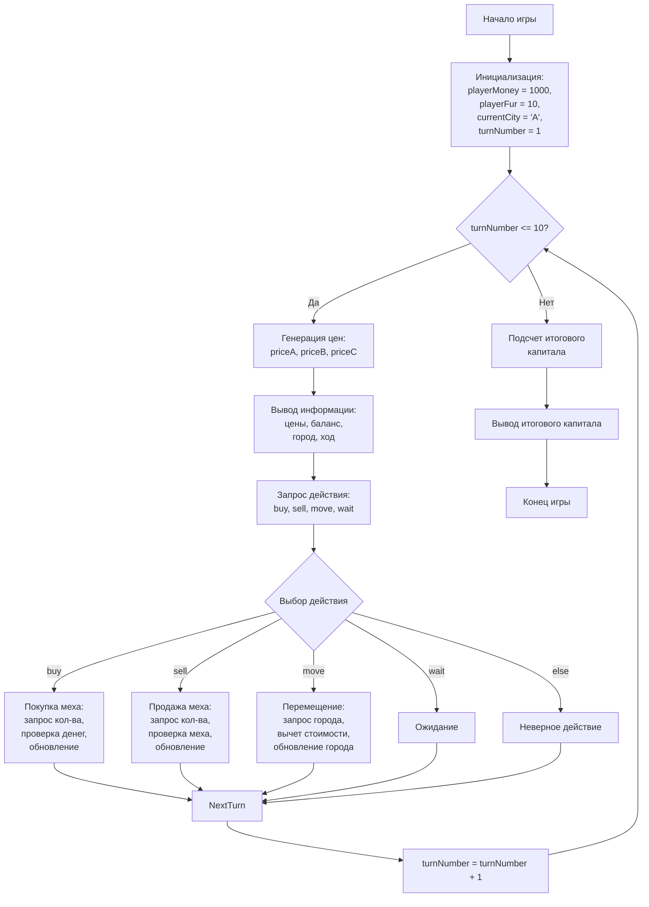

## АНАЛИЗ КОДА: `banner.py`

### 1. <алгоритм>

**Общая логика:**

Программа представляет собой простую экономическую игру, где игрок торгует мехом между тремя городами (A, B, C). Цель игры - максимизировать капитал за 10 ходов, покупая и продавая мех по разным ценам.

**Пошаговая блок-схема с примерами:**

1.  **Инициализация:**
    *   `playerMoney = 1000` (игрок начинает с 1000 долларов).
    *   `playerFur = 10` (игрок начинает с 10 единиц меха).
    *   `currentCity = 'A'` (игрок начинает в городе A).
    *   `turnNumber = 1` (начинается первый ход).

2.  **Начало игрового цикла (пока `turnNumber <= 10`)**:
    *   **Генерация случайных цен**:
        *   `priceA = random.randint(100, 500)` (цена меха в городе A, например, 250).
        *   `priceB = random.randint(100, 500)` (цена меха в городе B, например, 300).
        *   `priceC = random.randint(100, 500)` (цена меха в городе C, например, 180).
    *   **Вывод информации:**
        *   `print(f"--- Ход {turnNumber} ---")` (вывод номера хода, например "--- Ход 1 ---").
        *   `print(f"Цены на мех: A={priceA}, B={priceB}, C={priceC}")` (вывод цен: "Цены на мех: A=250, B=300, C=180").
        *   `print(f"Деньги: {playerMoney}, Мех: {playerFur}, Город: {currentCity}")` (вывод состояния игрока: "Деньги: 1000, Мех: 10, Город: A").
    *   **Запрос действия игрока:**
        *   `action = input("Действие (купить/buy, продать/sell, переместиться/move, ждать/wait): ").lower()` (например, ввод "купить").
    *   **Обработка действия игрока:**
        *   **Если действие "купить"**:
            *   Запрашивает количество меха: `amount = int(input("Сколько меха купить? "))` (например, ввод 2).
            *   Проверяет, достаточно ли денег: `if playerMoney >= amount * locals()[f'price{currentCity}']:`.
            *   Если достаточно, уменьшает деньги и увеличивает количество меха.
            *   Иначе, выводит сообщение "Недостаточно денег.".
        *   **Если действие "продать"**:
            *   Запрашивает количество меха: `amount = int(input("Сколько меха продать? "))` (например, ввод 3).
            *   Проверяет, достаточно ли меха: `if playerFur >= amount:`.
            *   Если достаточно, увеличивает деньги и уменьшает количество меха.
            *   Иначе, выводит сообщение "Недостаточно меха.".
        *   **Если действие "переместиться"**:
            *   Запрашивает город для перемещения: `city = input("В какой город переместиться (A, B, C)? ").upper()` (например, ввод "B").
            *   Проверяет, что город действителен и не совпадает с текущим.
            *   Вычитает 10% от текущих денег и обновляет текущий город.
             *   Иначе, выводит сообщение "Некорректный город или вы уже в нем находитесь."
        *   **Если действие "ждать"**:
            *   Выводит сообщение "Ожидание...".
        *    **Иначе:**
             *    Выводит сообщение "Неверное действие.".
    *   `turnNumber += 1` (переход к следующему ходу).

3.  **Подсчет итогового капитала:**
    *   `finalCapital = playerMoney + (playerFur * locals()[f'price{currentCity}'])` (общий капитал = деньги + (мех \* цена в текущем городе)).
    *   `print(f"\n--- Итого ---")` (вывод "--- Итого ---").
    *   `print(f"Общий капитал: {finalCapital}")` (вывод итогового капитала).

### 2. <mermaid>

**Объяснение зависимостей:**

*   **`Start`**: Начало выполнения программы.
*   **`InitializeVariables`**: Инициализирует основные переменные игры, такие как начальное количество денег (`playerMoney`), количество меха (`playerFur`), текущий город (`currentCity`) и номер хода (`turnNumber`).
*   **`GameLoopStart`**: Проверяет, не закончились ли ходы. Если `turnNumber <= 10`, игра продолжается.
*    **`GeneratePrices`**: Генерирует случайные цены на мех для каждого города A, B и C (`priceA`, `priceB`, `priceC`).
*   **`DisplayInfo`**: Отображает текущую игровую информацию, такую как цены на мех в каждом городе, текущее количество денег и меха у игрока, текущий город и номер хода.
*   **`GetAction`**: Запрашивает у игрока действие: "купить" (buy), "продать" (sell), "переместиться" (move) или "ждать" (wait).
*   **`ActionCheck`**: Определяет, какое действие выбрал игрок.
*   **`BuyFur`**: Выполняет действие "купить мех", запрашивая количество, проверяя наличие денег и обновляя соответствующие переменные.
*   **`SellFur`**: Выполняет действие "продать мех", запрашивая количество, проверяя наличие меха и обновляя соответствующие переменные.
*   **`MoveCity`**: Выполняет действие "переместиться", запрашивая город, вычитая стоимость перемещения и изменяя текущий город.
*   **`WaitAction`**: Выполняет действие "ждать".
*   **`InvalidAction`**: Выполняет действие при неверном вводе.
*   **`NextTurn`**: Переход к следующему ходу.
*  **`IncrementTurn`**: Увеличивает номер хода на 1.
*  **`GameLoopStart`**: Возвращается на проверку цикла, если turnNumber не достиг 10.
*   **`CalculateFinalCapital`**: Рассчитывает итоговый капитал, суммируя деньги и стоимость меха по цене текущего города.
*   **`OutputFinalCapital`**: Отображает итоговый капитал игрока.
*   **`End`**: Конец игры.

### 3. <объяснение>

#### Импорты:

*   `import random`: Импортирует модуль `random`, который используется для генерации случайных цен на мех в городах.

#### Переменные:

*   `playerMoney` (int): Количество денег у игрока. Инициализируется как 1000.
*   `playerFur` (int): Количество меха у игрока. Инициализируется как 10.
*   `currentCity` (str): Текущий город, в котором находится игрок ('A', 'B', или 'C'). Инициализируется как 'A'.
*   `turnNumber` (int): Номер текущего хода. Инициализируется как 1.
*   `priceA`, `priceB`, `priceC` (int): Случайно сгенерированные цены на мех в городах A, B, и C соответственно.
*   `action` (str): Действие, выбранное игроком.
*   `amount` (int): Количество меха, которое игрок хочет купить или продать.
*   `city` (str): Город, в который игрок хочет переместиться.
*   `cost` (float): Стоимость перемещения (10% от текущих денег).
*   `finalCapital` (int): Общий капитал игрока в конце игры.

#### Функции:

*   В коде явно не определены пользовательские функции, используется только встроенная функция `random.randint(a, b)` для генерации случайных чисел.
*   Также используются: `input()` для получения ввода от пользователя, `print()` для вывода сообщений на экран, `lower()` и `upper()` для форматирования ввода пользователя.

#### Особенности кода:

*   **Динамическое получение цен**: В коде используется конструкция `locals()[f'price{currentCity}']`, которая динамически получает цену на мех в текущем городе.
*   **Обработка ввода**: Код обрабатывает ввод пользователя для действий (купить, продать, переместиться, ждать), а также проверяет корректность ввода чисел.
*   **Экономическая модель**:  Реализована простая экономическая модель, где цены на мех меняются случайным образом, а игрок принимает решения о покупке и продаже.
*   **Цикл игры**: Основной игровой цикл `while turnNumber <= 10:` контролирует продолжительность игры (10 ходов).
*   **Итоговый капитал**: Рассчитывается как сумма денег и стоимости меха по текущей цене.

#### Потенциальные улучшения:

*   **Функциональное разделение:** Разделение кода на отдельные функции для генерации цен, обработки действий и вывода информации сделает код более читаемым и поддерживаемым.
*   **Обработка ошибок**: Более детальная обработка ошибок (например, если пользователь вводит не число, не строку и тд.).
*   **Использование словаря для цен**: Вместо отдельных переменных `priceA`, `priceB`, `priceC` можно использовать словарь `prices = {'A': 0, 'B': 0, 'C': 0}` для хранения цен, что упростит доступ к ним.
*   **Структурирование данных**: Вместо отдельных переменных можно использовать класс `Player` для хранения данных игрока, таких как деньги, мех и текущий город.
*   **Интерфейс пользователя**: Вместо текстового интерфейса можно реализовать графический интерфейс для более удобного управления игрой.

#### Цепочка взаимосвязей:

*   `random` -> используется для генерации случайных цен.
*   `input()` и `print()` -> используются для взаимодействия с пользователем.

Этот код представляет собой простую, но функциональную экономическую игру. Структурирование данных и разделение кода на функции сделают его более понятным и легко модифицируемым в будущем.