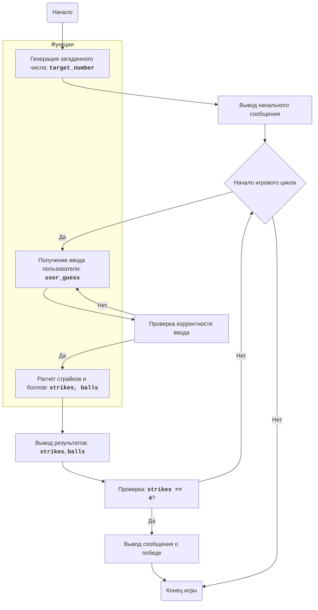

## АНАЛИЗ КОДА: `basebl.py`

### 1. <алгоритм>

**Описание рабочего процесса:**

1.  **Генерация загаданного числа:** Функция `generate_target_number` создает случайное 4-значное число с уникальными цифрами.
    *   Пример: сгенерировано число `"1234"`.
2.  **Начало игры:** Выводится сообщение о начале игры и запрос на ввод числа.
3.  **Цикл ввода и проверки:**
    *   Функция `get_user_guess` запрашивает ввод числа от пользователя.
        *   Пример: пользователь вводит `"5678"`.
    *   Проверяется корректность ввода (4 цифры).
        *   Если ввод некорректный, запрос повторяется.
        *   Пример: если пользователь ввел `"123"`, появится сообщение об ошибке.
    *   Если ввод корректный, переходим к следующему шагу.
4.  **Расчет страйков и боллов:** Функция `calculate_score` сравнивает ввод пользователя с загаданным числом и определяет количество страйков и боллов.
    *   Пример: загаданное число `"1234"`, ввод пользователя `"1425"`.
        *   Страйков: 1 (цифра `1` на правильной позиции).
        *   Боллов: 2 (цифры `2` и `4` присутствуют, но на неправильных позициях).
5.  **Вывод результатов:** Количество страйков и боллов выводится на экран.
6.  **Проверка на победу:**
    *   Если количество страйков равно 4, выводится сообщение о победе, и игра завершается.
    *   В противном случае, возвращаемся к шагу 3.
7.  **Завершение игры:** Игра заканчивается, когда пользователь угадывает число.

**Поток данных:**

1.  `play_baseball` вызывает `generate_target_number` для получения `target_number`.
2.  `play_baseball` в цикле вызывает `get_user_guess` для получения `user_guess`.
3.  `play_baseball` вызывает `calculate_score` с `target_number` и `user_guess` для получения `strikes` и `balls`.
4.  `play_baseball` выводит `strikes` и `balls`, и проверяет условие победы.

### 2. <mermaid>

**Зависимости:**

*   `random`: Используется в `generate_target_number` для генерации случайного числа. `random` является стандартным модулем Python и не имеет дополнительных зависимостей.

### 3. <объяснение>

#### Импорты:

*   **`import random`**: Импортирует модуль `random` для генерации случайных чисел. Этот модуль используется в функции `generate_target_number` для создания случайного 4-значного числа с уникальными цифрами.

#### Функции:

*   **`generate_target_number()`**:
    *   **Аргументы**: Нет.
    *   **Возвращаемое значение**: Строка, представляющая 4-значное число с уникальными цифрами.
    *   **Назначение**: Генерирует случайное 4-значное число, которое игрок должен угадать.
    *   **Пример**: `generate_target_number()` может вернуть `"4729"`.
*   **`get_user_guess()`**:
    *   **Аргументы**: Нет.
    *   **Возвращаемое значение**: Строка, представляющая 4-значное число, введенное пользователем.
    *   **Назначение**: Запрашивает у пользователя ввод 4-значного числа и проверяет, является ли ввод корректным (4 цифры).
    *   **Пример**: Если пользователь вводит `"1234"`, функция вернет `"1234"`. Если вводит `"123"`, будет запрошен повторный ввод.
*   **`calculate_score(target, guess)`**:
    *   **Аргументы**:
        *   `target`: Строка, представляющая загаданное число.
        *   `guess`: Строка, представляющая число, введенное пользователем.
    *   **Возвращаемое значение**: Кортеж из двух целых чисел: количество страйков и количество боллов.
    *   **Назначение**: Вычисляет количество страйков (совпадение цифры и позиции) и боллов (совпадение цифры, но не позиции) между загаданным числом и введенным числом.
    *   **Пример**: `calculate_score("1234", "1425")` вернет `(1, 2)`.
*   **`play_baseball()`**:
    *   **Аргументы**: Нет.
    *   **Возвращаемое значение**: Нет (функция не возвращает значения).
    *   **Назначение**: Основная функция, управляющая процессом игры. Она вызывает другие функции для генерации числа, запроса ввода, расчета результатов и проверки на победу. Она также выводит сообщения для пользователя.

#### Переменные:

*   **`digits`** (в `generate_target_number`): Список целых чисел от 0 до 9.
*   **`target_number`** (в `play_baseball`): Строка, представляющая загаданное 4-значное число, сгенерированное функцией `generate_target_number`.
*   **`guess`** (в `get_user_guess`): Строка, представляющая ввод пользователя.
*   **`strikes`** (в `calculate_score` и `play_baseball`): Целое число, счетчик страйков.
*   **`balls`** (в `calculate_score` и `play_baseball`): Целое число, счетчик боллов.
*   **`user_guess`** (в `play_baseball`): Строка, представляющая ввод пользователя, полученный от функции `get_user_guess`.

#### Потенциальные ошибки и области для улучшения:

1.  **Некорректный ввод**: Функция `get_user_guess` обрабатывает только неверный формат ввода (не 4 цифры). Можно добавить проверки на нецифровые символы.
2.  **Локализация**: Сообщения игры на русском, код и комментарии на английском. Необходимо привести в соответствие.
3.  **GUI**: Игра реализована через консоль, можно сделать более интерактивный интерфейс.
4.  **Код стайл**: PEP8

#### Взаимосвязь с другими частями проекта:

*   Этот код является самостоятельным и не зависит от других частей проекта, за исключением стандартного модуля `random`. Он представляет собой отдельную игру.

**Общая оценка:**
Код хорошо структурирован и понятен. Он соответствует описанному алгоритму игры в "Бейсбол". Есть несколько возможностей для улучшения, но в целом код выполняет свою задачу.