## <алгоритм>

**Описание алгоритма игры "Морской бой":**

1. **Инициализация:**
   - Устанавливается размер игрового поля `BOARD_SIZE = 10`.
   - Создаются два двумерных массива (матрицы) `player_board` и `computer_board` размером 10x10, представляющие поля игрока и компьютера, соответственно. Оба поля инициализируются нулями, что обозначает пустые клетки.
   - Функция `place_computer_ships()` случайно размещает 5 кораблей размером 1x1 на поле компьютера.
   - Счетчик ходов `turn_count` устанавливается в 0.

   _Пример:_
   ```
   BOARD_SIZE = 10
   player_board = [[0, 0, 0, ..., 0], [0, 0, 0, ..., 0], ..., [0, 0, 0, ..., 0]] # 10x10
   computer_board = [[0, 0, 0, ..., 0], [0, 0, 1, ..., 0], ..., [0, 1, 0, ..., 0]] # 10x10, несколько 1 (корабли)
   turn_count = 0
   ```

2. **Игровой цикл (пока `turn_count < 30`):**
    - `turn_count` увеличивается на 1.
    - **Ход игрока:**
        - Запрашиваются координаты выстрела (строка `player_row` и столбец `player_col`) у игрока.
        - Проверяется, попал ли игрок в корабль компьютера. Если `computer_board[player_row][player_col]` равен 1 (корабль):
            - Значение в `computer_board[player_row][player_col]` изменяется на 2 (попадание).
            - Выводится сообщение "HIT!".
        - Если игрок промахнулся:
            - Значение в `computer_board[player_row][player_col]` изменяется на 3 (промах).
            - Выводится сообщение "MISS!".
        - Выводится на экран поле игрока с отметками о попаданиях и промахах (скрывая корабли компьютера).
    
    _Пример (ход игрока):_
    ```
    player_row = 2
    player_col = 3
    if computer_board[2][3] == 1: # Попадание
        computer_board[2][3] = 2 
        print("HIT!")
    else: # Промах
        computer_board[2][3] = 3
        print("MISS!")
    display_board(player_board)
    ```
    - **Ход компьютера:**
        - Компьютер генерирует случайные координаты выстрела `computer_row` и `computer_col`.
        - Проверяется, попал ли компьютер в корабль игрока. Если `player_board[computer_row][computer_col]` равен 1 (корабль):
            - Значение в `player_board[computer_row][computer_col]` изменяется на 2 (попадание).
            - Выводится сообщение "COMPUTER HITS!".
        - Если компьютер промахнулся:
            - Значение в `player_board[computer_row][computer_col]` изменяется на 3 (промах).
            - Выводится сообщение "COMPUTER MISSES".
        - Выводится на экран поле игрока с отметками о попаданиях и промахах.

    _Пример (ход компьютера):_
    ```
    computer_row = 5
    computer_col = 7
    if player_board[5][7] == 1: # Попадание
        player_board[5][7] = 2
        print("COMPUTER HITS!")
    else: # Промах
        player_board[5][7] = 3
        print("COMPUTER MISSES")
    display_board(player_board)
    ```

3. **Конец игры:**
   - После 30 ходов выводится сообщение "END OF GAME".

```mermaid
flowchart TD
    Start["Начало игры: <code>play_battle()</code>"] --> CreateBoards["Создание игровых полей:\n<code>player_board = create_board(BOARD_SIZE)</code>\n<code>computer_board = create_board(BOARD_SIZE)</code>"]
    CreateBoards --> PlaceComputerShips["Размещение кораблей компьютера:\n<code>place_computer_ships(computer_board)</code>"]
    PlaceComputerShips --> InitializeTurnCount["Инициализация счетчика ходов:\n<code>turn_count = 0</code>"]
    InitializeTurnCount --> GameLoopStart{"<code>while turn_count < 30</code>"}
    GameLoopStart -- Yes --> IncreaseTurnCount["Увеличение счетчика ходов:\n<code>turn_count += 1</code>"]
    IncreaseTurnCount --> PlayerTurnStart["Начало хода игрока"]
    PlayerTurnStart --> PlayerInputStart{"Начало цикла ввода координат игрока:\n<code>while True</code>"}
    PlayerInputStart --> PlayerInput["Ввод координат игрока:\n<code>player_row = int(input(...))</code>\n<code>player_col = int(input(...))</code>"]
    PlayerInput --> ValidatePlayerInput{"Проверка ввода:\n<code>0 <= player_row < BOARD_SIZE and 0 <= player_col < BOARD_SIZE</code>"}
    ValidatePlayerInput -- No --> PlayerInputStart
    ValidatePlayerInput -- Yes --> CheckPlayerHit{"Проверка попадания игрока:\n<code>computer_board[player_row][player_col] == 1</code>"}
    CheckPlayerHit -- Yes --> PlayerHit["Попадание игрока:\n<code>computer_board[player_row][player_col] = 2</code>\nOutput: HIT!"]
    CheckPlayerHit -- No --> PlayerMiss["Промах игрока:\n<code>computer_board[player_row][player_col] = 3</code>\nOutput: MISS!"]
     PlayerHit --> DisplayPlayerBoard["Вывод поля игрока:\n<code>display_board(player_board)</code>"]
     PlayerMiss --> DisplayPlayerBoard
    DisplayPlayerBoard --> ComputerTurnStart["Начало хода компьютера"]
    ComputerTurnStart --> ComputerMove["Ход компьютера:\n<code>computer_row = random.randint(0, BOARD_SIZE - 1)</code>\n<code>computer_col = random.randint(0, BOARD_SIZE - 1)</code>"]
     ComputerMove --> CheckComputerHit{"Проверка попадания компьютера:\n<code>player_board[computer_row][computer_col] == 1</code>"}
    CheckComputerHit -- Yes --> ComputerHit["Попадание компьютера:\n<code>player_board[computer_row][computer_col] = 2</code>\nOutput: COMPUTER HITS!"]
     CheckComputerHit -- No --> ComputerMiss["Промах компьютера:\n<code>player_board[computer_row][computer_col] = 3</code>\nOutput: COMPUTER MISSES"]
     ComputerHit --> DisplayPlayerBoard2["Вывод поля игрока:\n<code>display_board(player_board)</code>"]
    ComputerMiss --> DisplayPlayerBoard2
    DisplayPlayerBoard2 --> GameLoopStart
    GameLoopStart -- No --> End["Конец игры:\nOutput: END OF GAME"]
    
```

## <mermaid>



**Описание зависимостей `mermaid`:**

*   `random`: Модуль `random` используется для генерации случайных чисел при размещении кораблей компьютера (`place_computer_ships`) и при выборе компьютером координат для "выстрела".
*   `BOARD_SIZE`: Константа, определяющая размер игрового поля.
*   `create_board(size)`: Функция, создающая игровое поле (матрицу) заданного размера.
*   `place_computer_ships(board)`: Функция для размещения кораблей компьютера на игровом поле.
*   `display_board(board, is_computer=False)`: Функция для отображения игрового поля.
*   `input()`: Функция для ввода координат выстрела игроком.
*  Цикл `while True`  для обработки исключений и проверки корректного ввода игроком.
*   Игровые переменные `player_board`, `computer_board`:  двумерные массивы для хранения состояния игры.
*   Игровые переменные `player_row`, `player_col`, `computer_row`, `computer_col`:  переменные для хранения координат выстрела.
*   `turn_count`: Счетчик ходов.

## <объяснение>

**Импорты:**

*   `import random`: Импортирует модуль `random`, предоставляющий функции для генерации псевдослучайных чисел. Используется для:
    *   Случайного размещения кораблей компьютера на игровом поле.
    *   Случайного выбора координат выстрела компьютером.

**Константы:**

*   `BOARD_SIZE = 10`: Определяет размер игрового поля как квадратную сетку 10x10.

**Функции:**

*   `create_board(size)`:
    *   **Аргумент**: `size` - размер стороны квадратного игрового поля.
    *   **Возвращаемое значение**: Двумерный список (матрица) размером `size x size`, заполненный нулями.
    *   **Назначение**: Создает игровое поле, представленное матрицей, где каждый элемент изначально равен 0 (пустая клетка).

        _Пример:_
        ```python
        board = create_board(5)  # создает поле 5x5
        print(board)
        # [[0, 0, 0, 0, 0], [0, 0, 0, 0, 0], [0, 0, 0, 0, 0], [0, 0, 0, 0, 0], [0, 0, 0, 0, 0]]
        ```

*   `place_computer_ships(board)`:
    *   **Аргумент**: `board` - двумерный список (матрица), представляющий игровое поле компьютера.
    *   **Возвращаемое значение**: `None`. Функция изменяет переданную матрицу `board` напрямую.
    *   **Назначение**: Размещает 5 кораблей (размером 1x1) на поле компьютера случайным образом.  Каждый корабль обозначается значением `1` в соответствующей ячейке матрицы.
    *   _Пример_:
        ```python
        computer_board = create_board(10)
        place_computer_ships(computer_board) # размещает корабли на поле
        print(computer_board)  # пример вывода
        #  [[0, 0, 1, 0, 0, 0, 0, 0, 0, 0],
        #  [0, 0, 0, 0, 0, 0, 0, 0, 0, 0],
        #  [0, 0, 0, 0, 1, 0, 0, 0, 0, 0],
        #  [0, 0, 0, 0, 0, 0, 1, 0, 0, 0],
        #  [0, 0, 0, 0, 0, 0, 0, 0, 0, 0],
        #  [1, 0, 0, 0, 0, 0, 0, 0, 0, 0],
        #  [0, 0, 0, 0, 0, 0, 0, 0, 1, 0],
        #  [0, 0, 0, 0, 0, 0, 0, 0, 0, 0],
        #  [0, 0, 0, 0, 0, 0, 0, 0, 0, 0],
        #  [0, 0, 0, 0, 0, 0, 0, 0, 0, 0]]
        ```
*   `display_board(board, is_computer=False)`:
    *   **Аргументы**:
        *   `board`: Двумерный список (матрица), представляющий игровое поле.
        *  `is_computer`: Boolean флаг (по умолчанию False). Если True, то корабли компьютера будут скрыты.
    *   **Возвращаемое значение**: `None`. Функция только выводит отформатированное игровое поле в консоль.
    *   **Назначение**: Выводит игровое поле в консоль, отображая:
        *   `*` если `is_computer = True` и  в ячейке корабль (значение `1` ).
        *  `O` - пустая клетка (значение `0`).
        *  `X` - попадание (значение `2`).
        *  `-` - промах (значение `3`).

          _Пример_:
        ```python
        player_board = [[0, 0, 1, 0], [0, 2, 0, 3], [0, 0, 0, 0], [0, 0, 0, 0]]
        display_board(player_board) # обычный вывод

        #    0 1 2 3
        #  0 O O 1 O
        #  1 O X O -
        #  2 O O O O
        #  3 O O O O

        computer_board = [[0, 0, 1, 0], [0, 2, 0, 3], [0, 0, 0, 1], [0, 0, 0, 0]]
        display_board(computer_board, is_computer=True) # вывод с скрытием кораблей компьютера

         #    0 1 2 3
        #  0 O O * O
        #  1 O X O -
        #  2 O O O *
        #  3 O O O O

         ```
*   `play_battle()`:
    *   **Аргументы**: Нет.
    *   **Возвращаемое значение**: `None`. Функция выполняет игру напрямую.
    *   **Назначение**: Основная функция игры, которая:
        *   Создает игровые поля для игрока и компьютера.
        *   Размещает корабли компьютера.
        *   Запускает основной игровой цикл на 30 ходов.
        *   В цикле:
            *   Запрашивает у игрока координаты выстрела.
            *   Обрабатывает выстрел игрока (попадание или промах).
            *   Выводит поле игрока.
            *   Осуществляет ход компьютера (случайный выстрел).
            *   Обрабатывает выстрел компьютера.
            *   Выводит поле игрока.
        *   После 30 ходов выводит сообщение об окончании игры.
        
        
**Переменные:**

*   `player_board`: Двумерный список (матрица), представляющая игровое поле игрока.
*   `computer_board`: Двумерный список (матрица), представляющая игровое поле компьютера.
*   `turn_count`: Целочисленная переменная, хранящая текущий ход игры.
*   `player_row`, `player_col`: Целочисленные переменные, хранящие введенные игроком координаты выстрела.
*   `computer_row`, `computer_col`: Целочисленные переменные, хранящие случайные координаты выстрела компьютера.

**Потенциальные ошибки и области для улучшения:**

*   **Нет проверки на победу:** Игра заканчивается после 30 ходов, независимо от того, потоплены ли все корабли одного из игроков. Необходимо добавить логику для определения победителя, отслеживая количество оставшихся кораблей.
*   **Размещение кораблей игрока не предусмотрено:** Игрок не размещает свои корабли, что делает игру неполноценной. Необходимо добавить логику для размещения кораблей игроком.
*   **Простой AI:** Компьютер стреляет случайным образом, что делает его предсказуемым. Можно улучшить AI, добавив логику выбора выстрелов.
*   **Одноразмерные корабли**: Все корабли имеют размер 1x1. Следует добавить поддержку кораблей разного размера и ориентации.
*  **Нет повторных выстрелов**: Код не проверяет, были ли уже выстрелы в конкретную ячейку. Необходимо добавить проверку и запретить повторные выстрелы в одну и туже клетку.

**Взаимосвязи с другими частями проекта:**

*   Данный код является автономным и не зависит от других частей проекта. Он представляет собой базовую реализацию игры "Морской бой".