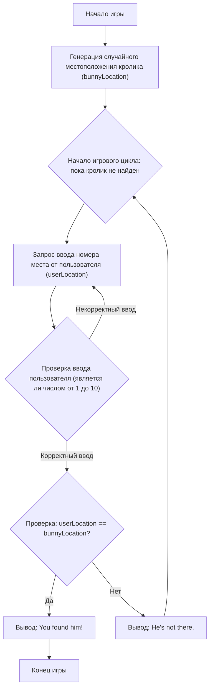

## Анализ кода игры "BUNNY"

### 1. <алгоритм>

Игра "BUNNY" представляет собой простую текстовую игру, в которой игрок пытается угадать, в каком из десяти мест спрятан кролик. 

**Блок-схема:**

1.  **Начало игры**:
    *   Программа начинает выполнение.
2.  **Инициализация**:
    *   Генерируется случайное целое число от 1 до 10, представляющее местоположение кролика (`bunnyLocation`). Например, `bunnyLocation = 7`.
3.  **Начало игрового цикла**:
    *   Цикл начинается, который будет продолжаться до тех пор, пока игрок не найдет кролика.
4.  **Ввод номера места**:
    *   Программа запрашивает у игрока номер места, где, по его мнению, находится кролик, и сохраняет его в переменную `userLocation`. Например, игрок вводит `userLocation = 3`.
5.  **Проверка местоположения**:
    *   Программа сравнивает `userLocation` с `bunnyLocation`.
    *   **Если `userLocation` равно `bunnyLocation`** (например, если `userLocation = 7`):
        *   Программа выводит сообщение "You found him!".
        *   Игра завершается.
    *   **Если `userLocation` не равно `bunnyLocation`** (например, если `userLocation = 3`):
        *   Программа выводит сообщение "He's not there.".
        *   Игра возвращается к шагу 3 (начало игрового цикла).
6.  **Конец игры**:
    *   Игра завершается, когда кролик найден.

**Пример работы:**

1.  `bunnyLocation` случайно присвоено значение `4`.
2.  Игрок вводит `userLocation = 1`. Выводится "He's not there.".
3.  Игрок вводит `userLocation = 7`. Выводится "He's not there.".
4.  Игрок вводит `userLocation = 4`. Выводится "You found him!". Игра заканчивается.

### 2. <mermaid>

**Описание диаграммы `mermaid`:**

*   **`Start`**: Начало игры.
*   **`GenerateBunnyLocation`**: Генерируется случайное местоположение кролика (`bunnyLocation`) в диапазоне от 1 до 10.
*   **`GameLoopStart`**: Начало основного игрового цикла, который продолжается до тех пор, пока кролик не будет найден.
*   **`GetUserLocation`**: Запрашивается ввод номера места у пользователя и сохраняется в переменной `userLocation`.
*   **`ValidateUserLocationInput`**: Проверка, является ли введенное пользователем значение корректным числом в диапазоне от 1 до 10. Если ввод некорректный, то происходит возврат к шагу ввода, если корректный, то переходит на проверку местоположения.
*   **`CheckLocations`**: Проверяется, совпадает ли введенное пользователем местоположение (`userLocation`) с местоположением кролика (`bunnyLocation`).
*   **`OutputWin`**: Если местоположения совпадают, выводится сообщение "You found him!".
*   **`End`**: Игра завершается.
*   **`OutputLose`**: Если местоположения не совпадают, выводится сообщение "He's not there." и цикл продолжается.

### 3. <объяснение>

*   **Импорты:**
    *   `import random`: Этот импорт используется для работы с генератором случайных чисел, что позволяет определить случайную позицию кролика. 
*   **Переменные:**
    *   `bunnyLocation`: Целочисленная переменная, которая хранит случайное местоположение кролика (от 1 до 10).
    *   `userLocation`: Целочисленная переменная, которая хранит введенное пользователем предполагаемое местоположение кролика.
*   **Функции:**
    *   `random.randint(1, 10)`: Функция из модуля `random`, которая возвращает случайное целое число в диапазоне от 1 до 10 включительно.
    *   `input("Где кролик (1-10)? ")`: Встроенная функция Python, которая запрашивает ввод данных от пользователя и возвращает введенную строку.
    *   `int(...)`: Встроенная функция Python, которая преобразует строку в целое число.
*   **Цикл `while True`:**
    *   Этот цикл выполняется бесконечно, пока не встретится оператор `break`, что происходит в случае выигрыша.
*   **Блок `try...except ValueError`:**
    *   Этот блок обрабатывает исключение `ValueError`, которое может возникнуть, если пользователь введет нечисловое значение. Это предотвращает ошибку и позволяет пользователю повторно ввести корректные данные.
*   **Условные операторы `if` и `else`:**
    *   `if userLocation == bunnyLocation:`: Проверяет, угадал ли пользователь местоположение кролика. Если да, выводится сообщение о победе, и цикл завершается оператором `break`.
    *   `else: `: Если пользователь не угадал местоположение, выводится сообщение о проигрыше, и цикл продолжается.

**Потенциальные улучшения:**

1.  **Ограничение количества попыток**: Можно добавить ограничение количества попыток, чтобы игра не продолжалась бесконечно, если игрок не может угадать.
2.  **Подсказки**: Можно добавить подсказки для игрока, например, сообщать, что кролик находится "выше" или "ниже" введенного места.
3.  **Валидация ввода**: Дополнительно можно проверять, чтобы введенное число было в диапазоне от 1 до 10, и выводить сообщение об ошибке, если это не так.

**Взаимосвязь с другими частями проекта:**

Этот код является самостоятельной игрой и не имеет прямой взаимосвязи с другими частями проекта, если таковые существуют. Он использует только стандартную библиотеку Python (`random`) для генерации случайных чисел и стандартный ввод/вывод (`input` и `print`).