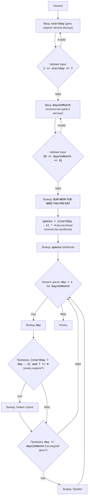

## ИНСТРУКЦИЯ:

Анализируй предоставленный код подробно и объясни его функциональность. Ответ должен включать три раздела:  

1. **<алгоритм>**: Опиши рабочий процесс в виде пошаговой блок-схемы, включая примеры для каждого логического блока, и проиллюстрируй поток данных между функциями, классами или методами.  
2. **<mermaid>**: Напиши код для диаграммы в формате `mermaid`, проанализируй и объясни все зависимости, 
    которые импортируются при создании диаграммы. 
    **ВАЖНО!** Убедитесь, что все имена переменных, используемые в диаграмме `mermaid`, 
    имеют осмысленные и описательные имена. Имена переменных вроде `A`, `B`, `C`, и т.д., не допускаются!  
    
    **Дополнительно**: Если в коде есть импорт `import header`, добавьте блок `mermaid` flowchart, объясняющий `header.py`:\
    ```mermaid\
    flowchart TD\
        Start --> Header[<code>header.py</code><br> Determine Project Root]\
    \
        Header --> import[Import Global Settings: <br><code>from src import gs</code>] \
    ```\

3. **<объяснение>**: Предоставьте подробные объяснения:  
   - **Импорты**: Их назначение и взаимосвязь с другими пакетами `src.`.  
   - **Классы**: Их роль, атрибуты, методы и взаимодействие с другими компонентами проекта.  
   - **Функции**: Их аргументы, возвращаемые значения, назначение и примеры.  
   - **Переменные**: Их типы и использование.  
   - Выделите потенциальные ошибки или области для улучшения.  

Дополнительно, постройте цепочку взаимосвязей с другими частями проекта (если применимо).  

Это обеспечивает всесторонний и структурированный анализ кода.
## Формат ответа: `.md` (markdown)
**КОНЕЦ ИНСТРУКЦИИ**

## <алгоритм>

1.  **Начало**: Программа начинает выполнение.
2.  **Ввод дня начала месяца**:
    *   Запрашивается ввод номера дня недели, с которого начинается месяц (1 - воскресенье, 7 - суббота).
    *   Проверяется, что введенное значение находится в диапазоне от 1 до 7.
        *   **Пример:** Если пользователь вводит `3`, это соответствует вторнику.
    *   Если введено некорректное значение, запрашивается ввод повторно.
3.  **Ввод количества дней в месяце**:
    *   Запрашивается ввод общего количества дней в месяце (от 28 до 31).
    *   Проверяется, что введенное значение находится в диапазоне от 28 до 31.
        *   **Пример:** Если пользователь вводит `30`, это соответствует месяцу с 30 днями.
    *   Если введено некорректное значение, запрашивается ввод повторно.
4.  **Вывод заголовка дней недели**:
    *   Выводится строка `SUN MON TUE WED THU FRI SAT`.
5.  **Вычисление отступов**:
    *   Вычисляется количество пробелов перед первым числом месяца по формуле `spaces = (startDay - 1) * 4`.
        *   **Пример:** Если `startDay` равно 3, то `spaces` будет равно `(3 - 1) * 4 = 8`.
6.  **Вывод отступов**:
    *   Выводится рассчитанное количество пробелов.
7.  **Цикл по дням месяца**:
    *   Начинается цикл от 1 до `daysInMonth`.
        *   **Пример:** Если `daysInMonth` равно 30, то цикл пройдёт от 1 до 30.
    *   **Вывод дня**: Выводится текущий день месяца.
        *   **Пример:** В начале цикла выведется `1`.
    *   **Проверка конца недели**: Проверяется, является ли текущий день субботой по условию `(startDay + day - 2) % 7 == 6`.
        *   **Пример:** Если `startDay` равен 3 (вторник), и текущий день равен 5, то `(3 + 5 - 2) % 7 = 6`, значит, это суббота.
    *   Если текущий день - суббота, выводится переход на новую строку.
    *   **Проверка последнего дня**: Проверяется, является ли текущий день последним днем месяца.
    *   Если текущий день не последний, добавляется пробел после числа.
8.  **Конец цикла**: Цикл продолжается до последнего дня месяца.
9.  **Конец**: Программа завершает выполнение.

## <mermaid>

## <объяснение>
### Импорты
В данном коде нет импортов, поскольку это простая программа, которая не использует внешние библиотеки или модули.

### Классы
В этом коде классы не используются. Программа состоит только из простых функций и управляющих структур.

### Функции
В этом коде нет пользовательских функций, используется только встроенная функция `print` и `input`.

### Переменные
*   `startDay`:
    *   Тип: `int`
    *   Назначение: Хранит номер дня недели, с которого начинается месяц (1 - воскресенье, 7 - суббота).
    *   Использование: Вводится пользователем, используется для вычисления отступов и проверки конца недели.
*   `daysInMonth`:
    *   Тип: `int`
    *   Назначение: Хранит общее количество дней в месяце (28-31).
    *   Использование: Вводится пользователем, используется для определения длины цикла и проверки последнего дня.
*   `spaces`:
    *   Тип: `int`
    *   Назначение: Хранит количество пробелов перед первым числом месяца.
    *   Использование: Вычисляется на основе `startDay`, используется для вывода отступов.
*   `day`:
    *   Тип: `int`
    *   Назначение: Счетчик в цикле, представляет текущий день месяца.
    *   Использование: Используется в цикле для вывода дней месяца.

### Пошаговое объяснение кода:
1.  **Ввод данных**:
    *   `while True:`: Бесконечный цикл для ввода номера дня начала месяца.
    *   `try...except ValueError`: Обрабатывает ошибки ввода.
    *   `startDay = int(input(...))`: Получает день начала месяца и преобразует в `int`.
    *   `if 1 <= startDay <= 7:`: Проверка корректности ввода `startDay`.
    *   `break`: Выход из цикла при корректном вводе.
    *   Аналогичные шаги для ввода количества дней в месяце `daysInMonth` (28-31).
2.  **Вывод заголовка**:
    *   `print(" SUN MON TUE WED THU FRI SAT")`: Выводит строку с названиями дней недели.
3.  **Вычисление отступов**:
    *   `spaces = (startDay - 1) * 4`: Вычисляет количество пробелов, каждый день недели занимает 4 символа (три цифры + пробел).
4.  **Вывод пробелов**:
    *   `print(" " * spaces, end="")`: Выводит рассчитанное количество пробелов.
5.  **Цикл вывода календаря**:
    *   `for day in range(1, daysInMonth + 1):`: Цикл от первого до последнего дня месяца.
    *   `print(f"{day:3}", end=" ")`: Выводит текущий день, форматируя его до трех символов, затем добавляется пробел.
    *   `if (startDay + day - 2) % 7 == 6:`: Проверяет, является ли текущий день субботой.
    *   `print()`: Если текущий день суббота - переходит на новую строку.
    *    `elif day != daysInMonth:`: Если день не последний в месяце добавляем пробел.

### Потенциальные ошибки и области для улучшения:
*   **Недостаточная проверка ввода**: Проверка вводимых данных (`startDay` и `daysInMonth`) достаточно проста. Можно добавить дополнительные проверки, например, проверку типа вводимого значения.
*   **Отсутствие обработки некорректного ввода**: Если пользователь введет строку вместо числа, будет ошибка `ValueError`. Обработка `ValueError` помогает избежать краша программы при неправильном вводе.
*   **Нет обработки високосного года**: Код не учитывает, что февраль может содержать 29 дней в високосном году.
*   **Жестко заданные форматы**: Формат вывода (3 символа на день) жестко задан и не подстраивается под количество дней в месяце (например, если дней больше 99).

### Цепочка взаимосвязей с другими частями проекта:
Данный скрипт является самостоятельным и не имеет связей с другими частями проекта, поскольку он не использует внешние модули и не является частью большей структуры.