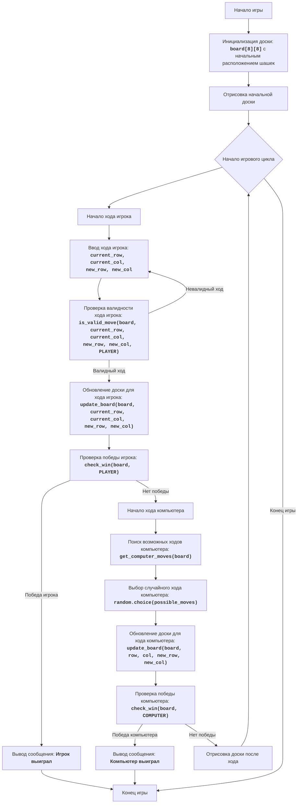

## ИНСТРУКЦИЯ:

Анализируй предоставленный код подробно и объясни его функциональность. Ответ должен включать три раздела:  

1. **<алгоритм>**: Опиши рабочий процесс в виде пошаговой блок-схемы, включая примеры для каждого логического блока, и проиллюстрируй поток данных между функциями, классами или методами.  
2. **<mermaid>**: Напиши код для диаграммы в формате `mermaid`, проанализируй и объясни все зависимости, 
    которые импортируются при создании диаграммы. 
    **ВАЖНО!** Убедитесь, что все имена переменных, используемые в диаграмме `mermaid`, 
    имеют осмысленные и описательные имена. Имена переменных вроде `A`, `B`, `C`, и т.д., не допускаются!  
    
    **Дополнительно**: Если в коде есть импорт `import header`, добавьте блок `mermaid` flowchart, объясняющий `header.py`:\
    ```mermaid
    flowchart TD
        Start --> Header[<code>header.py</code><br> Determine Project Root]
    
        Header --> import[Import Global Settings: <br><code>from src import gs</code>] 
    ```

3. **<объяснение>**: Предоставьте подробные объяснения:  
   - **Импорты**: Их назначение и взаимосвязь с другими пакетами `src.`.  
   - **Классы**: Их роль, атрибуты, методы и взаимодействие с другими компонентами проекта.  
   - **Функции**: Их аргументы, возвращаемые значения, назначение и примеры.  
   - **Переменные**: Их типы и использование.  
   - Выделите потенциальные ошибки или области для улучшения.  

Дополнительно, постройте цепочку взаимосвязей с другими частями проекта (если применимо).  

Это обеспечивает всесторонний и структурированный анализ кода.
## Формат ответа: `.md` (markdown)
**КОНЕЦ ИНСТРУКЦИИ**
```md
## <алгоритм>

**1. Инициализация игры:**

   - Вызывается функция `initialize_board()`, которая создает доску 8x8, представленную как список списков.  
   - Размещаются шашки игрока ('1') и компьютера ('2') в начальных позициях.
   - **Пример**: `board = initialize_board()` создает начальную доску.
   
**2. Отрисовка доски:**
  
   - Функция `draw_board(board)` выводит текущее состояние доски в консоль.
   - **Пример**: `draw_board(board)` показывает игроку текущее расположение шашек.

**3. Игровой цикл:**

    - Начало цикла `while True`, который продолжается до победы одной из сторон.
    - **Пример**: `while True:` начинает игровой процесс.
  
**4. Ход игрока:**
  
    - Вызывается `player_turn(board)`, которая запрашивает у игрока координаты текущей и желаемой позиций.
    - **Пример**: Пользователь вводит `текущая строка: 2`, `текущий столбец: 1`, `новая строка: 3`, `новый столбец: 2`.
    - Проверяется валидность ввода с помощью `is_valid_move(board, current_row, current_col, new_row, new_col, PLAYER)`.
    - Если ход валиден, `update_board(board, current_row, current_col, new_row, new_col)` обновляет доску, перемещая шашку.
    - Если ход невалиден, пользователю предлагается повторить ввод.
   
**5. Проверка победы игрока:**
   
    - Вызывается `check_win(board, PLAYER)`, чтобы проверить, достиг ли игрок противоположного конца доски.
    - **Пример**: Если шашка игрока на последней строке, `check_win` возвращает `True`.
    - Если игрок победил, выводится сообщение и цикл прерывается.
  
**6. Ход компьютера:**
    
    - Вызывается `computer_turn(board)`, которая находит все возможные ходы компьютера с помощью `get_computer_moves(board)`.
    - **Пример**: `get_computer_moves` возвращает список возможных ходов компьютера, например, `[(4, 1, 3, 2), (4, 3, 3, 2)]`.
    - Выбирается случайный ход из списка и вызывается `update_board`, чтобы обновить доску.
    
**7. Проверка победы компьютера:**
    - Вызывается `check_win(board, COMPUTER)`, чтобы проверить, достиг ли компьютер противоположного конца доски.
    - **Пример**: Если шашка компьютера на первой строке, `check_win` возвращает `True`.
    - Если компьютер победил, выводится сообщение и цикл прерывается.
    
**8. Обновление и повтор цикла:**
    - Если ни один из игроков не выиграл, текущая доска снова выводится на экран (`draw_board(board)`) и игровой цикл продолжается с шага 4.
    - Если победа достигнута, игровой цикл завершается.

## <mermaid>



**Анализ `mermaid` диаграммы:**

1.  **Start**: Начало выполнения программы.
2.  **InitializeBoard**: Функция `initialize_board` создает и инициализирует игровое поле (доску) с начальным расположением шашек.
3. **DrawInitialBoard**: Функция `draw_board` выводит начальное состояние доски в консоль.
4.  **GameLoopStart**: Начало основного игрового цикла, который продолжается до тех пор, пока игра не будет завершена.
5.  **PlayerTurnStart**: Начало хода игрока.
6.  **PlayerInput**: Функция `player_turn` запрашивает ввод хода от пользователя (текущую и новую позицию).
7.  **ValidatePlayerMove**: Функция `is_valid_move` проверяет, является ли ход игрока допустимым, проверяя границы доски, принадлежность шашки игроку, целевую клетку пустой и движение по диагонали.
8.  **UpdateBoardPlayer**: Функция `update_board` обновляет доску, перемещая шашку игрока на новую позицию.
9.  **PlayerWinCheck**: Функция `check_win` проверяет, выиграл ли игрок (шашка достигла противоположного конца доски).
10. **OutputPlayerWin**: Вывод сообщения о победе игрока.
11. **ComputerTurnStart**: Начало хода компьютера.
12. **FindComputerMoves**: Функция `get_computer_moves` находит все возможные ходы для компьютера.
13. **ChooseComputerMove**: Функция `computer_turn` выбирает случайный ход из списка возможных ходов.
14. **UpdateBoardComputer**: Функция `update_board` обновляет доску, перемещая шашку компьютера на новую позицию.
15. **ComputerWinCheck**: Функция `check_win` проверяет, выиграл ли компьютер (шашка достигла противоположного конца доски).
16. **OutputComputerWin**: Вывод сообщения о победе компьютера.
17. **DrawBoardLoop**: Функция `draw_board` выводит обновленное состояние доски в консоль после хода.
18. **End**: Конец игры.

**Зависимости:**

*   Импортируется модуль `random` для генерации случайного хода компьютера, что отражено в `ChooseComputerMove` как вызов `random.choice()`.
*   Функции `initialize_board`, `draw_board`, `is_valid_move`, `update_board`, `check_win`, `get_computer_moves`, `computer_turn` и `player_turn` последовательно вызываются для выполнения игрового процесса.

## <объяснение>

### Импорты:

*   `import random`:
    *   **Назначение:** Модуль `random` используется для генерации псевдослучайных чисел. В данном коде, он используется для выбора случайного хода компьютера из списка возможных.
    *   **Взаимосвязь:** Этот модуль является частью стандартной библиотеки Python и не зависит от других частей проекта `src`.

### Переменные:
*   `BOARD_SIZE`:
    *   **Тип:** Целое число (int).
    *   **Использование:** Задает размер игрового поля (8x8). Используется для определения размеров доски в функциях `initialize_board`, `draw_board`, `is_valid_move` и других, что обеспечивает возможность легко изменять размер доски.
*   `EMPTY`:
    *   **Тип:** Строка (str).
    *   **Использование:** Символ, представляющий пустую клетку на игровой доске ('.'). Используется при инициализации доски и обновлении доски после хода.
*   `PLAYER`:
    *   **Тип:** Строка (str).
    *   **Использование:** Символ, представляющий шашку игрока ('1'). Используется в функциях `is_valid_move`, `check_win` и `player_turn`.
*   `COMPUTER`:
    *   **Тип:** Строка (str).
    *   **Использование:** Символ, представляющий шашку компьютера ('2'). Используется в функциях `is_valid_move`, `check_win` и `get_computer_moves`.

### Функции:

*   `initialize_board()`:
    *   **Аргументы:** Нет.
    *   **Возвращаемое значение:** Двумерный список (список списков) представляющий игровую доску с начальным расположением шашек.
    *   **Назначение:** Создает и инициализирует игровую доску 8x8, расставляя шашки игрока и компьютера.
    *   **Пример:** `board = initialize_board()` создает доску с шашками на начальных позициях.
*   `draw_board(board)`:
    *   **Аргументы:** `board` - Двумерный список, представляющий текущее состояние игровой доски.
    *   **Возвращаемое значение:** Нет (выводит доску на экран).
    *   **Назначение:** Выводит текущее состояние игровой доски в консоль с нумерацией строк и столбцов для удобства пользователя.
    *    **Пример:** `draw_board(board)` выводит текущую доску с шашками и нумерацией.
*   `is_valid_move(board, row, col, new_row, new_col, player)`:
    *   **Аргументы:**
        *   `board`: Двумерный список, представляющий текущую игровую доску.
        *   `row`, `col`: Целые числа, координаты текущей позиции шашки.
        *   `new_row`, `new_col`: Целые числа, координаты новой позиции шашки.
        *   `player`: Строка, представляющая игрока (PLAYER или COMPUTER).
    *   **Возвращаемое значение:** Логическое значение (`True` если ход допустим, `False` если нет).
    *   **Назначение:** Проверяет, является ли ход игрока или компьютера допустимым, учитывая границы доски, принадлежность шашки игроку и правила перемещения.
    *   **Пример:** `is_valid_move(board, 2, 1, 3, 2, PLAYER)` возвращает `True` если игрок может переместить шашку из (2,1) в (3,2) и `False` если нет.
*   `update_board(board, row, col, new_row, new_col)`:
    *   **Аргументы:**
        *   `board`: Двумерный список, представляющий текущую игровую доску.
        *   `row`, `col`: Целые числа, координаты текущей позиции шашки.
        *   `new_row`, `new_col`: Целые числа, координаты новой позиции шашки.
    *   **Возвращаемое значение:** Нет (изменяет состояние доски).
    *   **Назначение:** Обновляет игровую доску после хода, перемещая шашку из текущей позиции в новую и помечая текущую позицию как пустую.
    *   **Пример:** `update_board(board, 2, 1, 3, 2)` перемещает шашку из (2,1) в (3,2) на доске.
*  `check_win(board, player)`:
    *   **Аргументы:**
         *   `board`: Двумерный список, представляющий текущую игровую доску.
         *   `player`: Строка, представляющая игрока (`PLAYER` или `COMPUTER`).
    *   **Возвращаемое значение:** Логическое значение (`True` если игрок или компьютер достиг победы, `False` если нет).
    *   **Назначение:** Проверяет, достиг ли игрок или компьютер противоположного конца доски, что означает победу.
    *   **Пример:** `check_win(board, PLAYER)` возвращает `True` если шашка игрока достигла противоположного конца доски.
*   `get_computer_moves(board)`:
    *   **Аргументы:** `board` - Двумерный список, представляющий текущее состояние игровой доски.
    *   **Возвращаемое значение:** Список кортежей, представляющих возможные ходы компьютера (row, col, new_row, new_col).
    *   **Назначение:** Находит все возможные ходы компьютера, проходя по доске и проверяя диагональные перемещения для каждой шашки компьютера.
    *   **Пример:** `moves = get_computer_moves(board)` возвращает `[(4, 1, 3, 2), (4, 3, 3, 2)]`, если у компьютера есть эти два варианта хода.
*    `computer_turn(board)`:
    *    **Аргументы:** `board` - Двумерный список, представляющий текущее состояние игровой доски.
    *   **Возвращаемое значение:** Нет (обновляет доску).
    *    **Назначение:** Выполняет ход компьютера, выбирая случайный допустимый ход и обновляя доску.
    *   **Пример:** `computer_turn(board)` выбирает случайный ход и обновляет доску, перемещая шашку компьютера.
*  `player_turn(board)`:
    *   **Аргументы:** `board` - Двумерный список, представляющий текущее состояние игровой доски.
    *   **Возвращаемое значение:** Нет (обновляет доску).
    *   **Назначение:** Запрашивает ввод координат хода игрока, проверяет его валидность и обновляет доску, если ход допустим.
    *   **Пример:** `player_turn(board)` запрашивает ввод хода от игрока и обновляет доску.
*  `play_checkers()`:
    *   **Аргументы:** Нет.
    *   **Возвращаемое значение:** Нет.
    *   **Назначение:** Основная функция игры, которая инициализирует доску, запускает игровой цикл, обрабатывает ходы игрока и компьютера, а также проверяет условия победы.
    *   **Пример:** `play_checkers()` запускает игру.

### Потенциальные ошибки и области для улучшения:

*   **Отсутствие дамки:** В коде отсутствует логика превращения шашек в дамки при достижении противоположного конца доски. Это можно добавить для большей сложности и аутентичности игры в шашки.
*   **Проверка прыжков:** В текущей реализации есть только передвижения на одну клетку. Нужно добавить проверку прыжков через шашку противника, если за ней есть свободное место.
*   **Улучшенный ИИ:** Компьютер делает случайные ходы. Для более интересной игры можно улучшить ИИ, например, применив алгоритмы поиска (например, Minimax) или эвристические правила.
*   **Обработка исключений:** В функции `player_turn` есть блок try-except для обработки ошибок ввода. Можно добавить более конкретные обработки, например, для ввода не целых чисел или ввода координат за пределами доски.
*   **GUI:** Для лучшего пользовательского опыта можно реализовать графический интерфейс пользователя (GUI) вместо текстового.
*  **Не реализована проверка на конец игры при отсутствии доступных ходов:** В текущей реализации не учитывается ситуация, когда у игрока или компьютера нет доступных ходов, что является условием для окончания игры.

### Цепочка взаимосвязей:
1.  **`play_checkers()`**: Основная функция, которая управляет игровым процессом.
2.  **`initialize_board()`**: Создает начальное состояние доски. Результат передается в `play_checkers()` и затем в `draw_board()` для отрисовки.
3.  **`draw_board(board)`**: Отображает текущее состояние доски в консоли. Вызывается после каждого хода и в начале игры.
4.  **`player_turn(board)`**: Запрашивает ход игрока, проверяет его валидность с помощью `is_valid_move(board, ...)` и обновляет доску с помощью `update_board(board, ...)` .
5.  **`is_valid_move(board, ...)`**: Проверяет валидность хода игрока или компьютера. Используется в `player_turn()` и `get_computer_moves()`.
6.  **`update_board(board, ...)`**: Обновляет состояние доски, перемещая шашки. Используется в `player_turn()` и `computer_turn()`.
7.  **`check_win(board, player)`**: Проверяет, достиг ли игрок или компьютер условий победы. Используется в `play_checkers()` после каждого хода.
8.  **`computer_turn(board)`**: Выполняет ход компьютера, выбирая случайный ход из списка возможных, полученного с помощью `get_computer_moves(board)`.
9.  **`get_computer_moves(board)`**: Находит все возможные ходы для компьютера.

В общем, код представляет собой базовую текстовую реализацию игры в шашки, в которой игрок играет против компьютера. Игра следует стандартным правилам перемещения шашек на одну клетку по диагонали вперед, но не включает в себя более сложные правила, такие как дамки и перепрыгивание.
```