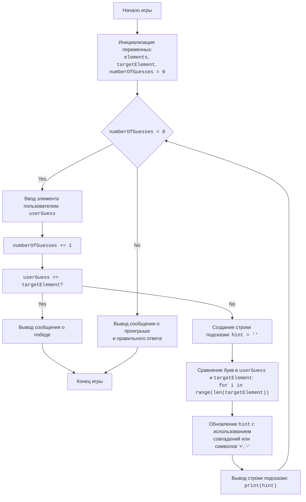

## АНАЛИЗ КОДА

### <алгоритм>
**1. Инициализация переменных:**
   - Создается список `elements` с названиями химических элементов.
     _Пример:_ `elements = ['HYDROGEN', 'HELIUM', 'LITHIUM', ...]`
   - Из списка `elements` случайным образом выбирается элемент и присваивается переменной `targetElement`.
     _Пример:_ `targetElement = 'CARBON'`
   - Переменная `numberOfGuesses` устанавливается в 0, чтобы отслеживать количество попыток.
     _Пример:_ `numberOfGuesses = 0`

**2. Начало игрового цикла:**
   - Запускается цикл `while`, который выполняется, пока `numberOfGuesses` меньше 8.

**3. Ввод данных пользователем:**
   - Запрашивается ввод элемента от пользователя.
     _Пример:_ Пользователь вводит `"carbon"`.
   - Введенное значение преобразуется в верхний регистр и присваивается переменной `userGuess`.
     _Пример:_ `userGuess = "CARBON"`

**4. Увеличение счетчика попыток:**
   - Значение `numberOfGuesses` увеличивается на 1.
     _Пример:_ `numberOfGuesses = 1`

**5. Проверка на совпадение:**
   - Сравнивается `userGuess` с `targetElement`.
   - **Если** `userGuess` равен `targetElement`:
      - Выводится сообщение о победе с количеством попыток.
        _Пример:_ `ПОЗДРАВЛЯЮ! Вы угадали элемент за 1 попыток!`
      - Выход из цикла.
   - **Иначе:**

**6. Создание подсказки:**
   - Создается пустая строка `hint`.
     _Пример:_ `hint = ""`

**7. Сравнение букв:**
   - Запускается цикл `for` для перебора букв в `targetElement`.
   - Для каждой позиции `i`:
     - **Если** `i` меньше длины `userGuess`:
         - **Если** буква в `userGuess` на позиции `i` равна букве в `targetElement` на позиции `i`:
            - Буква из `userGuess` добавляется в `hint`.
              _Пример:_ Если `targetElement = "CARBON"`, а `userGuess = "CARBON"`, то для `i=0` `hint` становится `"C"`.
         - **Иначе если** буква из `userGuess` на позиции `i` есть в `targetElement`:
            - В `hint` добавляется "+".
              _Пример:_ Если `targetElement = "CARBON"`, а `userGuess = "BORON"`, то для `i=0` `hint` становится `"+"` , так как буква `B` есть в слове.
         - **Иначе:**
            - В `hint` добавляется "-".
              _Пример:_ Если `targetElement = "CARBON"`, а `userGuess = "HELIUM"`, то для `i=0` `hint` становится `"-"`.
     -  **Иначе** (если индекс выходит за границы длины пользовательского ввода):
          - В `hint` добавляется "-".

   - Выводится `hint`.
    _Пример:_ Если `targetElement = "CARBON"`, а `userGuess = "BORON"`, то `hint = "+-+-+"`.

**8. Завершение игры:**
   - **Если** после завершения цикла `numberOfGuesses` равен 8:
     - Выводится сообщение о проигрыше и правильный ответ.
      _Пример:_ `ВЫ ПРОИГРАЛИ! Загаданный элемент был CARBON`

### <mermaid>

**Объяснение зависимостей `mermaid`:**

- **flowchart TD**: Определяет тип диаграммы как блок-схему, и направление сверху вниз (Top Down).
- **Start, InitializeVariables, GameLoopStart ... End**: Узлы (ноды) диаграммы, представляющие этапы игры, с описаниями, заключенными в кавычки.
- **-->**: Стрелки, показывающие последовательность выполнения этапов.
- **{`numberOfGuesses < 8`}**: Условный оператор, определяющий условие продолжения цикла.
-  **Yes, No**: Указывает на ветвление потока выполнения в зависимости от условия.
- **`print(hint)`**:  Вывод строки подсказки пользователю.
- **`userGuess == targetElement`**: Условие для проверки выигрыша.
- **<code>...</code>**: Заключения кода внутри нод.

### <объяснение>

#### Импорты
-   `import random`: Импортирует модуль `random` для генерации случайных чисел и выбора случайного элемента из списка. Этот модуль используется в коде для выбора случайного химического элемента, который игрок должен угадать.

#### Переменные
-   `elements` (list): Список строк, представляющих названия химических элементов. Используется для хранения элементов, из которых выбирается загаданный элемент.
-   `targetElement` (str): Строка, представляющая случайно выбранный элемент из списка `elements`. Это загаданный элемент, который должен угадать игрок.
-   `numberOfGuesses` (int): Целое число, отслеживающее количество попыток, сделанных игроком. Инициализируется 0, увеличивается с каждой попыткой.
-   `userGuess` (str): Строка, представляющая ввод пользователя с попыткой угадать элемент. Получается с помощью функции `input()`.
-   `hint` (str): Строка, используемая для предоставления подсказок игроку. Содержит буквы из `userGuess`, совпадающие с буквами в `targetElement` на тех же позициях, `"+"`, если буква есть в слове и `"-"`, если нет.

#### Функции
-   В коде нет объявленных функций. Весь код выполнен в глобальной области видимости.

#### Циклы
- `while numberOfGuesses < 8:`:
    - Основной игровой цикл. Позволяет игроку делать до 8 попыток, пока не угадает элемент.
- `for i in range(len(targetElement)):`:
  - Цикл, который проходит по каждой букве загаданного элемента. Используется для формирования подсказки.

#### Объяснение работы кода

1. **Инициализация игры:**
   - Создается список химических элементов `elements`.
   - Случайно выбирается элемент `targetElement` из списка.
   - Устанавливается начальное количество попыток `numberOfGuesses = 0`.
2. **Игровой цикл:**
   - Цикл выполняется, пока количество попыток `numberOfGuesses` меньше 8.
   - В цикле игрок вводит свой вариант ответа `userGuess`.
   - Количество попыток `numberOfGuesses` увеличивается на 1.
   - Проверяется, угадал ли игрок элемент:
     - Если угадал, выводится сообщение о победе и цикл завершается.
     - Если не угадал, создается строка подсказки:
       - Сравниваются буквы `userGuess` и `targetElement`.
       - Если буква на той же позиции, добавляется буква в `hint`.
       - Если буква есть, но на другой позиции, добавляется `+`.
       - Если буквы нет, добавляется `-`.
   - Выводится строка подсказки `hint`.
3. **Завершение игры:**
   - Если все 8 попыток исчерпаны, но элемент не угадан, выводится сообщение о проигрыше и правильный ответ.

#### Потенциальные улучшения

1. **Обработка ошибок ввода**: Код не обрабатывает случаи, когда пользователь вводит не буквенные символы или числа.
2. **Улучшение подсказок**: Подсказки можно улучшить, например, предоставив более детальную информацию о количестве правильных букв.
3. **Рефакторинг кода**: Разделить код на функции для лучшей читаемости и поддержки.

#### Взаимосвязи с другими частями проекта:
-  Этот код, является независимой игрой и не имеет прямых связей с другими частями проекта. Он использует стандартную библиотеку `random`, но не взаимодействует с другими пользовательскими модулями или классами.