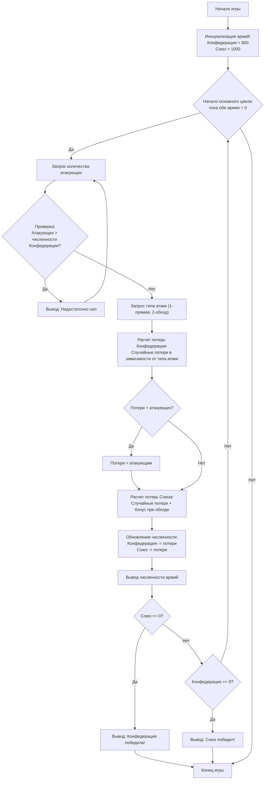

## Анализ кода `civilw.py`

### 1. `<алгоритм>`:

**Блок-схема игрового процесса:**



**Примеры работы логических блоков:**

1. **Начало игры (Start):**
   - Инициализируются переменные `unionForce = 1000` и `confederateForce = 800`.
2. **Основной цикл (MainLoopStart):**
   - Пока `unionForce > 0` и `confederateForce > 0` выполняются следующие шаги.
3. **Запрос количества атакующих (InputAttackers):**
   - Игрок вводит, например, `attackForce = 200`.
4. **Проверка количества атакующих (ValidateAttackers):**
   - Проверяется, `attackForce > confederateForce`.
     - Если `200 > 800` (неверно), переходим к следующему шагу.
     - Если `900 > 800` (верно) выводится сообщение "Недостаточно сил!" и переход на шаг 3.
5. **Запрос типа атаки (InputAttackType):**
   - Игрок вводит, например, `attackType = 2` (обходной маневр).
6. **Расчет потерь Конфедерации (CalculateConfederateLosses):**
   - `confederateLosses = 200 * random(0, 0.2)`. Пусть случайное число будет 0.1, тогда `confederateLosses = 20`.
7. **Проверка потерь Конфедерации (CheckConfederateLosses):**
   - Проверяется `confederateLosses > attackForce`
     - Если `20 > 200` (неверно), переходим к следующему шагу.
     - Если `250 > 200` (верно) `confederateLosses` устанавливается в `attackForce`, т.е. 200.
8.  **Расчет потерь Союза (CalculateUnionLosses):**
    -   `unionLosses = 200 * random(0, 0.3)`. Пусть случайное число будет 0.2, тогда `unionLosses = 40`.
    -   Так как `attackType == 2`, добавляется случайное число от 0 до 100, пусть будет 30: `unionLosses += 30`,  то есть `unionLosses = 70`.
9.  **Обновление численности (UpdateForces):**
    -   `confederateForce = 800 - 20 = 780`.
    -   `unionForce = 1000 - 70 = 930`.
10. **Вывод численности армий (DisplayForces):**
    - Выводятся сообщения: "Конфедерация: 780 солдат", "Союз: 930 солдат".
11. **Проверка победы Союза (CheckUnionWin):**
     - Проверяется `unionForce <= 0`
        - Если `930 <= 0` (неверно), переходим к следующему шагу.
        - Если `0 <= 0` (верно), выводится сообщение "Конфедерация победила!" и конец игры.
12. **Проверка победы Конфедерации (CheckConfederateWin):**
      - Проверяется `confederateForce <= 0`
        - Если `780 <= 0` (неверно), переход к началу основного цикла.
        - Если `0 <= 0` (верно), выводится сообщение "Союз победил!" и конец игры.

### 2. `<mermaid>`:

```mermaid
flowchart TD
    Start(Начало игры) --> InitializeVariables(Инициализация переменных:<br>unionForce = 1000<br>confederateForce = 800)
    InitializeVariables --> GameLoopStart{while unionForce > 0 and confederateForce > 0}
    GameLoopStart -- true --> InputAttackForce(Запросить атакующих:<br>attackForce)
     InputAttackForce --> ValidateAttackForce{attackForce > confederateForce?}
    ValidateAttackForce -- true --> InsufficientForceMessage(Вывести "Недостаточно сил!")
    InsufficientForceMessage --> InputAttackForce
    ValidateAttackForce -- false --> InputAttackType(Запросить тип атаки:<br>attackType (1 или 2))
    InputAttackType --> CalculateConfederateLosses(Расчет потерь Конфедерации:<br>confederateLosses)
    CalculateConfederateLosses --> CheckConfederateLosses{confederateLosses > attackForce?}
    CheckConfederateLosses -- true --> ConfederateLossesSetToAttackForce(установить потери:<br>confederateLosses = attackForce)
     ConfederateLossesSetToAttackForce --> CalculateUnionLosses(Расчет потерь Союза:<br>unionLosses)
    CheckConfederateLosses -- false --> CalculateUnionLosses
    CalculateUnionLosses --> UpdateForces(Обновление численности:<br>confederateForce -= confederateLosses<br>unionForce -= unionLosses)
    UpdateForces --> DisplayCurrentForces(Вывод текущей численности:<br>конфедерация и союз)
    DisplayCurrentForces --> CheckUnionWin{unionForce <= 0?}
    CheckUnionWin -- true --> DisplayConfederateWin(Вывести "Конфедерация победила!")
    DisplayConfederateWin --> End(Конец игры)
     CheckUnionWin -- false --> CheckConfederateWin{confederateForce <= 0?}
    CheckConfederateWin -- true --> DisplayUnionWin(Вывести "Союз победил!")
    DisplayUnionWin --> End
    CheckConfederateWin -- false --> GameLoopStart
    GameLoopStart -- false --> End
```

**Объяснение зависимостей:**

-   `Start`: Начало игры.
-   `InitializeVariables`: Инициализация начальных переменных `unionForce` (численность армии Союза) и `confederateForce` (численность армии Конфедерации).
-   `GameLoopStart`: Начало основного цикла игры, который продолжается пока обе армии имеют численность больше 0.
-   `InputAttackForce`: Запрос у игрока количества солдат для атаки (`attackForce`).
-   `ValidateAttackForce`: Проверка, что `attackForce` не больше текущей численности `confederateForce`.
-   `InsufficientForceMessage`: Вывод сообщения об ошибке, если сил недостаточно.
-   `InputAttackType`: Запрос у игрока типа атаки (`attackType`: 1 - прямая, 2 - обходная).
-   `CalculateConfederateLosses`: Расчет потерь армии Конфедерации (`confederateLosses`) с учетом случайных факторов и типа атаки.
-    `CheckConfederateLosses`: Проверяет, не превышают ли `confederateLosses` значение `attackForce`.
-   `ConfederateLossesSetToAttackForce`: Устанавливает `confederateLosses` равными `attackForce`, если потери больше атакующих.
-   `CalculateUnionLosses`: Расчет потерь армии Союза (`unionLosses`) с учетом случайных факторов и типа атаки.
-   `UpdateForces`: Обновление численности армий, вычитание потерь из текущих значений.
-   `DisplayCurrentForces`: Вывод текущей численности армий Конфедерации и Союза.
-   `CheckUnionWin`: Проверка условия победы Конфедерации (`unionForce <= 0`).
-    `DisplayConfederateWin`: Вывод сообщения о победе Конфедерации.
-    `CheckConfederateWin`: Проверка условия победы Союза (`confederateForce <= 0`).
-   `DisplayUnionWin`: Вывод сообщения о победе Союза.
-   `End`: Конец игры.

### 3. `<объяснение>`:

**Импорты:**
-   `import random`: Импортируется модуль `random` для генерации случайных чисел. Используется для моделирования случайных факторов при расчете потерь в сражениях.

**Переменные:**

-   `unionForce` (int): Начальная численность армии Союза, устанавливается в 1000.
-   `confederateForce` (int): Начальная численность армии Конфедерации, устанавливается в 800.
-   `attackForce` (int): Количество солдат, которых Конфедерация отправляет в атаку, вводится пользователем.
-    `attackType` (int): Тип атаки, выбранный игроком (1 - прямая, 2 - обходная), вводится пользователем.
-   `confederateLosses` (int): Потери армии Конфедерации в текущем сражении, рассчитываются на основе случайных чисел и типа атаки.
-   `unionLosses` (int): Потери армии Союза в текущем сражении, рассчитываются на основе случайных чисел и типа атаки.

**Функции:**

В коде нет явно определенных функций. Вся логика игры реализована в основном цикле `while`.

**Объяснение основного цикла `while`:**

1. **Инициализация:**
   -   `unionForce` и `confederateForce` устанавливаются в начальные значения.
2. **Основной цикл:**
    - Цикл `while unionForce > 0 and confederateForce > 0:` продолжает игру, пока обе армии имеют положительную численность.
    - Внутри цикла выполняются следующие действия:
        -   **Ввод данных:**
            -   Запрашивает у игрока количество атакующих солдат (`attackForce`) с проверкой на корректность введенных данных (число).
            -   Проверяет, что `attackForce` не больше `confederateForce`.
            -   Запрашивает у игрока тип атаки (`attackType`) с проверкой на корректность введенных данных (1 или 2).
        -   **Расчет потерь:**
            -   Рассчитывает потери Конфедерации (`confederateLosses`) на основе выбранного типа атаки и случайного числа.
            -   Рассчитывает потери Союза (`unionLosses`) на основе случайного числа и добавляет бонус, если тип атаки - обходной маневр.
        -   **Обновление численности армий:**
            -   Вычитает потери из численности обеих армий.
        -   **Вывод текущей численности:**
            -   Выводит текущую численность обеих армий.
        -   **Проверка условий победы:**
            -   Проверяет, если численность одной из армий стала меньше или равна 0, объявляет победителя и завершает игру.

**Потенциальные ошибки и области для улучшения:**

-   **Отсутствие обработки некорректного ввода:** Хотя в коде есть обработка `ValueError` при вводе `attackForce` и `attackType`, можно добавить дополнительную проверку, чтобы убедиться, что пользователь вводит только положительные числа.
- **Отсутствие констант**: Числовые значения, такие как `0.4`, `0.2`, `0.3`, `100`, являются магическими числами и должны быть вынесены в константы. Это улучшит читаемость и упростит поддержку кода.
-   **Однообразность случайных потерь:** Модель потерь достаточно простая. Можно усовершенствовать ее, введя зависимость потерь от каких-то дополнительных факторов.
-   **Отсутствие сложности:** Игра достаточно простая и не имеет настроек сложности. Можно ввести уровень сложности, где потери и параметры будут изменены.

**Взаимосвязь с другими частями проекта:**

Этот код является самостоятельной игрой и не имеет прямых зависимостей от других частей проекта.

**Заключение:**
Код представляет собой простую симуляцию сражения между двумя армиями. Алгоритм игры достаточно прямолинеен и понятен, однако имеет некоторые области для улучшения.