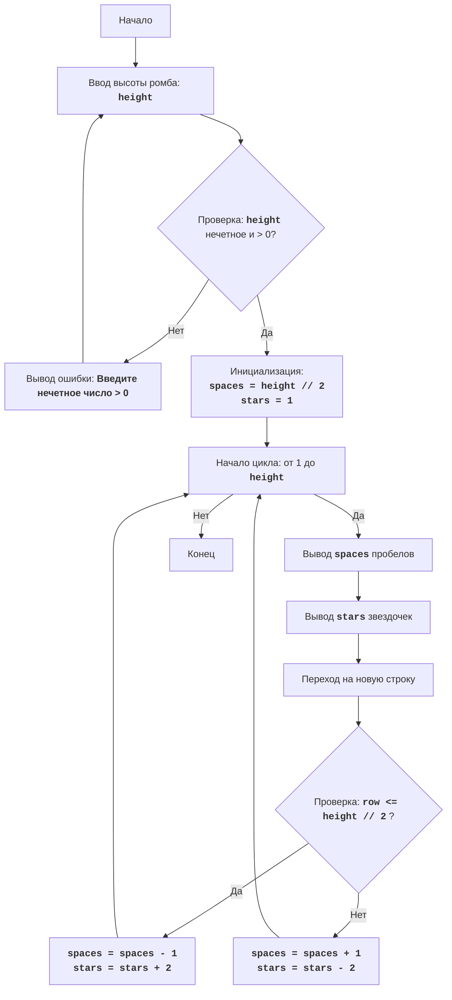

## АНАЛИЗ КОДА: `diamnd.py`

### 1. <алгоритм>

**Пошаговая блок-схема:**

1. **Начало**
   - Игра начинается.
2. **Ввод высоты ромба (height)**
   - Пользователю предлагается ввести нечетное целое число больше 0, которое определяет высоту ромба.
   - Пример: Пользователь вводит `7`.
3. **Проверка высоты (height)**
   - Проверяется, является ли введенное число `height` нечетным и больше 0.
     - Если `height <= 0` или `height` четное, то выводится сообщение об ошибке и возврат к шагу 2.
     - Пример: если введено `6`, выводится ошибка.
     - Пример: если введено `-1`, выводится ошибка.
     - Если `height` удовлетворяет условию, то переход к следующему шагу.
     - Пример: если введено `7`, то переходим к инициализации переменных.
4.  **Инициализация переменных:**
    - `spaces` присваивается значение `height // 2` (целочисленное деление).
        -  Пример:  `spaces = 7 // 2 = 3`
    - `stars` присваивается значение `1`.
        -  Пример: `stars = 1`
5. **Начало цикла (от 1 до height включительно):**
    - Цикл перебирает каждую строку ромба, от первой до последней.
    - Пример: Цикл выполняется для `row = 1, 2, 3, 4, 5, 6, 7`.
6.  **Вывод пробелов:**
    -  Выводится `spaces` пробелов.
         - Пример: Для первой строки `spaces` равен `3`, вывод: "   "
7. **Вывод звездочек:**
   - Выводится `stars` звездочек.
      - Пример: Для первой строки `stars` равен `1`, вывод: "*"
8. **Вывод перевода строки**
    - Переход на новую строку.
9. **Проверка текущей строки (row):**
   - Проверяется, находится ли текущая строка в верхней половине ромба: `row <= height // 2`.
    - Если условие истинно (верхняя половина или середина):
       -  Уменьшить `spaces` на 1.
            -  Пример: `spaces` становится `2`.
       - Увеличить `stars` на 2.
            - Пример: `stars` становится `3`.
    - Если условие ложно (нижняя половина):
       -  Увеличить `spaces` на 1.
            -  Пример: `spaces` становится `4`.
       - Уменьшить `stars` на 2.
            -  Пример: `stars` становится `1`.
10. **Конец цикла:**
   - Цикл продолжается до тех пор, пока не будут обработаны все строки (`height`).
11. **Конец**
    - Игра завершается.

### 2. <mermaid>


**Объяснение диаграммы `mermaid`:**

-  `Start`: Начало программы.
- `InputHeight`:  Запрос у пользователя ввода высоты ромба и сохранение значения в переменной `height`.
- `CheckHeight`: Проверка корректности введенной высоты: должна быть нечетной и больше 0.
- `OutputError`: Вывод сообщения об ошибке, если высота не соответствует условию.
- `InitializeVariables`: Инициализация переменных `spaces` (количество пробелов) и `stars` (количество звездочек).
- `LoopStart`:  Начало цикла, который повторяется `height` раз.
- `OutputSpaces`: Вывод `spaces` пробелов.
- `OutputStars`: Вывод `stars` звездочек.
- `OutputNewline`: Вывод символа новой строки.
- `CheckRow`: Проверка, находится ли текущая строка в верхней половине ромба (включая середину).
- `ModifyUpperPart`: Изменение переменных `spaces` и `stars` для верхней половины ромба.
- `ModifyLowerPart`: Изменение переменных `spaces` и `stars` для нижней половины ромба.
- `End`: Конец программы.

### 3. <объяснение>

**Импорты:**

- В данном коде отсутствуют какие-либо импорты. Это означает, что программа не зависит от внешних библиотек и использует только встроенные возможности Python.

**Классы:**

- В коде нет классов. Вся логика реализована с использованием функций и управляющих конструкций.

**Функции:**

- **`input("Введите нечетную высоту ромба (больше 0): ")`**:
   - **Аргументы**: Принимает строку, которая является подсказкой для пользователя.
   - **Возвращаемое значение**: Возвращает строку, введенную пользователем с клавиатуры.
   - **Назначение**: Запрашивает у пользователя ввод высоты ромба.
   - **Пример**: `input("Введите высоту: ")` может вернуть `"7"`, `"3"`, `"abc"`, и т.д.
-  **`int( ... )`**:
   -  **Аргументы**: Принимает значение, которое нужно преобразовать в целое число.
   -  **Возвращаемое значение**: Возвращает целое число.
   -  **Назначение**: Преобразует строку, возвращенную `input()`, в целое число.
   - **Пример**: `int("7")` возвращает `7`.
- **`print( ... )`**:
   - **Аргументы**: Принимает одно или несколько значений, которые нужно вывести в консоль.
   - **Возвращаемое значение**: Не возвращает значения (`None`).
   - **Назначение**: Выводит сообщения в консоль.
   - **Пример**: `print("hello")` выведет `"hello"`.
- **`range(1, height + 1)`**:
   - **Аргументы**: Принимает начальное и конечное значение диапазона.
    - **Возвращаемое значение**: Возвращает последовательность целых чисел.
   - **Назначение**:  Генерирует последовательность чисел для итерации цикла.
    - **Пример**: `range(1, 4)` вернет последовательность `1, 2, 3`.

**Переменные:**

-  `height`:
    - **Тип**: `int` (целое число).
    - **Назначение**: Хранит высоту ромба, введенную пользователем.
- `spaces`:
   - **Тип**: `int` (целое число).
   - **Назначение**: Хранит текущее количество пробелов перед звездочками в каждой строке.
- `stars`:
   - **Тип**: `int` (целое число).
   - **Назначение**: Хранит текущее количество звездочек в каждой строке.
- `row`:
   - **Тип**: `int` (целое число).
   - **Назначение**: Переменная цикла, представляющая текущую строку при построении ромба.

**Цепочка взаимосвязей:**
- Программа `diamnd.py` является самостоятельной и не зависит от других частей проекта.

**Потенциальные ошибки и области для улучшения:**

- **Обработка ввода**:
  -  Хотя код обрабатывает ошибки `ValueError` при вводе не числа, он не обрабатывает ввод пустой строки. Возможно стоит добавить обработку пустой строки.
- **Уточнение сообщения об ошибке:**
  - Сообщение об ошибке можно сделать более информативным, например, указать конкретно, что число должно быть нечетным и больше нуля.
- **Универсальность**:
  - Код жестко задан на вывод ромба из звездочек. Можно сделать более универсальный код, принимающий символ для вывода.

**Пример работы программы:**

1. Пользователь вводит `7`.
2. `height` = 7, `spaces` = 3, `stars` = 1.
3. Вывод ромба:
```
   *
  ***
 *****
*******
 *****
  ***
   *
```

В целом, код четко выполняет задачу построения ромба заданной высоты, но есть небольшие области, которые можно улучшить для повышения надежности и удобства использования.