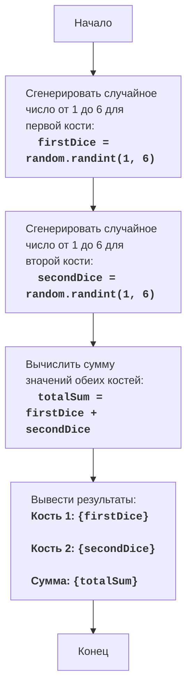

## Анализ кода `dice.py`

### 1. <алгоритм>

**Описание алгоритма:**

1.  **Начало**: Программа начинает свою работу.
2.  **Бросок первой кости**: Генерируется случайное целое число в диапазоне от 1 до 6 (включительно), имитирующее бросок шестигранной кости. Это значение сохраняется в переменной `dice1`.
    *   *Пример*: `dice1` может быть присвоено значение `3`.
3.  **Бросок второй кости**: Аналогично первому броску, генерируется другое случайное целое число от 1 до 6, которое сохраняется в переменной `dice2`.
    *   *Пример*: `dice2` может быть присвоено значение `5`.
4.  **Вычисление суммы**: Значения `dice1` и `dice2` складываются, и результат сохраняется в переменной `total`.
    *   *Пример*: `total` становится равным `3 + 5 = 8`.
5.  **Вывод результатов**: Программа выводит значения `dice1`, `dice2` и `total` на экран, сообщая пользователю результаты броска костей и их сумму.
    *   *Пример*: Выводится: "Кость 1: 3", "Кость 2: 5", "Сумма: 8".
6.  **Конец**: Программа завершает свою работу.

### 2. <mermaid>

**Объяснение:**

*   Диаграмма начинается с узла `Start`, обозначающего начало программы.
*   `GenerateFirstDiceRoll`:  Генерируется случайное целое число от 1 до 6, представляющее результат броска первой кости, и сохраняется в переменной `firstDice`.
*   `GenerateSecondDiceRoll`: Генерируется случайное целое число от 1 до 6, представляющее результат броска второй кости, и сохраняется в переменной `secondDice`.
*   `CalculateTotal`: Вычисляется сумма значений `firstDice` и `secondDice`, и результат сохраняется в переменной `totalSum`.
*   `OutputResults`: Выводятся значения `firstDice`, `secondDice` и их сумма `totalSum` на экран.
*   Диаграмма заканчивается узлом `End`, обозначающим завершение программы.

**Зависимости:**

*   **`import random`**:
    *   Модуль `random` импортируется для генерации случайных чисел.
    *   Функция `random.randint(a, b)` используется для получения случайного целого числа в диапазоне от `a` до `b` включительно.
    *   Эта зависимость необходима для имитации броска костей, поскольку результаты должны быть случайными.
     *   Эта зависимость является внешней, так как `random` является частью стандартной библиотеки Python и не входит в состав проекта `src`.

### 3. <объяснение>

**Импорты:**

*   `import random`:
    *   **Назначение:** Модуль `random` используется для генерации псевдослучайных чисел.
    *   **Взаимосвязь с `src.`:** Модуль `random` является частью стандартной библиотеки Python и не имеет прямой связи с пакетами `src.`.

**Классы:**

*   В данном коде классы не используются.

**Функции:**

*   `random.randint(a, b)`:
    *   **Аргументы:** `a` (начало диапазона) и `b` (конец диапазона). Оба аргумента являются целыми числами.
    *   **Возвращаемое значение:** Случайное целое число `N` такое, что `a <= N <= b`.
    *   **Назначение:** Генерирует псевдослучайное целое число в заданном диапазоне.
    *   **Примеры:**
        *   `random.randint(1, 6)` может вернуть любое из чисел: 1, 2, 3, 4, 5 или 6.
        *   `random.randint(0, 100)` может вернуть любое целое число от 0 до 100 включительно.
*   `print(value)`
    *   **Аргументы**: `value` - значение, которое нужно вывести на экран
    *   **Возвращаемое значение**: `None`
    *   **Назначение**: Выводит на экран строку, форматированную с помощью f-строки.
    *   **Примеры:**
         *   `print(f"Кость 1: {dice1}")` - выводит строку, в которой вместо `{dice1}` подставляется текущее значение переменной `dice1`.

**Переменные:**

*   `dice1`:
    *   **Тип:** `int` (целое число).
    *   **Использование:** Хранит значение, полученное в результате броска первой кости (случайное число от 1 до 6).
*   `dice2`:
    *   **Тип:** `int` (целое число).
    *   **Использование:** Хранит значение, полученное в результате броска второй кости (случайное число от 1 до 6).
*   `total`:
    *   **Тип:** `int` (целое число).
    *   **Использование:** Хранит сумму значений `dice1` и `dice2`.

**Потенциальные ошибки и области для улучшения:**

1.  **Отсутствие проверки ввода:**
    *   В этом конкретном скрипте нет пользовательского ввода, поэтому проверка ввода не требуется. Но если бы был ввод данных, то его нужно было бы валидировать.
2.  **Масштабируемость:**
    *   Код выполняет только одно бросание костей. Для расширения функциональности, например для многократного бросания или взаимодействия с пользователем, потребовалось бы расширение функционала.
3.  **Отсутствие функций**:
    *   Код состоит из последовательности команд. Для улучшения читаемости и повторного использования было бы логично перенести генерацию броска костей и вычисление суммы в отдельные функции.

**Взаимосвязи с другими частями проекта:**

*   Этот код является автономным и не зависит от других частей проекта `src.`. Он выполняет простую имитацию броска костей и вывод результатов. Если бы были другие модули в проекте, с которыми этот скрипт должен был взаимодействовать (например, для отображения результатов в графическом интерфейсе), то пришлось бы реализовать интерфейс для обмена данными.