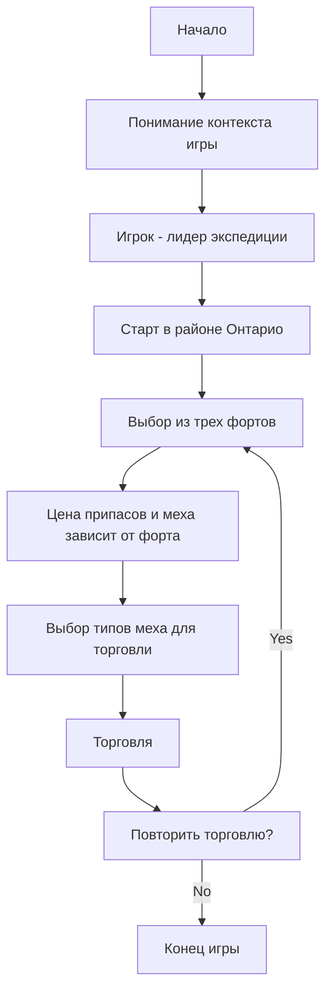

# Анализ README.MD для FURS Trading Expedition

## 1. <алгоритм>

Данный файл `README.md` представляет собой текстовое описание игры "FURS FUR TRADING EXPEDITION".  Он не содержит исполняемого кода, а скорее служит в качестве документации. Алгоритм работы с описанием заключается в следующем:

1.  **Начало**: Читаем описание игры "FURS FUR TRADING EXPEDITION".
2.  **Понимание контекста**:  Осознаем, что игра моделирует экспедицию по торговле мехом в 1776 году.
3.  **Цель**: Игрок выступает в роли лидера экспедиции, отправляющейся из района Онтарио.
4.  **Торговля**: Игроку предоставляется выбор из трех фортов для торговли.
5.  **Параметры торговли**: Стоимость припасов и цена на мех зависят от выбранного форта.
6.  **Типы меха**: Игрок также указывает, какие типы меха он хочет продать.
7.  **Цикличность**:  Игра продолжается, пока игрок не решит закончить торговать.

**Примеры логических блоков**:

*   **Выбор форта**: Игрок может выбрать форт A, форт B или форт C.
*   **Выбор меха**: Игрок может выбрать, например, продажу бобровых, лисьих и медвежьих шкур.
*   **Торговля**: Игрок получает доход от продажи меха и тратит деньги на припасы.
*   **Повтор**:  Игрок может начать новый торговый цикл.
*   **Завершение**: Игрок может завершить игру, когда захочет.

Поток данных в данном случае представляет собой скорее поток информации от текста к пониманию пользователя.

## 2. <mermaid>

**Объяснение диаграммы mermaid:**

*   `Start`: Начало анализа описания игры.
*   `Understand`: Понимание того, что игра имитирует торговлю мехом в определенном историческом периоде.
*   `Role`:  Осознание роли игрока как лидера экспедиции.
*   `Location`: Место начала экспедиции - район Онтарио.
*   `TradeChoice`: Выбор одного из трех фортов для торговли.
*   `FortParameters`:  Понимание, что цены на припасы и мех зависят от выбранного форта.
*   `FurType`:  Выбор типов меха для продажи.
*   `Trading`: Процесс торговли с обменом меха на припасы.
*   `LoopChoice`: Решение игрока о продолжении торговли или завершении игры.
*   `End`: Завершение игры.

Диаграмма описывает логическую последовательность действий игрока, основываясь на описании игры в `README.md`.

## 3. <объяснение>

**Общее:**

Файл `README.md` предназначен для человеческого чтения и содержит текстовое описание игры FURS. Он не содержит исполняемого кода, поэтому анализ сводится к пониманию логики игры, описанной текстом.

**Детали:**

*   **Описание игры**:  Описание устанавливает следующие ключевые элементы игры:
    *   **Сеттинг**: 1776 год, французская экспедиция по торговле мехом.
    *   **Роль игрока**: Лидер экспедиции.
    *   **Место действия**: Район Онтарио.
    *   **Цель**: Торговать мехом и пополнять запасы.
    *   **Выбор**: Возможность выбора одного из трех фортов для торговли.
    *   **Торговые условия**: Цены на мех и припасы зависят от выбранного форта.
    *   **Типы меха**: Возможность выбора, каким мехом торговать.
    *   **Цикличность**: Возможность продолжать торговлю по желанию игрока.

**Взаимосвязи с другими частями проекта:**

Так как `README.md` – это файл документации, он не имеет прямых связей с исполняемым кодом проекта. Он описывает правила игры, которые, предположительно, будут реализованы в коде.

**Потенциальные ошибки или области для улучшения:**

Поскольку это всего лишь описание, а не код, здесь нет ошибок. Однако, можно было бы улучшить описание, добавив:

*   Более подробное описание возможных типов меха.
*   Примеры различий в ценах между фортами.
*   Описание условий победы/поражения (если они есть).

**Цепочка взаимосвязей:**

1.  `README.md`: Описывает игру.
2.  `Исполняемый код игры (предположительно)`:  Реализует логику игры, описанную в README.md.
3.  `Пользователь`: Играет в игру, основываясь на описании в README.md.

В итоге, `README.md` служит отправной точкой для понимания и реализации игры.