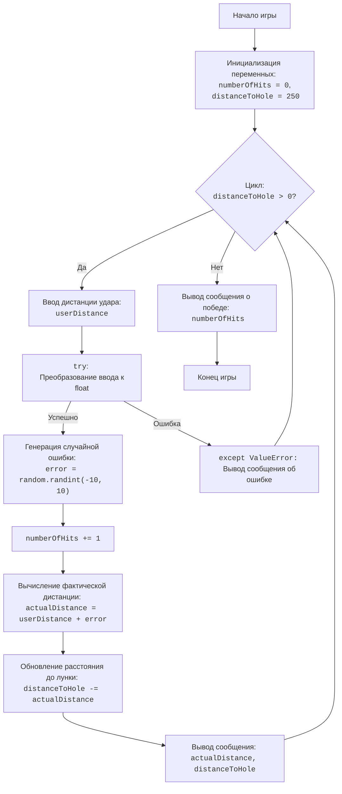

## АНАЛИЗ КОДА:

### <алгоритм>

1.  **Начало игры:**
    *   Инициализация:
        *   `numberOfHits` = 0 (счетчик ударов)
        *   `distanceToHole` = 250 (расстояние до лунки в ярдах)

2.  **Игровой цикл (пока `distanceToHole` > 0):**
    *   **Ввод данных:**
        *   Запрос у пользователя дистанции удара (`userDistance`).
        *   Пример: Пользователь вводит `100`.

    *   **Обработка ввода:**
        *   Если ввод не является числом, выводится сообщение об ошибке, и цикл переходит к следующей итерации.
        *   Пример: Пользователь вводит `abc`, выводится сообщение `Пожалуйста, введите число.`.

    *   **Генерация случайной ошибки:**
        *   Генерируется случайное число `error` в диапазоне от -10 до 10.
        *   Пример: `error` = -5.

    *   **Увеличение счетчика ударов:**
        *   `numberOfHits` увеличивается на 1.
        *   Пример: `numberOfHits` становится 1.

    *   **Вычисление фактической дистанции удара:**
        *   `actualDistance` = `userDistance` + `error`.
        *   Пример: `actualDistance` = 100 + (-5) = 95.

    *   **Обновление расстояния до лунки:**
        *   `distanceToHole` = `distanceToHole` - `actualDistance`.
        *   Пример: `distanceToHole` = 250 - 95 = 155.

    *   **Вывод результатов удара:**
        *   Выводится сообщение о фактической дистанции удара (`actualDistance`) и оставшемся расстоянии до лунки (`distanceToHole`).
        *   Пример: Выводится сообщение: "Фактическая дистанция удара: 95.00 ярдов", "Расстояние до лунки: 155.00 ярдов"

    *   **Проверка на достижение лунки:**
        *   Если `distanceToHole` <= 0, то цикл завершается.
        *   Если `distanceToHole` > 0, цикл продолжается.

3.  **Конец игры (после завершения цикла):**
    *   Выводится сообщение о победе с указанием количества ударов, потребовавшихся для достижения лунки.
    *   Пример: Выводится сообщение "УРА! Вы добрались до лунки за 5 ударов."

### <mermaid>

**Описание импорта `mermaid`:**

*   Диаграмма не использует никаких импортов, так как это графическое представление логики кода.

### <объяснение>

**1. Импорты:**

*   `import random`:
    *   **Назначение:** Этот модуль используется для генерации псевдослучайных чисел. В данной программе он используется для имитации неточности ударов при игре в гольф.
    *   **Взаимосвязь с другими пакетами:** Не имеет прямой связи с другими пакетами `src` в данном коде.

**2. Классы:**

*   В данном коде классы не используются.

**3. Функции:**

*   В данном коде определена только одна встроенная функция `input()` и функция `print()`.
    *   `input(prompt)`:
        *   **Аргументы:** `prompt` - строка, которая выводится пользователю в качестве приглашения ввести данные.
        *   **Возвращаемое значение:** Строка, введенная пользователем.
        *   **Назначение:** Запрашивает пользовательский ввод.
    *   `print(*objects, sep=' ', end='\n', file=sys.stdout, flush=False)`:
        *   **Аргументы:** `objects` - любое количество объектов, которые будут выведены, `sep` - разделитель между объектами, `end` - символ конца вывода, `file` - куда будет выводиться текст и `flush` - принудительная очистка буфера вывода.
        *   **Возвращаемое значение:** `None`.
        *   **Назначение:** Выводит данные на стандартный вывод (консоль).

**4. Переменные:**

*   `numberOfHits`:
    *   **Тип:** Целое число (`int`).
    *   **Использование:** Хранит количество ударов, сделанных игроком. Изначально равно 0 и увеличивается на 1 с каждым ударом.
*   `distanceToHole`:
    *   **Тип:** Целое число (`int`).
    *   **Использование:** Хранит текущее расстояние до лунки в ярдах. Изначально равно 250 и уменьшается на фактическую дистанцию каждого удара.
*   `userDistance`:
    *   **Тип:** Число с плавающей точкой (`float`).
    *   **Использование:** Хранит дистанцию удара, введенную пользователем.
*   `error`:
    *   **Тип:** Целое число (`int`).
    *   **Использование:** Хранит случайную ошибку удара, сгенерированную с помощью `random.randint()`.
*   `actualDistance`:
    *   **Тип:** Число с плавающей точкой (`float`).
    *   **Использование:** Хранит фактическое расстояние, на которое был нанесен удар, вычисленное как сумма `userDistance` и `error`.

**5. Потенциальные ошибки и области для улучшения:**

*   **Обработка ошибок ввода:**
    *   Обработка ошибки `ValueError` существует для предотвращения сбоев программы, если пользователь введет нечисловое значение.
*   **Недостаток проверок на валидность ввода:**
    *   Код не проверяет, является ли введённая дистанция положительной. Если пользователь введет отрицательное значение, это может привести к странному поведению игры.
    *   **Улучшение:** Можно добавить проверку, чтобы убедиться, что `userDistance` больше 0.
*   **Недостаток проверок на попадание в лунку:**
    *   Расстояние до лунки `distanceToHole` может стать отрицательным, так как не учитывается, что расстояние не может быть отрицательным.
    *   **Улучшение:** Можно проверять `distanceToHole` на отрицательное значение и приравнивать к 0.

**6. Взаимосвязи с другими частями проекта:**

*   Данный код не имеет прямых связей с другими частями проекта `src`. Он является самостоятельной игрой.

**7. Дополнительно:**

*   Код достаточно прост и понятен для начинающих.
*   Форматирование кода хорошее, и он легко читаем.
*   Можно добавить больше интерактивности в игру, например, вывод траектории мяча или более сложных правил.