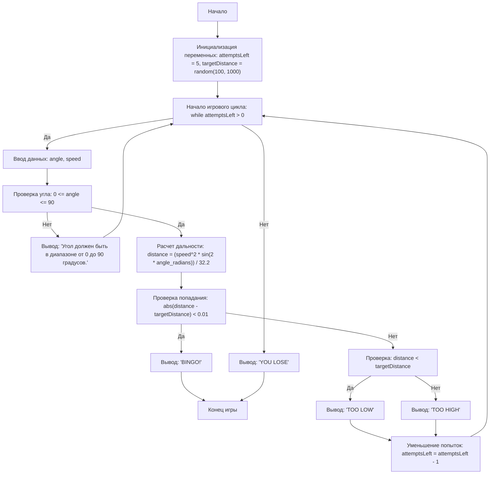

## АНАЛИЗ КОДА:

### <алгоритм>
1.  **Начало игры:**
    *   Инициализация: `attemptsLeft` (количество попыток) = 5, `targetDistance` (расстояние до цели) = случайное число от 100 до 1000.
    *   Пример: `attemptsLeft` = 5, `targetDistance` = 543

2.  **Игровой цикл (пока `attemptsLeft > 0`):**
    *   **Ввод данных:** Запрос у игрока угла выстрела (`angle`) и скорости выстрела (`speed`).
        *   Пример: Игрок вводит `angle` = 45, `speed` = 200
    *   **Проверка ввода:**
        *   Если `angle` < 0 или `angle` > 90, то вывод сообщения об ошибке и переход к следующей итерации.
        *   Пример: Игрок вводит `angle` = -10 -> выводится сообщение об ошибке, цикл переходит к следующей попытке.
    *   **Расчет дальности:**
        *   `angle_radians` = `angle` в радианах.
        *   `distance` = (`speed`^2 * sin(2 * `angle_radians`)) / 32.2
        *   Пример: `angle_radians` = 0.785, `distance` = (200^2 * sin(2*0.785)) / 32.2 = 1242.24

    *   **Проверка попадания:**
        *   Если |`distance` - `targetDistance`| < 0.01, то вывод "BINGO!", завершение игры.
        *   Пример: `distance` = 543.005, `targetDistance` = 543 -> вывод "BINGO!", игра заканчивается.
        *   Иначе если `distance` < `targetDistance`, то вывод "TOO LOW".
        *   Пример: `distance` = 400, `targetDistance` = 543 -> вывод "TOO LOW".
        *   Иначе вывод "TOO HIGH".
        *   Пример: `distance` = 700, `targetDistance` = 543 -> вывод "TOO HIGH".
    *   **Уменьшение попыток:** `attemptsLeft` = `attemptsLeft` - 1.
        *   Пример: `attemptsLeft` = 4.

3.  **Конец игры (после цикла):**
    *   Если `attemptsLeft` == 0, то вывод "YOU LOSE".
    *   Пример: После 5 попыток цель не поражена -> выводится "YOU LOSE".

### <mermaid>

### <объяснение>

**Импорты:**

*   `import random`:
    *   **Назначение:** Предоставляет функции для генерации псевдослучайных чисел.
    *   **Взаимосвязь с `src`:** Используется локально в текущем файле для генерации случайного расстояния до цели, не связан напрямую с другими пакетами `src`.

*   `import math`:
    *   **Назначение:** Обеспечивает доступ к математическим функциям, таким как синус (`math.sin`) и преобразование градусов в радианы (`math.radians`).
    *    **Взаимосвязь с `src`:** Используется локально в текущем файле для вычисления дальности полета снаряда, не связан напрямую с другими пакетами `src`.

**Переменные:**

*   `attemptsLeft`:
    *   **Тип:** `int`.
    *   **Использование:** Хранит количество оставшихся попыток. Инициализируется значением 5, уменьшается на 1 после каждой попытки.

*   `targetDistance`:
    *   **Тип:** `int`.
    *   **Использование:** Хранит случайное расстояние до цели, генерируется один раз в начале игры.

*  `angle`:
    *   **Тип**: `float`.
    *   **Использование:** Хранит угол выстрела, введенный пользователем.

*  `speed`:
    *   **Тип**: `float`.
    *   **Использование:** Хранит скорость выстрела, введенную пользователем.

*   `angle_radians`:
    *   **Тип:** `float`.
    *   **Использование:** Хранит угол выстрела в радианах, используется для расчета дальности.

*   `distance`:
    *   **Тип:** `float`.
    *   **Использование:** Хранит вычисленную дальность полета снаряда.

**Функции:**

*   `input()`:
    *   **Аргументы:** Строка-приглашение для пользователя.
    *   **Возвращаемое значение:** Строка, введенная пользователем.
    *   **Назначение:** Запрашивает ввод данных от пользователя (угол и скорость).
    *   **Примеры:**
        *   `angle = float(input("Введите угол выстрела в градусах (0-90): "))` - Запрашивает угол.
        *   `speed = float(input("Введите скорость выстрела в футах в секунду: "))` - Запрашивает скорость.

*   `random.randint(a, b)`:
    *   **Аргументы:** Два целых числа `a` и `b`, определяющие диапазон.
    *   **Возвращаемое значение:** Случайное целое число в диапазоне от `a` до `b` включительно.
    *   **Назначение:** Генерирует случайное расстояние до цели.
    *   **Пример:** `targetDistance = random.randint(100, 1000)` - Генерирует расстояние от 100 до 1000.

*   `math.radians(angle)`:
    *   **Аргументы:** Угол в градусах.
    *   **Возвращаемое значение:** Угол в радианах.
    *   **Назначение:** Преобразует угол из градусов в радианы.
    *   **Пример:** `angle_radians = math.radians(angle)` - Преобразует угол в радианы.

*   `math.sin(x)`:
    *   **Аргументы:** Угол в радианах.
    *   **Возвращаемое значение:** Синус угла.
    *   **Назначение:** Вычисляет синус угла в радианах.
    *   **Пример:** `math.sin(2 * angle_radians)` - Вычисляет синус удвоенного угла.

*   `print()`:
     *   **Аргументы:** Строка для вывода на экран.
     *   **Возвращаемое значение:** None.
     *   **Назначение:** Вывод сообщений для пользователя, таких как подсказки или результаты.
     *   **Примеры:**
         *   `print("BINGO!")` - Выводит сообщение о попадании в цель.
         *   `print("TOO LOW")` - Выводит сообщение о том, что снаряд не долетел.

**Потенциальные ошибки и области для улучшения:**

1.  **Обработка нечислового ввода:**
    *   В коде уже есть `try-except` блок для обработки `ValueError` при вводе нечисловых данных, что хорошо.
2.  **Сравнение чисел с плавающей точкой:**
    *   Используется `abs(distance - targetDistance) < 0.01` для сравнения чисел с плавающей точкой, что является хорошей практикой для избежания проблем, связанных с неточностью представления.
3.  **Ограничение ввода угла:**
    *   Проверка `if not (0 <= angle <= 90):` обеспечивает корректность ввода угла.
4.  **Улучшение пользовательского интерфейса:**
    *   Можно добавить больше информации об игре (правила, текущие попытки и т.д.).
5.  **Рефакторинг кода:**
    *   Можно выделить расчет дальности в отдельную функцию для улучшения читаемости и повторного использования.

**Цепочка взаимосвязей с другими частями проекта:**
* Данный файл является автономной игрой и не имеет прямых зависимостей с другими частями проекта.