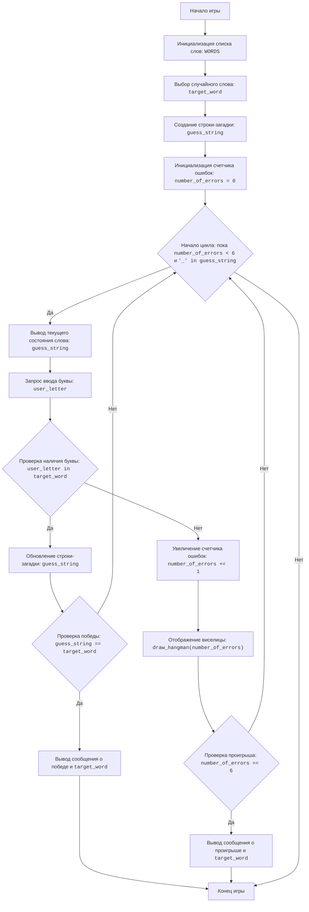

## АНАЛИЗ КОДА: `hang.py`

### 1. <алгоритм>

**Блок-схема:**

1.  **Начало игры:**
    *   Пример: Запускается скрипт `hang.py`.
2.  **Инициализация списка слов:**
    *   Пример: `WORDS = ["python", "java", "kotlin", "javascript", "swift", "ruby", "csharp"]`
3.  **Выбор случайного слова:**
    *   Пример: Компьютер выбирает слово "PYTHON" из списка `WORDS` . `target_word = "PYTHON"`
4.  **Создание строки-загадки:**
    *   Пример: Создается строка `guess_string = "______"`
5.  **Инициализация счетчика ошибок:**
    *   Пример: `number_of_errors = 0`
6.  **Начало цикла "пока не угадано и ошибок < 6":**
    *   Пример: Игра продолжается, пока `number_of_errors < 6` и `"_"` есть в `guess_string`.
7.  **Вывод текущего состояния слова:**
    *   Пример: Выводится `Слово: ______`
8.  **Запрос ввода буквы от пользователя:**
    *   Пример: Пользователь вводит букву `A`. `user_letter = "A"`
9.  **Проверка наличия буквы в слове:**
    *   Пример: Проверяется, есть ли `A` в `PYTHON`. `user_letter in target_word == False`
    *   Если буква есть (например, `user_letter` = 'O'), то переходим к шагу 10, иначе к 11.
10. **Обновление строки-загадки:**
    *   Пример: `guess_string = "___O__"` (буква O появляется в слове)
11. **Проверка, угадано ли слово:**
    *   Пример:  Проверяется, что `guess_string == target_word` (`"___O__" == "PYTHON"`). Если истинно, переходим к шагу 12. Иначе к 6.
12. **Увеличение счетчика ошибок:**
    *   Пример: `number_of_errors = 1`.
13. **Отображение виселицы:**
    *   Пример:  Вызывается `draw_hangman(1)` для отображения текущей стадии виселицы.
14. **Проверка, достигнут ли лимит ошибок:**
    *   Пример:  Проверяется, что `number_of_errors == 6`. Если ложь, то переходим к шагу 6.
15. **Вывод сообщения о победе:**
    *   Пример: Выводится сообщение `ПОЗДРАВЛЯЮ! Вы угадали слово: PYTHON`.
16. **Завершение игры.**
17. **Вывод сообщения о проигрыше:**
    *   Пример:  Выводится сообщение `СОЖАЛЕЮ, вы не отгадали слово. Загаданное слово: PYTHON`.
18. **Завершение игры.**

### 2. <mermaid>

**Объяснение:**

*   `Start` - начало игры
*   `InitializeWords` - инициализируется список слов для игры, представленный переменной `WORDS`.
*   `ChooseWord` - случайным образом выбирается слово из списка `WORDS`, которое становится `target_word`.
*   `CreateGuessString` - создается строка `guess_string`, представляющая собой текущее состояние отгадывания слова (например, `______` для слова из 6 букв).
*   `InitializeErrors` - счетчик ошибок `number_of_errors` устанавливается в 0.
*   `LoopStart` - начало игрового цикла.
*   `DisplayGuessString` - отображается текущее состояние `guess_string`.
*   `InputLetter` - пользователь вводит букву, которая сохраняется в `user_letter`.
*   `CheckLetter` - проверка, присутствует ли введенная буква `user_letter` в загаданном слове `target_word`.
*   `UpdateGuessString` - если буква присутствует, то `guess_string` обновляется с учетом угаданной буквы.
*   `CheckWin` - проверяется, угадано ли слово, сравнивая `guess_string` и `target_word`.
*   `OutputWin` - вывод сообщения о победе и загаданного слова.
*    `End` - конец игры.
*   `IncreaseErrors` - если буква отсутствует, то увеличивается счетчик ошибок `number_of_errors`.
*   `DrawHangman` - вызывается функция для отображения текущего состояния виселицы в зависимости от количества ошибок.
*   `CheckLose` - проверка на достижение лимита ошибок.
*   `OutputLose` - вывод сообщения о проигрыше и загаданного слова.

**Зависимости импорта:**

*   `random` : импортируется для случайного выбора слова из списка, используется в `random.choice(WORDS)`.

### 3. <объяснение>

**Импорты:**

*   `import random`: Модуль `random` используется для генерации случайных чисел. В данном коде он используется для выбора случайного слова из списка `WORDS`.

**Переменные:**

*   `WORDS` (list): Список строк, представляющих слова, которые могут быть загаданы. Тип: `list[str]`.
*   `target_word` (str): Слово, которое нужно угадать, выбранное случайным образом из списка `WORDS`. Тип: `str`.
*   `guess_string` (str): Строка, представляющая текущее состояние отгадываемого слова (например, `_ _ _ _ _` ).  Тип: `str`.
*   `number_of_errors` (int): Целое число, представляющее количество ошибок, которые сделал игрок. Тип: `int`.
*  `user_letter` (str): Буква, введенная пользователем. Тип: `str`.
*   `hangman_stages` (list[str]): Список строк, каждая из которых представляет стадию виселицы. Тип: `list[str]`.
*  `new_guess_string` (str): Временная строка, используется для обновления `guess_string`. Тип: `str`.

**Функции:**

*   `draw_hangman(errors)`:
    *   Аргументы:
        *   `errors` (int): Количество ошибок, которые сделал игрок.
    *   Возвращает: `None`
    *   Назначение: Функция отображает текущее состояние виселицы в зависимости от количества ошибок.
        *   Пример: `draw_hangman(2)` выведет на экран виселицу с головой и телом.
*   `play_hangman()`:
    *   Аргументы: `None`
    *   Возвращает: `None`
    *   Назначение: Основная функция игры. Она управляет ходом игры: выбирает случайное слово, принимает ввод от пользователя, проверяет наличие буквы в слове, обновляет строку-загадку, проверяет условия победы или поражения и выводит соответствующие сообщения.
        *   Пример: `play_hangman()` запускает игровой процесс, пока игрок не выиграет или не проиграет.

**Классы:**

В этом коде нет классов.

**Взаимосвязи с другими частями проекта:**

Этот скрипт `hang.py` является самостоятельным файлом и не имеет прямых зависимостей от других файлов в проекте. Он использует только стандартные модули Python, такие как `random`.

**Потенциальные ошибки и области для улучшения:**

*   **Обработка ввода пользователя:**
    *   Код не проверяет, ввел ли пользователь корректную букву (одну букву, а не несколько, не цифру и не спецсимвол). Необходимо добавить валидацию пользовательского ввода.
*   **Управление регистром:**
    *  Код переводит введенную букву и загаданное слово в верхний регистр, что правильно, но можно явно указывать, что регистр не имеет значения для игры.
*   **Обработка повторного ввода буквы:**
    *   Код не проверяет, вводил ли пользователь уже эту букву. Нужно добавить проверку, чтобы избежать повторного ввода одной и той же буквы.
*  **Интерфейс:**
     *  У игры текстовый интерфейс. Можно улучшить UI, используя графическую библиотеку, например, `pygame`.
*  **Словарь:**
     *  Список слов фиксирован. Можно реализовать загрузку слов из файла или БД.
* **Сложность:**
     *  Можно добавить выбор сложности, например, по длине слова или категории слов.
*  **Логика повторения:**
     * После завершения игры, нужно предоставить игроку возможность начать игру заново.

**Цепочка взаимосвязей:**

В текущей реализации `hang.py` не имеет зависимостей от других файлов проекта, следовательно, нет цепочки взаимосвязей с другими частями проекта.