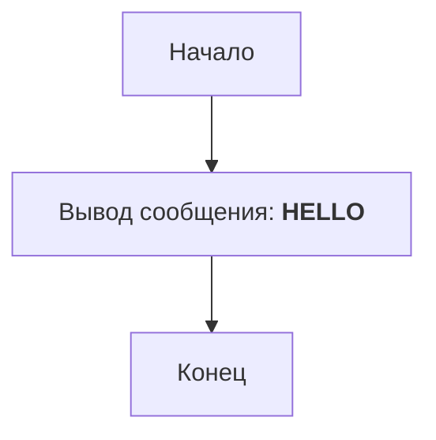

## ИНСТРУКЦИЯ:

Анализируй предоставленный код подробно и объясни его функциональность. Ответ должен включать три раздела:  

1. **<алгоритм>**: Опиши рабочий процесс в виде пошаговой блок-схемы, включая примеры для каждого логического блока, и проиллюстрируй поток данных между функциями, классами или методами.  
2. **<mermaid>**: Напиши код для диаграммы в формате `mermaid`, проанализируй и объясни все зависимости, 
    которые импортируются при создании диаграммы. 
    **ВАЖНО!** Убедитесь, что все имена переменных, используемые в диаграмме `mermaid`, 
    имеют осмысленные и описательные имена. Имена переменных вроде `A`, `B`, `C`, и т.д., не допускаются!  
    
    **Дополнительно**: Если в коде есть импорт `import header`, добавьте блок `mermaid` flowchart, объясняющий `header.py`:\
    ```mermaid
    flowchart TD
        Start --> Header[<code>header.py</code><br> Determine Project Root]
    
        Header --> import[Import Global Settings: <br><code>from src import gs</code>] 
    ```

3. **<объяснение>**: Предоставьте подробные объяснения:  
   - **Импорты**: Их назначение и взаимосвязь с другими пакетами `src.`.  
   - **Классы**: Их роль, атрибуты, методы и взаимодействие с другими компонентами проекта.  
   - **Функции**: Их аргументы, возвращаемые значения, назначение и примеры.  
   - **Переменные**: Их типы и использование.  
   - Выделите потенциальные ошибки или области для улучшения.  

Дополнительно, постройте цепочку взаимосвязей с другими частями проекта (если применимо).  

Это обеспечивает всесторонний и структурированный анализ кода.
## Формат ответа: `.md` (markdown)
**КОНЕЦ ИНСТРУКЦИИ**
## Анализ кода `hypotez/src/ai/helicone/ai_games/101_basic_computer_games/en/HELLO/hello.py`

### <алгоритм>
1.  **Начало программы:** Программа начинает свое выполнение.
2.  **Вывод сообщения:** Выполняется единственная инструкция `print("HELLO")`, которая выводит текст "HELLO" в консоль.
3.  **Завершение программы:** Программа завершает свое выполнение.

### <mermaid>

Диаграмма описывает простой поток управления: программа начинается, затем выводит сообщение "HELLO", после чего завершается. Импортов или зависимостей, которые нужно было бы отображать на диаграмме, нет.

### <объяснение>
- **Импорты**: В данном коде нет импортов. Это простейшая программа, которая не использует внешних библиотек или модулей.

- **Классы**: В коде нет классов. Это процедурная программа, состоящая только из одной функции - встроенной функции `print()`.

- **Функции**: 
    - `print("HELLO")`:
        - **Аргументы**: Принимает строку `"HELLO"` в качестве аргумента.
        - **Возвращаемое значение**: Ничего не возвращает (т.е. возвращает `None`, хотя явно это не указано).
        - **Назначение**: Выводит переданную строку (в данном случае "HELLO") в стандартный вывод (консоль).
        - **Пример**: `print("HELLO")` выведет "HELLO" в консоль.
- **Переменные**: В коде нет переменных, т.к. используется строчный литерал напрямую в функции `print()`.

**Потенциальные ошибки и области для улучшения:**
- В данном простом примере нет ошибок. 
- Областей для улучшения нет, так как код выполняет свою задачу (вывод приветствия) идеально просто.
- Программа полностью самодостаточна и не требует взаимодействия с другими частями проекта.

**Цепочка взаимосвязей с другими частями проекта:**
Так как это изолированная программа, взаимодействий с другими частями проекта нет.