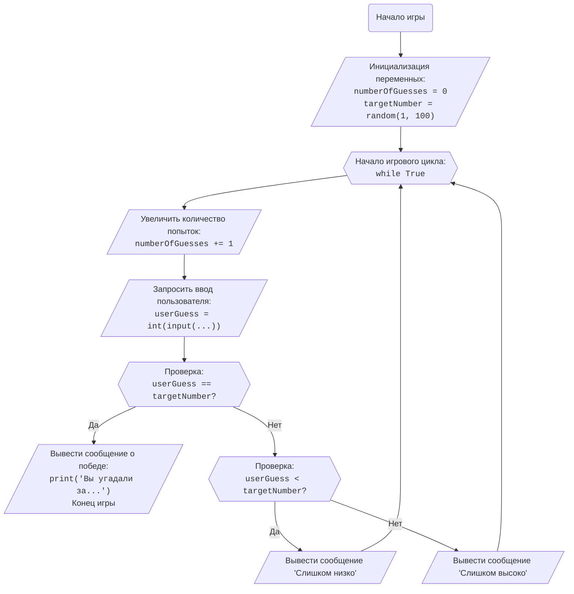

# Анализ кода игры "Больше-Меньше"

## <алгоритм>

**Пошаговая блок-схема:**

1. **Инициализация**:
    - Устанавливаем `numberOfGuesses` (количество попыток) в 0.  Пример: `numberOfGuesses = 0`.
    - Генерируем случайное целое число от 1 до 100, например, `targetNumber = 42`.

2. **Начало игрового цикла**:
    - Входим в цикл `while True`, который будет выполняться до тех пор, пока число не будет угадано.

3. **Итерация цикла**:
    - Увеличиваем `numberOfGuesses` на 1. Пример: `numberOfGuesses` становится 1.
    - Запрашиваем у игрока ввод числа. Допустим, игрок ввел `userGuess = 50`.
    - **Проверка угадывания**:
        - **Если `userGuess` равен `targetNumber`**:
            - Выводим сообщение "Вы угадали число за {numberOfGuesses} попыток!".
            - Завершаем цикл (`break`).  Игра окончена.
        - **Иначе, если `userGuess` меньше `targetNumber`**:
            - Выводим сообщение "Слишком низко".
            - Возвращаемся к началу цикла (шаг 3).
        - **Иначе (если `userGuess` больше `targetNumber`)**:
            - Выводим сообщение "Слишком высоко".
            - Возвращаемся к началу цикла (шаг 3).

4. **Завершение игры**:
    - После угадывания числа цикл `while` завершается.

**Пример потока данных:**

```
Начало --> Инициализация (numberOfGuesses = 0, targetNumber = 42) 
--> Вход в цикл --> numberOfGuesses = 1 
--> Запрос ввода (userGuess = 50)
--> Проверка: 50 == 42? --> Нет
--> Проверка: 50 < 42? --> Нет
--> Вывод: "Слишком высоко"
--> numberOfGuesses = 2 
--> Запрос ввода (userGuess = 25)
--> Проверка: 25 == 42? --> Нет
--> Проверка: 25 < 42? --> Да
--> Вывод: "Слишком низко"
--> numberOfGuesses = 3
--> Запрос ввода (userGuess = 42)
--> Проверка: 42 == 42? --> Да
--> Вывод: "Вы угадали число за 3 попыток!" 
--> Конец
```

## <mermaid>



**Объяснение зависимостей в mermaid-диаграмме:**

*   **Start**: Начало игры.
*   **InitializeVariables**: Инициализация переменных `numberOfGuesses` (счетчик попыток) и `targetNumber` (загаданное число). Используется `random.randint(1, 100)` из модуля `random`.
*   **GameLoopStart**: Начало цикла `while True`, который продолжает игру, пока не будет угадано число.
*   **IncrementGuesses**: Увеличивает счетчик `numberOfGuesses` на 1 каждую итерацию цикла.
*   **GetUserGuess**: Запрашивает ввод числа у пользователя и сохраняет его в `userGuess`, обрабатывая возможные ошибки ввода.
*  **CheckGuess**: Проверяет, совпадает ли введенное пользователем число `userGuess` с загаданным числом `targetNumber`.
*   **OutputWin**: Если числа совпали, выводит сообщение о победе и завершает игру.
*   **CheckLow**: Если числа не совпали, проверяет, является ли введенное число `userGuess` меньше загаданного числа `targetNumber`.
*   **OutputLow**: Если `userGuess` меньше `targetNumber`, выводит сообщение "Слишком низко" и возвращается в начало цикла.
*   **OutputHigh**: Если `userGuess` не меньше `targetNumber` (т.е. больше), выводит сообщение "Слишком высоко" и возвращается в начало цикла.

## <объяснение>

1.  **Импорты**:
    *   `import random`: Импортирует модуль `random` из стандартной библиотеки Python. Этот модуль предоставляет функции для генерации псевдослучайных чисел. В данном коде используется функция `random.randint(a, b)` для генерации случайного целого числа в диапазоне от `a` до `b` (включительно).
        *   **Связь с другими пакетами `src`**: В данном коде нет прямой связи с пакетами внутри `src` директории, так как он представляет собой отдельный скрипт, не зависящий от других частей проекта.

2.  **Переменные**:
    *   `numberOfGuesses`: Целочисленная переменная, которая хранит количество попыток, которые сделал игрок. Инициализируется значением 0 в начале игры и увеличивается на 1 при каждой новой попытке.
    *   `targetNumber`: Целочисленная переменная, которая хранит случайное число, загаданное компьютером. Генерируется один раз в начале игры с помощью `random.randint(1, 100)`.
    *   `userGuess`: Целочисленная переменная, которая хранит число, введенное пользователем. Принимает значение при каждом вводе пользователя.

3.  **Функции**:
    *   `input()`: Встроенная функция Python, которая используется для получения пользовательского ввода из консоли.
    *   `int()`: Встроенная функция Python, которая пытается преобразовать переданное ей значение в целое число. Может вызвать исключение `ValueError`, если преобразование невозможно (например, при вводе нечислового значения).
    *   `random.randint(a, b)`: Функция из модуля `random`, которая возвращает случайное целое число в диапазоне от `a` до `b` включительно.
    *   `print()`: Встроенная функция Python, которая выводит переданное ей значение в консоль.
    *   `break`: Ключевое слово Python, которое используется для выхода из цикла (`while` в данном случае).

4.  **Классы**:
    * В коде не используются классы.

5.  **Потенциальные ошибки и улучшения**:

    *   **Обработка ошибок ввода**: В коде предусмотрена обработка ошибок ввода с помощью блока `try-except`, что предотвращает падение программы при вводе пользователем нечислового значения.
    *   **Улучшение**: Можно добавить дополнительные проверки, например, на ввод чисел, выходящих за пределы диапазона от 1 до 100.  Это позволит пользователю получить более точные сообщения об ошибках.
    *  **Улучшение**: Можно добавить возможность выхода из игры до её завершения.
    *  **Улучшение**: Можно добавить сложность игры, устанавливая диапазон случайных чисел и/или количество попыток.

6.  **Цепочка взаимосвязей**:
    *   Этот код является самостоятельным игровым приложением и не зависит от других частей проекта, что позволяет запускать его отдельно.

**Заключение:**

Код представляет собой простую, но функциональную игру "Больше-Меньше". Он использует базовые конструкции Python, такие как циклы, условные операторы, обработку исключений и ввод/вывод. Код хорошо структурирован и легко читается.