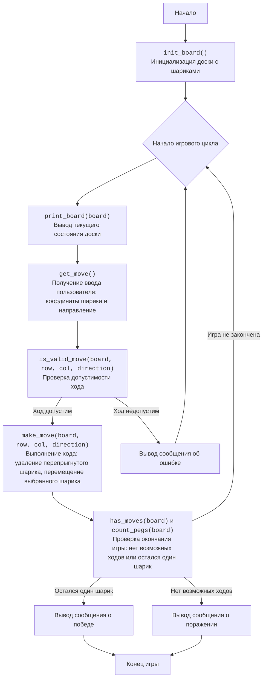

## <алгоритм>

1.  **Начало игры:**
    *   `Start`: Начало программы.
    *   `InitializeBoard`: Функция `init_board()` создает начальное состояние доски (список списков) с шариками.
        *   Пример: `board = [[0, 0, 1, 1, 1, 0, 0], [0, 0, 1, 1, 1, 0, 0], [1, 1, 1, 1, 1, 1, 1], [1, 1, 1, 0, 1, 1, 1], [1, 1, 1, 1, 1, 1, 1], [0, 0, 1, 1, 1, 0, 0], [0, 0, 1, 1, 1, 0, 0]]`.
2.  **Игровой цикл:**
    *   `GameLoopStart`: Начало цикла, повторяющегося до победы или поражения.
    *   `DisplayBoard`: Функция `print_board(board)` выводит текущее состояние доски на экран.
        *   Пример вывода:
            ```
            0 0 1 1 1 0 0
            0 0 1 1 1 0 0
            1 1 1 1 1 1 1
            1 1 1 0 1 1 1
            1 1 1 1 1 1 1
            0 0 1 1 1 0 0
            0 0 1 1 1 0 0
            ```
    *   `GetMove`: Функция `get_move()` запрашивает у пользователя ввод: строку, столбец и направление хода.
        *   Пример: Пользователь вводит "3", "2", "r" (строка 3, столбец 2, вправо).
    *   `ValidateMove`: Функция `is_valid_move(board, row, col, direction)` проверяет допустимость хода.
        *   Пример: Для ввода "3", "2", "r", функция проверяет, есть ли шарик в позиции (3, 2), есть ли шарик справа и есть ли пустая ячейка за ним.
        *   Возвращает `True`, если ход допустим, и `False` в противном случае.
3.  **Выполнение хода:**
    *   `MakeMove`: Если `ValidateMove` вернул `True`, то функция `make_move(board, row, col, direction)` обновляет доску, удаляя перепрыгнутый шарик и перемещая выбранный.
        *   Пример: Для ввода "3", "2", "r", шарик из (3,2) перемещается в (3,4), при этом шарик в позиции (3,3) удаляется. `board[3][2]`, `board[3][3]` становятся `0`, а `board[3][4]` становится `1`.
4.  **Проверка окончания игры:**
    *   `CheckEndGame`: Функция `has_moves(board)` проверяет, есть ли еще возможные ходы. Функция `count_pegs(board)` подсчитывает количество шариков.
        *   Если количество шариков равно 1 - победа
        *   Если возможных ходов нет - проигрыш
5.  **Завершение игры:**
    *   `OutputWin`: Если остался один шарик, игра завершается и выводится сообщение о победе.
    *   `OutputLose`: Если нет возможных ходов, игра завершается и выводится сообщение о поражении.
    *   `End`: Конец программы.
6.  **Недопустимый ход:**
    *   `OutputInvalidMove`: Если `ValidateMove` вернул `False`, то выводится сообщение об ошибке.
    *   Переход к `GameLoopStart`: Возвращаемся к началу игрового цикла для запроса нового хода.

## <mermaid>



**Объяснение `mermaid` диаграммы:**

*   **`Start`**: Начало выполнения программы.
*   **`InitializeBoard`**: Вызывает функцию `init_board()`, которая создает и инициализирует игровое поле в виде двумерного списка.
*   **`GameLoopStart`**: Начало основного игрового цикла, который продолжается до тех пор, пока игра не закончится.
*   **`DisplayBoard`**: Вызывает функцию `print_board(board)` для вывода текущего состояния игрового поля на экран.
*   **`GetMove`**: Вызывает функцию `get_move()`, которая запрашивает у пользователя ввод (координаты шарика и направление хода).
*   **`ValidateMove`**: Вызывает функцию `is_valid_move(board, row, col, direction)` для проверки допустимости введенного хода. Возвращает `True` если ход допустим и `False` если ход недопустим.
*   **`MakeMove`**: Вызывает функцию `make_move(board, row, col, direction)` для выполнения хода на игровом поле если ход был допустим.
*  **`CheckEndGame`**: Вызывает функции `has_moves(board)` и `count_pegs(board)` чтобы проверить, не завершилась ли игра: остался ли один шарик, или нет возможных ходов.
*   **`OutputInvalidMove`**: Выводит сообщение об ошибке, если ход был недопустим, и возвращает пользователя на начало цикла.
*   **`OutputWin`**: Выводит сообщение о победе, если остался один шарик.
*   **`OutputLose`**: Выводит сообщение о поражении, если нет возможных ходов.
*   **`End`**: Конец выполнения программы.

## <объяснение>

**Импорты:**

В данном коде нет импортов, так как весь код игры реализован в одном файле.

**Функции:**

1.  **`init_board()`**:
    *   **Аргументы**: Нет.
    *   **Возвращаемое значение**: `board` (список списков, представляющий доску).
    *   **Назначение**: Инициализирует игровое поле с начальным расположением шариков.
    *   **Пример**: Возвращает доску, где `1` - шарик, `0` - пустое место.
2.  **`print_board(board)`**:
    *   **Аргументы**: `board` (список списков, представляющий доску).
    *   **Возвращаемое значение**: Нет.
    *   **Назначение**: Выводит текущее состояние доски на экран.
    *   **Пример**: Если `board = [[0, 1], [1, 0]]`, на экране будет:
        ```
        0 1
        1 0
        ```
3.  **`get_move()`**:
    *   **Аргументы**: Нет.
    *   **Возвращаемое значение**: `row, col, direction` (кортеж: строка, столбец, направление).
    *   **Назначение**: Запрашивает у пользователя координаты шарика и направление хода.
    *   **Пример**: Возвращает `(3, 2, 'r')` если пользователь ввел строку `3`, столбец `2`, направление `r`.
4.  **`is_valid_move(board, row, col, direction)`**:
    *   **Аргументы**: `board` (доска), `row` (строка), `col` (столбец), `direction` (направление).
    *   **Возвращаемое значение**: `True` (если ход допустим) или `False` (если ход недопустим).
    *   **Назначение**: Проверяет, является ли ход допустимым согласно правилам игры.
    *   **Пример**: Если выбран шарик в позиции (3, 2) и направление "r", то проверяется, есть ли шарик справа и пустая ячейка за ним.
5.  **`make_move(board, row, col, direction)`**:
    *   **Аргументы**: `board` (доска), `row` (строка), `col` (столбец), `direction` (направление).
    *   **Возвращаемое значение**: Обновленный `board`.
    *   **Назначение**: Выполняет ход, обновляя состояние доски.
    *   **Пример**: Для хода "3, 2, r", шарик перемещается из (3,2) в (3,4), а шарик в (3,3) удаляется.
6.  **`has_moves(board)`**:
    *   **Аргументы**: `board` (доска).
    *   **Возвращаемое значение**: `True` (если есть возможные ходы) или `False` (если нет возможных ходов).
    *   **Назначение**: Проверяет, есть ли еще возможные ходы.
    *   **Пример**: Проверяет наличие доступных шариков для хода в любом направлении.
7.  **`count_pegs(board)`**:
    *   **Аргументы**: `board` (доска).
    *   **Возвращаемое значение**: Целое число, количество шариков на доске.
    *   **Назначение**: Подсчитывает количество шариков (единиц) на доске.
    *   **Пример**: Подсчитывает все `1` на доске.
8.  **`play_hi_q()`**:
    *   **Аргументы**: Нет.
    *   **Возвращаемое значение**: Нет.
    *   **Назначение**: Основная функция игры, содержит игровой цикл и управляет ходами.
    *   **Пример**: Управляет ходом игры, инициализирует доску, запрашивает ходы и завершает игру при победе или проигрыше.

**Переменные:**

*   `board`: Список списков, представляющий доску, где `1` - шарик, `0` - пустая ячейка.
*   `row`: Целое число, строка выбранного шарика.
*   `col`: Целое число, столбец выбранного шарика.
*   `direction`: Строка, направление хода (`u`, `d`, `l`, `r`).
*   `count`: Целое число, используется для подсчета количества шариков на доске.

**Потенциальные ошибки и области для улучшения:**

*   **Валидация ввода:** Функция `get_move` проверяет только формат ввода, но не проверяет, например, что выбранный шарик действительно существует на доске.
*   **Сообщения пользователю:** Можно сделать сообщения более информативными, например, указать причину неверного хода.
*   **Рефакторинг:** Код можно разбить на более мелкие функции, чтобы улучшить читаемость.
*   **Интерфейс:** Игра полностью текстовая, можно добавить графический интерфейс.
*   **AI противник:** Можно добавить компьютерного игрока.

**Взаимосвязь с другими частями проекта:**

В данном коде нет взаимосвязи с другими частями проекта, так как это автономная реализация игры. Однако, если бы этот код был частью большего проекта, то возможно, потребовалось бы:
1.  Создать класс `Game` для инкапсуляции логики игры.
2.  Разделить пользовательский интерфейс и логику игры.
3.  Сохранять результаты игры в базе данных.