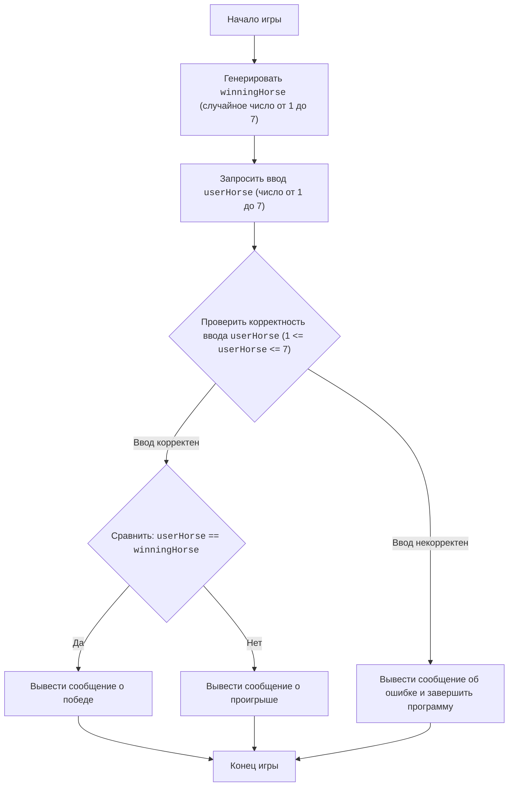

## Анализ кода игры "Скачки"

### 1. <алгоритм>

**Описание алгоритма игры "Скачки" в виде пошаговой блок-схемы:**

1.  **Начало игры:**
    *   Программа запускается.

2.  **Генерация номера лошади-победителя:**
    *   Используется функция `random.randint(1, 7)` для генерации случайного целого числа от 1 до 7 (включительно).
        *   Пример: `winningHorse` может быть присвоено значение `3`.
    *   Сгенерированное число сохраняется в переменной `winningHorse`.

3.  **Запрос ввода номера лошади от пользователя:**
    *   Программа выводит сообщение "Выберите номер лошади от 1 до 7:".
    *   Ожидается ввод целого числа от пользователя.
        *   Пример: пользователь вводит `5`.
    *   Ввод преобразуется в целое число и сохраняется в переменной `userHorse`.
    *   Проверка корректности ввода:
        *   Если `userHorse` < 1 или `userHorse` > 7, выводится сообщение об ошибке, и программа завершается.
        *   Если введено не целое число, то выбрасывается `ValueError`, выводится сообщение об ошибке, и программа завершается.

4.  **Проверка на выигрыш:**
    *   Программа сравнивает `userHorse` и `winningHorse`.
        *   Пример:  Если `userHorse` = `5`, а `winningHorse` = `3` , то условие ложно.

5.  **Вывод результата:**
    *   **Если `userHorse` == `winningHorse` (пользователь угадал):**
        *   Выводится сообщение: "УРА! ВАША ЛОШАДЬ ВЫИГРАЛА!".
            *   Пример: `userHorse` = `3` и `winningHorse` = `3`, выводится сообщение о победе.
    *   **Иначе (пользователь не угадал):**
        *   Выводится сообщение: "К СОЖАЛЕНИЮ, ВЫ ПРОИГРАЛИ!".
            *   Пример: `userHorse` = `5` и `winningHorse` = `3`, выводится сообщение о проигрыше.

6.  **Конец игры:**
    *   Программа завершается.

**Поток данных:**

```mermaid
flowchart TD
    A[Start] --> B{Generate winningHorse};
    B --> C{Get userHorse input};
    C --> D{Check: userHorse == winningHorse?};
    D -- Yes --> E[Output: "УРА! ВАША ЛОШАДЬ ВЫИГРАЛА!"];
    D -- No --> F[Output: "К СОЖАЛЕНИЮ, ВЫ ПРОИГРАЛИ!"];
    E --> G[End];
    F --> G;
    C --> H{Check input is valid};
     H -- No --> I[Output: Error message & exit];
    
```

### 2. <mermaid>



**Зависимости:**

*   **`Start`**: Начало программы. Не зависит от других компонентов, является точкой входа.
*   **`GenerateWinningHorse`**: Зависит от `random.randint` для генерации случайного номера лошади.
*   **`GetUserHorse`**: Зависит от функции `input` для получения ввода от пользователя, преобразует ввод в `int`.
*   **`ValidateUserHorseInput`**: Зависит от проверок на тип `int`, диапазон числа от 1 до 7.
*  **`OutputError`**: Выводит сообщение об ошибке, в случае некорректного ввода от пользователя. Завершает программу.
*   **`CompareHorses`**:  Сравнивает `userHorse` с `winningHorse`.
*   **`OutputWin`**: Выводит сообщение о победе, зависит от сравнения в `CompareHorses` и выполняется только при условии `userHorse == winningHorse`.
*   **`OutputLose`**: Выводит сообщение о проигрыше, зависит от сравнения в `CompareHorses` и выполняется только при условии `userHorse != winningHorse`.
*   **`End`**: Конец программы. Зависит от всех предыдущих шагов, является точкой выхода.

### 3. <объяснение>

**Импорты:**

*   **`import random`**: Импортирует модуль `random`, предоставляющий функции для генерации случайных чисел. В данном случае используется `random.randint(1, 7)` для получения случайного целого числа от 1 до 7, которое представляет номер лошади-победителя. Этот модуль является частью стандартной библиотеки Python и не относится к `src.`.

**Функции:**

*   **`random.randint(a, b)`**:
    *   **Аргументы**: `a` (начало диапазона) и `b` (конец диапазона), оба целые числа.
    *   **Возвращаемое значение**: Случайное целое число `N` такое, что `a <= N <= b`.
    *   **Назначение**: Генерация случайного номера лошади-победителя.
    *   **Пример**: `random.randint(1, 7)` вернет случайное число, например `3` или `7`.

*   **`input(prompt)`**:
    *   **Аргументы**: `prompt` - строка, сообщение пользователю для ввода.
    *   **Возвращаемое значение**: Строка, введенная пользователем.
    *   **Назначение**: Получение ввода от пользователя.
    *   **Пример**: `input("Выберите номер лошади от 1 до 7: ")` выведет сообщение и ожидает ввода от пользователя.

*   **`int(x)`**:
    *   **Аргументы**: `x` - строка, которую нужно преобразовать в целое число.
    *   **Возвращаемое значение**: Целое число, если преобразование успешно. Выбрасывает `ValueError`, если преобразование невозможно.
    *   **Назначение**: Преобразование строки, введенной пользователем, в целое число.
    *   **Пример**: `int("5")` вернет целое число 5.

*   **`exit()`**:
    *   **Аргументы**: Нет
    *   **Возвращаемое значение**: Нет
    *   **Назначение**: Завершает работу программы.
    *   **Пример**:  `exit()` завершит выполнение программы в случае некорректного ввода.

**Переменные:**

*   **`winningHorse`**:
    *   **Тип**: Целое число (`int`).
    *   **Использование**: Хранит случайный номер лошади-победителя, генерируемый функцией `random.randint()`.

*   **`userHorse`**:
    *   **Тип**: Целое число (`int`).
    *   **Использование**: Хранит номер лошади, выбранный пользователем. Значение получается от пользователя через функцию `input()` и преобразуется в целое число с помощью `int()`.

**Потенциальные ошибки и улучшения:**

*   **Обработка ошибок ввода**:
    *   В коде используется `try-except` для обработки `ValueError`, если пользователь вводит не целое число. Это хорошая практика.
    *   Есть проверка диапазона введенного числа (`if userHorse < 1 or userHorse > 7`), и программа завершается в случае некорректного ввода.
*   **Улучшения**:
    *  Можно сделать цикл для повторного запроса ввода, пока пользователь не введет корректное число.
    *  Можно добавить сообщение об ошибке с пояснением проблемы, чтобы пользователь лучше понял, что он сделал не так.

**Взаимосвязь с другими частями проекта:**

*   Данный скрипт является самостоятельной игрой и не имеет прямой зависимости от других частей проекта `src`.
*   В рамках проекта, игра расположена в подпапке `ai/helicone/ai_games/101_basic_computer_games/en/HORSES`, что говорит о её принадлежности к набору простых компьютерных игр.