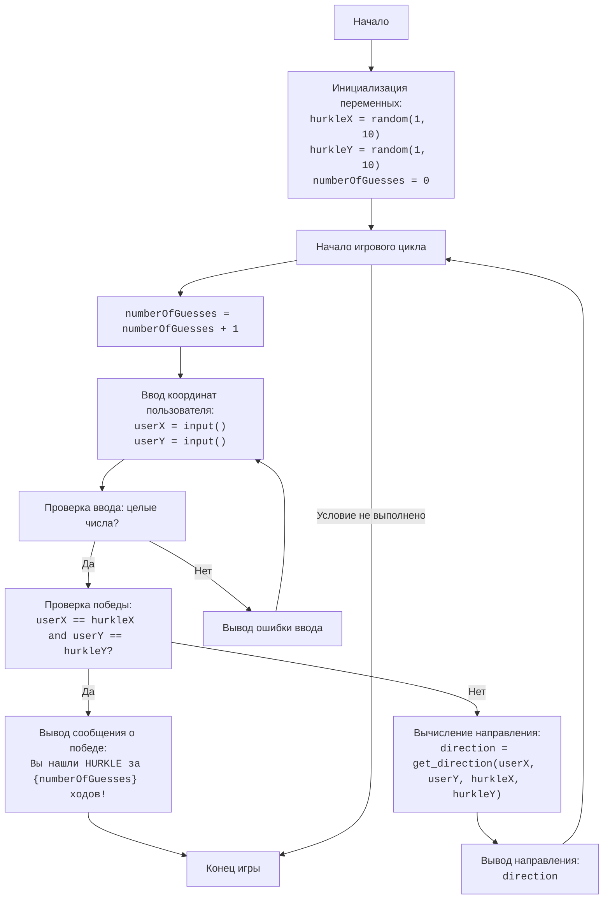

## АНАЛИЗ КОДА:

### 1. **<алгоритм>**
**Блок-схема (текстовое описание):**
1. **Начало:** Игра начинается с инициализации переменных.
2.  **Инициализация переменных:**
    *   Случайным образом генерируются координаты `hurkle_x` и `hurkle_y` (целые числа от 1 до 10) - местоположение "HURKLE".
    *   `numberOfGuesses` устанавливается в 0 - счетчик ходов.
3.  **Начало игрового цикла:**
    *   Цикл повторяется, пока игрок не угадает местоположение "HURKLE".
4.  **Увеличение счетчика ходов:** `numberOfGuesses` увеличивается на 1.
5.  **Ввод координат игроком:**
    *   Игрок вводит значения `user_x` и `user_y` (целые числа от 1 до 10).
    *   Если введенные значения не являются целыми числами, выводится сообщение об ошибке, и цикл переходит к следующей итерации.
6. **Проверка на победу**: 
    *   Сравниваются `user_x` и `user_y` с `hurkle_x` и `hurkle_y` соответственно. Если координаты совпадают, игра завершается.
7.  **Сообщение о победе:** Если координаты совпали, выводится сообщение о победе, включая количество ходов.
8.  **Конец игры**: Завершается основной цикл.
9.  **Вычисление направления:** Если координаты не совпадают, вычисляется направление от позиции пользователя к "HURKLE" с помощью функции `get_direction`.
10. **Вывод направления:** Выводится подсказка о направлении ("СЕВЕР", "ЮГ", "ВОСТОК", "ЗАПАД", "СЕВЕРО-ВОСТОК", "ЮГО-ВОСТОК", "СЕВЕРО-ЗАПАД", "ЮГО-ЗАПАД").
11. **Повторение цикла:** Цикл повторяется, начиная с шага 4.

**Примеры для логических блоков:**
*   **Инициализация переменных:**
    `hurkle_x` = 3, `hurkle_y` = 7, `numberOfGuesses` = 0
*   **Ввод координат игроком:**
    Игрок вводит `user_x` = 5, `user_y` = 5
*   **Проверка на победу**:
    `user_x` (5) != `hurkle_x` (3) и `user_y` (5) != `hurkle_y` (7) - условие не выполнено, игрок не победил.
*   **Вычисление направления:**
    `get_direction` (5, 5, 3, 7) возвращает "СЕВЕРО-ЗАПАД".
*   **Вывод направления:**
    Выводится подсказка "СЕВЕРО-ЗАПАД".

**Поток данных:**
1.  Координаты `hurkle_x` и `hurkle_y` генерируются в начале игры.
2.  Координаты `user_x` и `user_y` вводятся пользователем в каждой итерации цикла.
3.  Функция `get_direction` принимает `user_x`, `user_y`, `hurkle_x`, `hurkle_y` и возвращает направление.
4.  `numberOfGuesses` увеличивается на 1 при каждом новом витке цикла и выводится в конце игры при победе.

### 2. **<mermaid>**

**Объяснение диаграммы:**

*   `Start`: Начало программы.
*   `InitializeVariables`: Инициализация переменных: `hurkleX` и `hurkleY` — случайные координаты HURKLE, `numberOfGuesses` — счетчик ходов, который начинается с 0.
*   `GameLoopStart`: Начало основного игрового цикла.
*   `IncreaseGuesses`: Увеличение счетчика `numberOfGuesses` на 1 в начале каждого хода.
*  `UserInput`: Запрос у пользователя ввода координат X и Y.
*  `ValidateInput`: Проверка, являются ли введенные значения целыми числами.
*  `ErrorMessage`: Вывод сообщения об ошибке при неверном вводе.
*   `CheckWinCondition`: Проверка, угадал ли пользователь местоположение HURKLE.
*   `WinMessage`: Вывод сообщения о победе и количестве ходов, если координаты совпадают.
*   `End`: Конец игры.
*  `CalculateDirection`: Вызов функции `get_direction` для определения направления к HURKLE.
*  `OutputDirection`: Вывод направления для игрока.

**Зависимости:**
* `random`: Модуль для генерации случайных чисел.
* `get_direction`: Функция для вычисления направления относительно местоположения HURKLE.

### 3. **<объяснение>**

*   **Импорты:**
    *   `import random`: Этот модуль используется для генерации случайных координат `hurkle_x` и `hurkle_y`. Он не имеет прямой взаимосвязи с другими пакетами `src`, поскольку это стандартный модуль Python.

*   **Функции:**
    *   `get_direction(user_x, user_y, hurkle_x, hurkle_y)`:
        *   **Аргументы:** Принимает четыре целых числа: `user_x`, `user_y` (координаты игрока) и `hurkle_x`, `hurkle_y` (координаты HURKLE).
        *   **Возвращает:** Строку, представляющую направление (`"СЕВЕРО-ВОСТОК"`, `"ЮГО-ВОСТОК"`, `"СЕВЕРО-ЗАПАД"`, `"ЮГО-ЗАПАД"`, `"ВОСТОК"`, `"ЗАПАД"`, `"СЕВЕР"`, `"ЮГ"`).
        *   **Назначение:** Определяет и возвращает направление от позиции пользователя к HURKLE.
        *   **Пример:** `get_direction(3, 3, 5, 7)` вернет `"СЕВЕРО-ВОСТОК"`.

*   **Переменные:**
    *   `hurkle_x` (int): Случайная x-координата HURKLE (от 1 до 10).
    *   `hurkle_y` (int): Случайная y-координата HURKLE (от 1 до 10).
    *   `numberOfGuesses` (int): Счетчик количества попыток игрока, инициализируется 0.
    *   `user_x` (int): x-координата, введенная пользователем.
    *   `user_y` (int): y-координата, введенная пользователем.
    *   `direction` (str): Направление от позиции пользователя к HURKLE.

*   **Структура программы:**
    1.  **Генерация координат HURKLE:** Случайные координаты HURKLE генерируются в начале игры.
    2.  **Инициализация счетчика ходов:** `numberOfGuesses` устанавливается в 0.
    3.  **Игровой цикл:**
        *   **Увеличение счетчика ходов:** `numberOfGuesses` увеличивается на 1.
        *   **Ввод координат пользователем:** Запрашиваются x и y координаты, обрабатываются возможные ошибки ввода (исключение `ValueError`).
        *   **Проверка условия победы:** Сравниваются введенные координаты с координатами HURKLE.
        *   **Вывод сообщения о победе:** Если условие выполнено, выводится сообщение о победе и игра завершается.
        *   **Вычисление и вывод направления:** Если условие не выполнено, вычисляется и выводится направление с помощью функции `get_direction`.
        *  **Повторение цикла:** Цикл повторяется до тех пор, пока игрок не угадает местоположение HURKLE.

*   **Потенциальные ошибки и области для улучшения:**
    *   **Ошибка ввода:** Программа обрабатывает ошибку нецелочисленного ввода, но не проверяет ввод на корректный диапазон (1-10). Можно добавить проверку, чтобы ввод пользователя находился в пределах 1-10.
    *   **Повторный ввод:**  При невалидном вводе, после вывода сообщения об ошибке, код переходит на новую итерацию цикла. Однако, в этом случае, счетчик ходов все равно увеличивается.
    *   **Интерфейс:** Интерфейс пользователя можно сделать более интерактивным, например, используя графику, но для консольной игры текущий вариант приемлем.

**Взаимосвязи с другими частями проекта:**
*   Игра `HURKLE` является частью пакета игр `101_basic_computer_games`.
*   Использует только стандартные библиотеки Python, не имеет связей с другими частями проекта.