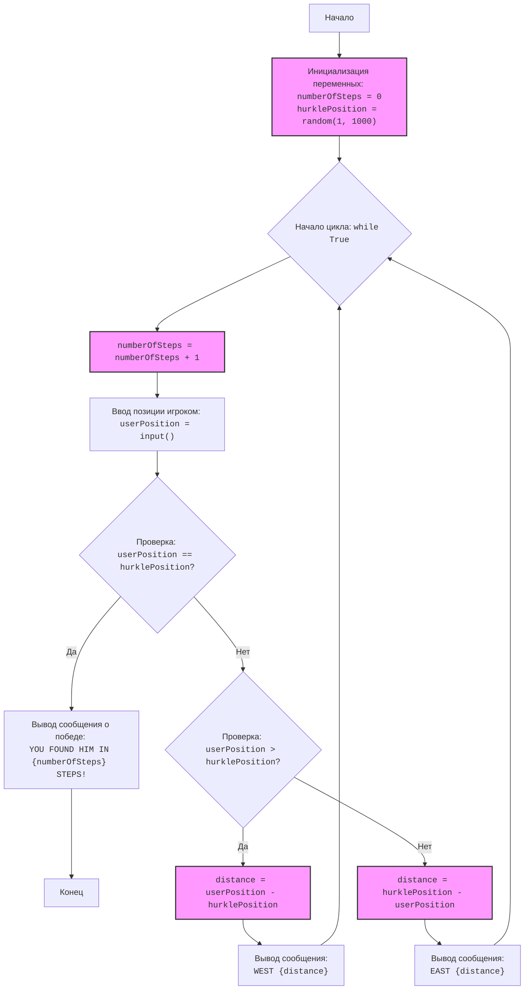

## Алгоритм

1. **Инициализация**:
   - Устанавливаем `numberOfSteps` (количество шагов) в 0.
   - Генерируем случайное целое число от 1 до 1000 для `hurklePosition` (позиция Херкла). Например, `hurklePosition = 500`.

2. **Начало цикла**:
   - Запускаем цикл `while True`, который будет выполняться, пока игрок не найдет Херкла.

3. **Итерация цикла**:
   - Увеличиваем `numberOfSteps` на 1. Если `numberOfSteps` был 0, он станет 1.
   - Запрашиваем ввод позиции игрока (`userPosition`). Например, игрок вводит `userPosition = 200`.
   - Проверяем, является ли введенное значение целым числом, если нет, то просим ввести заново.

4. **Проверка позиции**:
   - **Если `userPosition` равен `hurklePosition`:**
     - Например, если `userPosition = 500` и `hurklePosition = 500`, то выводим сообщение о победе: "ПОЗДРАВЛЯЮ! Вы нашли его за 1 шагов!".
     - Завершаем цикл.

   - **Если `userPosition` меньше `hurklePosition`:**
     - Например, если `userPosition = 200` и `hurklePosition = 500`, вычисляем `distance = hurklePosition - userPosition = 500 - 200 = 300`.
     - Выводим сообщение "EAST 300".
     - Возвращаемся к началу цикла.

   - **Если `userPosition` больше `hurklePosition`:**
     - Например, если `userPosition = 700` и `hurklePosition = 500`, вычисляем `distance = userPosition - hurklePosition = 700 - 500 = 200`.
     - Выводим сообщение "WEST 200".
     - Возвращаемся к началу цикла.

5. **Конец игры**:
   - Цикл завершается, когда игрок угадывает позицию Херкла.

## Mermaid

**Разбор зависимостей:**
- `random` : Импортируется для генерации случайной позиции Херкла `hurklePosition`.

## Объяснение

### Импорты
-   `import random`:  Модуль `random` используется для генерации псевдослучайных чисел. В данном случае, он используется для выбора случайной позиции Херкла в диапазоне от 1 до 1000.

### Переменные

-   `numberOfSteps`:  Целочисленная переменная, которая отслеживает количество шагов, которые сделал игрок. Инициализируется как 0 и увеличивается на 1 каждый раз, когда игрок делает попытку.
-   `hurklePosition`: Целочисленная переменная, хранящая случайную позицию Херкла, генерируется в начале игры с помощью `random.randint(1, 1000)`.
-   `userPosition`: Целочисленная переменная, хранящая позицию, которую вводит игрок. Значение считывается из ввода пользователя.
-   `distance`: Целочисленная переменная, хранящая расстояние между позицией игрока и позицией Херкла. Рассчитывается в зависимости от того, где находится игрок относительно Херкла.

### Функции
В коде нет явно определенных пользовательских функций, однако есть использование стандартных функций Python:
-   `random.randint(a, b)`: Функция из модуля `random`, возвращающая случайное целое число N в диапазоне `a <= N <= b`.
-   `input(prompt)`: Функция, которая выводит `prompt` и возвращает введенную пользователем строку.
-   `int(x)`: Функция, которая преобразует `x` в целое число.
-   `print(*objects, sep=' ', end='\n', file=sys.stdout, flush=False)`: Функция, которая выводит переданные аргументы в стандартный вывод.

### Основная логика кода:
-   Инициализируется переменная `numberOfSteps` для подсчета количества ходов игрока, начальное значение устанавливается как 0.
-   С помощью модуля `random` генерируется случайное целое число в диапазоне от 1 до 1000, которое является позицией Херкла (`hurklePosition`).
-   Запускается бесконечный цикл `while True`, который продолжается, пока не будет найден Херкл.
-   Внутри цикла:
    -   Счетчик `numberOfSteps` увеличивается на 1.
    -   Запрашивается ввод от пользователя, который должен ввести свою позицию.
        -  Если введено не целое число, программа выведет ошибку и попросит ввести снова.
    -   Проверяется, равна ли позиция пользователя позиции Херкла. Если они равны, то выводится сообщение о победе и количество ходов, после чего цикл завершается с помощью `break`.
    -   Если позиция пользователя меньше позиции Херкла, вычисляется расстояние и выводится сообщение "EAST {расстояние}".
    -   Если позиция пользователя больше позиции Херкла, вычисляется расстояние и выводится сообщение "WEST {расстояние}".

### Потенциальные ошибки и области для улучшения:
-   **Некорректный ввод пользователя**: Код обрабатывает только ошибку `ValueError`, которая может возникнуть, если пользователь введет нецелое число. Можно добавить обработку других типов ошибок (например, пустой ввод).
-   **Диапазон ввода**: Программа сообщает, что нужно вводить число от 1 до 1000, но не проверяет, что введенное значение действительно находится в этом диапазоне. Можно добавить проверку диапазона и выдавать соответствующее сообщение пользователю.
-   **Более информативный вывод**: Можно улучшить информативность сообщений, например, добавляя количество попыток или дополнительную информацию о предыдущих ходах.

### Взаимосвязь с другими частями проекта:
Так как это базовый скрипт игры, прямых связей с другими частями проекта нет. Однако, если бы этот скрипт был частью более крупной системы, то можно было бы добавить модульность:

1.  **Выделение игровой логики в отдельные функции**: Например, можно было бы выделить функцию для генерации позиции Херкла, функцию для проверки позиции и функцию для вывода сообщений, что сделало бы код более структурированным и легким для понимания.
2.  **Использование классов**: Если бы игра стала сложнее, можно было бы использовать классы для представления объектов игры (например, игрока и Херкла).

Таким образом, данный код представляет собой простую реализацию игры "Херкл", в которой игрок пытается угадать случайную позицию, получая подсказки о направлении и расстоянии. Код хорошо документирован и имеет простую структуру, однако может быть улучшен в плане обработки ошибок и информативности вывода.