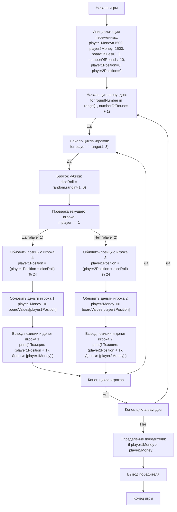

## АНАЛИЗ КОДА:

### 1. <алгоритм>
**Описание алгоритма игры "Монополия"**

Игра "Монополия" для двух игроков. Игроки ходят по очереди по круговому полю из 24 ячеек. Каждая ячейка имеет свою стоимость, которая добавляется или вычитается из капитала игрока.

**Блок-схема:**

1.  **Инициализация:**
    *   `player1Money` = 1500 (Начальный капитал первого игрока)
    *   `player2Money` = 1500 (Начальный капитал второго игрока)
    *   `boardValues` = `[-200, 100, -100, 200, -50, 50, -150, 150, 0, -200, 100, -100, 200, -50, 50, -150, 150, 0, -200, 100, -100, 200, -50, 50]` (Стоимости ячеек)
    *   `numberOfRounds` = 10 (Количество раундов игры)
    *   `player1Position` = 0 (Начальная позиция первого игрока)
    *    `player2Position` = 0 (Начальная позиция второго игрока)
2.  **Начало игрового цикла (по раундам):**
    *   Цикл от `roundNumber` = 1 до `numberOfRounds`:
        *   Вывод номера текущего раунда: `print(f"Раунд {roundNumber}")`
3.  **Цикл по игрокам:**
    *   Цикл для каждого `player` (1 и 2):
        *   Вывод имени текущего игрока: `print(f"Игрок {player}:")`
        *   **Бросок кубика:**
            *   `diceRoll` = random.randint(1, 6) (Случайное число от 1 до 6).
            *   Вывод результата броска: `print(f"   Бросок кубика: {diceRoll}")`
        *   **Перемещение игрока и обновление капитала:**
            *   Если `player` равен 1:
                *   `player1Position` = (`player1Position` + `diceRoll`) % 24 (Перемещение с учетом кругового поля)
                *   `currentPosition` = `player1Position`
                *   `player1Money` = `player1Money` + `boardValues`[`currentPosition`] (Изменение капитала)
                *   `currentMoney` = `player1Money`
            *   Иначе (если `player` равен 2):
                *   `player2Position` = (`player2Position` + `diceRoll`) % 24 (Перемещение с учетом кругового поля)
                *    `currentPosition` = `player2Position`
                *    `player2Money` = `player2Money` + `boardValues`[`currentPosition`] (Изменение капитала)
                *   `currentMoney` = `player2Money`
            *   Вывод текущей позиции и капитала игрока: `print(f"   Позиция: {currentPosition + 1}, Деньги: {currentMoney}")`
4.  **Определение победителя:**
    *   После завершения всех раундов:
        *   Вывод сообщения об окончании игры: `print("Игра окончена!")`
        *   Сравнение капитала игроков:
            *   Если `player1Money` > `player2Money`: Вывод: "Победил Игрок 1 с {player1Money} деньгами!"
            *   Иначе если `player2Money` > `player1Money`: Вывод: "Победил Игрок 2 с {player2Money} деньгами!"
            *   Иначе: Вывод: "Ничья, у обоих игроков {player1Money} денег"

**Пример для одного раунда и игрока:**
*   Предположим, `player1Position = 3`, `diceRoll = 5`. Тогда новая позиция будет `player1Position = (3 + 5) % 24 = 8`.
*   Если  `boardValues[8] = 0`, тогда капитал игрока не изменится.

### 2. <mermaid>

**Объяснение `mermaid` диаграммы:**
* **Start**: Начало программы.
* **InitializeVariables**: Инициализация переменных, таких как начальный капитал игроков (`player1Money`, `player2Money`), стоимости ячеек на поле (`boardValues`), количество раундов (`numberOfRounds`), и начальные позиции игроков (`player1Position`, `player2Position`).
* **RoundLoopStart**: Начало цикла, который повторяется для каждого раунда игры.
* **PlayerLoopStart**: Начало цикла, который повторяется для каждого игрока в текущем раунде.
* **RollDice**: Моделирует бросок кубика с помощью генерации случайного числа (`diceRoll`).
* **CheckPlayer**: Проверяет, какой игрок сейчас ходит (игрок 1 или игрок 2).
* **UpdatePlayer1Position/UpdatePlayer2Position**: Обновляет позицию текущего игрока на игровом поле в зависимости от результата броска кубика.
* **UpdatePlayer1Money/UpdatePlayer2Money**: Обновляет капитал текущего игрока в соответствии с его новой позицией на поле.
* **DisplayStatus1/DisplayStatus2**: Выводит на экран текущую позицию и количество денег текущего игрока.
* **PlayerLoopEnd**: Завершает цикл для текущего игрока. Если игроков еще есть, то возвращается к началу цикла игроков.
* **RoundLoopEnd**: Завершает цикл для текущего раунда. Если раундов еще есть, то возвращается к началу цикла раундов.
* **DetermineWinner**: Определяет победителя путем сравнения капитала игроков после всех раундов.
* **OutputWinner**: Выводит имя победителя на экран или объявляет ничью.
* **End**: Конец программы.

### 3. <объяснение>

**Импорты:**

*   `import random`: Этот модуль используется для генерации случайных чисел, в частности для имитации броска кубика.

**Переменные:**

*   `player1Money` (int): Начальный капитал первого игрока (1500).
*   `player2Money` (int): Начальный капитал второго игрока (1500).
*   `boardValues` (list): Список, содержащий стоимости (положительные или отрицательные) для каждой из 24 ячеек игрового поля.
*   `numberOfRounds` (int): Общее количество раундов в игре (10).
*   `player1Position` (int): Текущая позиция первого игрока на игровом поле (начинается с 0).
*   `player2Position` (int): Текущая позиция второго игрока на игровом поле (начинается с 0).
*   `roundNumber` (int): Переменная цикла, представляющая текущий раунд.
*   `player` (int): Переменная цикла, представляющая текущего игрока (1 или 2).
*   `diceRoll` (int): Случайное число, сгенерированное в диапазоне от 1 до 6, имитирующее бросок кубика.
*   `currentPosition` (int): Текущая позиция игрока на поле после броска кубика.
*  `currentMoney` (int): Текущая сумма денег игрока.

**Функции:**

*   `random.randint(1, 6)`: Функция из модуля `random`, которая генерирует случайное целое число от 1 до 6 (включительно), имитируя бросок кубика.

**Логика кода:**

1.  **Инициализация:**
    *   Инициализируются начальные значения для капитала игроков, стоимостей ячеек и количества раундов.
    *   Устанавливаются начальные позиции игроков на игровом поле (0).
2.  **Игровой цикл (раунды):**
    *   Внешний цикл `for roundNumber in range(1, numberOfRounds + 1)`: Итерирует каждый раунд игры.
    *   Выводится номер текущего раунда.
    *   Внутренний цикл `for player in range(1, 3)`: Итерирует по каждому игроку в текущем раунде.
3.  **Ход игрока:**
    *   Выводится номер текущего игрока.
    *   `diceRoll = random.randint(1, 6)`: Имитируется бросок кубика.
    *   Определяется текущий игрок (player1 или player2) на основе значения переменной player.
    *   Позиция игрока обновляется с учетом циклического поля `(player1Position + diceRoll) % 24` или `(player2Position + diceRoll) % 24`
    *   Капитал игрока изменяется в соответствии со значением ячейки на поле (boardValues).
    *   Выводится новая позиция и капитал игрока.
4.  **Определение победителя:**
    *   После завершения всех раундов сравнивается капитал игроков.
    *   Выводится сообщение о победителе или ничьей.

**Потенциальные ошибки и области для улучшения:**

*   **Нет проверки на банкротство:** Игра не учитывает ситуацию, когда у игрока заканчиваются деньги. В реальной "Монополии" это привело бы к проигрышу. Можно добавить проверку на отрицательный баланс и соответствующий механизм проигрыша.
*   **Отсутствие визуализации:** Код работает только с текстовым выводом. Добавление графического интерфейса улучшило бы восприятие игры.
*  **Жестко заданные значения:** Начальный капитал, стоимости ячеек, количество раундов, все это задано константами. Можно сделать эти значения настраиваемыми, например, через ввод от пользователя.
*   **Ограниченная логика:** Игра упрощена и не учитывает многие аспекты реальной "Монополии" (например, покупка недвижимости, налоги, другие специальные ячейки и т.д.).
*   **Отсутствие игрового интерфейса**: Вывод в консоль - не лучший способ представления игры.

**Цепочка взаимосвязей с другими частями проекта (если применимо):**
    *   `random` - стандартная библиотека python. Никаких зависимостей от других частей проекта нет.