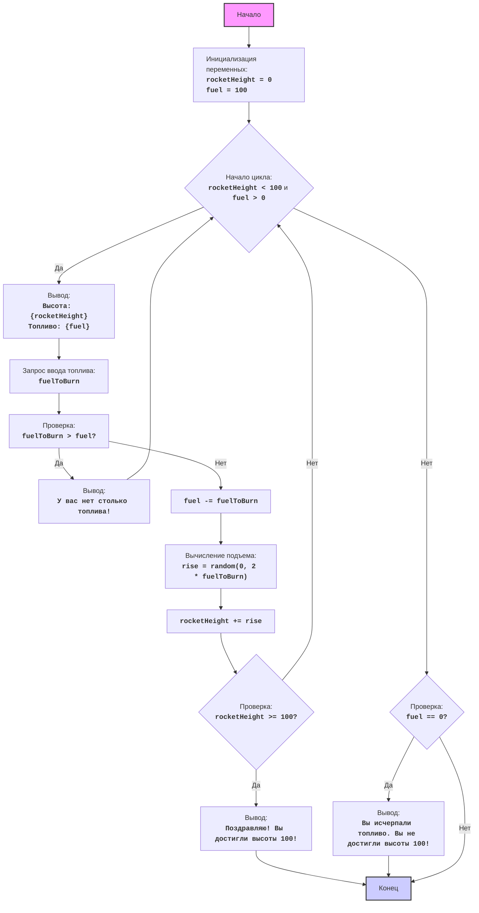

## ИНСТРУКЦИЯ:

Анализируй предоставленный код подробно и объясни его функциональность. Ответ должен включать три раздела:

1.  **<алгоритм>**: Опиши рабочий процесс в виде пошаговой блок-схемы, включая примеры для каждого логического блока, и проиллюстрируй поток данных между функциями, классами или методами.
2.  **<mermaid>**: Напиши код для диаграммы в формате `mermaid`, проанализируй и объясни все зависимости,
    которые импортируются при создании диаграммы.
    **ВАЖНО!** Убедитесь, что все имена переменных, используемые в диаграмме `mermaid`,
    имеют осмысленные и описательные имена. Имена переменных вроде `A`, `B`, `C`, и т.д., не допускаются!

    **Дополнительно**: Если в коде есть импорт `import header`, добавьте блок `mermaid` flowchart, объясняющий `header.py`:
    ```mermaid
    flowchart TD
        Start --> Header[<code>header.py</code><br> Determine Project Root]

        Header --> import[Import Global Settings: <br><code>from src import gs</code>]
    ```

3.  **<объяснение>**: Предоставьте подробные объяснения:
    -   **Импорты**: Их назначение и взаимосвязь с другими пакетами `src.`.
    -   **Классы**: Их роль, атрибуты, методы и взаимодействие с другими компонентами проекта.
    -   **Функции**: Их аргументы, возвращаемые значения, назначение и примеры.
    -   **Переменные**: Их типы и использование.
    -   Выделите потенциальные ошибки или области для улучшения.

Дополнительно, постройте цепочку взаимосвязей с другими частями проекта (если применимо).

Это обеспечивает всесторонний и структурированный анализ кода.
## Формат ответа: `.md` (markdown)
**КОНЕЦ ИНСТРУКЦИИ**

### 1. <алгоритм>

**Игра "Ракета"** - это текстовая игра, в которой игрок управляет ракетой, пытаясь достичь высоты 100, расходуя топливо.

**Блок-схема:**



**Пример работы алгоритма:**

1.  **Инициализация:**
    *   `rocketHeight` = 0
    *   `fuel` = 100
2.  **Начало цикла:**  Условие `rocketHeight < 100` (0 < 100) и `fuel > 0` (100 > 0) истинно.
3.  **Вывод состояния:** Выводится текущая высота и топливо. `Высота: 0, Топливо: 100`.
4.  **Ввод топлива:** Игрок вводит `fuelToBurn = 20`.
5.  **Проверка топлива:** Проверяется, что `fuelToBurn > fuel` (20 > 100) - ложно.
6.  **Сжигание топлива:**  `fuel` становится `100 - 20 = 80`.
7.  **Вычисление подъема:**  `rise`  становится случайным числом от 0 до `2 * 20 = 40`, например, 15.
8.  **Увеличение высоты:** `rocketHeight` становится `0 + 15 = 15`.
9.  **Проверка победы:** `rocketHeight >= 100` (15 >= 100) - ложно.
10. **Цикл продолжается** до достижения высоты 100 или до исчерпания топлива.
11. **Если условие цикла ложно:**
     *   **Проверка топлива:** Если `fuel == 0`, выводится сообщение о проигрыше.
     *   **Конец игры:** Игра завершается.

### 2. <mermaid>
```mermaid
flowchart TD
    Start["Начало игры"] --> InitializeVariables[Инициализация переменных:<br><code>rocketHeight = 0</code><br><code>fuel = 100</code>]
    InitializeVariables --> GameLoop{Цикл: <code>rocketHeight < 100</code> и <code>fuel > 0</code>}
    GameLoop -- True --> DisplayStatus[Вывести: <code>"Высота: {rocketHeight}, Топливо: {fuel}"</code>]
    DisplayStatus --> GetFuelInput[Ввод от пользователя: <code>fuelToBurn</code>]
    GetFuelInput --> ValidateFuelInput{Проверка: <code>fuelToBurn > fuel</code>}
    ValidateFuelInput -- True --> InsufficientFuelMessage[Вывести: <code>"У вас нет столько топлива!"</code>]
    InsufficientFuelMessage --> GameLoop
    ValidateFuelInput -- False --> CalculateFuel[<code>fuel = fuel - fuelToBurn</code>]
    CalculateFuel --> CalculateRise[<code>rise = random(0, 2 * fuelToBurn)</code>]
    CalculateRise --> UpdateHeight[<code>rocketHeight = rocketHeight + rise</code>]
    UpdateHeight --> CheckWinCondition{Проверка: <code>rocketHeight >= 100</code>}
    CheckWinCondition -- True --> VictoryMessage[Вывести: <code>"Поздравляю! Вы достигли высоты 100!"</code>]
     VictoryMessage --> EndGame["Конец игры"]
     CheckWinCondition -- False --> GameLoop
    GameLoop -- False --> CheckFuelEmpty{Проверка: <code>fuel == 0</code>}
    CheckFuelEmpty -- True --> GameOverMessage[Вывести: <code>"Вы исчерпали топливо. Вы не достигли высоты 100!"</code>]
    GameOverMessage --> EndGame
    CheckFuelEmpty -- False --> EndGame
     style Start fill:#f9f,stroke:#333,stroke-width:2px
    style EndGame fill:#ccf,stroke:#333,stroke-width:2px
```

**Зависимости:**

В данном коде используется только один импорт:

*   `import random`: Этот модуль используется для генерации случайного числа, которое определяет, на сколько ракета поднимется после сжигания топлива. Функция `random.randint(a, b)` возвращает случайное целое число `N` в диапазоне `a <= N <= b`.

**Объяснение диаграммы `mermaid`:**
Диаграмма `mermaid` представляет собой блок-схему игры "Ракета". В начале происходит инициализация переменных: `rocketHeight` (текущая высота ракеты) и `fuel` (количество топлива). Затем игра входит в цикл, который продолжается, пока высота ракеты не достигнет 100 или топливо не закончится. Внутри цикла выводится текущее состояние игры (высота и топливо), после чего запрашивается количество топлива для сжигания. Если введенное количество топлива превышает доступное, выводится сообщение об ошибке, и цикл повторяется. В противном случае, количество топлива уменьшается, вычисляется случайный подъём ракеты, и высота ракеты увеличивается. После каждого шага проверяется, достигла ли ракета нужной высоты. Если да, то игра завершается сообщением о победе. Если цикл завершается из-за отсутствия топлива, игра завершается сообщением о поражении.

### 3. <объяснение>

**Импорты:**

*   `import random`: Импортирует модуль `random`, предоставляющий функции для генерации псевдослучайных чисел.  В данном случае, он используется для определения случайного подъема ракеты после сжигания топлива.

**Переменные:**

*   `rocketHeight` (int): Целочисленная переменная, хранящая текущую высоту ракеты. Инициализируется 0 и увеличивается в цикле.
*   `fuel` (int): Целочисленная переменная, хранящая количество топлива. Инициализируется 100 и уменьшается в цикле.
*   `fuelToBurn` (int): Целочисленная переменная, хранящая количество топлива, которое игрок хочет сжечь в текущем ходе. Вводится пользователем и используется для уменьшения `fuel` и расчета подъема.
*   `rise` (int): Целочисленная переменная, хранящая случайное значение подъема ракеты. Вычисляется с помощью `random.randint()`.

**Функции:**

*   `random.randint(a, b)`: Функция модуля `random`, возвращающая случайное целое число в диапазоне от `a` до `b` включительно.

**Поток выполнения программы:**

1.  **Инициализация:** Переменные `rocketHeight` и `fuel` устанавливаются в начальные значения.
2.  **Игровой цикл:**
    *   Выводится текущее состояние игры (высота и топливо).
    *   Игрок вводит количество топлива для сжигания.
    *   Проверяется, достаточно ли топлива. Если нет, выводится сообщение об ошибке.
    *   Если топлива достаточно, то количество топлива уменьшается, и вычисляется случайный подъем.
    *   Высота ракеты увеличивается на случайный подъем.
    *   Проверяется условие победы или поражения (достижение высоты 100 или исчерпание топлива).
    *   Если ни одно из условий не выполнено, цикл продолжается.
3.  **Завершение игры:** Выводится сообщение о победе или поражении.

**Объяснение кода:**

Код реализует простую текстовую игру, в которой игрок пытается достичь заданной высоты, управляя расходом топлива. Игра использует цикл `while` для управления игровым процессом.  Внутри цикла обрабатывается ввод пользователя, вычисляется подъем ракеты с использованием случайных чисел и изменяется текущее состояние игры. Вся логика заключена в основном цикле и условных операторах, что делает игру легкой для понимания.

**Потенциальные ошибки и области для улучшения:**
*   **Обработка ввода:**  Код обрабатывает только ошибку ValueError при вводе не целого числа, но нет обработки других некорректных вводов (например, отрицательных чисел). Необходимо добавить проверки на допустимый ввод.
*   **Интерфейс пользователя:** Текстовый интерфейс можно улучшить, сделав его более дружественным. Например, можно добавить описание правил игры перед началом.
*   **Сложность:** Игра очень проста и не имеет никаких элементов сложности, кроме случайного числа подъема. Можно добавить возможность усовершенствования ракеты или влиять на значения подъема.
*   **Рефакторинг:** Код можно разбить на функции для лучшей читаемости.