## Анализ кода `pizza.py`

### <алгоритм>
1.  **Начало**: Программа начинает выполнение.
2.  **Ввод количества пицц**:
    *   Запрашивает у пользователя количество пицц.
    *   Пример: Пользователь вводит `3`.
    *   Проверяет, что введенное значение является целым числом и больше нуля. Если ввод некорректен, запрос повторяется.
3.  **Инициализация общей стоимости**:
    *   Устанавливает начальное значение переменной `totalCost` равным `0`.
    *   Пример: `totalCost = 0`.
4.  **Цикл по количеству пицц**:
    *   Цикл выполняется `quantity` раз.
    *   Начало цикла:
        *   Запрашивает у пользователя стоимость каждой пиццы.
        *   Пример: Пользователь вводит `10.5` для первой пиццы.
        *   Проверяет, что введенное значение является положительным числом. Если ввод некорректен, запрос повторяется.
        *   Увеличивает `totalCost` на стоимость текущей пиццы.
        *   Пример: `totalCost = totalCost + 10.5`.
    *   Конец цикла: Переходит к следующей итерации или к следующему шагу, если все пиццы обработаны.
5. **Ввод процента чаевых**:
   *  Запрашивает у пользователя процент чаевых.
   *  Пример: Пользователь вводит `10`.
   *  Проверяет, что введенное значение является числом в диапазоне от `0` до `100`. Если ввод некорректен, запрос повторяется.
6.  **Вычисление налога**:
    *   Вычисляет налог (`tax`) как 5% от общей стоимости (`totalCost`).
    *   Пример: `tax = totalCost * 0.05`
7.  **Вычисление суммы чаевых**:
    *   Вычисляет сумму чаевых (`tipAmount`) на основе введенного процента чаевых от общей стоимости (`totalCost`).
    *   Пример: `tipAmount = totalCost * tipPercent / 100`
8.  **Вычисление полной стоимости заказа**:
    *   Вычисляет полную стоимость заказа (`grandTotal`) как сумму общей стоимости, налога и чаевых.
    *   Пример: `grandTotal = totalCost + tax + tipAmount`.
9.  **Вывод результатов**:
    *   Выводит общую стоимость пицц.
    *   Выводит налог.
    *   Выводит сумму чаевых.
    *   Выводит полную стоимость заказа.
10. **Конец**: Программа завершает выполнение.

```mermaid
flowchart TD
    Start["Начало"] --> InputQuantity["Ввод количества пицц: <code><b>quantity</b></code>"];
    InputQuantity --> InitializeTotal["<code><b>totalCost = 0</b></code>"];
    InitializeTotal --> LoopStart{"Начало цикла: для каждой пиццы"};
    LoopStart -- Да --> InputCost["Ввод стоимости пиццы: <code><b>pizzaCost</b></code>"];
    InputCost --> UpdateTotal["<code><b>totalCost = totalCost + pizzaCost</b></code>"];
    UpdateTotal --> LoopEnd{"Конец цикла: все пиццы обработаны"};
    LoopEnd -- Да --> InputTipPercent["Ввод процента чаевых: <code><b>tipPercent</b></code>"];
    LoopEnd -- Нет --> InputTipPercent;
    InputTipPercent --> CalculateTax["<code><b>tax = totalCost * 0.05</b></code>"];
    CalculateTax --> CalculateTip["<code><b>tipAmount = totalCost * tipPercent / 100</b></code>"];
    CalculateTip --> CalculateGrandTotal["<code><b>grandTotal = totalCost + tax + tipAmount</b></code>"];
    CalculateGrandTotal --> OutputTotal["Вывод: <b>Общая стоимость пицц: <code>totalCost</code></b>"];
    OutputTotal --> OutputTax["Вывод: <b>Налог: <code>tax</code></b>"];
    OutputTax --> OutputTip["Вывод: <b>Чаевые: <code>tipAmount</code></b>"];
    OutputTip --> OutputGrandTotal["Вывод: <b>Полная стоимость заказа: <code>grandTotal</code></b>"];
    OutputGrandTotal --> End["Конец"];

    
    style Start fill:#f9f,stroke:#333,stroke-width:2px
    style End fill:#ccf,stroke:#333,stroke-width:2px
```

### <mermaid>

**Зависимости:**
Диаграмма не использует внешние импорты, поскольку данный скрипт является самостоятельным и не зависит от других модулей. Все вычисления и операции ввода/вывода происходят внутри этого скрипта.

### <объяснение>

**Импорты:**
В данном коде отсутствуют импорты, поскольку программа является автономной и не использует внешние модули или библиотеки.

**Классы:**
В коде нет классов, поскольку программа выполнена в виде последовательности инструкций и логических блоков.

**Функции:**
В коде не используются пользовательские функции, за исключением встроенных функций Python, таких как `int()`, `float()`, `input()`, `print()`.

*   `input(prompt)`: Используется для получения ввода от пользователя. Возвращает строку, введенную пользователем.
*   `int(value)`: Пытается преобразовать `value` в целое число. Возвращает целое число, или вызывает `ValueError`, если преобразование не удалось.
*   `float(value)`: Пытается преобразовать `value` в число с плавающей точкой. Возвращает число с плавающей точкой, или вызывает `ValueError`, если преобразование не удалось.
*   `print(message)`: Выводит `message` на экран.
*   `range(start, stop)`: Создает последовательность чисел от `start` (включительно) до `stop` (не включая).

**Переменные:**

*   `quantity` (`int`): Хранит количество пицц, которое пользователь хочет заказать.
*   `totalCost` (`float`): Хранит общую стоимость всех пицц. Инициализируется как `0`.
*   `i` (`int`): Счетчик цикла, используется для перебора каждой пиццы.
*   `pizzaCost` (`float`): Хранит стоимость каждой отдельной пиццы, вводимую пользователем.
*   `tipPercent` (`float`): Хранит процент чаевых, который пользователь хочет оставить.
*   `tax` (`float`): Хранит вычисленную сумму налога. Рассчитывается как 5% от `totalCost`.
*   `tipAmount` (`float`): Хранит вычисленную сумму чаевых. Рассчитывается как `tipPercent` процентов от `totalCost`.
*   `grandTotal` (`float`): Хранит полную стоимость заказа, включая `totalCost`, `tax` и `tipAmount`.

**Потенциальные ошибки и области для улучшения:**

*   **Обработка некорректного ввода**: Код уже включает в себя обработку `ValueError`, возникающего при вводе нечисловых данных. Однако можно было бы добавить более детальные проверки на ввод данных (например, проверить, что ввод не пустая строка).
*   **Форматирование вывода**: Вывод данных форматируется с использованием f-строк, что является хорошей практикой.
*   **Ограничение ввода**: Можно ограничить количество знаков после запятой при вводе стоимости пиццы и процента чаевых, что позволит избежать возможных проблем при больших числах.
*   **Комментарии**: Комментарии в коде понятные и помогают понять логику работы программы.
*   **Абстракция**: Код можно улучшить, добавив функции для ввода данных, расчета и вывода, чтобы сделать его более модульным.
*   **Переиспользование**: Код не имеет зависимостей и, следовательно, не переиспользуется в других частях проекта.

**Цепочка взаимосвязей:**
Так как этот скрипт является автономным и не использует внешние модули, цепочки взаимосвязей с другими частями проекта нет.