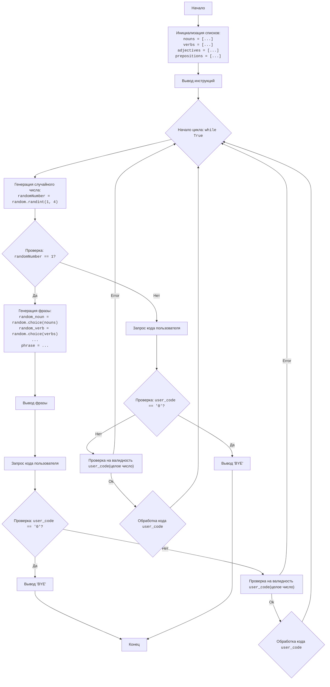

## ИНСТРУКЦИЯ:

Анализируй предоставленный код подробно и объясни его функциональность. Ответ должен включать три раздела:

1. **<алгоритм>**: Опиши рабочий процесс в виде пошаговой блок-схемы, включая примеры для каждого логического блока, и проиллюстрируй поток данных между функциями, классами или методами.
2.  **<mermaid>**: Напиши код для диаграммы в формате `mermaid`, проанализируй и объясни все зависимости,
    которые импортируются при создании диаграммы.
    **ВАЖНО!** Убедитесь, что все имена переменных, используемые в диаграмме `mermaid`,
    имеют осмысленные и описательные имена. Имена переменных вроде `A`, `B`, `C`, и т.д., не допускаются!

    **Дополнительно**: Если в коде есть импорт `import header`, добавьте блок `mermaid` flowchart, объясняющий `header.py`:
    ```mermaid
    flowchart TD
        Start --> Header[<code>header.py</code><br> Determine Project Root]

        Header --> import[Import Global Settings: <br><code>from src import gs</code>]
    ```

3.  **<объяснение>**: Предоставьте подробные объяснения:
    -   **Импорты**: Их назначение и взаимосвязь с другими пакетами `src.`.
    -   **Классы**: Их роль, атрибуты, методы и взаимодействие с другими компонентами проекта.
    -   **Функции**: Их аргументы, возвращаемые значения, назначение и примеры.
    -   **Переменные**: Их типы и использование.
    - Выделите потенциальные ошибки или области для улучшения.

Дополнительно, постройте цепочку взаимосвязей с другими частями проекта (если применимо).

Это обеспечивает всесторонний и структурированный анализ кода.
## Формат ответа: `.md` (markdown)
**КОНЕЦ ИНСТРУКЦИИ**
## АНАЛИЗ КОДА:

### <алгоритм>
1. **Инициализация списков:**
   -   Создаются списки `nouns`, `verbs`, `adjectives`, `prepositions` с начальными наборами слов.
   -   Пример: `nouns = ["BIRDS", "CATS", "DOGS", ...]`
2. **Вывод приветствия и инструкций:**
   -   На экран выводится приветственное сообщение и инструкции по управлению игрой.
   -   Пример: `print("Добро пожаловать в игру POETRY!")`
3. **Начало основного цикла:**
   -   Запускается бесконечный цикл `while True:`, который будет продолжаться до тех пор, пока пользователь не введет `0`.
4. **Генерация случайного числа:**
    -   Генерируется случайное число `randomNumber` от 1 до 4.
    -   Пример: `randomNumber = random.randint(1, 4)`
5. **Проверка условия:**
    -   Проверяется, равно ли `randomNumber` 1.
    -   Пример: `if randomNumber == 1:`
6. **Генерация и вывод случайной фразы:**
   - Если `randomNumber` равен 1:
     -   Случайно выбираются слова из каждого списка (`nouns`, `verbs`, `adjectives`, `prepositions`).
     -   Пример: `random_noun = random.choice(nouns)`
     -   Формируется фраза: "THE {adjective} {noun} {verb} {preposition} THE FOREST".
     -   Пример:  `phrase = f"THE {random_adjective} {random_noun} {random_verb} {random_preposition} THE FOREST"`
     -   Фраза выводится на экран.
     -   Пример: `print(f"Случайная фраза: {phrase}")`
     -   Запрашивается ввод кода у пользователя.
     -   Пример:  `user_code = input("Введите код (0 для выхода): ")`
     - Если введен код 0, то цикл завершается.
     - Если введен код, то проверяем на валидность (целое число) и переходим к шагу обработки кода
7. **Запрос кода пользователя для изменения списка:**
   -   Если `randomNumber` не равен 1, то запрашивается ввод кода у пользователя.
   -   Пример: `user_code = input("Введите код (0 для выхода): ")`
     - Если введен код 0, то цикл завершается.
     - Если введен код, то проверяем на валидность (целое число) и переходим к шагу обработки кода

8. **Обработка кода пользователя:**
    -   Проверяется ввод пользователя `user_code`:
        -   Если `user_code` равен 1, вызывается функция `change_list` для изменения списка `nouns`.
        -   Если `user_code` равен 2, вызывается функция `change_list` для изменения списка `verbs`.
        -   Если `user_code` равен 3, вызывается функция `change_list` для изменения списка `adjectives`.
        -   Если `user_code` равен 4, вызывается функция `change_list` для изменения списка `prepositions`.
9. **Завершение игры:**
    -   Если пользователь ввел 0 (на любом шаге ввода кода), цикл `while` завершается.
    -   Выводится сообщение "BYE".
    -   Пример: `print("BYE")`

### <mermaid>


### <объяснение>
1. **Импорты:**
    -   `import random`: Импортирует модуль `random`, который предоставляет функции для генерации псевдослучайных чисел. Используется для выбора случайных слов и генерации случайного числа от 1 до 4.

2. **Переменные:**
    -   `nouns`: Список существительных (строки).
    -   `verbs`: Список глаголов (строки).
    -   `adjectives`: Список прилагательных (строки).
    -   `prepositions`: Список предлогов (строки).
    -   `randomNumber`: Случайное целое число, сгенерированное модулем `random`.
    -  `user_code`: Строка, полученная от пользователя, которая преобразовывается в целое число.
    -   `phrase`: Строка, представляющая сгенерированную фразу.
    -  `random_noun`, `random_verb`, `random_adjective`, `random_preposition`: Строки, которые выбираются случайно из списков слов.
    -  `new_list`: Список, который получает новые слова от пользователя.

3.  **Функции:**
    -   `change_list(list_name)`:
        -   Аргумент: `list_name` (строка) - имя списка слов, который нужно изменить.
        -   Возвращает: `new_list` (список строк) - новый список слов, введенный пользователем.
        -   Назначение: Запрашивает у пользователя новые слова для списка, разделяет их на отдельные элементы и возвращает новый список.
        -   Пример:
            ```python
            new_nouns = change_list("существительных") # Если пользователь ввел "cat,dog,mouse", то new_nouns = ["CAT", "DOG", "MOUSE"]
            ```

4.  **Общая логика:**
    -   Программа инициализирует списки слов.
    -   Запускается бесконечный цикл, где на каждом шаге генерируется случайное число.
    -  Если случайное число равно 1, то генерируется случайная фраза, которая выводится на экран.
    -  В любом случае, программа запрашивает ввод пользователя для изменения списков слов.
    -   Функция `change_list` позволяет пользователю изменять слова в каждом из списков.
    -   Если пользователь вводит `0`, программа завершается.

5. **Потенциальные ошибки и улучшения:**
    -   **Обработка ошибок:**  В коде есть обработка `ValueError` для проверки ввода, но можно добавить проверку, чтобы убедиться, что список не пустой и введенные пользователем слова не содержат пробелы в начале и конце.

    -   **Развитие игры:** Можно расширить игру, добавив другие части речи (например, наречия) или создавая более сложные структуры предложений.
    -   **Интерфейс пользователя:**  Можно улучшить интерфейс, предоставив более подробные инструкции, или предоставить выбор языка.
    -   **Хранение списков:** Списки можно хранить в файле, чтобы при каждом запуске игры не вводить начальные значения, а подгружать их.
    -   **Объединение проверок:** В коде есть дублирование проверок на ввод. Можно вынести проверку в отдельную функцию.

**Взаимосвязь с другими частями проекта:**

Этот код является автономной программой и не имеет прямых зависимостей от других частей проекта. Однако, в более крупном проекте этот код можно было бы интегрировать как отдельный модуль для игр, например в модуль `src/ai/helicone/ai_games/101_basic_computer_games`. Списки слов могли бы храниться в отдельном файле или базе данных, и функция change_list могла бы взаимодействовать с этой базой данных.