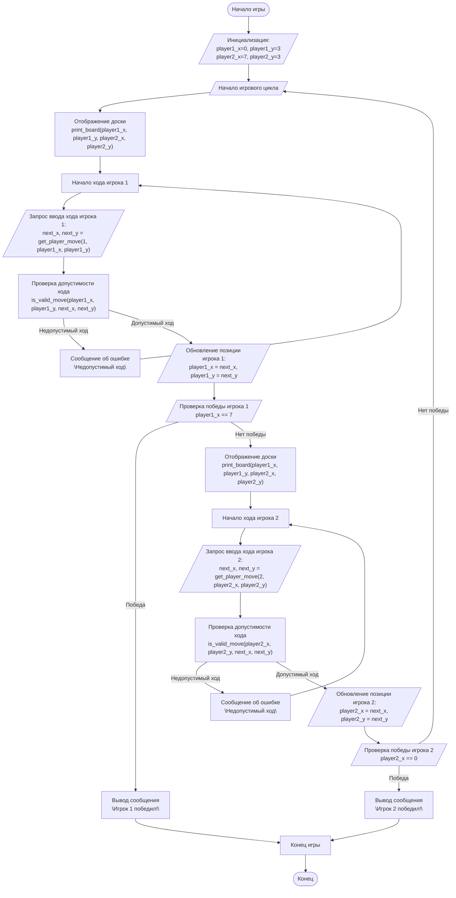

## АНАЛИЗ КОДА:

### 1. **<алгоритм>**

**Описание алгоритма:**

Игра "Ферзь" - это пошаговая стратегическая игра для двух игроков на шахматной доске 8x8. Цель игры - первым достичь противоположного края доски своим ферзем.

**Блок-схема:**

1.  **Начало:**
    *   Инициализируются начальные позиции ферзей:
        *   Игрок 1: `player1_x = 0`, `player1_y = 3`
        *   Игрок 2: `player2_x = 7`, `player2_y = 3`

2.  **Игровой цикл (пока не будет победителя):**

    *   **Отображение доски:** Вывод текущего состояния доски с позициями ферзей.
    *   **Ход игрока 1:**
        *   Запрос ввода хода у игрока 1 (координаты `next_x`, `next_y`).
        *   Проверка корректности ввода: проверяется формат ввода и допустимость хода (перемещение по горизонтали, вертикали или диагонали).
        *   Если ввод некорректен или ход недопустим, выводится сообщение об ошибке, и цикл повторяется для ввода хода.
        *   Обновление позиции ферзя игрока 1: `player1_x = next_x`, `player1_y = next_y`.
        *   Проверка, достиг ли ферзь игрока 1 конца доски (`player1_x == 7`).
        *   Если достиг, игра завершается, и игрок 1 объявляется победителем.
    *   **Отображение доски:** Вывод доски с новой позицией ферзя игрока 1.
    *   **Ход игрока 2:**
        *   Запрос ввода хода у игрока 2 (координаты `next_x`, `next_y`).
        *   Проверка корректности ввода и допустимости хода.
        *   Если ввод некорректен или ход недопустим, выводится сообщение об ошибке, и цикл повторяется для ввода хода.
        *   Обновление позиции ферзя игрока 2: `player2_x = next_x`, `player2_y = next_y`.
        *   Проверка, достиг ли ферзь игрока 2 конца доски (`player2_x == 0`).
        *   Если достиг, игра завершается, и игрок 2 объявляется победителем.
    *   Цикл продолжается до тех пор, пока один из игроков не выиграет.

3.  **Конец игры:**
    *   Выводится сообщение о победе одного из игроков.

**Пример:**

*   Начальные позиции:
    *   Игрок 1 (1): `(0, 3)`
    *   Игрок 2 (2): `(7, 3)`

*   Шаги:
    1.  Игрок 1 делает ход: `(1, 3)`.
    2.  Игрок 2 делает ход: `(6, 3)`.
    3.  Игра продолжается, пока один из игроков не достигнет противоположной стороны.

### 2. **<mermaid>**

**Импортированные зависимости:**

В данном коде нет явных импортов модулей, кроме `sys`, который не используется, поэтому импортированных зависимостей нет.

### 3. **<объяснение>**

**Импорты:**

*   `import sys`: Этот импорт присутствует в коде, но фактически не используется. Это означает, что он не влияет на текущую функциональность программы.

**Переменные:**

*   `player1_x`, `player1_y`: Целочисленные переменные, хранящие текущие координаты ферзя первого игрока на доске. Изначально установлены в (0, 3), что соответствует левому краю доски.
*   `player2_x`, `player2_y`: Целочисленные переменные, хранящие текущие координаты ферзя второго игрока на доске. Изначально установлены в (7, 3), что соответствует правому краю доски.

**Функции:**

*   **`print_board(player1_x, player1_y, player2_x, player2_y)`:**
    *   **Аргументы:** Принимает целочисленные координаты ферзей обоих игроков (`player1_x`, `player1_y`, `player2_x`, `player2_y`).
    *   **Назначение:** Отображает на экране шахматную доску 8x8. Позиции ферзей отображаются как '1' (игрок 1) и '2' (игрок 2), пустые клетки - как '.'.
    *   **Пример:** `print_board(0, 3, 7, 3)` выведет доску, где ферзь игрока 1 находится в левом краю, а ферзь игрока 2 - в правом.
    *   **Возвращаемое значение:** Отсутствует (функция не возвращает значение - `None`).

*   **`is_valid_move(current_x, current_y, next_x, next_y)`:**
    *   **Аргументы:** Принимает текущие координаты ферзя (`current_x`, `current_y`) и координаты следующего хода (`next_x`, `next_y`).
    *   **Назначение:** Проверяет, является ли предложенный ход допустимым. Ход считается допустимым, если ферзь перемещается по горизонтали, вертикали или диагонали. Также проверяется, что новая позиция не выходит за пределы доски.
    *   **Возвращаемое значение:** Возвращает `True`, если ход допустим, и `False` в противном случае.
    *   **Пример:** `is_valid_move(0, 3, 1, 4)` вернет `True`, т.к. это диагональный ход. `is_valid_move(0, 3, 0, 8)` вернет `False`, т.к. выход за границы доски.

*   **`get_player_move(player_number, current_x, current_y)`:**
    *   **Аргументы:** Принимает номер игрока (`player_number`) и текущие координаты ферзя (`current_x`, `current_y`).
    *   **Назначение:** Запрашивает у игрока ввод координат следующего хода в формате "x,y". Проверяет, является ли ввод корректным (два числа, разделенных запятой), и вызывает функцию `is_valid_move` для проверки допустимости хода.
    *   **Возвращаемое значение:** Возвращает кортеж новых координат (`next_x`, `next_y`) если ход допустим.
    *   **Пример:** Вызов `get_player_move(1, 0, 3)` запросит у игрока 1 ввод хода, например: "1,4", и вернет `(1, 4)`.

**Основной игровой цикл (`while True`):**

*   Выводит доску на экран с помощью `print_board`.
*   Запускает ход игрока 1, запрашивая ввод координат и обновляя позицию его ферзя.
*   Проверяет, не достиг ли игрок 1 противоположного края доски (x = 7). Если достиг, игра заканчивается, и игрок 1 объявляется победителем.
*   Повторяет аналогичные шаги для игрока 2.
*   Проверяет, не достиг ли игрок 2 противоположного края доски (x = 0). Если достиг, игра заканчивается, и игрок 2 объявляется победителем.
*   Игра продолжается до тех пор, пока один из игроков не выиграет.

**Потенциальные ошибки и области для улучшения:**

*   **Обработка ошибок:** В функции `get_player_move` обрабатывается только `ValueError`, но возможны другие ошибки ввода.
*   **Логика проверки выигрыша:** Условие `player1_x == 7`  проверяет, достиг ли ферзь только конечной позиции по оси x, но не учитывает возможные перемещения по диагонали. Аналогично для игрока 2: `player2_x == 0`.
*   **Отсутствие проверки перекрытия позиций:** Код не проверяет, не находятся ли ферзи на одной и той же позиции.
*   **Улучшение интерфейса:** Графический интерфейс (GUI) сделал бы игру более наглядной.
*   **Расширение возможностей:** Добавление более сложных правил, например, ограничения на количество ходов.

**Цепочка взаимосвязей с другими частями проекта:**

В текущем варианте код не взаимодействует с другими частями проекта, он является самостоятельным игровым модулем. Однако, при интеграции в более крупную систему,  можно было бы:

1.  **Использовать общую библиотеку для GUI.**
2.  **Хранить состояние игры (историю ходов) в БД.**
3.  **Создать класс для игры, чтобы упростить масштабирование.**

В целом, код хорошо структурирован и реализует базовую логику игры "Ферзь", но может быть улучшен в плане обработки ошибок, правил игры и пользовательского интерфейса.