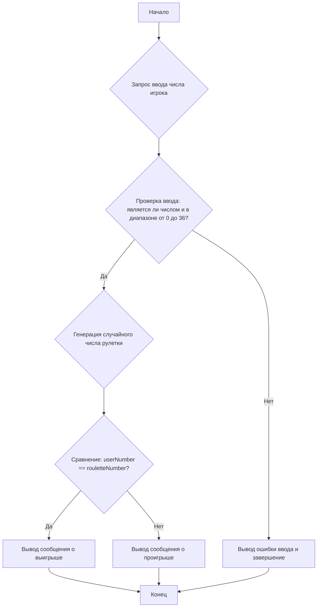

## <алгоритм>

**Блок-схема:**

1.  **Начало:**
    *   Программа начинает выполнение.

2.  **Ввод числа игроком:**
    *   Программа запрашивает у пользователя ввод целого числа от 0 до 36.
    *   Введенное значение сохраняется в переменной `userNumber`.
    *   **Пример:** Пользователь вводит `25`. `userNumber` становится равным `25`.
    *   **Пример ошибки:** Пользователь вводит `abc` или `3.14`. Программа выводит сообщение об ошибке и завершается.

3.  **Проверка диапазона:**
    *   Проверяется, находится ли `userNumber` в диапазоне от 0 до 36.
    *   Если `userNumber` меньше 0 или больше 36, программа выводит сообщение об ошибке и завершается.
    *   **Пример ошибки:** Пользователь вводит `-1`. Программа выводит сообщение об ошибке и завершается.
    *   **Пример ошибки:** Пользователь вводит `37`. Программа выводит сообщение об ошибке и завершается.

4.  **Генерация случайного числа:**
    *   Программа генерирует случайное целое число в диапазоне от 0 до 36.
    *   Сгенерированное значение сохраняется в переменной `rouletteNumber`.
    *   **Пример:** Сгенерировано число `12`. `rouletteNumber` становится равным `12`.

5.  **Проверка выигрыша:**
    *   Проверяется, равно ли значение `userNumber` значению `rouletteNumber`.
    *   Если значения равны, программа переходит к шагу 6.
    *   Если значения не равны, программа переходит к шагу 7.
    *   **Пример:** `userNumber` равно `25`, `rouletteNumber` равно `25`. Условие выполняется.
    *   **Пример:** `userNumber` равно `10`, `rouletteNumber` равно `5`. Условие не выполняется.

6.  **Вывод сообщения о выигрыше:**
    *   Программа выводит сообщение "ПОЗДРАВЛЯЮ! Вы выиграли!".
    *   Программа переходит к шагу 8.

7.  **Вывод сообщения о проигрыше:**
    *   Программа выводит сообщение "Вы проиграли. Число было {rouletteNumber}".
    *   **Пример:** Если `rouletteNumber` равен `12`, сообщение будет "Вы проиграли. Число было 12".
    *   Программа переходит к шагу 8.

8.  **Конец:**
    *   Программа завершает выполнение.

**Поток данных:**

*   `input()` -> `userNumber` (int)
*   `userNumber` -> Проверка диапазона
*   `random.randint()` -> `rouletteNumber` (int)
*   `userNumber`, `rouletteNumber` -> Проверка на совпадение
*   Сообщение о выигрыше или проигрыше -> `print()`

## <mermaid>

**Объяснение:**

*   `Start`: Начало выполнения программы.
*   `InputUserNumber`: Блок, представляющий запрос ввода числа от пользователя.
*   `ValidateInput`: Блок, проверяющий, является ли введенное значение целым числом и находится ли оно в допустимом диапазоне от 0 до 36.
*   `InputError`:  Блок, выполняемый, если введенные данные не валидны, выводит сообщение об ошибке и завершает программу.
*   `GenerateRouletteNumber`: Блок, генерирующий случайное число, которое будет результатом "вращения" рулетки.
*   `CompareNumbers`: Блок, сравнивающий число, введенное пользователем, со случайным числом рулетки.
*   `OutputWin`: Блок, выводящий сообщение о выигрыше.
*   `OutputLose`: Блок, выводящий сообщение о проигрыше и число, выпавшее на рулетке.
*   `End`: Завершение выполнения программы.

## <объяснение>

**Импорты:**

*   `import random`: Импортирует модуль `random`, который предоставляет функции для генерации псевдослучайных чисел. В данном коде используется функция `random.randint(a, b)`, которая возвращает случайное целое число N в диапазоне a <= N <= b.

**Функции:**

*   `input(prompt)`: Встроенная функция, которая выводит сообщение `prompt` на экран и считывает ввод пользователя в виде строки. В данном случае используется для получения ставки пользователя.
*   `int(x)`: Встроенная функция, которая преобразует строку `x` в целое число.
*   `random.randint(a, b)`: Функция из модуля `random`, которая возвращает случайное целое число в диапазоне от `a` до `b` включительно.
*   `print(obj, ...)`: Встроенная функция, которая выводит объекты `obj` на экран.
*   `exit()`: Встроенная функция, которая завершает выполнение программы.

**Переменные:**

*   `userNumber` (int): Целое число, введенное пользователем, на которое он делает ставку.
*   `rouletteNumber` (int): Целое число, сгенерированное случайно, представляющее результат "вращения" рулетки.

**Подробное объяснение:**

1.  **Импорт модуля `random`:**
    *   `import random`: Подключает модуль `random`, который используется для генерации случайных чисел. В данном коде это нужно для эмуляции "вращения" рулетки.

2.  **Ввод ставки пользователя:**
    *   `try...except ValueError`: Используется для обработки потенциальной ошибки, когда пользователь вводит не целое число. Если возникает `ValueError`, программа выводит сообщение об ошибке и завершается.
    *   `userNumber = int(input("Введите число от 0 до 36: "))`:  Запрашивает у пользователя ввод числа от 0 до 36 и преобразует ввод в целое число. Результат сохраняется в переменной `userNumber`.

3.  **Проверка допустимости ставки:**
    *   `if userNumber < 0 or userNumber > 36:`: Проверяет, находится ли введенное число в допустимом диапазоне (от 0 до 36).
    *   Если число выходит за пределы диапазона, выводится сообщение об ошибке, и программа завершается.

4.  **Генерация случайного числа рулетки:**
    *   `rouletteNumber = random.randint(0, 36)`: Генерирует случайное целое число в диапазоне от 0 до 36 (включительно) и сохраняет его в переменной `rouletteNumber`.

5.  **Проверка выигрыша:**
    *   `if userNumber == rouletteNumber:`:  Сравнивает число, введенное пользователем, с числом, выпавшим на рулетке.
    *   Если числа равны, выводится сообщение о выигрыше.
    *   Если числа не равны, выводится сообщение о проигрыше и выпавшее число на рулетке.

**Потенциальные ошибки и области для улучшения:**

*   **Обработка нечислового ввода:** В коде уже предусмотрена обработка `ValueError`, но можно добавить более подробное сообщение об ошибке.
*   **Повторный запуск игры:** Код запускается только один раз. Можно добавить цикл, позволяющий пользователю сыграть несколько раз.
*   **Ставки на чет/нечет:**  Можно расширить игру, добавив возможность делать ставки на четные или нечетные числа.
*   **Визуализация:** Можно добавить графический интерфейс для более интерактивного опыта.

**Взаимосвязь с другими частями проекта:**

*   В данном коде не происходит взаимодействия с другими частями проекта.