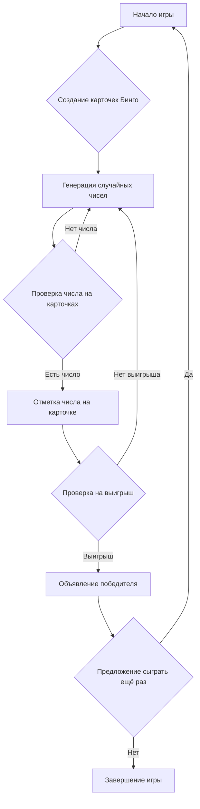
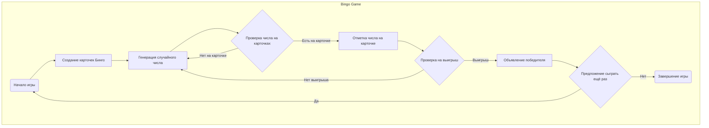

## ИНСТРУКЦИЯ:

Анализируй предоставленный код подробно и объясни его функциональность. Ответ должен включать три раздела:

1. **<алгоритм>**: Опиши рабочий процесс в виде пошаговой блок-схемы, включая примеры для каждого логического блока, и проиллюстрируй поток данных между функциями, классами или методами.
2. **<mermaid>**: Напиши код для диаграммы в формате `mermaid`, проанализируй и объясни все зависимости,
    которые импортируются при создании диаграммы.
    **ВАЖНО!** Убедитесь, что все имена переменных, используемые в диаграмме `mermaid`,
    имеют осмысленные и описательные имена. Имена переменных вроде `A`, `B`, `C`, и т.д., не допускаются!

    **Дополнительно**: Если в коде есть импорт `import header`, добавьте блок `mermaid` flowchart, объясняющий `header.py`:
    ```mermaid
    flowchart TD
        Start --> Header[<code>header.py</code><br> Determine Project Root]

        Header --> import[Import Global Settings: <br><code>from src import gs</code>]
    ```

3. **<объяснение>**: Предоставьте подробные объяснения:
   - **Импорты**: Их назначение и взаимосвязь с другими пакетами `src.`.
   - **Классы**: Их роль, атрибуты, методы и взаимодействие с другими компонентами проекта.
   - **Функции**: Их аргументы, возвращаемые значения, назначение и примеры.
   - **Переменные**: Их типы и использование.
   - Выделите потенциальные ошибки или области для улучшения.

Дополнительно, постройте цепочку взаимосвязей с другими частями проекта (если применимо).

Это обеспечивает всесторонний и структурированный анализ кода.
## Формат ответа: `.md` (markdown)
**КОНЕЦ ИНСТРУКЦИИ**

## Анализ кода игры "Бинго"

### 1. <алгоритм>

**Блок-схема игрового процесса:**



**Пошаговое описание с примерами:**

1.  **Начало игры (A):**
    *   Инициализация всех необходимых переменных и структур данных.
    *   Вывод приветственного сообщения "Добро пожаловать в игру Бинго!".

2.  **Создание карточек Бинго (B):**
    *   Генерация двух карточек (5x5) для игрока и компьютера.
        *   Пример генерации чисел для столбца 'B': `random.sample(range(1, 16), 5)` (выбор 5 случайных чисел от 1 до 15).
        *   Центральная ячейка для столбца 'N' помечается как "FREE".
    *   Вывод карточки игрока на экран.
    *   Пример карточки игрока:

        ```
        B  I  N  G  O
        10 22 35 50 69
        8  16  FREE 47 60
        5  29  41 55 68
        12 18 33 53 72
        14 23 44 52 74
        ```

3.  **Генерация случайных чисел (C):**
    *   Компьютер генерирует случайное число от 1 до 75, используя `random.randint(1, 75)`.
    *   Пример: `Выпало число: 22`

4.  **Проверка числа на карточках (D):**
    *   Проверяется, есть ли сгенерированное число на карточках игрока и компьютера.
    *   Пример: число `22` есть на карточке игрока.
        *   Если число есть, переходим к отметке этого числа на карточке (E).
        *   Если числа нет, возвращаемся к генерации случайного числа (C).

5.  **Отметка числа на карточке (E):**
    *   Если число найдено на карточке, оно отмечается (например, заменяется на 'X').
    *   Пример: На карточке игрока число 22 заменяется на 'X'.

6.  **Проверка на выигрыш (F):**
    *   После каждого хода проверяются все строки, столбцы и диагонали на предмет наличия выигрышной комбинации (все числа отмечены).
        *   Пример: если строка `10 X 35 50 69` на карточке игрока, то выигрыша нет.
        *   Пример: если строка `X X X X X` на карточке игрока, то игрок выиграл.
    *   Если есть выигрыш, переходим к объявлению победителя (G).
    *   Если выигрыша нет, возвращаемся к генерации случайного числа (C).

7.  **Объявление победителя (G):**
    *   Если обнаружен выигрыш (F), выводится сообщение "Поздравляем! Вы выиграли!" или "Компьютер выиграл!".

8.  **Предложение сыграть ещё раз (H):**
    *   После окончания игры предлагается пользователю сыграть ещё раз (да/нет).
    *   Если ответ "да", возвращаемся к началу игры (A).
    *   Если ответ "нет", переходим к завершению игры (I).

9.  **Завершение игры (I):**
    *   Вывод прощального сообщения.

### 2. <mermaid>



**Объяснение диаграммы `mermaid`:**

Диаграмма описывает основной поток управления игры "Бинго".

*   **Start (Начало игры)**: Начальная точка игры.
*   **GenerateCards (Создание карточек Бинго)**: Блок, отвечающий за создание игровых карточек для пользователя и компьютера.
*   **GenerateNumber (Генерация случайного числа)**:  Блок, в котором генерируется случайное число для игры.
*   **CheckNumberOnCards (Проверка числа на карточках)**: Решение, есть ли сгенерированное число на карточках игрока или компьютера.
    * Если число присутствует, то поток переходит к блоку **MarkNumberOnCard**.
    * Если число не найдено, то поток возвращается к блоку **GenerateNumber**, для генерации нового числа.
*   **MarkNumberOnCard (Отметка числа на карточке)**: Если число присутствует, оно отмечается на карточке игрока или компьютера.
*   **CheckForWin (Проверка на выигрыш)**: После отметки числа производится проверка, не выиграл ли кто-либо.
    * Если выигрыш есть, то поток переходит к блоку **AnnounceWinner**.
    * Если нет, то поток возвращается к блоку **GenerateNumber**, для генерации нового числа.
*   **AnnounceWinner (Объявление победителя)**: Сообщение о победе одного из игроков (игрока или компьютера).
*   **PlayAgain (Предложение сыграть ещё раз)**:  После объявления победителя игроку предлагается сыграть еще раз.
    *   Если ответ "да", игра начинается заново (стрелка к **Start**).
    *   Если ответ "нет", игра завершается (стрелка к **End**).
*  **End (Завершение игры)**: Конечная точка игры.

### 3. <объяснение>

**Импорты:**
* В данном коде нет импортов, так как это описание алгоритма, а не реализация кода.

**Классы:**

*   В представленном описании нет классов, так как это описание правил и алгоритма, а не программного кода.

**Функции:**

*   В представленном описании нет функций, так как это описание правил и алгоритма, а не программного кода. Однако, можно выделить потенциальные функции для реализации:
    *   `generate_bingo_card()`: Функция для генерации карточки Бинго (возвращает матрицу чисел 5x5).
    *   `generate_random_number()`: Функция для генерации случайного числа от 1 до 75.
    *   `check_number_on_card(card, number)`: Функция для проверки наличия числа на карточке и его отметки.
    *   `check_for_win(card)`: Функция для проверки карточки на выигрыш.
    *   `print_card(card)`: Функция для вывода карточки на экран.
    *   `play_again()`: Функция для предложения сыграть еще раз.

**Переменные:**

*   `player_card`: Карточка Бинго игрока (матрица 5x5).
*   `computer_card`: Карточка Бинго компьютера (матрица 5x5).
*   `number_drawn`: Случайное число, которое было выбрано (целое число от 1 до 75).
*   `columns`: Список названий столбцов ['B', 'I', 'N', 'G', 'O'].

**Потенциальные ошибки и области для улучшения:**

*   **Некорректный ввод пользователя:** Ввод, который не является 'да' или 'нет' для предложения сыграть ещё раз. Нужно добавить обработку некорректного ввода.
*   **Отсутствие проверки на повторение чисел:** При генерации чисел для карточек необходимо убедиться, что числа не повторяются внутри одного столбца.
*   **Улучшение пользовательского интерфейса:** Необходимо предусмотреть форматированный вывод карточки и сообщений.
*   **Возможность автоматизации игры:** Предусмотреть возможность игры компьютера против компьютера (без вмешательства игрока) для тестирования алгоритма.
*   **Добавление уровней сложности:** Возможность добавить различные уровни сложности, например, количество выигрышных линий или частота выпадения чисел.

**Взаимосвязь с другими частями проекта:**
В контексте проекта, данный модуль, после реализации, будет связан с основным игровым циклом. Для работы ему потребуется модуль для `header` для определения корня проекта и `gs` для доступа к глобальным настройкам (если они есть). Карточки, созданные в игре, должны будут храниться и обновляться в памяти, возможно, используя какую-то структуру данных (класс). Также, может потребоваться модуль для обработки пользовательского ввода.