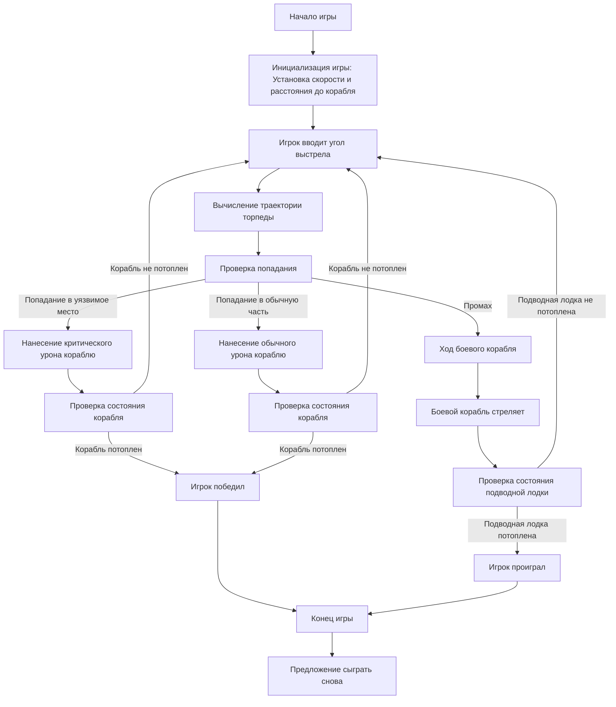

## АНАЛИЗ КОДА:

### <алгоритм>

1.  **Начало игры:**
    *   Инициализация:
        *   Устанавливается скорость боевого корабля (например, 17.18 узлов).
        *   Устанавливается расстояние между подводной лодкой и боевым кораблём (например, 5136.84 ярдов).
        *   Игроку сообщается о необходимости рассчитать угол для выстрела.
        *   **Пример:** `ship_speed = 17.18`, `distance = 5136.84`, сообщение "Введите угол:".
2.  **Основной цикл игры:**
    *   **Ход игрока:**
        1.  Игрок вводит угол для выстрела (например, `angle = 70`).
        2.  Вычисление траектории торпеды:
            *   На основе угла и расстояния рассчитывается, попала ли торпеда в корабль.
            *   Условно разделяется на попадание в уязвимое место, попадание в обычную часть корабля или промах.
            *   **Пример:** `if попадание_в_уязвимое_место: damage_ship("критическое"); elif попадание_в_обычную_часть: damage_ship("обычное"); else: miss()`.
        3.  Обработка попадания:
            *   Если торпеда попала в уязвимое место, боевому кораблю наносится критический урон.
            *   Если торпеда попала в обычную часть, боевому кораблю наносится обычный урон.
            *   Если игрок промахнулся, игра переходит к ходу боевого корабля.
        4.  Состояние корабля:
            *   Оценивается состояние боевого корабля.
            *   Если корабль потоплен, игрок побеждает, и цикл завершается.
            *   **Пример:** `if ship_health <= 0: win(); break;`
    *   **Ход боевого корабля (если игрок промахнулся):**
        1.  Боевой корабль стреляет в ответ.
        2.  Оценка попадания:
            *   Если подводная лодка потоплена, игрок проигрывает, и игра завершается.
            *    **Пример:** `if подводная_лодка_потоплена: lose(); break;`
            *   Иначе игра продолжается с хода игрока
        *   **Пример:** ` if player_health <=0: lose(); break; else: игрок_ходит()`
3.  **Подсчёт победителя:**
    *   Игра заканчивается, когда один из кораблей потоплен.
    *   Выводится сообщение о победе или поражении.
4.  **Завершение игры:**
    *   Предлагается сыграть снова (например, "Хотите сыграть снова? (да/нет)").
    *   Если игрок выбирает "да", игра начинается заново.

### <mermaid>


### <объяснение>

1. **Импорты:**
    *   В предоставленном коде не используются импорты, так как это описание игровой логики, а не исполняемый код.
    *   Если бы код был написан на Python, то импортировались бы, например, библиотеки для математических расчетов, обработки ввода, и, возможно, для вывода графики или звука.

2. **Классы:**
    *   В описании игры не определены классы.
    *   В реализации на Python, можно было бы создать классы, например, `Ship` (для корабля), `Submarine` (для подводной лодки), `Torpedo` (для торпеды).
    *   **Пример:**
        ```python
        class Ship:
            def __init__(self, speed, health):
                self.speed = speed
                self.health = health

            def take_damage(self, damage_type):
                if damage_type == "критическое":
                    self.health -= 2
                else:
                    self.health -= 1

        class Submarine:
            def __init__(self, distance, health):
                self.distance = distance
                self.health = health

            def shoot(self, angle):
                # расчет траектории
                pass
        ```

3. **Функции:**
    *   В описании явно не определены функции, но логически их можно выделить:
        *   `initialize_game()`: Инициализирует игру, устанавливает начальные параметры (скорость корабля, расстояние), выводит приветствие.
        *   `get_player_angle()`: Получает от игрока угол выстрела.
        *   `calculate_trajectory(angle)`: Рассчитывает траекторию торпеды и определяет, было ли попадание.
        *   `damage_ship(damage_type)`: Наносит урон кораблю (критический или обычный).
        *   `ship_shoot()`: Имитирует выстрел боевого корабля в ответ.
        *   `check_win_condition()`: Проверяет условия победы.
        *   `play_again()`: Предлагает игроку сыграть снова.
    *  **Пример:**
        ```python
        def initialize_game():
            ship_speed = 17.18
            distance = 5136.84
            print("Добро пожаловать в игру BOAT!")
            print(f"Скорость боевого корабля установлена на {ship_speed} узлов.")
            print(f"Растояние от вас до боевого корабля: {distance} ярдов.")
            print("Вам необходимо расчитать угол для выстрела.")
            return ship_speed, distance
        ```

4. **Переменные:**
    *   `ship_speed` (float): Скорость боевого корабля.
    *   `distance` (float): Расстояние от подводной лодки до боевого корабля.
    *   `angle` (int/float): Угол выстрела, введенный игроком.
    *  `ship_health` (int): Здоровье корабля.
    *   `player_health`(int): Здоровье подводной лодки.
    *  `damage_type` (string): Тип урона (критический или обычный).

5. **Потенциальные ошибки и улучшения:**
    *   **Отсутствует реализация расчёта траектории:** Описание не содержит конкретный алгоритм для расчета траектории торпеды.
    *   **Не детализировано поведение корабля:** Не указано, как именно боевой корабль стреляет в ответ (рандомно, по какой-то логике).
    *   **Не определена логика повреждений:** Описание не определяет конкретно, как повреждения влияют на корабли, и сколько урона наносит торпеда.
    *   **Простота взаимодействия:** игра может быть улучшена добавлением случайных элементов, таких как ветер или неточность торпед.
    *   **Отсутствует валидация ввода:** Не производится проверка на правильность ввода угла выстрела.
    *   **Улучшение:** Ввод данных пользователя можно вынести в отдельную функцию, для упрощения и улучшения кода.
    *   **Улучшение:**  Можно добавить графический интерфейс, а также звуковое сопровождение, для повышения интерактивности игры.

6. **Взаимосвязи с другими частями проекта:**
    *   В текущем описании нет связей с другими частями проекта.
    *   В реальном проекте, данный модуль мог бы использовать общие ресурсы проекта, такие как утилиты для ввода-вывода, математические функции или модули для графики и звука.