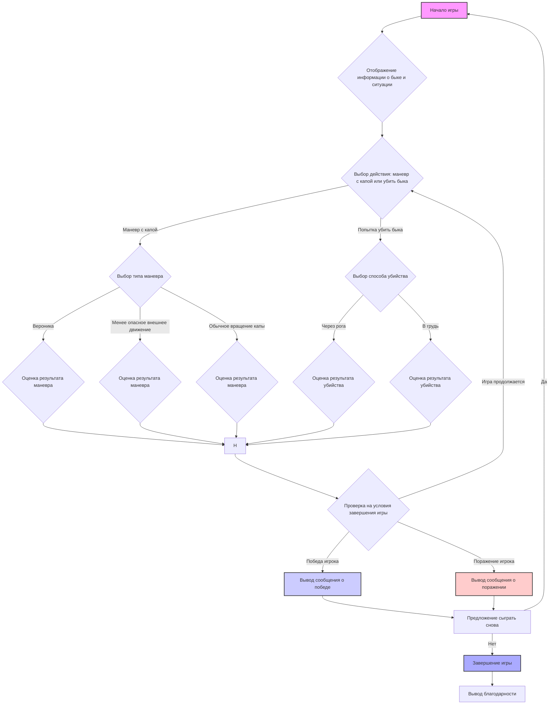

## АНАЛИЗ КОДА:

### 1. <алгоритм>

Представленный текст описывает правила и логику игры "BULL" (Бой с быком). Ниже представлена пошаговая блок-схема, отражающая игровой процесс:



**Примеры для логических блоков:**

*   **B:** Выводится текст: "Добро пожаловать в игру Бой с быком! Вы — матадор. На арене появился бык. Пикадоры не в форме."
*   **C:** Игрок вводит "0", "1", "2" для маневров, или "4", "5" для попытки убийства.
*   **D:** Игрок вводит "0", "1", или "2" для выбора конкретного маневра.
*   **E, F, G:** Результаты маневров определяются случайным образом, может быть успешным или нет.
*   **I:** Игрок вводит "4" или "5" для выбора способа убийства быка.
*   **J, K:** Результат попытки убийства также определяется случайно, может привести к победе или поражению игрока.
*   **L:** Игра завершается, если игрок убивает быка, или бык убивает игрока.
*  **O:** Игроку предлагается сыграть снова, ввод "да" для начала новой игры или "нет" для завершения.

**Поток данных:**

1.  **Инициализация**: Начало игры, вывод начальной информации.
2.  **Выбор действия**: Игрок выбирает между маневром с капой или попыткой убийства быка.
3.  **Выбор маневра/способа убийства**: Игрок уточняет тип маневра с капой или способ убийства быка.
4.  **Оценка результата**: Система определяет результат действия (успех/неудача) на основе случайных операций.
5.  **Проверка условий**: Проверка на победу или поражение, если условия не выполнены, игра возвращается к шагу выбора действия.
6.  **Завершение игры**: Вывод результата, предложение сыграть снова.
7.  **Рестарт или выход**: Игрок выбирает начать новую игру или завершить текущую.

### 2. <mermaid>

```mermaid
flowchart TD
    subgraph Игра "BULL"
        A[Начало игры] --> B{Отображение информации о быке и ситуации};
        B --> C{Выбор действия: маневр с капой или убить быка};
    
        C -- Маневр с капой --> D{Выбор типа маневра};
        D -- Вероника --> E{Оценка результата маневра};
        D -- Менее опасное внешнее движение --> F{Оценка результата маневра};
        D -- Обычное вращение капы --> G{Оценка результата маневра};
        E --> H;
        F --> H;
        G --> H;
        
        C -- Попытка убить быка --> I{Выбор способа убийства};
        I -- Через рога --> J{Оценка результата убийства};
        I -- В грудь --> K{Оценка результата убийства};
        J --> H;
        K --> H;
        
        H --> L{Проверка на условия завершения игры};
        L -- Победа игрока --> M[Вывод сообщения о победе];
        L -- Поражение игрока --> N[Вывод сообщения о поражении];
        L -- Игра продолжается --> C;
        
        M --> O[Предложение сыграть снова];
        N --> O;
        
        O -- Да --> A;
        O -- Нет --> P[Завершение игры];
        P --> Q[Вывод благодарности];
    end
    
    style A fill:#f9f,stroke:#333,stroke-width:2px
    style M fill:#ccf,stroke:#333,stroke-width:2px
    style N fill:#fcc,stroke:#333,stroke-width:2px
    style P fill:#aaf,stroke:#333,stroke-width:2px
```

**Описание:**

*   Диаграмма представляет собой flowchart, описывающий игровой процесс "BULL" (Бой с быком).
*   `Начало игры`  - первый шаг, запуск игры.
*  `Отображение информации о быке и ситуации` - отображается информация о состоянии быка и игровом окружении.
*   `Выбор действия: маневр с капой или убить быка` - игрок выбирает один из двух основных вариантов.
*   `Выбор типа маневра` - если игрок выбрал маневр, то уточняет его тип.
*   `Вероника`, `Менее опасное внешнее движение`, `Обычное вращение капы` -  варианты маневров.
*   `Оценка результата маневра` - определяет успешность маневра.
*  `Выбор способа убийства` - если игрок выбрал убить быка, то уточняет способ.
*   `Через рога`, `В грудь` - варианты попытки убийства.
*   `Оценка результата убийства` - определяет успешность попытки убийства.
*   `Проверка на условия завершения игры` - проверка условий победы или поражения.
*   `Вывод сообщения о победе` - сообщение игроку о победе.
*   `Вывод сообщения о поражении` - сообщение игроку о поражении.
*   `Предложение сыграть снова` - запрос игроку, хочет ли он сыграть еще раз.
*   `Завершение игры` - завершение игры.
*   `Вывод благодарности` - благодарность игроку за игру.

В диаграмме не используется импорт каких-либо библиотек.

### 3. <объяснение>

**Общее описание:**
Представленный текст описывает логику и правила игры "BULL" (Бой с быком), не являясь кодом на каком-либо языке программирования. Это пошаговое описание игры, предназначенное для последующей реализации в виде программного кода.

**Разделы описания:**

1.  **Инициализация игры**:
    *   Игра начинается с представления игроку информации о быке и текущей игровой ситуации.
    *   Игроку сообщается о состоянии пикадоров и тореадоров.
    *   Предоставляется выбор действий: выполнить маневр с капой или попытаться убить быка.

2.  **Основной цикл игры**:
    *   **Маневры с капой**:
        *   Игрок выбирает один из трех типов маневра: "Вероника" (опасный), "Менее опасное внешнее движение" и "Обычное вращение капы".
        *   Каждый маневр имеет свою степень риска и может привести к разным результатам.
    *   **Попытка убить быка**:
        *   Игрок может попытаться убить быка "через рога" или "в грудь".
        *   Попытка убийства – это рискованный шаг, который может привести как к победе, так и к поражению игрока.

3.  **Подсчёт победителя**:
    *   Игра продолжается до тех пор, пока игрок не убьет быка (победа) или не будет убит быком (поражение).
    *   После завершения игры программа выводит сообщение о результате: "Поздравляем, вы убили быка!" или "Жаль, вы были поражены быком.".

4.  **Завершение игры**:
    *   После окончания игры игроку предлагается сыграть еще раз.
    *   При выборе "нет" игра завершается и выводится благодарность за игру.

**Переменные**:
*   В тексте не используются конкретные переменные. Вместо этого, описаны общие концепции, такие как "тип маневра", "результат действия", "состояние игры", которые могут быть представлены переменными при реализации в коде.

**Потенциальные ошибки и области для улучшения:**

1.  **Неопределенность результатов**: Результаты действий (маневров и попыток убийства) должны быть реализованы с использованием механизма случайных чисел, чтобы отразить непредсказуемость игры.

2.  **Отсутствие численной оценки**:
    *   В тексте отсутствуют конкретные числовые характеристики быка, маневров и вероятности успеха. Это может быть улучшено путем добавления таких числовых характеристик.
    *   Возможна система подсчета очков за каждый успешный маневр или попытку убийства.

3.  **Отсутствие промежуточных состояний**:
    *   В тексте отсутствуют промежуточные этапы игры, которые могут усложнить игру и добавить динамики.
    *   Можно было бы добавить "уровень ярости быка", который возрастает с каждым действием игрока.

4.  **Слишком простая система успеха/неудачи**:
    *   Система успеха или неудачи не подразумевает промежуточных результатов и ситуаций, которые могли бы возникнуть в настоящей корриде.
    *   Следует расширить спектр возможных исходов.

5.  **Отсутствие взаимодействия с другими персонажами**:
    *   Описание игры не учитывает взаимодействия игрока с пикадорами и тореадорами. В будущем можно было бы добавить их влияние на игровой процесс.
**Цепочка взаимосвязей с другими частями проекта**:
В предоставленном описании отсутствуют явные связи с другими частями проекта, так как это описание правил игры. Однако, данное описание может быть связано с:
1.  **GUI (графический пользовательский интерфейс)**: Если игра будет иметь графический интерфейс, то это описание послужит основой для его создания, определяя логику и текстовые сообщения.
2.  **Классы и функции**: Код, реализующий данную игру, будет использовать функции и, возможно, классы для инкапсуляции игровой логики, маневров, состояний и персонажей.
3.  **Система тестирования**: Данное описание поможет разработать тестовые сценарии для игры.

**Заключение:**
В заключении, представленный текст является описанием правил игры "BULL", а не кодом. Он хорошо структурирован, описывает основные этапы игры и может служить основой для дальнейшей реализации. Необходимо добавить механизмы случайности, числовые параметры и возможные промежуточные результаты для создания более сложной и интересной игры.