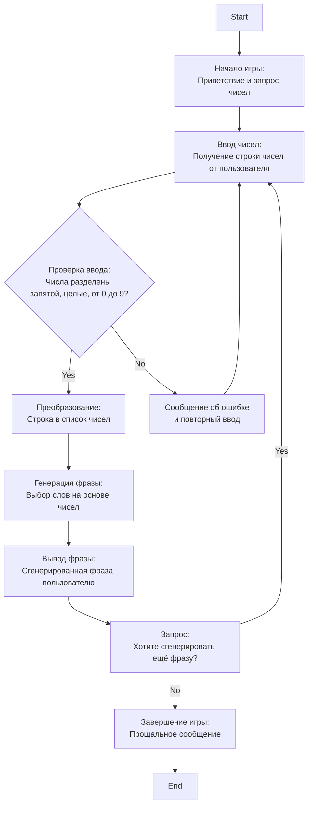

## Анализ кода игры BUZZWD (Генератор модных слов)

### 1. <алгоритм>

**Описание алгоритма:**

1.  **Начало игры:**
    *   Программа выводит приветствие и запрашивает у игрока три числа от 0 до 9, разделенных запятой.
    *   Пример: `Добро пожаловать в генератор модных слов! Введите три числа от 0 до 9, разделённых запятой.`

2.  **Ввод чисел:**
    *   Игрок вводит три числа в виде строки (например, "1,2,3").
    *   Программа проверяет корректность ввода:
        *   Разделены ли числа запятыми.
        *   Являются ли все числа целыми и находятся ли в диапазоне от 0 до 9.
        *   Если ввод некорректный, программа просит повторить ввод.
    *   Пример: `> 1, 4, 7`

3.  **Генерация фразы:**
    *   После получения корректных чисел программа преобразует их в список целых чисел.
    *   На основе этих чисел (или, возможно, используя их в качестве индексов) выбираются слова из заранее определенных списков слов (например, "технологические слова", "существительные", "модификаторы").
    *   Слова объединяются в случайную фразу, которая не несет определенного смысла, но звучит "модно" и "интеллектуально".
    *   Пример: `Синхронизированное управление компонентами`

4.  **Вывод фразы:**
    *   Сгенерированная фраза выводится на экран.
    *   Пример: `Синхронизированное управление компонентами`

5.  **Завершение или продолжение игры:**
    *   Программа спрашивает игрока, хочет ли он сгенерировать новые модные слова.
    *   Если ответ "да", программа возвращается к шагу 2.
    *   Если ответ "нет", программа выводит прощальное сообщение и завершается.
    *   Пример: `Хотите сгенерировать новые модные слова? (да/нет)`
    *   Пример: `> нет`
    *   Пример: `Спасибо за игру!`

**Блок-схема (псевдокод):**

```
Start
|
V
Print "Добро пожаловать в генератор модных слов!"
|
V
While True:
    |
    V
    Input "Введите три числа от 0 до 9, разделённых запятой: " -> input_string
    |
    V
    if input_string is valid (3 integers between 0 and 9, separated by commas):
    |    |
    |    V
    |   numbers = convert input_string to a list of integers
    |   |
    |   V
    |   generated_phrase = generate_phrase_from_numbers(numbers)
    |   |
    |   V
    |   Print generated_phrase
    |   |
    |   V
    |   Input "Хотите сгенерировать новые модные слова? (да/нет): " -> play_again
    |   |
    |   V
    |   if play_again == "нет":
    |       |
    |       V
    |       Print "Спасибо за игру!"
    |       |
    |       V
    |       Break
    |    else:
    |        |
    |        V
    |       continue loop
    |
    else:
        |
        V
        Print "Неверный ввод. Пожалуйста, введите три числа от 0 до 9, разделённых запятой."
        |
        V
        continue loop
End
```

### 2. <mermaid>



**Разъяснение зависимостей:**

*   `Start`: Начальная точка выполнения программы.
*   `GameStart`: Вывод начального приветствия и запроса на ввод чисел.
*   `InputNumbers`: Получает строку с числами от пользователя.
*   `ValidateNumbers`: Проверяет корректность ввода, убеждается, что введены три числа от 0 до 9, разделённые запятыми.
*   `ConvertNumbers`: Если проверка пройдена, преобразует строку в список целых чисел.
*   `InputError`: Если ввод невалиден, выводит сообщение об ошибке и возвращает пользователя к вводу.
*   `GeneratePhrase`:  Генерирует фразу из трех слов на основе списка чисел, которые могут использоваться как индексы в списках слов.
*  `PrintPhrase`: Выводит полученную фразу на экран.
*   `PlayAgainQuery`: Спрашивает пользователя, хочет ли он сгенерировать еще одну фразу.
*   `EndGame`: Выводит прощальное сообщение и завершает программу, если пользователь не хочет продолжать.
*   `End`: Конечная точка выполнения программы.

В этой блок-схеме нет импорта каких-либо дополнительных модулей, поэтому нет необходимости в дополнительном блоке `mermaid` для импорта.

### 3. <объяснение>

**Объяснения:**

*   **Импорты:** В предоставленном коде нет явных импортов. Однако, в реальной реализации игры, скорее всего, потребуется:
    *   `random`: Для генерации случайных индексов при выборе слов, если это необходимо.
    *   `sys`: Для взаимодействия с пользователем и выхода из программы.

*   **Классы:** В представленной инструкции нет явных классов. Однако, если бы мы разрабатывали игру в объектно-ориентированном стиле, мы могли бы создать класс `BuzzwordGenerator`, который инкапсулировал бы всю логику игры, а также хранил бы списки слов.

*   **Функции:**
    *   `generate_phrase_from_numbers(numbers)`:
        *   **Аргументы**: `numbers` - список целых чисел, введенных пользователем.
        *   **Возвращаемое значение**: Строка - сгенерированная фраза.
        *   **Назначение**: Генерирует фразу из трех слов на основе переданного списка чисел. Она может использовать эти числа как индексы в списках заранее подготовленных "модных" слов.
        *   **Пример**: Если `numbers` = `[1, 4, 7]`, то может вернуть: "Синхронизированное управление компонентами".
    *   `validate_input(input_string)`:
        *   **Аргументы**: `input_string` - строка, введенная пользователем.
        *   **Возвращаемое значение**: `bool` - `True`, если ввод валиден, `False` - если нет.
        *   **Назначение**: Проверяет, является ли строка валидным вводом (три целых числа, разделенных запятыми, от 0 до 9).
    *  `get_user_input()`:
        *   **Аргументы**: Нет
        *   **Возвращаемое значение**: Строка введенная пользователем.
        *  **Назначение**: Выводит сообщение, просит пользователя ввести значения, возвращает введенную строку.

*   **Переменные:**
    *   `input_string`: Строка, введенная пользователем.
        *   **Тип**: `str`.
        *   **Использование**: Используется для временного хранения введённых чисел.
    *   `numbers`: Список целых чисел.
        *   **Тип**: `list[int]`.
        *   **Использование**: Используется для хранения преобразованных чисел из `input_string`, а также для генерации фразы.
    *   `play_again`: Строка, хранящая ответ пользователя на вопрос о продолжении игры.
        *   **Тип**: `str`.
        *   **Использование**: Используется для управления основным циклом игры.
    *   `generated_phrase`: Строка, хранящая сгенерированную фразу.
        *   **Тип**: `str`.
        *   **Использование**: Используется для вывода сгенерированной фразы пользователю.

**Потенциальные ошибки и области для улучшения:**

*   **Обработка неверного ввода:** Текущее описание не полностью детализирует обработку неверного ввода. В реальной реализации, необходима более надежная проверка ввода (например, при помощи регулярных выражений).
*   **Структура данных для слов:** Необходимо определить структуру данных для хранения слов, которые будут использоваться для генерации фраз (например, списки или словари).
*   **Генерация фраз:** Генерация фраз может быть усовершенствована, чтобы обеспечить более разнообразные и интересные фразы.
*   **Отсутствие рандомизации:** В описании явно не указано использование рандомизации при генерации фраз, что может привести к повторению одних и тех же фраз.
*   **Объектно-ориентированный подход:** Рефакторинг с использованием классов и методов сделает код более организованным и гибким.

**Взаимосвязи с другими частями проекта:**

Поскольку это описание отдельной игры, нет прямых связей с другими частями проекта. Однако, если в проекте есть система для запуска нескольких игр, то эта игра могла бы быть интегрирована в эту систему.

**Пример взаимодействия с другими частями проекта:**

Представим, что у нас есть класс `GameManager` в проекте, который управляет запуском различных игр. Тогда `BuzzwordGenerator` можно было бы сделать классом, который взаимодействует с `GameManager` для запуска и управления игрой.

```python
# Файл: game_manager.py
class GameManager:
    def run_game(self, game):
        game.start()

# Файл: buzzwd.py
class BuzzwordGenerator:
    def __init__(self):
        pass
    def start(self):
       # Тут код игры

# Файл: main.py
from game_manager import GameManager
from buzzwd import BuzzwordGenerator

if __name__ == "__main__":
    game_manager = GameManager()
    buzzwd_game = BuzzwordGenerator()
    game_manager.run_game(buzzwd_game)

```

В этом примере `GameManager` управляет запуском игры `BuzzwordGenerator`, демонстрируя возможную связь с другими частями проекта.