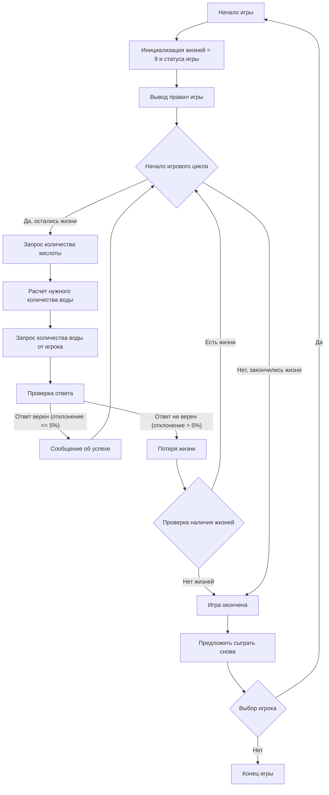

## <алгоритм>

1.  **Начало игры:**
    *   Программа выводит приветственное сообщение и объясняет правила игры, акцентируя внимание на соотношении воды к кислоте (7:3).
    *   Пример: "Добро пожаловать в игру CHEMST! Необходимо соблюдать соотношение 7 частей воды на 3 части кислоты."
2.  **Инициализация переменных:**
    *   Устанавливается начальное количество жизней игрока (9).
    *   Инициализируется переменная для отслеживания статуса игры (продолжается/завершена).
3.  **Основной игровой цикл (while):**
    *   **Ввод данных от игрока:**
        *   Запрос на ввод количества кислоты в литрах.
        *   Пример: "Введите количество кислоты, которое вы хотите развести (в литрах):"
    *   **Расчет правильного количества воды:**
        *   Вычисление необходимого количества воды по формуле: `количество кислоты * 7 / 3`.
        *   Пример: Если введено 30 литров кислоты, то необходимое количество воды будет `30 * 7 / 3 = 70` литров.
    *   **Запрос на ввод ответа от игрока:**
        *   Запрос на ввод количества воды, которое, по мнению игрока, необходимо добавить.
        *   Пример: "Сколько воды нужно добавить для разведения 30 литров кислоты? (7:3) > "
    *   **Проверка ответа:**
        *   Вычисление разницы между введенным ответом и правильным ответом.
        *   Вычисление отклонения в процентах от правильного ответа: `abs(введенное значение - правильное значение) / правильное значение * 100`
        *   Если отклонение больше 5%, игрок теряет жизнь.
            *   Если жизни игрока закончились, игра заканчивается.
            *   Пример: "Неправильный ответ! Вы потеряли жизнь. Осталось жизней: 8"
        *   Если отклонение не больше 5%, программа сообщает об успехе.
            *   Пример: "Правильный ответ! Вы успешно развели кислоту."
    *   **Повтор цикла:**
        *   Цикл повторяется до тех пор, пока у игрока есть жизни.
4.  **Завершение игры:**
    *   Если у игрока закончились жизни, выводится сообщение о проигрыше.
    *   Игроку предлагается сыграть снова (да/нет).
    *   Пример: "Хотите сыграть снова? (да/нет)"
    *   Если игрок хочет сыграть снова, игра перезапускается.
    *   Если нет - выводится сообщение о завершении игры.
        *   Пример: "Спасибо за игру!"

## <mermaid>

**Объяснение `mermaid`:**

*   **`Start`**: Начало блок-схемы, представляющее старт игры.
*   **`Initialize`**: Блок, представляющий инициализацию переменных, таких как количество жизней игрока (9) и статус игры.
*   **`DisplayRules`**: Блок, отображающий правила игры.
*   **`GameLoopStart`**: Начало игрового цикла. Условный блок, проверяющий, остались ли у игрока жизни.
*   **`InputAcid`**: Блок, где у игрока запрашивается количество кислоты для разведения.
*   **`CalculateWater`**: Блок, где происходит расчет необходимого количества воды на основе введенного количества кислоты.
*   **`InputWater`**: Блок, где у игрока запрашивается ввод его расчета необходимого количества воды.
*   **`CheckAnswer`**: Блок, в котором происходит проверка правильности ответа игрока.
*   **`CorrectAnswer`**: Блок, сообщающий об успешном разведении кислоты.
*   **`LoseLife`**: Блок, означающий потерю жизни из-за неправильного ответа.
*   **`CheckLives`**: Блок, проверяющий, остались ли у игрока еще жизни.
*   **`GameOver`**: Блок, означающий конец игры.
*    **`PlayAgain`**: Блок, предлагающий игроку сыграть снова.
*   **`PlayAgainChoice`**: Блок, представляющий выбор игрока о том, хочет ли он играть снова.
*   **`End`**: Конец блок-схемы, представляющий завершение игры.

## <объяснение>

**Импорты:**

В предоставленном коде импорты отсутствуют, так как игра реализуется с использованием базовых операций. Это означает, что для функционирования кода не требуются никакие внешние библиотеки или модули. Это может быть как преимуществом, так и ограничением, так как отсутствие импортов делает код более простым, но и менее гибким для расширения функциональности в будущем.

**Классы:**

В данном коде не используются классы. Вся логика игры построена на основе функций и переменных, что делает код более простым, но менее структурированным. В более сложных играх использование классов могло бы помочь в управлении игровыми объектами и их состояниями.

**Функции:**

В предоставленном описании кода конкретные функции не указаны, так как дано пошаговое описание самой игры, а не её реализации. Однако, опираясь на логику игры, можно выделить следующие потенциальные функции:

*   `start_game()`: Инициализирует игру, отображает правила и запускает основной игровой цикл.
*   `get_acid_amount()`: Запрашивает у игрока количество кислоты для разведения.
*   `calculate_water(acid_amount)`: Рассчитывает необходимое количество воды на основе введенного количества кислоты.
*   `get_player_water_amount()`: Запрашивает ввод количества воды от игрока.
*   `check_answer(player_water_amount, correct_water_amount)`: Проверяет ответ игрока и возвращает результат (правильно/неправильно).
*   `lose_life()`: Уменьшает количество жизней игрока на 1.
*   `game_over()`: Завершает игру и предлагает игроку начать заново.
*   `play_again()`: Запускает игру заново.

**Переменные:**

*   `lives`: целое число, представляющее количество жизней игрока. Инициализируется 9. Уменьшается при неправильном ответе.
*   `game_status`: строка, указывающая на текущий статус игры ("running", "finished").
*   `acid_amount`: число с плавающей точкой или целое число, представляющее количество кислоты, введенное игроком.
*   `correct_water_amount`: число с плавающей точкой или целое число, представляющее правильное количество воды для разведения кислоты.
*   `player_water_amount`: число с плавающей точкой или целое число, представляющее количество воды, введенное игроком.
*   `deviation`: число с плавающей точкой,  представляющее отклонение от правильного ответа в процентах.
*   `play_again_choice`: строка, представляющая выбор игрока (да/нет), желает ли он начать игру заново.

**Потенциальные ошибки и области для улучшения:**

*   **Обработка ввода:** Ввод данных от игрока не валидируется. Игрок может ввести не числовое значение, что приведет к ошибке. Необходимо предусмотреть обработку исключений.
*   **Сложность вычислений:** Присутствуют только базовые арифметические операции.  Может потребоваться добавление более сложных расчетов, например, с учётом химических свойств и т.д.
*   **Структура кода:** Код может стать более сложным для понимания и поддержки, если вся логика игры будет реализована в одном блоке. Применение функций сделает код более модульным.
*   **Отсутствие классов:** Использование классов поможет структурировать код и отделить логику представления от игровой логики.
*   **Отсутствие сохранения прогресса:** Нет возможности сохранять прогресс игры.

**Взаимосвязь с другими частями проекта:**

Так как это описание базовой игры, то взаимосвязи с другими частями проекта отсутствуют. Если бы этот код был частью более крупного проекта, то он, скорее всего, взаимодействовал бы с модулями для ввода/вывода, управления состоянием игры и, возможно, с графическим интерфейсом.