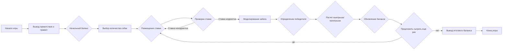
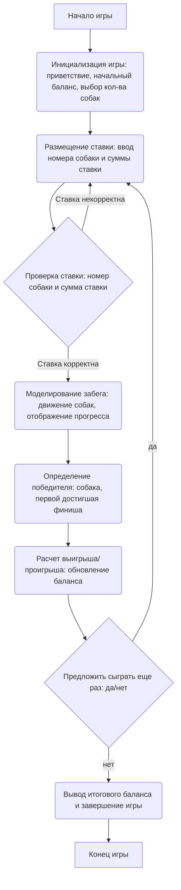

## ИНСТРУКЦИЯ:

Анализируй предоставленный код подробно и объясни его функциональность. Ответ должен включать три раздела:  

1. **<алгоритм>**: Опиши рабочий процесс в виде пошаговой блок-схемы, включая примеры для каждого логического блока, и проиллюстрируй поток данных между функциями, классами или методами.  
2. **<mermaid>**: Напиши код для диаграммы в формате `mermaid`, проанализируй и объясни все зависимости, 
    которые импортируются при создании диаграммы. 
    **ВАЖНО!** Убедитесь, что все имена переменных, используемые в диаграмме `mermaid`, 
    имеют осмысленные и описательные имена. Имена переменных вроде `A`, `B`, `C`, и т.д., не допускаются!  
    
    **Дополнительно**: Если в коде есть импорт `import header`, добавьте блок `mermaid` flowchart, объясняющий `header.py`:\
    ```mermaid
    flowchart TD
        Start --> Header[<code>header.py</code><br> Determine Project Root]
    
        Header --> import[Import Global Settings: <br><code>from src import gs</code>] 
    ```

3. **<объяснение>**: Предоставьте подробные объяснения:  
   - **Импорты**: Их назначение и взаимосвязь с другими пакетами `src.`.  
   - **Классы**: Их роль, атрибуты, методы и взаимодействие с другими компонентами проекта.  
   - **Функции**: Их аргументы, возвращаемые значения, назначение и примеры.  
   - **Переменные**: Их типы и использование.  
   - Выделите потенциальные ошибки или области для улучшения.  

Дополнительно, постройте цепочку взаимосвязей с другими частями проекта (если применимо).  

Это обеспечивает всесторонний и структурированный анализ кода.
## Формат ответа: `.md` (markdown)
**КОНЕЦ ИНСТРУКЦИИ**

## Алгоритм

### Пошаговое описание игры "Собачьи бега" (DOGS)

1.  **Начало игры:**
    *   Программа выводит приветственное сообщение и правила игры.
    *   Игроку предоставляется начальный баланс (например, $100).
    *   Игрок выбирает количество участвующих собак (от 3 до 6).
    *   *Пример:* Игрок вводит `4` (4 собаки).

2.  **Размещение ставок:**
    *   Игрок выбирает номер собаки, на которую хочет сделать ставку.
        *   *Пример:* Игрок вводит `2`.
    *   Игрок вводит сумму ставки.
        *   *Пример:* Игрок вводит `20`.
    *   Проверка корректности ввода:
        *   Если номер собаки некорректный или ставка превышает баланс, выводится сообщение об ошибке и запрос повторяется.

3.  **Моделирование забега:**
    *   Для каждой собаки инициализируется начальная позиция на треке (например, 0).
    *   Забег продолжается до тех пор, пока одна из собак не достигнет финиша (например, позиция 50).
    *   На каждом шаге моделирования:
        *   Для каждой собаки генерируется случайное число от 1 до 6 (шаг движения).
        *   Позиция каждой собаки обновляется.
        *   На экране отображается текущее положение всех собак в виде текста.
        *   *Пример:*
            ```
            Собака 1: =>
            Собака 2: ==>
            Собака 3: =>
            Собака 4: =>

            Собака 1: ====>
            Собака 2: =====>
            Собака 3: ===>
            Собака 4: =====>
            ```
    *   Определяется победитель (собака, которая первой достигла финиша).

4.  **Результаты:**
    *   Объявляется номер победившей собаки.
        *   *Пример:* Выводится "Победила собака 2!".
    *   Проверка ставки:
        *   Если игрок поставил на победившую собаку, баланс увеличивается на сумму выигрыша (ставка × коэффициент).
        *   Если игрок не угадал победителя, ставка вычитается из баланса.
        *   *Пример:* Игрок поставил на собаку 2, она выиграла. Баланс увеличивается на `20 * 2 = 40`. Новый баланс: `100 - 20 + 40 = 120`.

5.  **Продолжение игры:**
    *   Игроку предлагается сыграть еще раз (ввести "да" или "нет").
    *   Если игрок вводит "да", игра начинается сначала (переход к пункту 2).
    *   Если игрок вводит "нет", программа завершается, выводя итоговый баланс.
    *   *Пример:* Игрок вводит "нет".

### Блок-схема



## Mermaid



**Объяснение диаграммы:**

1.  **Start** - Начало процесса игры.
2.  **InitializeGame** - Инициализация игры: программа выводит приветствие, правила, устанавливает начальный баланс игрока и запрашивает у пользователя количество собак для участия в забеге.
3.  **PlaceBet** - Пользователь делает ставку: ввод номера собаки и суммы ставки.
4.  **ValidateBet** - Проверка корректности ставки: номер собаки должен быть в допустимом диапазоне, а сумма ставки не должна превышать текущий баланс игрока.
5.  **SimulateRace** - Моделирование забега: программа эмулирует движение собак по треку до тех пор, пока одна из них не достигнет финиша, обновляя и выводя на экран текущее положение каждой из собак.
6.  **DetermineWinner** - Определение победителя: программа определяет собаку, первой достигшую финишной линии.
7.  **CalculateResult** - Расчет выигрыша или проигрыша на основе ставки игрока и результата забега, обновление баланса игрока.
8.  **PlayAgain** - Предложение сыграть еще раз: программа спрашивает игрока, хочет ли он продолжить игру.
9.  **EndGame** - Завершение игры: программа выводит итоговый баланс игрока и завершает свою работу.
10. **End** - Конец процесса игры.

## Объяснение

### Общее описание

Представленный документ описывает концепцию и пошаговую реализацию игры "Собачьи бега" (DOGS). Игра представляет собой симулятор собачьих бегов, где игрок делает ставки на одну из нескольких собак, которые соревнуются на треке. Программа моделирует забег, отображая движение каждой собаки, и объявляет результаты.

### Основные компоненты и их взаимодействие

1.  **Инициализация игры:**
    *   Программа приветствует пользователя и выводит правила.
    *   Устанавливается начальный баланс игрока (например, $100).
    *   Игрок выбирает количество участвующих собак (от 3 до 6).
    *   **Пример:**
        *   Сообщение "Добро пожаловать в игру DOGS!".
        *   Начальный баланс: $100.
        *   Ввод количества собак: `4`.
2.  **Размещение ставок:**
    *   Игрок вводит номер собаки, на которую хочет поставить.
        *   **Пример:** `2`.
    *   Игрок вводит сумму ставки.
        *   **Пример:** `20`.
    *   Проверка корректности ввода:
        *   Если номер собаки вне диапазона или ставка превышает баланс, программа выводит сообщение об ошибке и повторяет запрос.
        *   **Пример:**
            *   Ошибка: "Некорректный номер собаки."
            *   Ошибка: "Ставка превышает баланс."
3.  **Моделирование забега:**
    *   Программа моделирует движение каждой собаки, случайно добавляя к ее текущей позиции значение от 1 до 6.
    *   На экране отображается текущее положение всех собак.
    *   Забег продолжается до тех пор, пока одна из собак не достигнет финишной черты.
    *   **Пример:**
        ```
        Собака 1: =>
        Собака 2: ==>
        Собака 3: =>
        Собака 4: =>

        Собака 1: ====>
        Собака 2: =====>
        Собака 3: ===>
        Собака 4: =====>
        ```
4.  **Результаты:**
    *   Объявляется победитель (номер собаки).
        *   **Пример:** "Победила собака 2!".
    *   Если игрок поставил на победившую собаку, его баланс увеличивается на сумму выигрыша (ставка × коэффициент).
        *   **Пример:** Коэффициент 2:1, ставка $20, выигрыш: $40.
    *   Если игрок проиграл, его ставка вычитается из баланса.
5.  **Продолжение игры:**
    *   Игроку предлагается сыграть еще раз (да/нет).
    *   Если игрок выбирает "да", игра начинается заново.
    *   Если игрок выбирает "нет", программа завершает работу, выводя итоговый баланс.
    *   **Пример:**
        *   Ввод: "да" - начало новой игры.
        *   Ввод: "нет" - вывод итогового баланса и завершение.

### Возможная реализация на Python

-   **Импорт `random`**: Используется для генерации случайных значений для движения собак.
-   **Циклы и условия**: Используются для управления ходом игры, обработки пользовательского ввода и проверки условий.
-   **Анимация**: Отображение процесса бега с помощью текстового вывода.

### Переменные

*   **`balance`**: Целочисленная переменная для хранения текущего баланса игрока.
*   **`num_dogs`**: Целочисленная переменная для хранения количества участвующих собак.
*   **`bet_dog`**: Целочисленная переменная для хранения номера собаки, на которую сделал ставку игрок.
*   **`bet_amount`**: Целочисленная переменная для хранения суммы ставки игрока.
*   **`dog_positions`**: Список (или словарь) для хранения текущей позиции каждой собаки на треке.
*   **`winner_dog`**: Целочисленная переменная для хранения номера победившей собаки.
*   **`play_again`**: Строковая переменная для хранения ответа игрока (да/нет).
### Потенциальные ошибки и улучшения

1.  **Обработка ошибок ввода:**
    *   Реализовать более надежную проверку пользовательского ввода (например, обработку нечисловых значений).
2.  **Коэффициенты ставок:**
    *   Ввести коэффициенты для ставок, зависящие от количества участников.
    *   *Пример:*
        *   2:1 для 3 собак.
        *   5:1 для 6 собак.
3.  **Увеличение начального баланса:**
    *   Добавить возможность увеличения начального баланса через дополнительный ввод.
4.  **Более детальная анимация:**
    *   Использовать графический интерфейс для более наглядного отображения забега.
5.  **Проверка на банкротство**:
    *   Добавить проверку, что игра заканчивается, если у игрока заканчиваются деньги (баланс <= 0).
6.  **Модульная структура:**
    *   Разделить код на отдельные функции для лучшей организации и читаемости.

### Цепочка взаимосвязей

Данная игра в рамках большого проекта является автономной, однако ее можно интегрировать с другими частями проекта, например:
1.  **Управление пользователями:** Интеграция с системой управления пользователями для сохранения прогресса и балансов игроков.
2.  **Интерфейс:** Возможность использовать общий графический интерфейс для всего проекта, а не только для текстового вывода.
3.  **Аналитика:** Сбор данных об игре (например, ставки, результаты) для последующего анализа и улучшения.

Таким образом, игра DOGS может быть реализована в виде отдельного модуля, взаимодействующего с другими частями проекта через API (Application Programming Interface).