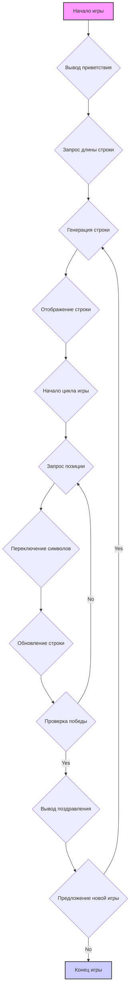

## Анализ кода игры FIPFOP (Переключение X и O)

### 1. <алгоритм>

**Блок-схема процесса игры FIPFOP:**

```mermaid
graph TD
    A[Начало игры] --> B{Вывод приветствия и правил игры};
    B --> C{Запрос длины строки (5-10)};
    C --> D{Генерация случайной строки из 'X' и 'O'};
    D --> E{Отображение текущей строки};
    E --> F{Начало цикла игры};
    F --> G{Запрос позиции для переключения (1 - длина строки)};
    G --> H{Переключение символа на выбранной позиции и соседних};
    H --> I{Обновление и отображение строки};
    I --> J{Проверка условия победы (все 'O')};
    J -- Да --> K{Вывод поздравления и количества ходов};
    K --> L{Предложение сыграть ещё раз? (да/нет)};
    L -- да --> D;
    L -- нет --> M[Конец игры];
    J -- Нет --> G;
```
**Примеры для каждого логического блока:**

*   **A [Начало игры]**
    *   Программа инициализируется, готовясь к запуску игры.
*   **B {Вывод приветствия и правил игры}**
    *   На экран выводится: "Добро пожаловать в игру FIPFOP!" и описание правил.
*   **C {Запрос длины строки (5-10)}**
    *   Пользователю предлагается ввести длину строки, например: "Введите длину строки (от 5 до 10):".
    *   Пользователь вводит "6".
*   **D {Генерация случайной строки из 'X' и 'O'}**
    *   На основе ввода пользователя (6), генерируется строка, например: "XOXOXO".
*   **E {Отображение текущей строки}**
    *   На экран выводится текущая строка: "Текущая строка: XOXOXO".
*   **F {Начало цикла игры}**
    *   Игровой цикл начинается для обработки ходов игрока.
*   **G {Запрос позиции для переключения (1 - длина строки)}**
    *   Пользователю предлагается ввести позицию: "Выберите позицию для переключения (1-6):".
    *   Пользователь вводит "3".
*   **H {Переключение символа на выбранной позиции и соседних}**
    *   Символы в строке "XOXOXO" изменяются по правилу переключения для позиции 3 и её соседей: "XOXXOX".
*   **I {Обновление и отображение строки}**
    *   На экран выводится обновленная строка: "Новая строка: XOXXOX".
*   **J {Проверка условия победы (все 'O')}**
    *   Проверяется, состоит ли строка "XOXXOX" только из "O". Результат: Нет.
*   **K {Вывод поздравления и количества ходов}**
    *   Выводится: "Поздравляем! Вы решили задачу за N ходов!", где N - количество ходов.
*  **L {Предложение сыграть ещё раз? (да/нет)}**
    * Выводится: "Хотите сыграть ещё раз? (да/нет):"
    * Пользователь вводит "да" или "нет".
*   **M [Конец игры]**
    *   Игра завершается, если пользователь выбрал "нет".

**Поток данных:**

*   Игровой цикл начинается с запроса длины строки у пользователя и генерации случайной строки.
*   Каждый ход пользователя включает запрос позиции, переключение символов и обновление строки.
*   Проверка условия победы определяет конец игры.
*   При завершении игры пользователю предлагается сыграть еще раз или закончить игру.

### 2. <mermaid>


**Объяснение диаграммы `mermaid`:**

*   `A[Начало игры]`: Начало программы.
*   `B{Вывод приветствия}`: Вывод приветственного сообщения и правил игры.
*   `C{Запрос длины строки}`: Запрос у пользователя длины строки (от 5 до 10).
*   `D{Генерация строки}`: Генерация случайной строки из символов `X` и `O` заданной длины.
*   `E{Отображение строки}`: Отображение текущей строки на экране.
*   `F{Начало цикла игры}`: Начало основного игрового цикла.
*   `G{Запрос позиции}`: Запрос у пользователя позиции для переключения.
*   `H{Переключение символов}`: Переключение символов на указанной позиции и соседних.
*   `I{Обновление строки}`: Обновление текущей строки после переключения.
*   `J{Проверка победы}`: Проверка условия победы (вся строка состоит только из `O`).
*   `K{Вывод поздравления}`: Вывод сообщения о победе и количества ходов.
*   `L{Предложение новой игры}`: Предложение начать новую игру.
*   `M[Конец игры]`: Конец программы.
    
**Зависимости:**

*   Данная диаграмма показывает поток управления внутри игры `FIPFOP`. Никаких внешних библиотек или модулей, кроме встроенных в Python (например, `random`) на диаграмме не представлено. 

### 3. <объяснение>

**Импорты:**

*   В предоставленном описании кода упоминается модуль `random`, который используется для генерации случайной строки из символов 'X' и 'O'. Это стандартный модуль Python и не входит в `src` или какие-либо другие пользовательские модули.

**Классы:**

*   В данном описании классов нет.

**Функции:**

*   В описании нет конкретных функций, но можно выделить следующие концептуальные блоки как функции:
    1.  **`initialize_game()`**: Приветствует пользователя, запрашивает длину строки, генерирует начальную строку.
    2.  **`display_string(current_string)`**: Отображает текущую строку.
    3.  **`get_player_move(string_length)`**: Запрашивает у игрока позицию для переключения.
    4.  **`switch_characters(string, position)`**: Переключает символы на указанной позиции и соседних.
    5.  **`check_win(string)`**: Проверяет, выиграл ли игрок (вся строка состоит из 'O').
    6.  **`play_again()`**: Предлагает пользователю сыграть еще раз.

**Переменные:**

*   `string_length` (int): Длина строки, которую задаёт пользователь (в пределах от 5 до 10).
*   `current_string` (str): Строка, состоящая из символов `X` и `O`, меняющаяся в процессе игры.
*   `position` (int): Позиция, которую выбрал игрок для переключения.
*   `moves_count` (int): Счётчик количества ходов (рекомендуется добавить).
*   `play_again_answer` (str): Ответ пользователя о желании сыграть снова ("да" или "нет").

**Потенциальные ошибки и области для улучшения:**

1.  **Отсутствие проверки ввода:**
    *   Необходимо проверять, что пользователь ввёл число при запросе длины строки и позиции, а также, что длина строки в диапазоне от 5 до 10.

2.  **Отсутствие подсчета ходов:**
    *   Необходимо добавить счётчик ходов, чтобы игрок видел, сколько раз он менял символы.
    
3.  **Отсутствие визуализации:**
    *   Добавить визуализацию (например, использовать `print` в консоли) для отображения строки в процессе игры, что улучшит восприятие игроком.
    
4.  **Отсутствие обработки неправильного ввода:**
     *  Добавить обработку исключений на неправильный ввод позиции.
    
5.  **Нет кода:**
    *   Предоставлен только текст с описанием игры, а не код. Необходимо реализовать программный код, который бы выполнял все описанные действия.

**Взаимосвязи с другими частями проекта:**

*   Поскольку в описании отсутствует конкретный код, нет явных взаимосвязей с другими частями проекта. Однако, если бы был код, то можно было бы использовать `src.gs`, например, для общих настроек (например, длины минимальной и максимальной длины строки) или вывода сообщений.