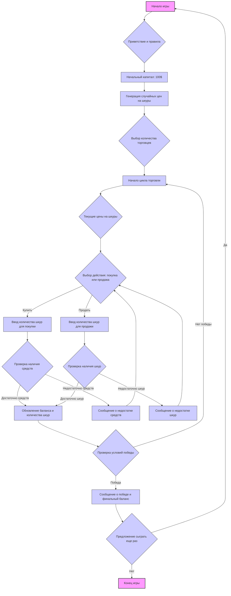
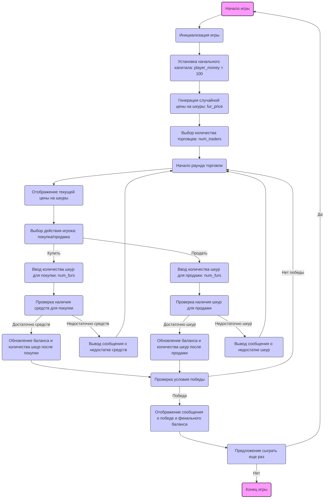

## ИНСТРУКЦИЯ:

Анализируй предоставленный код подробно и объясни его функциональность. Ответ должен включать три раздела:  

1. **<алгоритм>**: Опиши рабочий процесс в виде пошаговой блок-схемы, включая примеры для каждого логического блока, и проиллюстрируй поток данных между функциями, классами или методами.  
2. **<mermaid>**: Напиши код для диаграммы в формате `mermaid`, проанализируй и объясни все зависимости, 
    которые импортируются при создании диаграммы. 
    **ВАЖНО!** Убедитесь, что все имена переменных, используемые в диаграмме `mermaid`, 
    имеют осмысленные и описательные имена. Имена переменных вроде `A`, `B`, `C`, и т.д., не допускаются!  
    
    **Дополнительно**: Если в коде есть импорт `import header`, добавьте блок `mermaid` flowchart, объясняющий `header.py`:\
    ```mermaid
    flowchart TD
        Start --> Header[<code>header.py</code><br> Determine Project Root]
    
        Header --> import[Import Global Settings: <br><code>from src import gs</code>] 
    ```

3. **<объяснение>**: Предоставьте подробные объяснения:  
   - **Импорты**: Их назначение и взаимосвязь с другими пакетами `src.`.  
   - **Классы**: Их роль, атрибуты, методы и взаимодействие с другими компонентами проекта.  
   - **Функции**: Их аргументы, возвращаемые значения, назначение и примеры.  
   - **Переменные**: Их типы и использование.  
   - Выделите потенциальные ошибки или области для улучшения.  

Дополнительно, постройте цепочку взаимосвязей с другими частями проекта (если применимо).  

Это обеспечивает всесторонний и структурированный анализ кода.
## Формат ответа: `.md` (markdown)
**КОНЕЦ ИНСТРУКЦИИ**

## <алгоритм>



**Примеры для блоков:**

*   **Начало игры**: Игрок запускает программу.
*   **Приветствие и правила**: На экран выводится текст: "Добро пожаловать в FURS! Торгуйте шкурами, чтобы заработать деньги."
*   **Начальный капитал**: Игроку присваивается переменная `player_money = 100`.
*   **Генерация случайных цен на шкуры**:  Цена шкуры: `fur_price = random.randint(10, 30)`.
*   **Выбор количества торговцев**:  Игрок вводит число, например, `num_traders = 3`.
*   **Текущие цены на шкуры**:  Цена выводится на экран, например: "Цена за шкуру: $20".
*   **Выбор действия**: Игрок вводит "купить" или "продать".
*   **Ввод количества шкур для покупки/продажи**: Игрок вводит число, например, `num_furs = 3`.
*   **Проверка наличия средств**:  Если игрок хочет купить 3 шкуры по 20$, и у него 100$, то условие `player_money >= fur_price * num_furs` (100 >= 20*3) выполняется.
*	**Проверка наличия шкур**: Если игрок хочет продать 2 шкуры, а у него 5, то условие `player_furs >= num_furs` (5 >= 2) выполняется.
*   **Обновление баланса и количества шкур**: Если игрок купил 3 шкуры по 20$: `player_money = 100 - 3 * 20 = 40`, `player_furs = 0 + 3 = 3`.
*   **Сообщение о недостатке средств/шкур**: Если игрок пытается купить 10 шкур по 20$, имея только 40$, выводится: "Недостаточно средств!"
*   **Проверка условий победы**: Если `player_money > 500` или `player_furs > 20`, то игрок победил.
*   **Сообщение о победе**:  Выводится: "Поздравляем! Вы накопили $600."
*   **Предложение сыграть еще раз**: Игроку предлагается ввести "да" или "нет".
*   **Конец игры**: Программа завершает работу.

## <mermaid>



**Объяснение зависимостей:**

*   **`Start`**: Начало игры. Не зависит от других компонентов, это точка входа.
*   **`InitializeGame`**: Инициализация игры, в свою очередь, активирует другие блоки для установки начальных параметров игры.
*   **`SetInitialCapital`**: Устанавливает начальный капитал игрока. Использует переменную `player_money`.
*  **`GenerateRandomFurPrice`**: Генерирует случайную цену на шкуры, используя переменную `fur_price`.
*  **`ChooseNumberOfTraders`**: Позволяет игроку выбрать количество торговцев. Сохраняет выбор в переменной `num_traders`.
*   **`StartTradingRound`**: Начинает раунд торговли, управляет переходом между действиями игрока.
*   **`DisplayCurrentFurPrice`**: Отображает текущую цену на шкуры, используя переменную `fur_price`.
*   **`PlayerActionChoice`**: Позволяет игроку выбрать действие (купить или продать).
*  **`InputFursToBuy`**: Принимает количество шкур, которые игрок хочет купить, сохраняя значение в переменной `num_furs`.
*  **`InputFursToSell`**: Принимает количество шкур, которые игрок хочет продать, сохраняя значение в переменной `num_furs`.
*   **`CheckSufficientFunds`**: Проверяет, достаточно ли у игрока средств для покупки. Использует `player_money` и `fur_price` и `num_furs`.
*   **`CheckSufficientFurs`**: Проверяет, достаточно ли у игрока шкур для продажи. Использует `player_furs` и `num_furs`.
*  **`UpdateBalanceAndFursBuy`**: Обновляет количество шкур у игрока и его денежный баланс после покупки, изменяет переменные `player_money` и `player_furs`.
*  **`UpdateBalanceAndFursSell`**: Обновляет количество шкур у игрока и его денежный баланс после продажи, изменяет переменные `player_money` и `player_furs`.
*   **`DisplayInsufficientFundsMessage`**: Выводит сообщение о недостатке средств при попытке покупки, если `CheckSufficientFunds` возвращает отрицательный результат.
*	**`DisplayInsufficientFursMessage`**: Выводит сообщение о недостатке шкур при попытке продажи, если `CheckSufficientFurs` возвращает отрицательный результат.
*   **`CheckWinCondition`**: Проверяет, выполнил ли игрок условия победы (например, достиг определенного количества денег или шкур). Использует `player_money` и `player_furs`.
*   **`DisplayWinMessage`**: Выводит сообщение о победе и финальный баланс игрока.
*   **`PlayAgainChoice`**: Предлагает игроку сыграть снова.
*   **`End`**: Завершает игру.

## <объяснение>

**Общее описание:**

Представленный текст описывает концепцию и правила экономической игры "FURS", в которой игрок торгует шкурами с индейцами с целью заработать как можно больше денег.  Игра включает в себя начальную инициализацию, процесс торговли, условия победы и возможность повторной игры.

**1. Инициализация игры:**

*   **Начальный капитал**: Игрок начинает со 100 долларов. Это значение будет храниться в переменной `player_money`.
*   **Случайные цены на шкуры**:  Цена шкур генерируется случайным образом с использованием модуля `random`.  Эта цена будет храниться в переменной `fur_price`.
*   **Количество торговцев**: Игрок может выбрать количество торговцев, с которыми он будет работать. Это значение будет хранится в переменной `num_traders`.

**2. Основной процесс игры:**

*   **Торговля:**
    *   Игрок выбирает, покупать или продавать шкуры.
    *   Цена шкуры устанавливается случайным образом в начале каждого раунда торговли и влияет на возможную прибыль.
    *  Количество шкур для покупки или продажи вводится пользователем и хранится в переменной `num_furs`.
*   **Действия игрока:**
    *   Игрок выбирает действие и указывает количество шкур.
    *   Баланс денег и количество шкур игрока обновляется в соответствии с выбранным действием. Переменная `player_furs` для хранения количества шкур.

**3. Условия победы:**

*   Игра заканчивается, когда игрок достигает заранее установленного количества шкур или капитала.
*   Условия победы используют переменные `player_money` и `player_furs`.

**4. Продолжение игры:**

*   После окончания игры игроку предлагается сыграть снова.
*   Если игрок выбирает "да", игра начинается заново с новым капиталом и случайными ценами на шкуры.

**Реализация (основана на тексте):**

*   **Модуль `random`**: Используется для генерации случайных цен на шкуру.
*   **Циклы и условия**: Используются для обработки ввода игрока и обновления состояния игры.
*   **Структуры данных**:
    *   `player_money`: Целочисленная переменная для отслеживания капитала игрока.
    *   `player_furs`: Целочисленная переменная для отслеживания количества шкур у игрока.
    *  `fur_price`: Целочисленная переменная для хранения текущей цены на шкуры.
    * `num_traders`: Целочисленная переменная для хранения количества торговцев, выбранных игроком.
* **Функции (основываясь на алгоритме):**
    *   `initialize_game()`: устанавливает начальный капитал и генерирует первую цену на шкуру, возвращает начальное состояние игры.
    *   `display_current_price()`: отображает текущую цену на шкуры.
    *   `get_player_action()`: получает выбор действия от игрока.
    *   `buy_furs()`: обрабатывает покупку шкур, изменяет `player_money` и `player_furs`, возвращает обновленное состояние игры.
	*	`sell_furs()`: обрабатывает продажу шкур, изменяет `player_money` и `player_furs`, возвращает обновленное состояние игры.
    *   `check_win_condition()`: проверяет условия победы, возвращает `True` или `False`
    *   `play_again()`: спрашивает игрока, хочет ли он сыграть снова, возвращает `True` или `False`
    
**Взаимосвязь с другими частями проекта:**

Исходя из предоставленного описания, данная игра является самостоятельным модулем. Однако, в более сложном проекте можно было бы интегрировать следующие аспекты:

*   **Система уровней сложности**: Параметры сложности можно было бы хранить в конфигурационном файле, который был бы доступен через `gs` (global settings).
*  **Событийная система**: В более сложной реализации можно было бы использовать события для изменения цен на рынке (например, внезапные изменения цен)
*   **Логирование**: Можно было бы добавить логирование действий игрока и состояний игры для анализа.

**Потенциальные ошибки и области для улучшения:**

*   **Отсутствие валидации ввода**: Необходимо добавить проверки на корректность ввода пользователя (например, ввод чисел вместо текста).
*   **Ограниченная реализация**: Игра представляет собой базовую реализацию, можно добавить больше механик и возможностей для увеличения её сложности и интересности.
*   **Отсутствие обработки ошибок**:  Нужно добавить обработку ошибок, например, если игрок введет некорректное действие или количество шкур.
*   **Нет явной структуры кода**: Необходимо спроектировать классы и функции, которые бы отражали структуру игры и делали код более модульным и поддерживаемым.
*   **Отсутствие пользовательского интерфейса**: В текущем описании нет UI, но в реальной реализации можно было бы использовать curses или другие библиотеки для создания более удобного интерфейса.
*  **Нет сохранения игры**: Отсутствует механизм сохранения и загрузки игры.