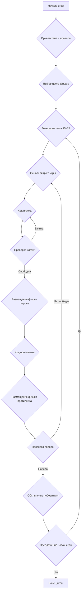

## ИНСТРУКЦИЯ:

Анализируй предоставленный код подробно и объясни его функциональность. Ответ должен включать три раздела:

1.  **<алгоритм>**: Опиши рабочий процесс в виде пошаговой блок-схемы, включая примеры для каждого логического блока, и проиллюстрируй поток данных между функциями, классами или методами.
2.  **<mermaid>**: Напиши код для диаграммы в формате `mermaid`, проанализируй и объясни все зависимости,
    которые импортируются при создании диаграммы.
    **ВАЖНО!** Убедитесь, что все имена переменных, используемые в диаграмме `mermaid`,
    имеют осмысленные и описательные имена. Имена переменных вроде `A`, `B`, `C`, и т.д., не допускаются!

    **Дополнительно**: Если в коде есть импорт `import header`, добавьте блок `mermaid` flowchart, объясняющий `header.py`:
    ```mermaid
    flowchart TD
        Start --> Header[<code>header.py</code><br> Determine Project Root]

        Header --> import[Import Global Settings: <br><code>from src import gs</code>]
    ```

3.  **<объяснение>**: Предоставьте подробные объяснения:
    *   **Импорты**: Их назначение и взаимосвязь с другими пакетами `src.`.
    *   **Классы**: Их роль, атрибуты, методы и взаимодействие с другими компонентами проекта.
    *   **Функции**: Их аргументы, возвращаемые значения, назначение и примеры.
    *   **Переменные**: Их типы и использование.
    *   Выделите потенциальные ошибки или области для улучшения.

Дополнительно, постройте цепочку взаимосвязей с другими частями проекта (если применимо).

Это обеспечивает всесторонний и структурированный анализ кода.
## Формат ответа: `.md` (markdown)
**КОНЕЦ ИНСТРУКЦИИ**

## <алгоритм>

### Инициализация игры
1.  **Приветствие и объяснение правил:**
    - Программа выводит приветствие и краткое описание правил игры Гомоку.
    - *Пример:* "Добро пожаловать в игру GOMOKO! Цель игры - собрать 5 фишек в ряд."
2.  **Выбор цвета фишек:**
    - Игрок выбирает цвет своих фишек (черные или белые).
    - *Пример:*  "Выберите цвет фишек: (черные/белые):"
    - В зависимости от выбора игрока, программа определяет, кто будет ходить первым и каким цветом будет играть противник.
3.  **Генерация игрового поля:**
    - Создается игровое поле размером 15x15, представляющее собой двумерный массив, изначально заполненный пустыми клетками.
    - *Пример:* Игровое поле представляется в виде массива, где каждая ячейка либо пуста ("."), либо содержит фишку игрока ("X" или "O").

### Основной процесс игры
1.  **Ход игрока:**
    - Программа запрашивает у игрока координаты клетки, куда он хочет поставить свою фишку.
    - *Пример:* "Ваш ход. Выберите позицию (например, D4):"
    - Программа проверяет, свободна ли выбранная ячейка. Если занята, то запрашивается ввод новой позиции.
    - Если ячейка свободна, в нее ставится фишка игрока.
2.  **Ход противника:**
    - Противник (компьютер или второй игрок) делает свой ход на свободную клетку.
    - *Пример:* Противник делает ход в "F5".
    - Программа обновляет поле, добавляя фишку противника.
3.  **Проверка победы:**
    - После каждого хода программа проверяет, есть ли на поле линия из 5 фишек подряд по вертикали, горизонтали или диагонали.
    - Если победа есть, то игра завершается.
    - Если победитель не выявлен, то игра продолжается.

### Завершение игры
1.  **Объявление победителя:**
    - Если один из игроков собрал линию из 5 фишек, программа объявляет его победителем.
    - *Пример:* "Вы выиграли! Поздравляем!"
2.  **Предложение начать новую игру:**
    - Программа предлагает игроку начать новую игру.
    - *Пример:* "Хотите сыграть снова? (да/нет):"
3.  **Обработка ответа:**
    - Если игрок выбирает "да", игра начинается с нового пустого поля.
    - Если игрок выбирает "нет", программа завершается.
    - *Пример:* "Спасибо за игру!"

### Блок-схема


## <mermaid>



```mermaid
flowchart TD
    subgraph Игра Гомоку
    Start(Начало игры) --> Initialize(Инициализация игры);
    Initialize --> PlayerChoice(Выбор цвета фишки игроком);
    PlayerChoice --> GenerateBoard(Генерация игрового поля);
    GenerateBoard --> MainLoop(Основной цикл игры);
    MainLoop --> PlayerTurn(Ход игрока);
    PlayerTurn --> CheckCellAvailability(Проверка доступности клетки);
    CheckCellAvailability -- Занята --> PlayerTurn;
    CheckCellAvailability -- Свободна --> PlacePlayerPiece(Разместить фишку игрока);
    PlacePlayerPiece --> OpponentTurn(Ход противника);
    OpponentTurn --> PlaceOpponentPiece(Разместить фишку противника);
    PlaceOpponentPiece --> CheckWinCondition(Проверка условия победы);
    CheckWinCondition -- Победа --> DeclareWinner(Объявление победителя);
    CheckWinCondition -- Нет победы --> MainLoop;
    DeclareWinner --> AskNewGame(Предложение новой игры);
    AskNewGame -- Да --> GenerateBoard;
    AskNewGame -- Нет --> End(Конец игры);
    end
```

### Объяснение зависимостей в mermaid
В данной диаграмме mermaid описывается последовательность действий при реализации игры Гомоку. Зависимости представлены в виде потока выполнения задач:
- **Start:** Начало игры, отсюда начинается весь процесс.
- **Initialize:** Этап инициализации, который включает в себя выбор цвета игрока и генерацию игрового поля.
- **PlayerChoice:** Игрок выбирает цвет фишки. Этот выбор влияет на дальнейший игровой процесс, определяя, кто будет ходить первым и какой символ будет использоваться для игрока и противника.
- **GenerateBoard:** Создание игрового поля, подготовка к началу игрового процесса. Зависит от предыдущего шага, т.к. определяет, что будет являться основой для игры.
- **MainLoop:** Основной игровой цикл. Зависит от предыдущего этапа инициализации. Содержит в себе шаги хода игрока и противника, а также проверку условий победы.
- **PlayerTurn:** Шаг, где игрок выбирает клетку для своего хода. Зависит от того, что игра находится в активном цикле.
- **CheckCellAvailability:** Проверка доступности выбранной клетки, чтобы убедиться, что она свободна для размещения фишки. Зависит от выбора игрока и является условием для выполнения следующего шага.
- **PlacePlayerPiece:** Размещение фишки игрока на выбранной клетке. Зависит от успешной проверки доступности клетки.
- **OpponentTurn:** Ход противника. Зависит от хода игрока.
- **PlaceOpponentPiece:** Размещение фишки противника.
- **CheckWinCondition:** Проверка наличия выигрышной комбинации на поле после каждого хода.
- **DeclareWinner:** Объявление победителя в случае нахождения выигрышной комбинации.
- **AskNewGame:** Предложение начать новую игру.
- **End:** Конец игры.

## <объяснение>

### Общее описание
Этот документ описывает правила и процесс реализации игры Гомоку, которая представляет собой стратегическую игру на доске 15x15, где два игрока поочередно ставят свои фишки, стремясь сформировать непрерывную линию из пяти своих фишек по горизонтали, вертикали или диагонали.

###  Разделы документа:
1. **Описание:** Краткое описание игры и ее целей.
2. **Пошаговая инструкция для реализации:** Подробный план реализации игры, включая инициализацию, основной игровой процесс и завершение игры.
3. **Пример работы программы:** Иллюстрация того, как игра может взаимодействовать с пользователем.
4. **Возможные ограничения:** Перечисление ограничений, которые необходимо учесть при разработке.
5. **Реализация:** Рекомендации по выбору инструментов и методов для реализации.

### Подробное объяснение разделов:
**1. Описание**
   - Игра Гомоку - это стратегическая игра для двух игроков, где игроки поочередно размещают фишки на поле 15x15.
   - Цель - первым составить линию из 5 фишек по горизонтали, вертикали или диагонали.

**2. Пошаговая инструкция для реализации**

   - **Инициализация игры:**
     - Программа приветствует игрока и объясняет правила.
     - Игрок выбирает цвет фишек (черные или белые).
     - Создается игровое поле 15x15, где каждая ячейка может быть пустой или занята фишкой.
     - Определяется, кто ходит первым (обычно игрок).
   - **Основной процесс игры:**
     - **Ход игрока:**
       - Игрок выбирает клетку для размещения фишки, предоставляя координаты (например, A1, D4).
       - Проверяется, не занята ли выбранная клетка; если занята, запрашивается новая позиция.
     - **Ход противника:**
       - Противник (компьютер или другой игрок) делает свой ход.
       - Поле обновляется после хода противника.
     - **Проверка победы:**
       - После каждого хода программа проверяет, есть ли на поле линия из 5 фишек подряд.
       - Если победа есть, игра заканчивается, и победитель объявляется.
   - **Завершение игры:**
     - Объявляется победитель.
     - Игроку предлагается начать новую игру или завершить приложение.

**3. Пример работы программы**

   - Приведен пример диалога между пользователем и программой:
     - Выбор цвета фишек пользователем.
     - Примеры ходов игрока и противника.
     - Иллюстрация вывода текущего состояния игрового поля.
     - Сообщение о победе и предложение начать новую игру.

**4. Возможные ограничения**

   - Игровое поле имеет фиксированный размер 15x15.
   - Размещать фишки можно только в пустые клетки.
   - Если поле заполнено, а победитель не выявлен, игра завершается ничьей.

**5. Реализация**

   - В качестве инструментов реализации предлагается использовать:
     - Модуль `random` для реализации простого ИИ противника.
     - Циклы и условия для обработки ходов и проверки победных условий.
     - Модуль для вывода текстового представления игрового поля.
   - Рекомендации:
     - Реализовать графическую версию игры для лучшего восприятия.
     - Добавить возможность игры с компьютером с разными уровнями сложности.

### Замечания и возможные улучшения:
-   **Отсутствие импортов**: В данном тексте не приводится код, поэтому нет импортов для анализа. Но в разделе "Реализация" упоминаются модули `random`.
-   **Нет классов и функций**: В тексте описываются процессы, но нет кода для анализа классов, функций и переменных.
-   **Переменные**: Переменные не описаны, так как нет кода. Однако можно предположить, что будут переменные для представления игрового поля (например, двумерный массив), текущего игрока, и т.д.
-   **Потенциальные улучшения**:
    *   Реализация графического интерфейса.
    *   Создание разных уровней сложности для ИИ.
    *   Добавление возможности игры по сети.
    *   Проверка на ничью, если нет победителя.

### Цепочка взаимосвязей
Этот документ является самостоятельным и не имеет прямых связей с другими частями проекта, кроме использования общих конвенций проекта, если таковые имеются. Однако, если бы была реализация кода, то можно было бы проследить связи импортов и зависимостей классов и функций внутри проекта.