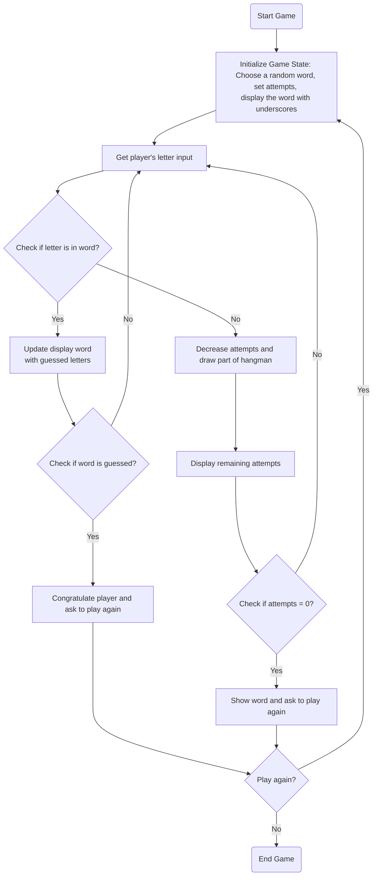

## АНАЛИЗ КОДА ИГРЫ "ВИСЕЛИЦА"

### 1. <алгоритм>

**Блок-схема игрового процесса:**

```mermaid
graph LR
    A[Начало игры] --> B{Инициализация};
    B --> C[Приветствие и объяснение правил];
    C --> D[Выбор случайного слова из списка];
    D --> E[Установка начального количества попыток (например, 6)];
    E --> F[Отображение слова в виде подчеркиваний];
    F --> G{Игровой цикл: Пока есть попытки и слово не угадано};
    G -- Да --> H[Запрос на ввод буквы от игрока];
    H --> I{Проверка введенной буквы};
    I -- Буква есть в слове --> J[Открытие буквы в слове на нужных позициях];
    J --> K[Отображение обновленного слова];
    I -- Буквы нет в слове --> L[Уменьшение количества попыток];
    L --> M[Отрисовка части висельника];
        M --> N[Отображение количества оставшихся попыток];
        N --> G;

    G -- Нет --> O{Проверка: выигрыш или проигрыш};
    O -- Выигрыш --> P[Поздравление и предложение сыграть снова];
    O -- Проигрыш --> Q[Сообщение о проигрыше и показ загаданного слова];
    P --> R{Играем снова? (да/нет)};
    Q --> R;
    R -- Да --> B;
    R -- Нет --> S[Завершение игры];
```

**Примеры для каждого блока:**

*   **A (Начало игры):** Запуск программы `hangman.py`.
*   **B (Инициализация):** Выбор слова из списка `["python", "java", "ruby", "swift"]`.
*   **C (Приветствие):** Вывод на экран: `"Добро пожаловать в игру HANG! Угадайте слово. У вас 6 попыток."`
*   **D (Выбор слова):** Случайный выбор слова, например, `"python"`.
*   **E (Попытки):** Установка переменной `attempts = 6`.
*   **F (Слово):** Отображение `"_ _ _ _ _ _"` на экране.
*   **G (Цикл):** Цикл продолжается, пока `attempts > 0` и слово не угадано.
*   **H (Ввод буквы):** Ожидание ввода, например, `"a"`.
*   **I (Проверка буквы):** Проверка, есть ли `"a"` в слове `"python"`.
    *   **J (Буква есть):** Открытие букв, например, если `"p"` введено, будет `"p _ _ _ _ _"`.
    *   **L (Буквы нет):** Уменьшение `attempts` на 1, теперь `attempts = 5`.
*   **M (Висельник):** Вывод части висельника, например, `"O"`.
*    **N (Попытки):** Отображение "Осталось попыток: 5"
*   **O (Проверка выигрыша):** Проверка, если слово `"python"` угадано или попытки `attempts == 0`.
    *   **P (Выигрыш):** Вывод: `"Поздравляем! Вы угадали слово!"`, запрос `Играем снова?`.
    *   **Q (Проигрыш):** Вывод: `"Вы проиграли! Загаданное слово было 'python'"`
*   **R (Играем снова):**
    *   **Да:** Переход к блоку **B**.
    *   **Нет:** Переход к блоку **S**.
*   **S (Конец):** Вывод: `"Спасибо за игру!"`, завершение работы программы.

### 2. <mermaid>



**Описание зависимостей:**

*   **Start:** Начало игры.
*   **Initialize:** Инициализирует игру. Выбирает случайное слово из списка, устанавливает начальное количество попыток и отображает слово в виде подчеркиваний.
*   **InputLetter:** Запрашивает букву у игрока.
*   **CheckLetter:** Проверяет, есть ли введенная буква в загаданном слове.
*    **UpdateWord:** Обновляет отображение слова с открытыми буквами.
*   **DecreaseAttempts:** Уменьшает количество оставшихся попыток и отображает текущее состояние висельника.
*    **DisplayAttempts:** Отображает оставшиеся попытки.
*    **CheckWin:** Проверяет, угадал ли игрок слово.
*    **CheckLose:** Проверяет, остались ли у игрока попытки.
*   **WinMessage:** Выводит поздравительное сообщение и предлагает сыграть еще раз.
*   **LoseMessage:** Выводит сообщение о проигрыше, показывает загаданное слово и предлагает сыграть еще раз.
*   **PlayAgain:** Спрашивает, хочет ли игрок сыграть еще раз.
*   **End:** Завершение игры.

### 3. <объяснение>

**Импорты:**

*   В данном коде импорты не используются, так как  это простое описание алгоритма игры.

**Классы:**
*   В данном коде нет классов, поскольку  это простое описание алгоритма игры.

**Функции:**

*   В данном коде явно нет определения функций, так как это просто описание алгоритма. Но можно выделить логические блоки, которые можно реализовать в виде функций, например:
    *   `initialize_game()`: Инициализация игры, выбор слова, установка попыток.
    *   `get_player_input()`: Запрос ввода буквы от пользователя.
    *   `check_letter_in_word(letter, word, guessed)`: Проверка буквы в слове и обновление отображения.
    *   `update_hangman()`: Отрисовка висельника.
    *   `check_win(word, guessed)`: Проверка выигрыша.
    *   `check_lose(attempts)`: Проверка проигрыша.
    *   `play_again()`: Запрос на повторную игру.

**Переменные:**
*   `secret_word` (str):  Слово, выбранное для угадывания.
*   `attempts` (int): Количество оставшихся попыток.
*   `guessed_letters` (list): Список уже угаданных букв.
*   `display_word` (str): Отображаемое слово с подчеркиваниями и угаданными буквами.
*    `hangman_stages` (list): Визуализация висельника в зависимости от количества попыток.

**Потенциальные ошибки и улучшения:**

*   **Ошибки:**
    *   Некорректный ввод (например, ввод числа или нескольких символов).
    *   Повторный ввод одной и той же буквы.
*   **Улучшения:**
    *   Реализация графического интерфейса для лучшей визуализации висельника.
    *   Добавление разных уровней сложности с разной длиной слов и количеством попыток.
    *   Валидация ввода игрока (проверка на корректность ввода и исключение повторного ввода одной и той же буквы).
    *   Добавление списка уже использованных букв.
    *   Сохранение статистики игр (количество побед и поражений).
    *   Создание модуля для визуализации висельника.
    *   Разделить функционал на функции.

**Цепочка взаимосвязей:**

Данное описание алгоритма не подразумевает прямых взаимосвязей с другими частями проекта, но предполагается, что данный файл `46_hang.ru.md` может быть частью более крупной структуры, где:

*   Файлы `header.py` могут определять глобальные настройки проекта и импорты.
*   Могут быть отдельные модули для работы с пользовательским интерфейсом и логикой игры.
*   Файлы с правилами (`*.md`)  могут использоваться для генерации документации или обучения пользователей.

```mermaid
flowchart TD
    Start --> GameRule[<code>46_hang.ru.md</code><br>Game Rules]
    GameRule --> Implementation[Game Logic <code>hangman.py</code>]
    Implementation --> UserInterface[User Interface]
    Implementation --> GameData[Game Data: <br> words, attempts]
    GameData --> GameRule