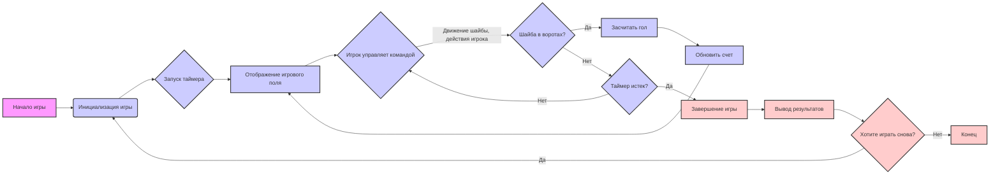
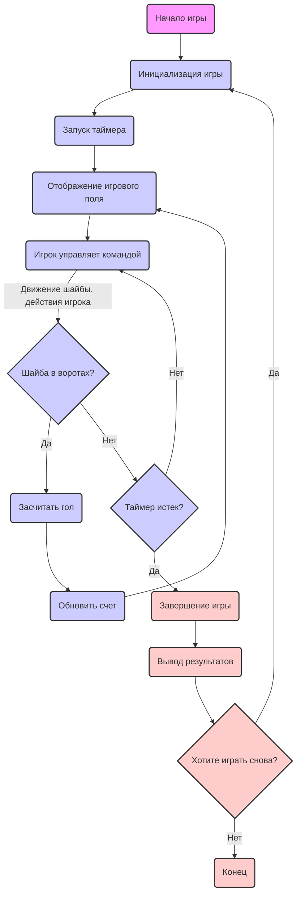

## Анализ кода игры "HOCKEY"

### 1. <алгоритм>

**Блок-схема игрового процесса HOCKEY:**



**Пошаговое объяснение:**

1.  **Начало игры:**
    *   Игра начинается с приветствия пользователя и объяснения правил.
2.  **Инициализация игры:**
    *   Устанавливается начальный экран с названием команд.
    *   Задается продолжительность матча (например, 5 минут).
    *   Игроки размещаются на игровом поле.
3.  **Запуск таймера:**
    *   Запускается таймер, отсчитывающий время матча.
4.  **Отображение игрового поля:**
    *   Игровое поле отображается на экране с игроками и шайбой.
5.  **Игрок управляет командой:**
    *   Игрок использует клавиши для перемещения хоккеистов по полю, передачи шайбы и атаки ворот противника.
    *   Данные о действиях игрока передаются для обработки в основной игровой цикл.
6. **Шайба в воротах?**:
    *   Проверяется, находится ли шайба в воротах противника.
    *   **Да**: Если шайба пересекла линию ворот, то выполняется блок "Засчитать гол".
    *   **Нет**: Если шайба не в воротах, то выполняется блок "Таймер истек?".
7.  **Засчитать гол:**
    *   Если шайба оказывается в воротах, засчитывается гол.
    *   Данные передаются в блок "Обновить счет".
8. **Обновить счет:**
   * Обновляется счет в игре
   * Возвращаемся к отображению игрового поля.
9.  **Таймер истек?**:
    *   Проверяется, истекло ли время матча.
    *  **Нет**: Если время не истекло, игра продолжается с блока "Игрок управляет командой".
    *   **Да**: Если время истекло, то игра переходит к блоку "Завершение игры".
10. **Завершение игры:**
    *   Игра останавливается.
    *   Переходим к блоку "Вывод результатов".
11. **Вывод результатов:**
    *   Отображается итоговый счет игры.
12. **Хотите играть снова?**:
    *   Пользователю предлагается начать новую игру.
    *   **Да**: Если игрок согласен, игра возвращается к "Инициализации игры".
    *   **Нет**: Если игрок не согласен, игра завершается.
13. **Конец**:
   *  Игра завершается.

### 2. <mermaid>



**Описание переменных:**

*   `Start`: Начало игры, представляет собой точку входа в игровой процесс.
*   `InitializeGame`: Инициализация игры, где устанавливаются основные параметры.
*  `StartTimer`: Запуск игрового таймера.
*   `DisplayGameField`: Отображение игрового поля с игроками и шайбой.
*   `PlayerControl`: Управление командой игроком.
*   `GoalCheck`: Проверка, был ли забит гол.
*   `ScoreGoal`: Засчитывание гола и изменение счёта.
*   `TimeCheck`: Проверка, истекло ли время игры.
*   `UpdateScore`: Обновление счета в игре.
*   `EndGame`: Завершение игры.
*   `DisplayResults`: Вывод итоговых результатов игры.
*   `PlayAgain`: Вопрос о повторной игре.
*   `StopGame`: Конец игры.

**Зависимости:**

В коде `mermaid` нет импортов, поскольку это диаграмма, а не исполняемый код.

### 3. <объяснение>

**Импорты:**

В предоставленном описании игры не указаны импорты. Тем не менее, в разделе "Реализация" упоминается использование `pygame` для графического интерфейса. Если бы игра была реализована на Python, импорт был бы следующим:

```python
import pygame
```

*   `pygame`: Модуль Python, используемый для создания игр, обработки графики, звука, ввода данных и других игровых элементов.

**Описание игры:**

Игра **HOCKEY** представляет собой симуляцию хоккея, в которой игрок управляет своей командой с целью забить больше голов, чем противник. Основные компоненты игры включают:

*   **Игровое поле:** Графическое представление хоккейной площадки.
*   **Игроки:** Хоккеисты, управляемые игроком или ИИ.
*   **Шайба:** Объект, которым игроки забивают голы.
*   **Таймер:** Отслеживает время матча.
*   **Счет:** Показывает количество голов, забитых игроками.

**Классы:**

В предоставленном коде нет классов, однако при реализации могут понадобиться следующие классы:

1.  **`HockeyPlayer`**:
    *   **Атрибуты**:
        *   `x`, `y`: Координаты игрока на поле.
        *   `speed`: Скорость движения игрока.
        *   `team`: Команда, за которую играет игрок.
    *   **Методы**:
        *   `move(direction)`: Перемещает игрока в заданном направлении.
        *   `draw(screen)`: Отображает игрока на экране.

2.  **`Puck`**:
    *   **Атрибуты**:
        *   `x`, `y`: Координаты шайбы.
        *   `speed`: Скорость движения шайбы.
        *   `direction`: Направление движения шайбы.
    *   **Методы**:
        *   `move()`: Перемещает шайбу в текущем направлении.
        *   `draw(screen)`: Отображает шайбу на экране.

3.  **`Goal`**:
    *   **Атрибуты**:
        *   `x1`, `y1`, `x2`, `y2`: Координаты границ ворот.
    *   **Методы**:
        *   `is_goal(puck)`: Проверяет, находится ли шайба в воротах.
        *    `draw(screen)`: Отображает ворота на экране.

4. **`Timer`**:
    *   **Атрибуты**:
        *   `duration`: Общая продолжительность игры.
        *   `start_time`: Время начала игры.
    *   **Методы**:
         * `is_expired()`: Возвращает `True`, если время истекло, иначе `False`.
         *  `get_remaining_time()`: Возвращает время, оставшееся до конца игры.
         * `start()`: Запускает таймер.
5.  **`Game`**:
    *   **Атрибуты**:
        *   `player_team`: Список объектов `HockeyPlayer`, представляющих команду игрока.
        *   `opponent_team`: Список объектов `HockeyPlayer`, представляющих команду противника.
        *   `puck`: Объект типа `Puck`.
        *   `goals`: Объект типа `Goal`
         * `timer`: Объект типа `Timer`
        *   `player_score`, `opponent_score`: Количество голов, забитых каждой командой.
    *   **Методы**:
        *   `start()`: Инициализирует игру.
        *   `update()`: Обновляет состояние игры.
        *   `draw(screen)`: Отображает игровое поле, игроков и шайбу.
        *    `check_for_goal()`: Проверяет, был ли забит гол.
        *   `end_game()`: Выводит результаты и спрашивает о новой игре.

**Функции:**

1.  **`main()`**:
    *   Основная функция, которая запускает игру.
    *   Инициализирует `pygame`, создает объект `Game` и запускает игровой цикл.
    *   Пример вызова:

    ```python
    def main():
        pygame.init()
        game = Game()
        game.start()
        running = True
        while running:
            for event in pygame.event.get():
                if event.type == pygame.QUIT:
                    running = False
            game.update()
        pygame.quit()
    ```

2.  **`handle_player_input(player, keys)`**:
    *   Аргументы:
        *   `player`: Объект типа `HockeyPlayer`.
        *   `keys`: Словарь, представляющий нажатые клавиши.
    *   Управляет движением игрока в зависимости от нажатых клавиш.

3. **`display_text(screen, text, x, y, color)`**:
    *   Аргументы:
        *  `screen`: Экран для отображения текста.
        *  `text`: Отображаемый текст.
        * `x`, `y`: Координаты текста.
        * `color`: Цвет текста.
    *   Отображает текст на экране.

**Переменные:**

*   `screen`: Объект, представляющий окно игры.
*   `running`: Логическая переменная, контролирующая игровой цикл.
*   `clock`: Объект, который управляет частотой обновления экрана.
*   `player_score`, `opponent_score`: Целочисленные переменные, хранящие счет голов.

**Потенциальные ошибки и области для улучшения:**

*   **Обработка столкновений:** Необходимо добавить более точные алгоритмы обработки столкновений между игроками и шайбой.
*   **ИИ противника:** Реализовать более сложный ИИ для противника, который будет более активно и эффективно играть.
*   **Уровни сложности:** Добавить несколько уровней сложности, изменяя скорость движения игроков и сложность ИИ противника.
*   **Интерфейс:** Улучшить интерфейс пользователя, добавив больше информации об игре.

**Взаимосвязь с другими частями проекта:**

Игра "HOCKEY" может быть частью более крупного проекта, включающего в себя:

*   **Меню выбора игр:** Возможность выбора других игр в меню.
*   **Глобальные настройки:** Настройки, которые могут применяться ко всем играм, например, громкость звука, разрешение экрана.
*   **Общая библиотека UI:** Общие элементы интерфейса, используемые во всех играх (кнопки, надписи, и т.д.).

Этот анализ предоставляет исчерпывающее описание игры, ее логики, возможной реализации и потенциальных улучшений.