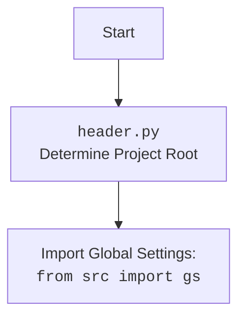

## Анализ игры HURKLE

### 1. <алгоритм>

**Блок-схема игрового процесса:**

```
Начало игры
    |
    V
Вывод приветствия и правил игры
    |
    V
Генерация игрового поля (например, 5x5)
    |
    V
Случайное размещение Хёркла на поле
    |
    V
    loop:
        |
        V
    Запрос хода игрока (ввод координат)
        |
        V
    Проверка ввода игрока
        |
        V
        if:
            |
            V
        Координаты корректны?
        /   \
       да  нет
      /      \
     V        V
    Оценка близости   Вывод сообщения об ошибке
    к Хёрклу           и повтор ввода
    |
    V
  Вывод подсказки:    
  "Хёркл рядом",
   "Хёркл далеко", или "Поздравляем!"
    |
    V
   if:
    |
    V
  Хёркл найден?
  /   \
 да  нет
/      \
V        V
Вывод сообщения  Переход к началу loop
о победе, кол-во ходов
    |
    V
Запрос новой игры (да/нет)
    |
    V
if:
    |
    V
Играть снова?
/   \
да  нет
/      \
V        V
Переход к началу   Вывод прощания
игры                  и завершение
```

**Примеры для логических блоков:**

*   **Инициализация:**
    *   Приветствие: `Добро пожаловать в игру HURKLE! Я спрятал объект...`
    *   Поле:  `[['A1', 'A2', 'A3', 'A4', 'A5'], ['B1', 'B2', 'B3', 'B4', 'B5'], ['C1', 'C2', 'C3', 'C4', 'C5'], ['D1', 'D2', 'D3', 'D4', 'D5'], ['E1', 'E2', 'E3', 'E4', 'E5']]`
    *   Хёркл: (Случайная ячейка, например, `C3`)
*   **Ход игрока:**
    *   Ввод игрока: `C3`
    *   Подсказка:
        *   Если Хёркл в `C3`: `Поздравляем! Вы нашли Хёркла!`
        *   Если Хёркл в `D4`: `Хёркл далеко!`
        *   Если Хёркл в `B2`: `Хёркл рядом!`
*   **Завершение игры:**
    *   Победа: `Поздравляем! Вы нашли Хёркла за 5 ходов!`
    *   Новая игра: `Хотите сыграть снова? (да/нет)`

**Поток данных:**

1.  **Инициализация:** Генерация поля и размещение Хёркла.
2.  **Ввод игрока:** Координаты -> Проверка ввода.
3.  **Оценка близости:** Координаты игрока + координаты Хёркла -> Подсказка.
4.  **Условие победы:** Координаты игрока == Координаты Хёркла.
5.  **Завершение:** Количество ходов, запрос новой игры.

### 2. <mermaid>

```mermaid
flowchart TD
    Start(Начало игры) --> WelcomeMessage[Вывод приветствия и правил];
    WelcomeMessage --> GenerateField[Генерация игрового поля (например, 5x5)];
    GenerateField --> PlaceHurkle[Случайное размещение Хёркла];
    PlaceHurkle --> PlayerInput[Запрос хода игрока (ввод координат)];
    PlayerInput --> ValidateInput{Проверка ввода игрока};
    ValidateInput -- Координаты корректны --> AssessProximity[Оценка близости к Хёрклу];
    ValidateInput -- Координаты некорректны --> InputError[Вывод ошибки и повтор ввода];
    InputError --> PlayerInput;
    AssessProximity --> ProvideHint[Вывод подсказки: "Хёркл рядом", "Хёркл далеко", или "Поздравляем!"];
    ProvideHint --> CheckVictory{Хёркл найден?};
    CheckVictory -- Да --> VictoryMessage[Вывод сообщения о победе и количестве ходов];
    CheckVictory -- Нет --> PlayerInput;
    VictoryMessage --> AskNewGame[Запрос новой игры (да/нет)];
    AskNewGame -- Да --> GenerateField;
    AskNewGame -- Нет --> End[Вывод прощания и завершение];
```

**Объяснение импортов (отсутствуют в предоставленном коде):**

В данном коде нет импортов, так как это текстовое описание игры, а не программный код. Если бы был код на Python, то могли бы быть импорты, например:

```python
import random  # Для случайного размещения Хёркла
```

Если бы присутствовал импорт `import header`, то блок `mermaid` был бы следующим:


### 3. <объяснение>

**Общее:**

*   **Игра:**  HURKLE — простая игра-угадайка, где игрок ищет скрытый объект на поле, получая подсказки о близости к нему.
*   **Цель:** Угадать местоположение Хёркла за наименьшее количество ходов.
*   **Основные элементы:** Игровое поле, Хёркл, ввод игрока, подсказки, циклы игры.

**Разделы по пунктам:**

*   **Инициализация:**
    *   **Назначение:** Начинает игру, генерирует поле и прячет Хёркла.
    *   **Пример:**
        *   Приветствие: `Добро пожаловать...`
        *   Размер поля: 5x5 (может быть изменен).
        *   Хёркл: Случайная ячейка (например, `C3`).
*   **Основной процесс игры:**
    *   **Назначение:**  Позволяет игроку делать ходы, проверяет ввод и дает подсказки.
    *   **Ход игрока:**
        *   Ввод:  Координаты ячейки (например, `C3`).
        *   Проверка:  Валидация ввода (формат, координаты в пределах поля).
        *   Подсказки: `Хёркл рядом`, `Хёркл далеко` или сообщение о победе.
    *   **Примеры подсказок:**
        *   Хёркл в `C3`, ввод `C4`: `Хёркл рядом`
        *   Хёркл в `A1`, ввод `E5`: `Хёркл далеко`
        *   Хёркл в `C3`, ввод `C3`: `Поздравляем! Вы нашли Хёркла!`
*   **Завершение игры:**
    *   **Назначение:**  Завершает игру и предлагает сыграть снова.
    *   **Сообщение:** `Поздравляем! Вы нашли Хёркла за X ходов!`
    *   **Повтор игры:**  Запрос `(да/нет)` и запуск нового раунда или завершение игры.

**Циклы и условия:**

*   **Цикл:**  Главный цикл игры продолжается, пока игрок не найдет Хёркла или не решит не играть снова.
*   **Условия:**
    *   Проверка ввода игрока (координаты).
    *   Оценка близости к Хёрклу и вывод подсказки.
    *   Проверка на победу (совпадение координат).
    *   Запрос новой игры.

**Переменные (хотя в тексте кода они явно не определены, вот их примеры и назначение):**

*   `field_size`: Размер игрового поля (например, 5).
*   `hurkle_location`: Координаты Хёркла (например, (`2`,`2`)).
*   `player_guess`:  Ввод игрока (например, `C3`).
*   `moves_count`:  Количество ходов, сделанных игроком.
*   `play_again`:  Флаг, указывающий, хочет ли игрок играть снова.

**Потенциальные ошибки и улучшения:**

*   **Ошибки ввода:**  Некорректный формат ввода или координаты вне поля.
*   **Улучшения:**
    *   Реализовать проверку корректности ввода.
    *   Давать более гранулированные подсказки (`горячо`, `тепло`, `холодно`, `ледяной`).
    *   Разрешить изменение размера поля.
    *   Добавить ограничения по количеству ходов или времени.
    *   Визуализировать игровое поле.

**Связь с другими частями проекта:**

*   В данном случае, предоставлен только текстовый файл с правилами игры.
*   Если это часть большого проекта, то эта игра может быть частью модуля игр.

**В заключение:**

Игра HURKLE — это простая игра-угадайка с понятными правилами. Ее реализация на Python будет включать в себя циклы, условия, случайную генерацию чисел и обработку ввода пользователя.