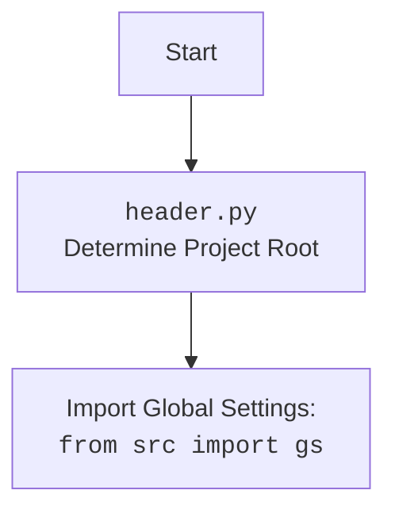

## АНАЛИЗ КОДА: **LIFE (Игра жизни)**

### <алгоритм>

1. **Инициализация игры:**
   - **Начало:** Программа стартует и приветствует пользователя, выводя правила игры.
   - **Ввод конфигурации:** Пользователь вводит начальную конфигурацию клеток (`.` для пустых, `*` для живых), строка за строкой. Ввод заканчивается комбинацией `Ctrl+Z` (EOF).
   - **Сохранение:** Введенная конфигурация сохраняется в структуре данных (например, в списке списков).
   - *Пример:* Пользователь вводит:
     ```
     ..*...
     .***..
     ..*...
     ```
     Это сохраняется в матрицу: `[['.', '.', '*', '.', '.', '.'], ['.', '*', '*', '*', '.', '.'], ['.', '.', '*', '.', '.', '.']]`.

2. **Эволюция поколений:**
    - **Цикл поколений:** Игра переходит в цикл, где каждое повторение представляет собой новое поколение.
    - **Копирование:** Создается копия текущего состояния сетки, чтобы изменения применялись на основе состояния предыдущего поколения.
    - **Обход сетки:**
        - Циклы проходят по каждой клетке сетки.
        - Для каждой клетки вызывается функция `calculate_neighbors()`, чтобы вычислить количество живых соседей.
        - *Пример:* Для клетки `(1,1)` в конфигурации выше, `calculate_neighbors()` вернет 3 (соседи `(0,1)`, `(0,2)`, `(1,2)`).
    - **Применение правил:**
        -  Для каждой клетки вызывается функция `apply_rules()`, в которую передаются значение клетки и количество живых соседей.
        -  Функция `apply_rules()` определяет новое состояние клетки (живая `*` или пустая `.`) на основе правил:
             - **Выживание:** Живая клетка остается живой, если у нее 2 или 3 соседа.
             - **Смерть:** Живая клетка умирает, если у нее меньше 2 или больше 3 соседей.
             - **Рождение:** Пустая клетка становится живой, если у нее ровно 3 соседа.
        - *Пример:* Для клетки `(1,1)` в конфигурации выше, с 3 соседями, `apply_rules()` вернет '*', она останется живой. Для клетки `(0,0)` с 1 соседом - вернет '.', она станет пустой.
    - **Обновление:** Все рассчитанные изменения применяются к копии сетки.
    - **Вывод:** Выводится обновленная сетка и количество живых клеток.

3. **Отображение состояния:**
    - **Вывод сетки:** Текущее состояние сетки выводится на экран: живые клетки как `*`, пустые как `.`.
    - **Счетчик населения:** Выводится номер текущего поколения и общее количество живых клеток.
    - *Пример:*
        ```
          Поколение: 1
          Население: 4
          .***..
          .*.*..
          .***..
        ```

4. **Завершение игры:**
    - **Условия окончания:** Цикл эволюции продолжается, пока не будет выполнено одно из условий:
        - Все клетки мертвы (население равно 0).
        - Состояние сетки не стабилизируется (текущее состояние идентично предыдущему).
        - Состояние сетки не начнет повторятся.
    - **Прерывание:** Игрок может прервать игру вручную.
    - **Конец игры:** Программа завершает работу.

### <mermaid>

```mermaid
flowchart TD
    Start[Начало Игры] --> InputConfig[Ввод начальной конфигурации пользователем]
    InputConfig --> InitializeGrid[Инициализация сетки (список списков)]
    InitializeGrid --> GenerationLoop[Цикл поколений]

    GenerationLoop --> CreateCopy[Создать копию текущей сетки]
    CreateCopy --> LoopThroughGrid[Обход всех клеток сетки]

    LoopThroughGrid --> CalculateNeighbors[Вычисление количества живых соседей для текущей клетки]
     CalculateNeighbors --> ApplyRules[Применение правил игры для текущей клетки]
     ApplyRules -->  UpdateCell[Обновление состояния клетки в копии сетки]
     UpdateCell --> LoopThroughGrid

    LoopThroughGrid -- Закончен обход сетки --> UpdateGrid[Присвоить обновленную сетку текущей]
     UpdateGrid --> CountLiveCells[Подсчёт живых клеток]
     CountLiveCells --> DisplayState[Отображение текущего состояния сетки и количества живых клеток]
     DisplayState --> CheckEndConditions[Проверка условий завершения игры]
     CheckEndConditions -- Игра не закончена --> GenerationLoop
    CheckEndConditions -- Игра закончена --> End[Завершение игры]

    classDef highlight fill:#f9f,stroke:#333,stroke-width:2px;
    class InputConfig, InitializeGrid, GenerationLoop, CreateCopy,LoopThroughGrid, CalculateNeighbors, ApplyRules, UpdateCell, UpdateGrid, CountLiveCells, DisplayState, CheckEndConditions, End highlight
```



**Объяснение диаграммы:**

1.  **`Start`**: Начало программы.
2.  **`InputConfig`**:  Пользователь вводит начальную конфигурацию клеток (живые/пустые).
3.  **`InitializeGrid`**: На основе введенной конфигурации инициализируется сетка.
4.  **`GenerationLoop`**: Начало цикла эволюции поколений.
5.  **`CreateCopy`**: Создается копия текущего состояния сетки для расчёта следующего поколения.
6.  **`LoopThroughGrid`**: Цикл, который проходит по всем клеткам сетки.
7.  **`CalculateNeighbors`**: Функция для подсчета живых соседей у текущей клетки.
8.  **`ApplyRules`**: Применение правил игры (выживание, смерть, рождение) для текущей клетки.
9.   **`UpdateCell`**: Обновление состояния текущей клетки в копии сетки, на основе правил.
10.  **`UpdateGrid`**: Обновление текущей сетки на основе изменений из копии.
11. **`CountLiveCells`**: Подсчёт количества живых клеток в текущей сетке.
12. **`DisplayState`**: Вывод текущего состояния сетки и количества живых клеток на экран.
13. **`CheckEndConditions`**: Проверка условий завершения игры: все клетки мертвы, состояние стабилизировалось, состояние повторяется.
14.  **`End`**: Завершение программы.

**Диаграмма `header.py`:**

1. **`Start`**: Начало выполнения `header.py`.
2. **`Header`**: Определяет корень проекта, что важно для импорта глобальных настроек.
3. **`import`**: Импортирует глобальные настройки из `src.gs`, что позволяет получить доступ к общим параметрам проекта.

### <объяснение>

**Импорты:**

В данном фрагменте кода импорты не используются. Если бы это был реальный код на Python, то вероятно потребовались бы следующие импорты:

-   `copy`: Для создания копий сетки в каждом поколении, чтобы избежать прямого изменения текущей сетки во время вычислений.
-   `typing` : Для статической типизации и повышения читаемости кода.

**Классы:**

В предоставленном описании классов не существует. Если бы это был реальный код, то, возможно, можно было бы создать следующие классы:

-   **`Grid`**:
    -   **Атрибуты**:
        -   `rows` (int): Количество строк в сетке.
        -   `cols` (int): Количество столбцов в сетке.
        -   `cells` (list of lists): Двумерный список, представляющий состояние клеток (живые/пустые).
    -   **Методы**:
        -   `__init__`: Инициализирует сетку с заданными размерами и начальной конфигурацией.
        -   `calculate_neighbors(row, col)`: Подсчитывает живых соседей для данной клетки.
        -   `apply_rules(row, col)`: Применяет правила игры к клетке, возвращая новое состояние.
        -   `update(new_cells)`: Обновляет сетку новым состоянием.
        -   `display()`: Выводит текущее состояние сетки на экран.
        -   `count_live_cells()`: Возвращает количество живых клеток.

- **`Game`**:
    - **Атрибуты**:
        - `grid` (Grid): Экземпляр класса `Grid`.
        - `generation` (int): Номер текущего поколения.
    - **Методы**:
        -   `__init__`: Инициализирует игру с начальной конфигурацией.
        -   `run_generation()`: Выполняет один шаг эволюции поколений.
        -   `check_end_conditions()`: Проверяет условия завершения игры.
        -   `run()`: Запускает главный цикл игры.

**Функции:**

-   **`calculate_neighbors(grid, row, col)`**:
    -   **Аргументы**:
        -   `grid` (list of lists): Текущее состояние сетки.
        -   `row` (int): Индекс строки клетки.
        -   `col` (int): Индекс столбца клетки.
    -   **Возвращаемое значение**: `int` - Количество живых соседей у клетки.
    -   **Назначение**: Подсчитывает количество живых соседей у заданной клетки, обрабатывая граничные условия.
    -   **Пример**: Для клетки в позиции `(1,1)` с соседями `* * *` вокруг, функция вернет 3.

-   **`apply_rules(cell, neighbors)`**:
    -   **Аргументы**:
        -   `cell` (str): Текущее состояние клетки (`*` или `.`).
        -   `neighbors` (int): Количество живых соседей.
    -   **Возвращаемое значение**: `str` - Новое состояние клетки (`*` или `.`).
    -   **Назначение**: Применяет правила игры, чтобы определить новое состояние клетки на основе количества соседей.
    -   **Пример**: Если `cell` равен `*` и `neighbors` равен 2 или 3, функция вернет `*`; если `neighbors` равен 4 или больше, функция вернет `.`. Если `cell` равен `.` и `neighbors` равен 3, вернет `*`.

**Переменные:**

-   `grid` (list of lists): Двумерный список, представляющий сетку.
-   `generation` (int): Номер текущего поколения.
-   `rows` (int): Количество строк в сетке.
-   `cols` (int): Количество столбцов в сетке.
-   `live_cells` (int): Количество живых клеток в текущем поколении.
-   `input_pattern` (list of lists): Начальная конфигурация, введенная пользователем.

**Потенциальные ошибки и области для улучшения:**

-   **Обработка ввода:** В описании не указана проверка ввода пользователя на корректность символов (`.` или `*`).
-   **Размер сетки:** Размер сетки фиксирован, что ограничивает гибкость игры.
-   **Условия завершения:** Условия завершения описаны в общих чертах. Нужна более точная реализация проверки стабилизации и повторений.
-  **Статическая типизация** : Рекомендуется использовать статическую типизацию для улучшения читаемости и предотвращения ошибок.

**Цепочка взаимосвязей с другими частями проекта:**

Если бы реализация была полной, то игра `LIFE` взаимодействовала бы с:

-   **`src.gs`** (Global Settings): для получения глобальных настроек проекта, таких как размеры сетки по умолчанию.
-   **`src.ui`** (User Interface): для взаимодействия с пользователем через консольный интерфейс или графическое отображение.

Этот анализ предоставляет подробное представление о структуре и функциональности игры "Жизнь" и её потенциальной реализации на Python.