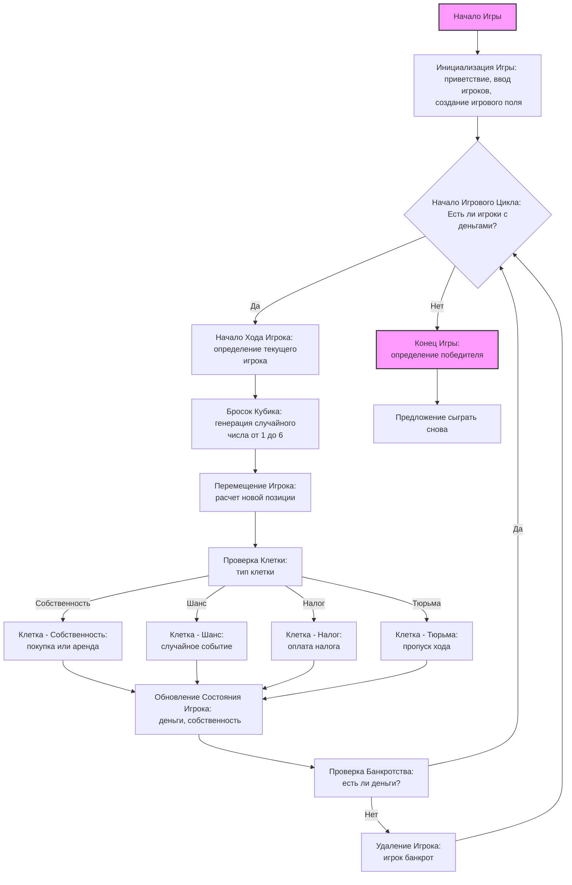

## Анализ кода игры "MNOPLY"

### <алгоритм>

1.  **Инициализация игры:**
    *   Вывод приветствия и правил игры.
    *   Запрос количества игроков (от 2 до 4).
    *   Запрос имен игроков.
    *   Инициализация начального капитала для каждого игрока (например, 1500 долларов).
    *   Создание игрового поля (списка клеток). Каждая клетка может быть:
        *   Собственность (с ценой и владельцем).
        *   Шанс (с событием).
        *   Налог (со штрафом).
        *   Тюрьма.
2.  **Основной игровой цикл:**
    *   Пока есть хотя бы два игрока с деньгами:
        *   Для каждого игрока:
            1.  **Бросок кубика:**
                *   Генерация случайного числа от 1 до 6.
            2.  **Перемещение:**
                *   Перемещение игрока на выпавшее количество клеток.
                *   Если игрок выходит за пределы поля, он начинает с начала.
            3.  **Обработка клетки:**
                *   **Собственность:**
                    *   Если не куплена, спросить игрока о покупке.
                        *   Если игрок покупает, списать деньги, и присвоить игрока в качестве владельца.
                    *   Если куплена другим игроком, игрок платит аренду.
                *   **Шанс:**
                    *   Выбрать случайное событие (например, выигрыш/проигрыш денег, перемещение).
                    *   Применить событие к игроку.
                *   **Налог:**
                    *   Списать с игрока штраф.
                *   **Тюрьма:**
                    *   Пропустить следующий ход игрока.
            4.  **Проверка банкротства:**
                *   Если у игрока закончились деньги, вывести сообщение и убрать из игры.
3.  **Завершение игры:**
    *   Когда остался только один игрок, объявить его победителем.
    *   Предложить сыграть еще раз.

**Пример потока данных:**

*   **Инициализация:** Имена игроков и их начальный капитал -> структура данных игроков и игрового поля.
*   **Бросок кубика:** Случайное число -> перемещение игрока.
*   **Обработка клетки:** Информация о клетке + состояние игрока -> изменение состояния игрока (деньги, положение, собственность).
*   **Финансы:** Состояние игрока -> проверка на банкротство.
*   **Завершение:** Состояние игроков -> объявление победителя.

### <mermaid>

**Объяснение:**

*   `Start` (Начало Игры): Начальная точка игры.
*   `InitializeGame`: Инициализация игры, включает в себя приветствие, ввод информации об игроках, создание игрового поля.
*   `GameLoopStart`: Начало игрового цикла, проверка наличия игроков с деньгами.
*   `PlayerTurnStart`: Начало хода игрока, определение текущего игрока.
*   `RollDice`: Генерация случайного числа для определения перемещения игрока.
*   `MovePlayer`: Перемещение игрока по игровому полю.
*   `CheckCell`: Проверка типа клетки, на которую попал игрок.
*   `PropertyCell`, `ChanceCell`, `TaxCell`, `JailCell`: Различные типы клеток.
*   `UpdatePlayerState`: Обновление состояния игрока (деньги, собственность).
*   `CheckBankruptcy`: Проверка на банкротство игрока.
*  `RemovePlayer`: Удаление игрока из игры, если у него закончились деньги
*   `EndGame`: Конец игры, определение победителя.
*   `PlayAgain`: Предложение сыграть снова.

### <объяснение>

**Импорты:**

*   `random`: используется для генерации случайных чисел при броске кубика и выборе случайных событий (шансов).

**Классы:**

*   В данном описании классов нет, так как это текстовое описание игры.
    Реализация на Python потребует создания классов:
    *   `Player`: для представления игрока (имя, деньги, позиция на поле, список собственности).
    *   `Cell`: для представления клетки на поле (тип, цена, владелец).
    *   `Game`: для управления игровым процессом.

**Функции:**

*   В данном описании функций нет, но реализация на Python потребует создания функций:
    *   `init_game()`: инициализирует игру (запрашивает количество игроков, имена, создает игроков и игровое поле).
    *   `roll_dice()`: генерирует случайное число от 1 до 6 (бросок кубика).
    *   `move_player(player, steps)`: перемещает игрока на заданное количество шагов по игровому полю.
    *   `handle_cell(player, cell)`: обрабатывает клетку, на которую попал игрок.
    *   `check_bankruptcy(player)`: проверяет, не обанкротился ли игрок.
    *   `end_game()`: завершает игру и объявляет победителя.

**Переменные:**

*   `players` (список): список объектов `Player`, представляющих игроков.
*   `board` (список): список объектов `Cell`, представляющих игровое поле.
*   `current_player` (объект): текущий игрок, делающий ход.
*   `dice_roll` (целое число): результат броска кубика.

**Потенциальные ошибки и области для улучшения:**

1.  **Недостаток деталей в описании:**
    *   Описание не содержит конкретных данных о свойствах клеток.
    *   Нет конкретной реализации шансов.
2.  **Ограниченные возможности:**
    *   Максимальное количество игроков ограничено 4.
    *   Фиксированное количество клеток на поле.
    *   Нет улучшений собственности (дома, отели).
    *   Нет возможности торговли между игроками.
3.  **Улучшения:**
    *   Создание классов для игроков, клеток и игры.
    *   Добавить больше типов клеток (например, железные дороги, коммунальные предприятия).
    *   Реализовать улучшение собственности.
    *   Реализовать торговлю между игроками.
    *   Возможность сохранения и загрузки игры.
    *   Более гибкая система обработки шансов.

**Цепочка взаимосвязей с другими частями проекта:**

*   Игра может быть интегрирована в более крупную систему, например, с использованием графического интерфейса пользователя (GUI) для визуализации игрового поля и интерфейса пользователя.
*   Может использовать базу данных для хранения результатов и статистики игр.
*   Может быть расширена для поддержки онлайн-игры с другими пользователями, используя сетевые функции.