## ИНСТРУКЦИЯ:

Анализируй предоставленный код подробно и объясни его функциональность. Ответ должен включать три раздела:  

1. **<алгоритм>**: Опиши рабочий процесс в виде пошаговой блок-схемы, включая примеры для каждого логического блока, и проиллюстрируй поток данных между функциями, классами или методами.  
2. **<mermaid>**: Напиши код для диаграммы в формате `mermaid`, проанализируй и объясни все зависимости, 
    которые импортируются при создании диаграммы. 
    **ВАЖНО!** Убедитесь, что все имена переменных, используемые в диаграмме `mermaid`, 
    имеют осмысленные и описательные имена. Имена переменных вроде `A`, `B`, `C`, и т.д., не допускаются!  
    
    **Дополнительно**: Если в коде есть импорт `import header`, добавьте блок `mermaid` flowchart, объясняющий `header.py`:
    ```mermaid
    flowchart TD
        Start --> Header[<code>header.py</code><br> Determine Project Root]
    
        Header --> import[Import Global Settings: <br><code>from src import gs</code>] 
    ```

3. **<объяснение>**: Предоставьте подробные объяснения:  
   - **Импорты**: Их назначение и взаимосвязь с другими пакетами `src.`.  
   - **Классы**: Их роль, атрибуты, методы и взаимодействие с другими компонентами проекта.  
   - **Функции**: Их аргументы, возвращаемые значения, назначение и примеры.  
   - **Переменные**: Их типы и использование.  
   - Выделите потенциальные ошибки или области для улучшения.  

Дополнительно, постройте цепочку взаимосвязей с другими частями проекта (если применимо).  

Это обеспечивает всесторонний и структурированный анализ кода.
## Формат ответа: `.md` (markdown)
**КОНЕЦ ИНСТРУКЦИИ**
```markdown
## <алгоритм>

### Блок-схема игры MUGWMP

```mermaid
graph LR
    A[Начало игры] --> B(Вывод приветствия и правил);
    B --> C{Генерация случайных координат 4 магвампов на сетке 10x10};
    C --> D[Установка количества ходов = 0];
    D --> E{Ввод координат игрока (X, Y)};
    E --> F{Расчет расстояния до ближайшего магвампа};
    F --> G{Проверка: Попал ли игрок в магвампа?};
    G -- Да --> H(Поздравление, уменьшение числа магвампов);
    H --> I{Проверка: Все магвампы пойманы?};
    G -- Нет --> J(Сообщение о расстоянии);
    J --> K[Увеличение количества ходов];
    K --> E;
    I -- Да --> L(Вывод сообщения о победе и кол-ве ходов);
    L --> M{Сыграть снова?};
    I -- Нет --> K;
    M -- Да --> C;
    M -- Нет --> N(Конец игры);
```

**Примеры для каждого блока:**

1.  **Начало игры**:
    *   Инициализация переменных и вызов начального сообщения.

2.  **Вывод приветствия и правил**:
    *   `print("Добро пожаловать в MUGWMP! ...")`

3.  **Генерация случайных координат 4 магвампов на сетке 10x10**:
    *   Использование `random.randint(1, 10)` для генерации `x` и `y` координат.
    *   `magwamp_locations = [(random.randint(1, 10), random.randint(1, 10)) for _ in range(4)]`
    *   Пример: `magwamp_locations = [(2, 3), (8, 1), (5, 9), (1, 7)]`

4.  **Установка количества ходов = 0**:
    *   `moves = 0`

5.  **Ввод координат игрока (X, Y)**:
    *   `input_coordinates = input("Введите координаты (X, Y): ")`
    *   `x, y = map(int, input_coordinates.split(','))`
    *   Пример: `input_coordinates = "5, 5"`, `x = 5`, `y = 5`

6.  **Расчет расстояния до ближайшего магвампа**:
    *   Вычисление расстояний до всех магвампов и выбор наименьшего.
    *   `distance = min(math.sqrt((x - mx)**2 + (y - my)**2) for mx, my in magwamp_locations)`
    *   Пример: `distance = 4.2`

7.  **Проверка: Попал ли игрок в магвампа?**:
    *   Сравнение координат игрока и магвампа.
    *   `if (x, y) in magwamp_locations:`

8.  **Поздравление, уменьшение числа магвампов**:
    *   `print("Вы поймали Магвампа! Осталось:", len(magwamp_locations) - 1)`
    *   Удаление магвампа из списка.
    *   `magwamp_locations.remove((x, y))`

9. **Сообщение о расстоянии**:
    *   `print("Расстояние до ближайшего Магвампа:", distance)`

10. **Увеличение количества ходов**:
    *   `moves += 1`

11. **Проверка: Все магвампы пойманы?**:
    *   Проверка, пуст ли список магвампов.
    *   `if not magwamp_locations:`

12. **Вывод сообщения о победе и кол-ве ходов**:
    *   `print("Поздравляем! Вы поймали всех Магвампов! Вам потребовалось", moves, "ходов.")`

13. **Сыграть снова?**:
     * `play_again = input("Хотите сыграть снова? (да/нет): ")`

14. **Конец игры**:
     * `print("Спасибо за игру!")`

```mermaid
graph LR
    Start[Начало игры] --> InitializeGame[Инициализация игры];
    InitializeGame --> GenerateMagwampLocations[Генерация позиций магвампов];
    GenerateMagwampLocations --> SetMovesToZero[Обнуление количества ходов];
    SetMovesToZero --> PlayerTurn[Ход игрока];
    PlayerTurn --> InputCoordinates[Ввод координат игрока];
    InputCoordinates --> CalculateDistance[Расчет расстояния до магвампа];
    CalculateDistance --> CheckHit[Проверка попадания в магвампа];
    CheckHit -- Попадание --> CongratulateAndReduceMagwamps[Поздравление, уменьшение числа магвампов];
    CongratulateAndReduceMagwamps --> CheckAllMagwampsCaught[Проверка: Все магвампы пойманы?];
    CheckHit -- Нет попадания --> OutputDistance[Вывод расстояния];
    OutputDistance --> IncreaseMoves[Увеличение количества ходов];
    IncreaseMoves --> PlayerTurn;
    CheckAllMagwampsCaught -- Да --> AnnounceVictory[Объявление победы];
    CheckAllMagwampsCaught -- Нет --> IncreaseMoves;
    AnnounceVictory --> AskPlayAgain[Спросить: Сыграть снова?];
    AskPlayAgain -- Да --> GenerateMagwampLocations;
    AskPlayAgain -- Нет --> EndGame[Конец игры];
    
  
    style Start fill:#f9f,stroke:#333,stroke-width:2px
    style EndGame fill:#ccf,stroke:#333,stroke-width:2px
```

## <mermaid>



### Описание диаграммы `mermaid`:

Диаграмма `mermaid` представляет собой блок-схему игрового процесса MUGWMP.  
*   **Start**: Начало игры.
*   **InitializeGame**: Инициализация основных переменных и настроек игры.
*   **GenerateMagwampLocations**:  Генерация случайных координат магвампов на игровом поле.
*   **SetMovesToZero**: Установка начального количества ходов равным нулю.
*  **PlayerTurn**: Начало хода игрока
*  **InputCoordinates**: Получение координат от игрока.
*   **CalculateDistance**: Вычисление расстояния от игрока до ближайшего магвампа.
*   **CheckHit**: Проверка, попал ли игрок в магвампа.
*   **CongratulateAndReduceMagwamps**: Вывод поздравления и уменьшение количества оставшихся магвампов.
*   **OutputDistance**: Вывод расстояния до ближайшего магвампа.
*   **IncreaseMoves**: Увеличение счетчика ходов.
*   **CheckAllMagwampsCaught**: Проверка, все ли магвампы пойманы.
*   **AnnounceVictory**: Вывод поздравления о победе.
*   **AskPlayAgain**: Запрос, хочет ли игрок сыграть еще раз.
*   **EndGame**: Завершение игры.

**Зависимости**

В данной диаграмме не показаны импорты, так как это блок схема алгоритма.

## <объяснение>

**Описание игры MUGWMP**
Игра MUGWMP представляет собой текстовую игру, в которой игрок пытается найти спрятанных магвампов на сетке 10x10, вводя координаты. Программа рассчитывает расстояние до ближайшего магвампа и предоставляет игроку обратную связь.

### Инициализация игры
1.  **Приветствие и правила**: Выводит начальное сообщение с правилами игры.
2.  **Генерация координат магвампов**: Случайным образом определяет местоположение четырех магвампов на сетке 10x10.
3.  **Обнуление счетчика ходов**:  Устанавливает начальное количество ходов равным 0.

### Основной процесс игры
1.  **Ход игрока**:
    *   **Ввод координат**: Игрок вводит координаты (X, Y) для поиска магвампа.
    *   **Расчет расстояния**: Программа вычисляет расстояние между введенными координатами и координатами каждого магвампа, используя формулу расстояния.
    *   **Сообщение о расстоянии**: Выводит сообщение о расстоянии до ближайшего магвампа.
2.  **Поимка магвампа**:
    *   **Проверка на совпадение координат**: Если введенные координаты совпадают с координатами магвампа, магвамп считается пойманным.
    *   **Уменьшение числа магвампов**: Программа уменьшает количество оставшихся магвампов и поздравляет игрока.
3.  **Продолжение игры**:
    *   Игра продолжается до тех пор, пока все магвампы не будут пойманы.
    *   Программа отслеживает количество ходов.

### Завершение игры
1.  **Победа**: Когда все магвампы пойманы, программа поздравляет игрока и выводит общее количество ходов.
2.  **Предложение играть снова**:  Предлагает игроку начать игру заново.

### Ключевые моменты
*   Использование случайных чисел для генерации координат магвампов.
*   Использование математической функции для вычисления расстояний между точками.
*   Отслеживание количества ходов и оставшихся магвампов.

### Возможные улучшения
1.  **Уровни сложности**: Введение различных размеров сетки (например, 20x20) для увеличения сложности.
2.  **Многопользовательский режим**: Добавление возможности играть с несколькими игроками, соревнуясь за наименьшее количество ходов.
3.  **Подсказки**: Добавление подсказок для игрока, например, указание направления на ближайшего магвампа.
4.  **Обработка ошибок**: Улучшить обработку некорректного ввода, чтобы избежать сбоев программы.
5. **Оптимизация расчета расстояния:** Вместо расчета расстояния до всех магвампов, можно оптимизировать алгоритм для поиска ближайшего магвампа без лишних вычислений.

### **Цепочка взаимосвязей**
Данный код представляет собой самостоятельную игру, не зависящую от других частей проекта. Однако, в более крупном проекте, этот код может быть интегрирован в систему игровых модулей.