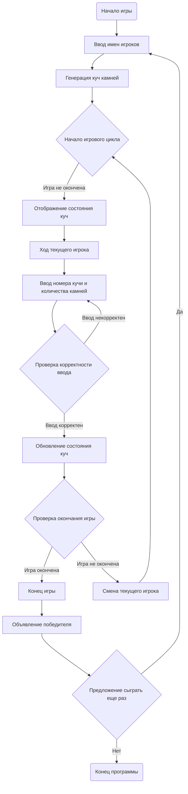

## ИНСТРУКЦИЯ:

Анализируй предоставленный код подробно и объясни его функциональность. Ответ должен включать три раздела:  

1.  **<алгоритм>**: Опиши рабочий процесс в виде пошаговой блок-схемы, включая примеры для каждого логического блока, и проиллюстрируй поток данных между функциями, классами или методами.  
2.  **<mermaid>**: Напиши код для диаграммы в формате `mermaid`, проанализируй и объясни все зависимости, 
    которые импортируются при создании диаграммы. 
    **ВАЖНО!** Убедитесь, что все имена переменных, используемые в диаграмме `mermaid`, 
    имеют осмысленные и описательные имена. Имена переменных вроде `A`, `B`, `C`, и т.д., не допускаются!  
    
    **Дополнительно**: Если в коде есть импорт `import header`, добавьте блок `mermaid` flowchart, объясняющий `header.py`:\
    ```mermaid
    flowchart TD
        Start --> Header[<code>header.py</code><br> Determine Project Root]
    
        Header --> import[Import Global Settings: <br><code>from src import gs</code>] 
    ```

3.  **<объяснение>**: Предоставьте подробные объяснения:  
    - **Импорты**: Их назначение и взаимосвязь с другими пакетами `src.`.  
    - **Классы**: Их роль, атрибуты, методы и взаимодействие с другими компонентами проекта.  
    - **Функции**: Их аргументы, возвращаемые значения, назначение и примеры.  
    - **Переменные**: Их типы и использование.  
    - Выделите потенциальные ошибки или области для улучшения.  

Дополнительно, постройте цепочку взаимосвязей с другими частями проекта (если применимо).  

Это обеспечивает всесторонний и структурированный анализ кода.
## Формат ответа: `.md` (markdown)
**КОНЕЦ ИНСТРУКЦИИ**

## <алгоритм>

**1. Инициализация игры:**

   - **Начало:** Выводится приветственное сообщение и объяснение правил игры.
   - **Ввод имен игроков:** Игроки по очереди вводят свои имена, которые сохраняются в переменных `player1_name` и `player2_name`.
   - **Генерация куч:** Случайным образом генерируется количество куч (например, от 3 до 5) и количество камней в каждой куче (например, от 5 до 15). Эти данные сохраняются в структуре данных, например, в виде списка `heaps`, где каждый элемент представляет собой число камней в конкретной куче. 
   - **Пример:** `heaps = [7, 5, 10]` (3 кучи с 7, 5 и 10 камнями соответственно).

**2. Основной процесс игры (цикл):**

   - **Вывод текущего состояния куч:** Текущее количество камней в каждой куче отображается игрокам. Например: "Куча 1: 7 камней, Куча 2: 5 камней, Куча 3: 10 камней".
   - **Ход игрока:**
     - Выводится сообщение о ходе текущего игрока (например, "Ход Анны:").
     - Игрок вводит номер кучи (например, `heap_number`) и количество камней, которые он хочет взять (`stones_to_take`).
   - **Проверка корректности ввода:**
     - Проверяется, что номер кучи корректен (не выходит за границы списка куч).
     - Проверяется, что игрок пытается взять не больше камней, чем есть в выбранной куче.
     - Если ввод некорректен, выводится сообщение об ошибке, и ход повторяется.
   - **Обновление состояния куч:**
     - Количество камней в выбранной куче уменьшается на число взятых камней. `heaps[heap_number] -= stones_to_take`
   - **Проверка окончания игры:**
     - Проверяется, остались ли еще камни в кучах. Если сумма всех камней в кучах равна 0, игра завершается.
   - **Смена игрока:**
     - Если игра не окончена, текущий игрок меняется на следующего.
   - **Пример:**
        - Игрок Анна выбирает кучу 3 и берет 4 камня. `heaps` становится `[7, 5, 6]`.
        - Проверяется, что сумма камней больше 0 (7+5+6=18).
        - Ход переходит к Ивану.

**3. Завершение игры:**

   - **Определение проигравшего:** Выводится сообщение, какой игрок взял последний камень. Проигравшим считается игрок, который сделал последний ход. Победитель — это предыдущий игрок.
   - **Вывод сообщения о победителе:** Выводится сообщение с именем победителя.
   - **Предложение сыграть еще раз:** Спрашивается, хотят ли игроки сыграть еще раз. Если да, начинается новая игра; если нет, программа завершается.

## <mermaid>

## <объяснение>

**1. Алгоритм:**
   - Алгоритм игры НИМ реализуется с помощью конечного цикла, который управляет ходами игроков, пока не закончится игра.
   - Начальная инициализация игры предполагает сбор имен игроков и генерацию игрового поля (куч с камнями).
   - Основной цикл включает в себя отображение текущего состояния, получение ввода от игроков, проверку корректности ввода и обновление игрового поля.
   - Условия завершения игры проверяются после каждого хода, когда все кучи становятся пустыми.
   - В конце игры объявляется победитель, и игрокам предлагается сыграть еще раз.

**2. mermaid:**
   - Диаграмма `mermaid` представляет собой блок-схему алгоритма игры НИМ.
   - `Start`: Начало программы.
   - `InputNames`: Блок для ввода имен игроков.
   - `GenerateHeaps`: Блок для генерации игровых куч с камнями.
   - `GameLoopStart`: Начало основного цикла игры.
   - `ShowHeaps`: Блок для отображения текущего состояния куч.
   - `PlayerTurn`: Блок для выполнения хода текущим игроком.
   - `InputHeapAndStones`: Блок для ввода номера кучи и количества камней.
   - `ValidateInput`: Блок проверки корректности ввода игрока.
   - `UpdateHeaps`: Блок обновления состояния куч.
   - `CheckGameOver`: Блок проверки условия завершения игры.
   - `SwitchPlayer`: Блок смены текущего игрока.
   - `GameOver`: Блок окончания игры.
   - `DisplayWinner`: Блок объявления победителя.
   - `PlayAgain`: Блок предложения сыграть еще раз.
   - `End`: Конец программы.

**3. Объяснение:**

   - **Импорты:**
     - В предоставленном описании нет явных импортов, что говорит о том, что все необходимые функции и структуры данных будут реализованы внутри самого игрового модуля. Если бы использовались какие-либо внешние библиотеки (например, для генерации случайных чисел), то они бы были указаны в импортах. Для генерации случайных чисел, скорее всего, потребуется импорт `random`, но явного упоминания его в тексте нет.

   - **Классы:**
     - В данном описании не предполагается использование классов. Игра может быть реализована с помощью простых функций и переменных. Однако, для более сложной реализации можно было бы использовать класс `Game` или `Player`, чтобы организовать логику и хранить состояние игры более структурированно.

   - **Функции:**
     -  **`initialize_game()`:**
        - **Назначение:** Инициализация игры. Выводит приветственное сообщение, запрашивает имена игроков, генерирует начальное состояние куч.
        - **Аргументы:** Нет.
        - **Возвращаемое значение:** Состояние куч (список `heaps`), имена игроков (строки `player1_name`, `player2_name`).
     - **`display_heaps(heaps)`:**
        - **Назначение:** Отображение текущего состояния куч.
        - **Аргументы:** `heaps` (список целых чисел, представляющий количество камней в каждой куче).
        - **Возвращаемое значение:** Нет.
        - **Пример:** При `heaps = [7, 5, 10]` выводит "Куча 1: 7 камней, Куча 2: 5 камней, Куча 3: 10 камней".
     - **`get_player_move(heaps, current_player_name)`:**
        - **Назначение:** Получение ввода от игрока (номер кучи и количество камней).
        - **Аргументы:** `heaps` (список целых чисел, представляющий количество камней в каждой куче), `current_player_name` (строка, имя текущего игрока).
        - **Возвращаемое значение:** Номер кучи (`heap_number`, целое число), количество камней, которое игрок хочет взять (`stones_to_take`, целое число).
     - **`validate_move(heaps, heap_number, stones_to_take)`:**
        - **Назначение:** Проверка корректности ввода игрока.
        - **Аргументы:** `heaps` (список целых чисел), `heap_number` (целое число), `stones_to_take` (целое число).
        - **Возвращаемое значение:** `True` если ход корректен, `False` в противном случае.
     - **`update_heaps(heaps, heap_number, stones_to_take)`:**
        - **Назначение:** Обновление состояния куч.
        - **Аргументы:** `heaps` (список целых чисел), `heap_number` (целое число), `stones_to_take` (целое число).
        - **Возвращаемое значение:** Обновленный список `heaps`.
     - **`check_game_over(heaps)`:**
        - **Назначение:** Проверка, остались ли камни в кучах.
        - **Аргументы:** `heaps` (список целых чисел).
        - **Возвращаемое значение:** `True`, если игра закончена (нет камней), `False` в противном случае.
     - **`display_winner(player_name)`:**
        - **Назначение:** Объявление победителя.
        - **Аргументы:** `player_name` (строка, имя победителя).
        - **Возвращаемое значение:** Нет.
     - **`play_again()`:**
        - **Назначение:** Запрос у игроков, хотят ли они играть еще раз.
        - **Аргументы:** Нет.
        - **Возвращаемое значение:** `True` если да, `False` в противном случае.

   - **Переменные:**
     - **`heaps`**: Список целых чисел, представляющий количество камней в каждой куче.
     - **`player1_name`, `player2_name`**: Строки, хранящие имена игроков.
     - **`current_player`**: Строка, имя текущего игрока.
     - **`heap_number`**: Целое число, номер выбранной кучи.
     - **`stones_to_take`**: Целое число, количество камней, которые игрок хочет взять.
     - **`game_over`**: Булево значение, указывающее, закончилась игра или нет.

   - **Потенциальные ошибки и улучшения:**
     - **Обработка некорректного ввода:** Хотя в описании упоминается обработка некорректного ввода, важно убедиться, что все возможные случаи (не числовой ввод, отрицательные значения, нулевой ввод, выход за границы массива) обрабатываются корректно.
     - **Усложнение игры:** Предлагается добавить режим игры против компьютера с простой/сложной стратегией, а также режим "обратного NIM".
     - **Рефакторинг:** Выделение функций, таких как `get_player_move`, `validate_move`, и `update_heaps` в отдельные блоки кода, сделает программу более модульной и читаемой.
     - **Классы:** Использование классов для инкапсуляции данных и методов игры сделает код более организованным и легким в сопровождении.
     - **Тестирование:** Необходимо добавить модульные тесты для проверки корректности реализации каждой функции.

   - **Цепочка взаимосвязей с другими частями проекта:**
     - Поскольку в данном описании не рассматривается взаимодействие с другими частями проекта, сложно построить цепочку взаимосвязей. Если бы были импорты или использовалась внешняя конфигурация, то можно было бы проанализировать эти связи.

Таким образом, игра NIM будет представлять собой интерактивное консольное приложение, которое позволяет двум игрокам по очереди удалять камни из куч, с целью заставить противника взять последний камень.