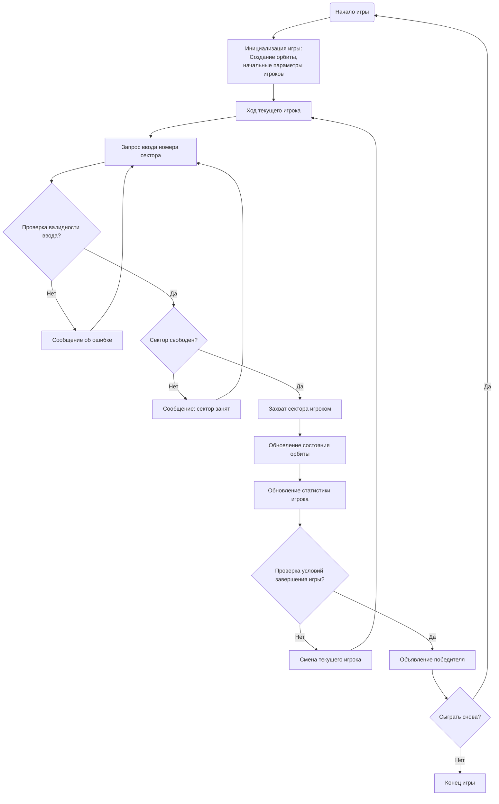

## АНАЛИЗ КОДА: ORBIT (Орбитальная Игра)

### 1. <алгоритм>

**Блок-схема игры ORBIT:**

```mermaid
graph TD
    A[Начало игры] --> B{Вывод приветствия и правил};
    B --> C[Инициализация орбиты (12 секторов)];
    C --> D{Установка параметров игры: текущий игрок, захваченные сектора, количество ходов};
    D --> E[Начало игрового цикла];
    E --> F{Ход текущего игрока};
    F --> G{Запрос ввода номера сектора};
    G --> H{Проверка валидности ввода};
    H -- Не валиден --> I[Вывод сообщения об ошибке];
    I --> G
    H -- Валиден --> J{Проверка: Сектор свободен?};
    J -- Нет --> K[Вывод сообщения об ошибке: Сектор занят];
    K --> G
    J -- Да --> L[Захват сектора игроком];
    L --> M[Обновление состояния орбиты];
    M --> N[Обновление статистики игрока: Количество захваченных секторов];    
    N --> O{Проверка условий завершения игры: (Большинство секторов захвачено или макс. количество ходов?)};
    O -- Нет --> P[Смена текущего игрока];
    P --> E;
    O -- Да --> Q{Объявление победителя};
    Q --> R[Запрос: Хотите сыграть снова?];
    R -- Да --> A;
    R -- Нет --> S[Выход из игры];
    S --> T[Конец]
```

**Пояснение:**

1.  **Начало игры**: Запускает игровую программу.
2.  **Вывод приветствия и правил**: Показывает игрокам основную информацию об игре.
3.  **Инициализация орбиты**: Создаётся представление игрового поля, состоящее из 12 секторов, изначально свободных.
4.  **Установка параметров игры**: Определяются начальные значения: текущий игрок (например, Игрок 1), счётчики захваченных секторов (изначально 0 у обоих игроков) и количество ходов.
5.  **Начало игрового цикла**: Начинается игровой процесс, который повторяется до завершения игры.
6.  **Ход текущего игрока**: Игрок, чей сейчас ход, делает свои действия.
7.  **Запрос ввода номера сектора**: Программа запрашивает у текущего игрока номер сектора, который он хочет захватить.
8.  **Проверка валидности ввода**: Проверяет, введён ли номер сектора в диапазоне от 1 до 12.
9.  **Вывод сообщения об ошибке**: Если номер сектора невалиден, программа сообщает об этом и запрашивает ввод снова.
10. **Проверка: Сектор свободен?**: Программа проверяет, свободен ли выбранный сектор или уже захвачен.
11. **Вывод сообщения об ошибке: Сектор занят**: Если выбранный сектор уже занят, программа выводит сообщение и запрашивает ввод снова.
12. **Захват сектора игроком**: Если сектор свободен, текущий игрок захватывает его.
13. **Обновление состояния орбиты**:  Состояние орбиты меняется: выбранный сектор теперь принадлежит текущему игроку.
14. **Обновление статистики игрока: Количество захваченных секторов**: Счётчик захваченных секторов для текущего игрока увеличивается.
15. **Проверка условий завершения игры**: Проверяется, не достиг ли один из игроков большинства захваченных секторов (например, 7 из 12), или не достигнуто ли максимальное количество ходов (например, 20).
16. **Смена текущего игрока**: Если условия завершения игры не выполнены, ход передаётся следующему игроку.
17. **Объявление победителя**: Если условия завершения игры выполнены, программа объявляет победителя.
18. **Запрос: Хотите сыграть снова?**: Программа спрашивает, хотят ли игроки сыграть ещё раз.
19. **Выход из игры**: Если игроки не хотят играть снова, программа завершает свою работу.
20. **Конец**: Программа завершает выполнение.

### 2. <mermaid>



**Пояснение диаграммы Mermaid:**

*   `Start`: Начальная точка игры.
*   `Initialize`: Инициализация игры, создается орбита и устанавливаются начальные параметры игроков.
*   `PlayerTurn`: Начало хода текущего игрока.
*   `InputSector`: Запрос номера сектора у игрока.
*   `ValidateInput`: Проверка валидности введенного номера сектора.
*   `InputError`: Сообщение об ошибке при невалидном вводе.
*   `CheckSector`: Проверка, свободен ли выбранный сектор.
*   `SectorError`: Сообщение об ошибке, если выбранный сектор занят.
*   `CaptureSector`: Захват сектора текущим игроком.
*   `UpdateOrbit`: Обновление состояния орбиты после захвата сектора.
*   `UpdateStats`: Обновление статистики захваченных секторов для игрока.
*   `CheckEndGame`: Проверка условий завершения игры (победа одного игрока или достижение максимального количества ходов).
*    `NextPlayer`: передача хода следующему игроку.
*   `AnnounceWinner`: Объявление победителя игры.
*   `PlayAgain`: Запрос о повторной игре.
*   `End`: Конец игры.

### 3. <объяснение>

**Импорты:**

В предоставленном описании кода импорты отсутствуют, так как данный код представляет собой текстовое описание и пошаговую инструкцию игры, а не фактический программный код.

**Классы:**

В данном описании классов нет, поскольку это описание не является кодом. В реализации, возможно, потребуются классы для представления игрока, орбиты или сектора.

**Функции:**

Описание включает логическую последовательность действий для функций, но не определяет их как таковые. В реализации можно выделить следующие функции:

*   `initialize_game()`:  Функция для инициализации игры: создание орбиты (списка/массива), начальной расстановки секторов, установка начальных параметров игроков и вывод приветственного сообщения.
*   `player_turn(current_player, orbit)`: Функция, отвечающая за ход игрока. Принимает текущего игрока и текущее состояние орбиты. Запрашивает ввод, проверяет валидность и захватывает сектор.
*   `validate_input(sector_number)`: Функция для проверки валидности ввода номера сектора. Принимает номер сектора, возвращает `True`, если ввод валиден, иначе `False`.
*   `is_sector_free(sector_number, orbit)`: Функция для проверки, свободен ли сектор. Принимает номер сектора и состояние орбиты, возвращает `True`, если сектор свободен, иначе `False`.
*   `capture_sector(sector_number, current_player, orbit)`: Функция для захвата сектора. Принимает номер сектора, текущего игрока и текущее состояние орбиты. Обновляет состояние орбиты и возвращает её.
*    `update_player_stats(current_player, captured_sectors)`: Функция для обновления статистики захваченных секторов.
*   `check_end_game(captured_sectors_player1, captured_sectors_player2, max_moves)`: Функция проверки условий завершения игры. Принимает количество захваченных секторов каждым игроком и максимальное количество ходов. Возвращает `True` если игра закончилась, иначе `False`.
*   `announce_winner(captured_sectors_player1, captured_sectors_player2)`:  Функция для объявления победителя. Принимает количество захваченных секторов каждым игроком.
*    `play_again()`:  Функция для запроса о повторной игре. Принимает ввод пользователя, возвращает `True` если игра начнется заново, иначе `False`.

**Переменные:**

В тексте присутствуют следующие переменные:

*   `orbit` (массив/список): Представляет состояние орбиты, где каждый элемент может указывать на владельца сектора (Игрок 1, Игрок 2, свободен).
*   `current_player`: Указывает на текущего игрока (например, "Игрок 1", "Игрок 2").
*   `sector_number`: Номер сектора, который игрок хочет захватить.
*    `captured_sectors_player1` (int): Количество захваченных секторов Игроком 1.
*   `captured_sectors_player2` (int): Количество захваченных секторов Игроком 2.
*   `max_moves` (int): Максимальное количество ходов в игре.
*    `play_again_input` (str): Ввод пользователя ("да" или "нет") по поводу повторной игры.

**Потенциальные ошибки и области для улучшения:**

*   **Обработка невалидного ввода:** Описанная логика хорошо прорабатывает случаи неверного ввода номера сектора. Но стоило бы уделить внимание и обработке случаев нечислового ввода.
*   **Реализация с компьютером:** В разделе "Рекомендуемые улучшения" упоминается реализация игры с компьютером, но в текущем описании это не рассматривается.
*   **Расширение возможностей:**  Ограничение на захват секторов и отсутствие "атак" может сделать игру менее интересной.
*   **GUI:** Рекомендовано добавить графический интерфейс.

**Взаимосвязи с другими частями проекта:**

Без фактического кода сложно определить связи с другими частями проекта, но в типичном случае:

*   Игра может быть частью более крупного игрового проекта `src.ai.helicone.ai_games`.
*   Возможно, будут использованы общие библиотеки для пользовательского ввода и вывода, логирования или графического интерфейса.
*   Могут использоваться общие настройки проекта.

Этот анализ дает полное понимание логики и структуры игры, а также потенциальных путей её реализации и улучшения.