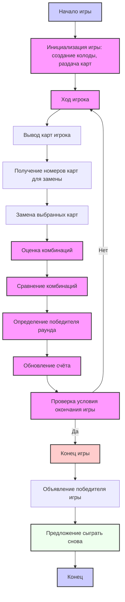

## Анализ кода игры "POKER"

### <алгоритм>

1.  **Начало игры**:
    *   Вывод приветственного сообщения и правил игры.
    *   Пример: "Добро пожаловать в POKER! Ваша задача — собрать самую сильную комбинацию из пяти карт. Игра продолжается до тех пор, пока не будет достигнуто определённое количество раундов или пока один из игроков не наберёт максимальное количество очков. Удачи!"
    *   Создание и перемешивание колоды из 52 карт.
    *   Пример: `deck = create_deck(); shuffle_deck(deck)`
    *   Раздача каждому игроку по 5 карт из колоды.
    *   Пример: `player1_cards = deal_cards(deck, 5); player2_cards = deal_cards(deck, 5)`

2.  **Основной процесс игры (цикл для каждого раунда)**:

    *   **Ход игрока**:
        *   Вывод текущих карт игрока.
        *   Пример: "Ваши карты: 1. 10 червы, 2. K бубен, 3. 7 треф, 4. 5 пик, 5. A червы"
        *   Запрос у игрока номеров карт для замены.
        *   Пример: "Введите номера карт, которые хотите заменить (через запятую): > 3, 4"
        *   Замена выбранных карт новыми из колоды.
        *   Пример: `player_cards = replace_cards(player_cards, deck, [3, 4])`
        *   Вывод обновлённых карт игрока.
        *   Пример: "Ваши новые карты: 1. 10 червы, 2. K бубен, 3. 8 треф, 4. Q пик, 5. A червы"

    *   **Оценка комбинаций**:
        *   Оценка комбинации карт каждого игрока.
        *   Пример: `player1_combination = evaluate_hand(player1_cards)`
        *   Определение лучшей комбинации среди игроков.
        *   Пример: "Ваша комбинация: Стрит"

    *   **Подсчёт очков**:
        *   Сравнение комбинаций игроков.
        *   Определение победителя раунда.
        *   Начисление очков победителю.
        *   Пример: "Победил Игрок 1!"
        *   Обновление счёта игроков.
        *   Пример: "Игрок 1: 2 очка, Игрок 2: 1 очко"

3.  **Завершение игры**:
    *   Проверка условия завершения игры (достижение максимального количества очков или количества раундов).
    *   Пример: `if player1_score >= 5 or round_count >= 10:`
    *   Объявление победителя игры.
    *   Пример: "Игра окончена! Победил Игрок 1 с 5 очками."
    *   Предложение сыграть снова.
    *   Пример: "Хотите сыграть снова? (да/нет)"

### <mermaid>

**Объяснение диаграммы `mermaid`:**

*   `Start`: Начало игры.
*   `Initialize`: Инициализация игры, включает создание колоды, перемешивание и раздачу начальных карт игрокам.
*   `PlayerTurn`: Начало хода игрока.
*   `DisplayCards`: Показ текущих карт игрока.
*   `GetCardSelection`: Получение ввода от игрока с номерами карт, которые он хочет заменить.
*   `ReplaceCards`: Замена карт игрока на новые из колоды.
*   `EvaluateHands`: Оценка комбинации карт каждого игрока.
*   `CompareHands`: Сравнение комбинаций карт игроков.
*   `DetermineWinner`: Определение победителя раунда на основе сравнения комбинаций.
*   `UpdateScore`: Обновление счёта игроков.
*   `CheckGameEnd`: Проверка условия окончания игры, например, достижение определённого счёта или количества раундов.
*   `GameOver`: Конец игры.
*   `DisplayWinner`: Объявление победителя игры.
*   `PlayAgain`: Предложение начать новую игру.
*   `End`: Завершение процесса.

### <объяснение>

**Импорты:**

В предоставленном коде нет явных импортов, так как это пошаговая инструкция, а не готовый код. Однако в реализации игры на Python потребуются импорты:

*   `random`: Для перемешивания колоды.
    *   Используется для обеспечения случайности при раздаче карт.
*   `collections.Counter`: Может использоваться для анализа карт и вычисления комбинаций.
    *   Упрощает подсчёт одинаковых карт.

**Классы:**

В этом описании нет классов, так как это текстовое описание алгоритма. Но при реализации на Python можно было бы использовать классы:

*   `Card`: Представление карты (масть, достоинство).
*   `Deck`: Колода карт. Содержит методы для создания, перемешивания, раздачи карт.
*   `Player`: Игрок. Хранит карты, очки и имеет методы для совершения хода.
*   `Game`: Управляет процессом игры. Инициализирует игру, обрабатывает ходы, определяет победителя.

**Функции:**

*   `create_deck()`: Создаёт колоду из 52 карт. Возвращает список объектов `Card`.
*   `shuffle_deck(deck)`: Перемешивает колоду. Принимает список `Card` и изменяет его порядок.
*   `deal_cards(deck, num_cards)`: Раздает указанное количество карт из колоды. Возвращает список `Card`.
*   `replace_cards(player_cards, deck, card_indices)`: Заменяет выбранные карты игрока новыми из колоды. Возвращает обновленный список `Card`.
*   `evaluate_hand(cards)`: Оценивает комбинацию карт и возвращает её тип (например, "Стрит", "Пара").
*   `compare_hands(hand1, hand2)`: Сравнивает две комбинации карт и возвращает победителя.
*   `update_score(winner)`: Обновляет счёт победителя.
*   `game_over(player_scores, max_score, round_count, max_rounds)`: Определяет, закончилась ли игра.
*   `play_again()`: Запрашивает у пользователя, хочет ли он сыграть снова.

**Переменные:**

*   `deck`: Список карт, представляющий колоду.
*   `player_cards`: Список карт, которые держит игрок.
*   `card_indices`: Список индексов карт, которые игрок хочет заменить.
*   `player_scores`: Словарь, который хранит очки каждого игрока.
*   `round_count`: Номер текущего раунда.
*   `max_score`: Максимальное количество очков для победы.
*   `max_rounds`: Максимальное количество раундов игры.
*   `winner`: Переменная, хранящая победителя раунда или игры.

**Потенциальные ошибки и области для улучшения:**

*   **Обработка ошибок ввода**: Не реализована проверка корректности ввода номеров карт, которые игрок хочет заменить.
*   **Алгоритм оценки комбинаций**: Нужно реализовать сложный алгоритм для точного определения комбинаций карт.
*   **Улучшение UI/UX**: Текстовый вывод не наглядный. Можно было бы реализовать графический интерфейс.
*   **Расширение функционала**: Необходимо добавить возможность ставок, игры с компьютером и другие опции.
*   **Модульность кода**: Код можно разбить на модули для лучшей читаемости и поддержки.
*   **Тестирование**: Необходимо добавить модульные тесты для проверки корректности каждой функции.

**Взаимосвязь с другими частями проекта:**

В рамках проекта `hypotez/src/ai/helicone` эта игра может быть частью более крупной системы AI-игр. Взаимодействие с другими частями проекта может включать:

*   Использование общего фреймворка для игр.
*   Общий интерфейс для взаимодействия с игроками.
*   Использование AI для создания ботов-противников.
*   Хранение статистики игр и результатов.

Этот анализ обеспечивает всесторонний взгляд на игру "POKER", её структуру и потенциальные улучшения.