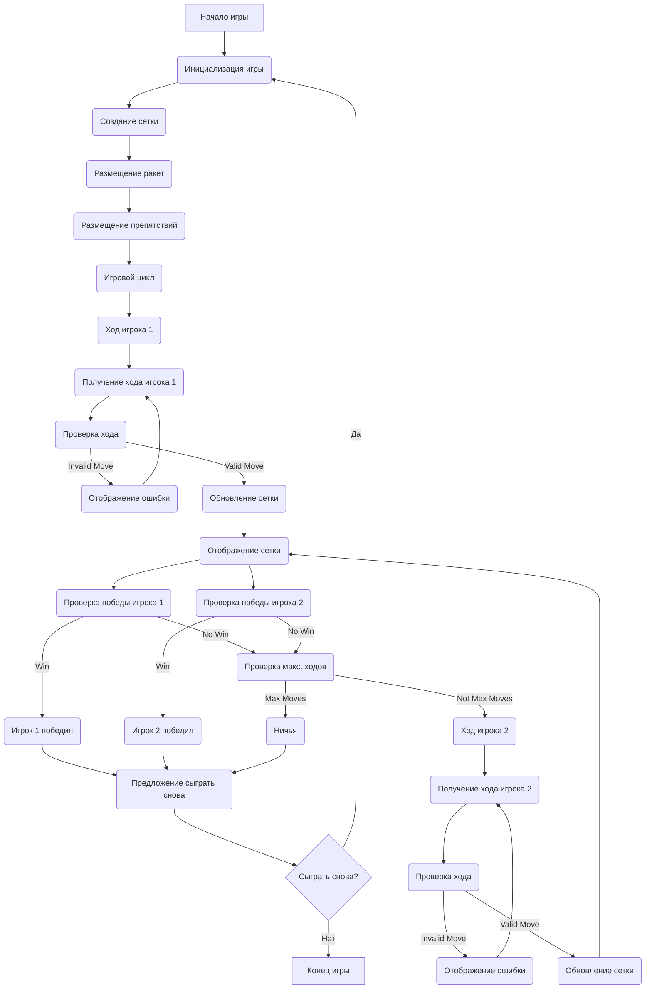

## АНАЛИЗ КОДА: **ROCKET** (Ракета)

### 1. **<алгоритм>**

**Блок-схема игрового процесса:**

```mermaid
graph LR
    A[Начало игры] --> B(Приветствие и правила);
    B --> C{Создание сетки 10x10};
    C --> D{Размещение ракет на A1 и J10};
    D --> E{Случайное размещение препятствий};
    E --> F[Начало игрового цикла];
    F --> G{Ход игрока 1};
    G --> H{Ввод хода игроком (направление, кол-во клеток)};
    H --> I{Проверка хода: граница, препятствия, ракета соперника};
     I -- Ход неверный --> J(Сообщение об ошибке);
     J --> H;
    I -- Ход верный --> K{Перемещение ракеты};
    K --> L{Отображение сетки};
    L --> M{Проверка победы: ракета на орбите?};
    M -- Победа --> N[Объявление победителя];
    N --> O(Предложение сыграть снова);
    M -- Нет победы --> P{Проверка максимального кол-ва ходов?};
    P -- Max ходов --> Q[Объявление ничьей];
    Q --> O;
    P -- Не max ходов --> R{Ход игрока 2};
    R --> S{Ввод хода игроком (направление, кол-во клеток)};
    S --> T{Проверка хода: граница, препятствия, ракета соперника};
     T -- Ход неверный --> U(Сообщение об ошибке);
     U --> S;
    T -- Ход верный --> V{Перемещение ракеты};
    V --> L;
    O --> W{Выбор игрока: сыграть снова?};
    W -- "да" --> C;
     W -- "нет" --> X[Завершение игры]
```

**Примеры для логических блоков:**

1.  **Создание сетки:**
    *   Создается двумерный массив 10x10, представляющий игровое поле.
    *   Например: `grid = [[' ' for _ in range(10)] for _ in range(10)]`.
2.  **Размещение ракет:**
    *   Ракета игрока 1 помещается в левый верхний угол (A1).
    *   Ракета игрока 2 помещается в правый нижний угол (J10).
    *   Например: `grid[0][0] = 'R1', grid[9][9] = 'R2'`.
3.  **Случайное размещение препятствий:**
    *   Случайным образом на сетке размещаются препятствия ('X').
    *   Например: `grid[2][3] = 'X'`.
4.  **Ввод хода игроком:**
    *   Игрок вводит направление (вверх, вниз, влево, вправо) и количество клеток.
    *   Например: `'вверх 2'` или `'вправо 3'`.
5.  **Проверка хода:**
    *   Проверяется, не выходит ли ракета за границы сетки.
    *   Проверяется, нет ли препятствий или ракеты соперника на пути.
6.  **Перемещение ракеты:**
    *   Обновляется положение ракеты на сетке.
    *   Например, если ракета была на A1 и игрок ввел 'вниз 2', то новое положение будет A3.
    *   `grid[0][0] = ' ', grid[2][0] = 'R1'`
7.  **Проверка победы:**
    *   Проверяется, достигла ли ракета игрока орбиты (противоположная сторона).
8.  **Проверка максимального количества ходов:**
    *   Если достигнуто максимальное количество ходов, игра завершается вничью.
9.  **Предложение сыграть снова:**
    *   Игроку предлагается сыграть заново или закончить игру.

### 2. **<mermaid>**



**Зависимости:**

В данной диаграмме нет явных импортов, поскольку представлен алгоритм игры в виде блок-схемы, а не конкретный программный код.

*   **Начало игры (Start)**: Обозначает начало игрового процесса.
*   **Инициализация игры (InitGame)**: Этап подготовки игрового поля, начальных позиций и препятствий.
*   **Создание сетки (CreateGrid)**: Создаёт игровую доску, представляющую собой двумерный массив.
*   **Размещение ракет (PlaceRockets)**: Устанавливает начальные позиции для ракет игроков.
*   **Размещение препятствий (PlaceObstacles)**: Размещает препятствия на игровом поле.
*   **Игровой цикл (GameLoop)**: Центральный цикл, в котором игроки по очереди совершают ходы.
*   **Ход игрока 1 (PlayerTurn1)**: Этап, на котором игрок 1 совершает ход.
*   **Получение хода игрока 1 (GetMove1)**: Получает ввод от игрока 1 (направление и количество клеток).
*   **Проверка хода (ValidateMove1)**: Проверяет, допустим ли ход (не выходит за границы, нет препятствий).
*   **Отображение ошибки (DisplayError1)**: Сообщает игроку об ошибке и просит повторить ход.
*   **Обновление сетки (UpdateGrid1)**: Обновляет позицию ракеты игрока 1 на игровом поле.
*   **Отображение сетки (DisplayGrid)**: Отображает текущее состояние игрового поля.
*   **Проверка победы (CheckWin1, CheckWin2)**: Проверяет, достиг ли игрок цели.
*  **Игрок 1 победил (Player1Wins)**: Сообщение о победе игрока 1.
*  **Игрок 2 победил (Player2Wins)**: Сообщение о победе игрока 2.
*   **Проверка макс. ходов (CheckMaxMoves)**: Проверяет, не превысило ли число ходов допустимого значения.
*   **Ничья (DrawGame)**: Сообщение о ничьей.
*   **Ход игрока 2 (PlayerTurn2)**: Этап, на котором игрок 2 совершает ход.
*   **Получение хода игрока 2 (GetMove2)**: Получает ввод от игрока 2 (направление и количество клеток).
*   **Проверка хода (ValidateMove2)**: Проверяет, допустим ли ход (не выходит за границы, нет препятствий).
*   **Отображение ошибки (DisplayError2)**: Сообщает игроку об ошибке и просит повторить ход.
*   **Обновление сетки (UpdateGrid2)**: Обновляет позицию ракеты игрока 2 на игровом поле.
*   **Предложение сыграть снова (PlayAgain)**: Предлагает пользователю начать игру заново.
*   **Сыграть снова? (PlayAgainChoice)**: Запрос на повторную игру.
*   **Конец игры (EndGame)**: Завершает игру.

### 3. **<объяснение>**

**Импорты:**

В представленном описании кода нет явных импортов, поскольку это текстовое описание алгоритма игры, а не конкретный код на Python.

**Классы:**

В данном описании нет классов. Это описание алгоритма игры.

**Функции:**

В данном описании нет функций.

**Переменные:**

В описании алгоритма упоминаются переменные, которые будут использоваться в коде:

*   `grid`: Двумерный массив (список списков) для представления игрового поля.
*   `player1_rocket`: Положение ракеты игрока 1 на сетке.
*   `player2_rocket`: Положение ракеты игрока 2 на сетке.
*   `obstacles`: Положения препятствий на сетке.
*   `current_player`: Указывает, чей ход в данный момент (Игрок 1 или Игрок 2).
*    `max_moves`: Максимальное количество ходов.
*    `moves_count`: Текущее количество ходов.

**Потенциальные ошибки и области для улучшения:**

*   **Неверный ввод игрока:** Программа должна обрабатывать ситуации, когда игрок вводит некорректное направление или количество клеток.
*   **Отсутствие графического интерфейса:** Игра в текстовом формате не является наглядной. Желательно добавить графический интерфейс для лучшей визуализации.
*   **Сложность кода**: Описание алгоритма является высокоуровневым, поэтому конкретная реализация может привести к сложным решениям, если не будет продумана должным образом.
*   **Возможность игры только для 2-х человек**: Игра не предусматривает возможность игры с ботом.

**Взаимосвязи с другими частями проекта:**

Поскольку это описание отдельной игры, прямых взаимосвязей с другими частями проекта нет. Однако, если бы игра была частью более крупного проекта, то она могла бы взаимодействовать с общими модулями:

*   **Модуль ввода-вывода:** Для отображения игрового поля и получения ввода от пользователя.
*   **Модуль управления игрой:** Для координации ходов, проверки победы и завершения игры.
*   **Модуль графического интерфейса:** Для отображения игры в визуальном формате.

**Дополнительные замечания:**

*   Реализация игры на Python с использованием массивов или списков для представления сетки и положения ракет является стандартным подходом.
*   Использование циклов и условных операторов для проверки ввода игрока и обработки ходов является необходимым для создания игровой логики.
*   Функции для проверки условий победы и завершения игры способствуют модульности и читаемости кода.
*  Необходимо проверять, что данные введены корректно и в правильном формате (например, игрок должен ввести `'вверх 2'`, а не `'верх 2'`)
*  Необходимо предусмотреть возможность выбора количества ходов и размера поля.