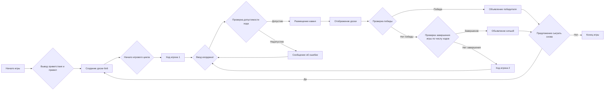
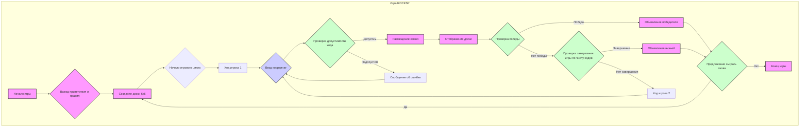

## Анализ кода игры "ROCKSP"

### 1. <алгоритм>

**Блок-схема процесса игры ROCKSP:**



**Пояснения к блок-схеме:**

1.  **Начало игры:** Игра начинается с инициализации всех необходимых параметров и структур данных.
2.  **Вывод приветствия и правил:** Пользователю предоставляется информация об игре, её правилах и целях.
3.  **Создание доски 6x6:** Формируется структура данных, представляющая собой игровое поле размером 6 на 6 клеток.
4.  **Начало игрового цикла:** Запускается основной цикл игры, в котором поочерёдно ходят игроки.
5.  **Ход игрока 1:** Первый игрок совершает свой ход.
    *   **Ввод координат:** Игрок вводит координаты клетки на доске, куда он хочет поставить камень (например, "B2").
    *   **Проверка допустимости хода:** Программа проверяет, является ли выбранная клетка пустой и находится ли она в пределах доски.
    *   **Размещение камня:** Если ход допустим, камень игрока размещается на доске.
    *   **Сообщение об ошибке:** Если ход недопустим, игроку сообщается об ошибке и предлагается повторить ввод.
    *   **Отображение доски:** После каждого хода отображается текущее состояние игрового поля.
6.  **Проверка победы:** После хода каждого игрока проверяется, не заблокировал ли текущий игрок соперника, не оставив ему возможных ходов. Если да, то игрок объявляется победителем.
7.  **Проверка завершения игры по числу ходов:** Если количество ходов достигает максимального значения (например, 20), то объявляется ничья.
8.  **Ход игрока 2:** Второй игрок совершает ход аналогично первому.
9.  **Предложение сыграть снова:** После окончания игры игрокам предлагается сыграть еще раз.
10. **Конец игры:** Игра завершается, если игроки отказываются играть снова.

### 2. <mermaid>



**Пояснения к диаграмме `mermaid`:**

Диаграмма `mermaid` представляет собой блок-схему игрового процесса `ROCKSP` с использованием наглядных обозначений для различных типов шагов.

*   `Игра ROCKSP`: это подграф, определяющий весь процесс игры.
*   **`action`**: Этот класс обозначает действия, такие как вывод сообщений, создание доски и размещение камня.
*   **`input`**: Этот класс обозначает ввод данных от игрока, а именно ввод координат.
*   **`condition`**: Этот класс обозначает условия проверки, такие как допустимость хода, проверка победы и проверка завершения игры.
*   Стрелки показывают поток выполнения программы.
*   Подписи на стрелках указывают условия перехода между блоками.
*   Используются описательные имена для всех переменных и блоков.

### 3. <объяснение>

**Объяснение основных элементов игры ROCKSP:**

**1. Инициализация игры:**

*   **Вывод приветственного сообщения:**
    *   Функция или блок кода отвечает за вывод текста с приветствием и правилами игры.
*   **Создание доски:**
    *   Используется массив или список для представления игровой доски (6x6).
    *   Начальное состояние доски: все клетки пусты.
*   **Переменные:**
    *   `board`: Массив/список, представляющий игровую доску.
    *   `currentPlayer`: Переменная, указывающая на текущего игрока (например, 1 или 2).
    *   `moves`: Переменная для подсчета ходов.
    *   `maxMoves`: Максимальное количество ходов до ничьи.

**2. Игровой процесс:**

*   **Ход игрока:**
    *   **Ввод координат:**
        *   Игрок вводит координаты клетки в виде (например, "B2").
        *   Программа преобразует этот ввод в индексы массива/списка.
    *   **Проверка допустимости хода:**
        *   Проверяется, является ли клетка пустой (не занята камнем).
        *   Проверяется, находятся ли координаты в пределах доски.
        *   Если ход недопустим, игроку предлагается повторить ввод.
    *   **Размещение камня:**
        *   Если ход допустим, камень игрока размещается на доске.
    *   **Отображение доски:**
        *   Выводится текущее состояние игровой доски.
*   **Проверка условий победы:**
    *   После каждого хода проверяется, может ли соперник сделать ход.
        *   Алгоритм, проверяющий, остались ли у соперника возможные ходы на пустые клетки.
        *   Если у соперника нет ходов, текущий игрок объявляется победителем.
*   **Проверка условий завершения игры:**
    *   Игра заканчивается, если достигнуто максимальное количество ходов (например, 20).
        *   Если условия победы не выполнены, и количество ходов достигло максимума, объявляется ничья.

**3. Завершение игры:**

*   **Предложение сыграть снова:**
    *   Игроку предлагается сыграть еще раз.
    *   Если игрок выбирает "да", игра начинается заново с новой доски.
    *   Если игрок выбирает "нет", игра заканчивается.

**Пример реализации на Python:**

```python
def init_board():
    """Создает пустую доску 6x6."""
    return [[' ' for _ in range(6)] for _ in range(6)]

def display_board(board):
    """Отображает доску."""
    print("  A B C D E F")
    for i, row in enumerate(board):
        print(f"{i+1} {' '.join(row)}")

def is_valid_move(board, row, col):
    """Проверяет, является ли ход допустимым."""
    if 0 <= row < 6 and 0 <= col < 6 and board[row][col] == ' ':
        return True
    return False

def make_move(board, row, col, player):
    """Размещает камень на доске."""
    board[row][col] = 'R' if player == 1 else 'B'

def has_moves(board, player):
    """Проверяет, есть ли у игрока возможные ходы."""
    for row in range(6):
        for col in range(6):
            if is_valid_move(board, row, col):
                return True
    return False

def get_player_move(board, player):
    """Получает ход игрока."""
    while True:
        move = input(f"Игрок {player}, введите координаты (например, B2): ").strip().upper()
        if len(move) == 2 and 'A' <= move[0] <= 'F' and '1' <= move[1] <= '6':
            col = ord(move[0]) - ord('A')
            row = int(move[1]) - 1
            if is_valid_move(board, row, col):
                return row, col
            else:
                print("Недопустимый ход. Попробуйте снова.")
        else:
            print("Неверный формат ввода. Попробуйте снова.")

def play_game():
    """Основная функция игры."""
    print("Добро пожаловать в ROCKSP!")
    print("Ваша задача — заблокировать соперника, размещая камни на доске.")
    print("Игра продолжается до тех пор, пока один из игроков не заблокирует соперника или пока не будет достигнуто максимальное количество ходов.")
    print("Удачи!")

    while True:
        board = init_board()
        currentPlayer = 1
        moves = 0
        maxMoves = 20

        while moves < maxMoves:
            display_board(board)
            row, col = get_player_move(board, currentPlayer)
            make_move(board, row, col, currentPlayer)
            moves += 1
            opponent = 3 - currentPlayer
            if not has_moves(board, opponent):
                display_board(board)
                print(f"Игра окончена! Победил Игрок {currentPlayer}.")
                break

            currentPlayer = opponent
        if moves >= maxMoves:
             display_board(board)
             print("Игра окончена! Ничья.")
        play_again = input("Хотите сыграть снова? (да/нет): ").strip().lower()
        if play_again != "да":
            break
    print("Спасибо за игру!")

if __name__ == "__main__":
    play_game()
```

**Потенциальные ошибки и области для улучшения:**

*   **Обработка ввода:** Необходимо добавить более надежную обработку ввода (например, проверку на пустую строку, обработку неожиданных символов).
*   **Условия победы:** Текущая реализация требует полного анализа ходов противника. Необходимо оптимизировать проверку на отсутствие ходов, если есть ходы только у текущего игрока.
*   **ИИ противника:** Игра ограничена двумя игроками, играющими вручную. Добавление компьютерного противника может сделать игру более интересной.
*   **Графический интерфейс:** Добавление графического интерфейса (например, с использованием `pygame` или `tkinter`) сделает игру более наглядной.
*   **Размер доски:** Жестко заданный размер доски можно сделать настраиваемым.
*   **Цветовая дифференциация:** Можно добавить цветное отображение для камней каждого игрока.
*   **Оптимизация:** Текущая реализация может быть оптимизирована по скорости, например, более эффективный поиск возможных ходов.

**Взаимосвязь с другими частями проекта:**

Игра `ROCKSP` может быть частью более крупной библиотеки AI-игр. Взаимодействие с другими частями проекта может включать:

*   **Общий модуль `game_engine`:**
    *   Управление состоянием игры.
    *   Реализация игрового цикла.
    *   Интерфейс для взаимодействия с игроками.
*   **Модуль `ai_players`:**
    *   Реализация различных AI-стратегий для игры.
*   **Модуль `utils`:**
    *   Общие функции для обработки ввода, вывода, графического интерфейса.

Этот анализ предоставляет полное и структурированное понимание игры "ROCKSP", её реализации и возможностей для улучшения.