## Анализ кода игры "Русская рулетка" (RUSROU)

### 1. <алгоритм>

Игра "Русская рулетка" (RUSROU) имитирует процесс игры с револьвером, где один патрон заряжен в барабан, и игроки по очереди вращают барабан и нажимают на курок, пока один из них не получит выстрел.

**Блок-схема:**

```mermaid
graph LR
    A[Начало игры] --> B{Вывод приветственного сообщения и правил};
    B --> C[Создание револьвера с 6 каморами];
    C --> D[Зарядка случайной каморы патроном];
    D --> E[Начало цикла игры];
    E --> F{Ход игрока 1};
    F --> G[Вращение барабана];
    G --> H{Нажатие на курок};
    H --> I{Проверка, есть ли патрон в текущей каморе};
    I -- Да --> J[Вывод сообщения о выстреле и конце игры для Игрока 1];
    I -- Нет --> K[Вывод сообщения об отсутствии выстрела];
    K --> L{Ход игрока 2};
     L --> M[Вращение барабана];
    M --> N{Нажатие на курок};
    N --> O{Проверка, есть ли патрон в текущей каморе};
    O -- Да --> P[Вывод сообщения о выстреле и конце игры для Игрока 2];
    O -- Нет --> Q[Вывод сообщения об отсутствии выстрела];
    Q --> E;
    J --> R[Объявление победителя];
    P --> R;
    R --> S{Предложение сыграть снова?};
    S -- Да --> A;
    S -- Нет --> T[Завершение игры];
    T --> U[Конец];

    style A fill:#f9f,stroke:#333,stroke-width:2px
    style J fill:#ccf,stroke:#333,stroke-width:2px
    style P fill:#ccf,stroke:#333,stroke-width:2px
    style T fill:#aaf,stroke:#333,stroke-width:2px

```



**Примеры:**

*   **Начало игры (A-B):** Вывод приветствия и правил игры.
*   **Создание револьвера (C):** Создание структуры данных, представляющей револьвер с 6 каморами (например, список или массив).
*   **Зарядка патрона (D):** Случайный выбор номера каморы для патрона (например, `random.randint(0, 5)`).
*   **Ход игрока (F, L):** Поочередно, сначала игрок 1, затем игрок 2 "вращают" барабан (определение текущей каморы) и "нажимают" на курок (проверка текущей каморы на наличие патрона).
*   **Проверка выстрела (I, O):** Сравнение текущей каморы с каморой, в которой находится патрон.
*   **Завершение игры (J, P):** Вывод сообщения о выстреле и победителе в случае выстрела, переход к сообщению о конце игры.
*   **Предложение сыграть снова (S):** Запрос пользователя о желании начать новую игру.

**Поток данных:**

1.  Инициализация: данные о револьвере (количество камор) и положение патрона генерируются случайным образом.
2.  Ход игрока: игрок "вращает" барабан, что может быть имитировано сдвигом указателя текущей каморы.
3.  Проверка: текущая камора сравнивается с каморой с патроном.
4.  Конец игры: если патрон найден, игра завершается, результаты выводятся.

### 2. <mermaid>

```mermaid
flowchart TD
    A[Начало игры] --> B{Вывод приветственного сообщения и правил};
    B --> C[Создание револьвера с 6 каморами];
    C --> D[Зарядка случайной каморы патроном: <br> <code>bullet_position = random.randint(0, 5)</code>];
    D --> E[Начало цикла игры: <br> <code>while not game_over</code>];
    E --> F{Ход игрока 1: <br> <code>current_chamber= (current_chamber + 1) % 6</code>};
    F --> H{Проверка выстрела: <br> <code>if current_chamber == bullet_position</code>};
    H -- Да --> J[Вывод сообщения о выстреле и конце игры для Игрока 1];
    H -- Нет --> K[Вывод сообщения об отсутствии выстрела];
    K --> L{Ход игрока 2:<br> <code>current_chamber= (current_chamber + 1) % 6</code>};
    L --> N{Проверка выстрела: <br> <code>if current_chamber == bullet_position</code>};
    N -- Да --> P[Вывод сообщения о выстреле и конце игры для Игрока 2];
    N -- Нет --> Q[Вывод сообщения об отсутствии выстрела];
    Q --> E;
    J --> R[Объявление победителя];
    P --> R;
    R --> S{Предложение сыграть снова? <br> <code>input("Хотите сыграть снова? (да/нет)")</code>};
    S -- Да --> A;
    S -- Нет --> T[Завершение игры];
    T --> U[Конец];

    style A fill:#f9f,stroke:#333,stroke-width:2px
    style J fill:#ccf,stroke:#333,stroke-width:2px
    style P fill:#ccf,stroke:#333,stroke-width:2px
    style T fill:#aaf,stroke:#333,stroke-width:2px

```

**Объяснение зависимостей:**

*   `random`: Модуль `random` используется для случайного определения положения патрона в барабане. `random.randint(0, 5)` генерирует случайное целое число от 0 до 5, представляющее номер каморы с патроном.

**Описание переменных в `mermaid` диаграмме:**

*   `A`: Начало игры.
*   `B`: Вывод приветственного сообщения и правил.
*   `C`: Создание револьвера с 6 каморами.
*   `D`: Зарядка случайной каморы патроном, где `bullet_position`  - это переменная, хранящая номер каморы с патроном.
*   `E`: Начало цикла игры, цикл продолжается пока переменная  `game_over` не станет `True`.
*   `F`: Ход игрока 1, где  `current_chamber` - текущая камора, куда "попадает" курок.
*   `H`: Проверка выстрела для игрока 1.
*   `J`: Вывод сообщения о выстреле и конце игры для игрока 1.
*   `K`: Вывод сообщения об отсутствии выстрела.
*   `L`: Ход игрока 2.
*   `N`: Проверка выстрела для игрока 2.
*  `P`: Вывод сообщения о выстреле и конце игры для игрока 2.
*   `Q`: Вывод сообщения об отсутствии выстрела.
*   `R`: Объявление победителя.
*   `S`: Предложение сыграть снова.
*   `T`: Завершение игры.
*   `U`: Конец.
### 3. <объяснение>

**Импорты:**

*   `random`: Этот модуль необходим для генерации случайного числа, определяющего положение патрона в барабане револьвера.

**Классы:**

В описании кода нет классов, но можно было бы создать класс `Revolver`, который бы хранил состояние револьвера (количество камор, положение патрона, текущая камора) и методы для вращения барабана и проверки выстрела.

**Функции:**

*   **`main()`**:
    *   Аргументы: Отсутствуют.
    *   Возвращаемое значение: Нет.
    *   Назначение: Основная функция, которая запускает игру. Она отвечает за инициализацию игры, организацию ходов игроков и предложение сыграть снова.
    *   Пример:
        ```python
        def main():
            print("Добро пожаловать в RUSROU!")
            # ... остальной код ...
            while True:
              # Ходы игроков
              # Проверка выстрела
              # Предложение сыграть снова

              if not play_again:
                 break;

        ```

*   **`spin_the_barrel(current_chamber)`**:
    *   Аргументы: `current_chamber` - текущая камора.
    *   Возвращаемое значение: Номер текущей каморы.
    *   Назначение: Имитирует вращение барабана револьвера, меняя значение текущей каморы.
    *   Пример:
        ```python
        def spin_the_barrel(current_chamber):
          current_chamber = (current_chamber + 1) % 6
          return current_chamber
        ```
*   **`check_shot(current_chamber, bullet_position)`**:
    *   Аргументы: `current_chamber` - текущая камора, `bullet_position` - камора с патроном.
    *   Возвращаемое значение: `True`, если произошел выстрел, `False` - если нет.
    *   Назначение: Проверяет, произошел ли выстрел.
    *   Пример:
        ```python
         def check_shot(current_chamber, bullet_position):
             if current_chamber == bullet_position:
                return True
             else:
                return False
        ```

**Переменные:**

*   `bullet_position` (int):  Номер каморы, в которой находится патрон (случайное целое число от 0 до 5).
*   `current_chamber` (int): Номер текущей каморы, на которую направлен курок (изначально 0, увеличивается на 1 после каждого "вращения" барабана, доходя до 5 и затем опять с 0).
*   `game_over` (bool): Флаг, показывающий, что игра окончена.
*   `play_again` (bool): Флаг, определяющий, хотят ли игроки сыграть снова.

**Потенциальные ошибки и области для улучшения:**

1.  **Отсутствие явной реализации:** Код представлен в виде инструкций, но не в виде фактического кода.
2.  **Нет проверки ввода игрока:** Нет обработки некорректного ввода пользователя при запросе "сыграть снова".
3.  **Жестко заданное количество игроков:** Игра рассчитана только на двух игроков.
4.  **Нет визуализации:** Отсутствует визуализация барабана револьвера.

**Цепочка взаимосвязей:**

1.  `random` используется для определения начального положения патрона.
2.  Основной игровой цикл управляет ходами игроков, проверками выстрела и повтором игры.
3.  Функции `spin_the_barrel` и `check_shot` обеспечивают логику игры.

**Рекомендации по улучшению:**

1.  **Реализовать код Python:** Написать код, следуя описанным шагам и используя указанные модули и функции.
2.  **Добавить обработку ввода:** Проверять ввод пользователя на корректность при запросе о повторной игре.
3.  **Сделать количество игроков настраиваемым:** Позволить пользователю выбирать количество игроков.
4.  **Реализовать графический интерфейс:** Добавить визуальное представление барабана и процесса игры, чтобы сделать ее более наглядной и интересной.
5.  **Создать класс `Revolver`**: инкапсулировать данные и методы револьвера.