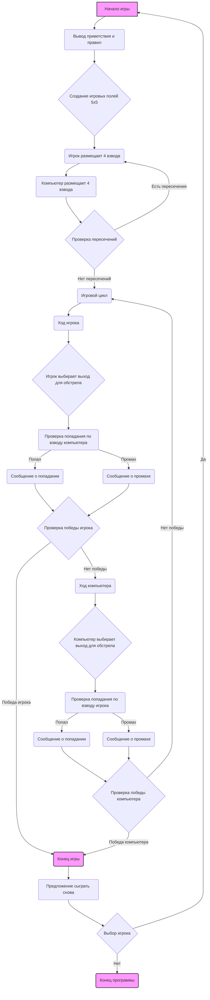
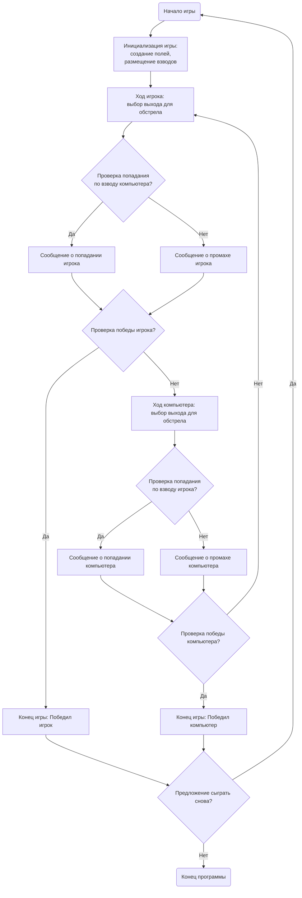

## АНАЛИЗ КОДА ИГРЫ "SALVO I"

### 1. <алгоритм>

#### Блок-схема игрового процесса

**Примеры для каждого логического блока:**

*   **A (Начало игры):** Вызывается при запуске программы, происходит инициализация всех параметров.
*   **B (Вывод приветствия и правил):** На экран выводится текст с правилами игры.
*   **C (Создание игровых полей 5x5):** Создаются два пустых массива или списка 5x5 для представления полей игрока и компьютера.
*   **D (Игрок размещает 4 взвода):** Игрок вводит 4 различных числа от 1 до 25. Пример: `3, 7, 12, 18`.
*   **E (Компьютер размещает 4 взвода):** Компьютер случайным образом выбирает 4 различных числа от 1 до 25.
*   **F (Проверка пересечений):** Проверяется, что взводы игрока и компьютера не занимают одни и те же позиции. Если есть пересечения, игрок размещает взводы заново.
*   **G (Игровой цикл):** Основной цикл игры, который продолжается до победы одного из игроков.
*   **H (Ход игрока):** Выводится запрос на ввод выхода для обстрела.
*   **I (Игрок выбирает выход для обстрела):** Игрок вводит число от 1 до 25. Пример: `7`.
*   **J (Проверка попадания по взводу компьютера):** Проверяется, есть ли взвод компьютера на выбранном выходе.
    *   **Пример попадания:** Ввод игрока `7`, на поле компьютера есть взвод на позиции 7.
    *   **Пример промаха:** Ввод игрока `7`, на поле компьютера нет взвода на позиции 7.
*   **K (Сообщение о попадании):** Выводится сообщение "Вы уничтожили один из моих взводов!".
*   **L (Сообщение о промахе):** Выводится сообщение "Промах. Мой ход.".
*   **M (Проверка победы игрока):** Проверяется, уничтожены ли все 4 взвода компьютера.
*   **O (Ход компьютера):** Компьютер случайным образом выбирает выход для обстрела.
*   **P (Компьютер выбирает выход для обстрела):** Компьютер выбирает случайное число от 1 до 25.
*   **Q (Проверка попадания по взводу игрока):** Проверяется, есть ли взвод игрока на выбранном компьютером выходе.
    *   **Пример попадания:** Компьютер выбрал `12`, на поле игрока есть взвод на позиции 12.
    *   **Пример промаха:** Компьютер выбрал `12`, на поле игрока нет взвода на позиции 12.
*   **R (Сообщение о попадании):** Выводится сообщение "Компьютер уничтожил ваш взвод на выходе X".
*   **S (Сообщение о промахе):** Выводится сообщение "Компьютер промахнулся. Ваш ход.".
*   **T (Проверка победы компьютера):** Проверяется, уничтожены ли все 4 взвода игрока.
*   **N (Конец игры):** Выводится сообщение о победе одного из игроков.
*   **U (Предложение сыграть снова):** Выводится вопрос "Хотите сыграть снова? (да/нет)".
*   **V (Выбор игрока):** Игрок вводит "да" или "нет".
*   **W (Конец программы):** Программа завершает свою работу.

### 2. <mermaid>

**Анализ зависимостей:**

В этой диаграмме `mermaid` описан поток управления игрой SALVO I. Основные блоки - это начало игры, ход игрока, ход компьютера, проверка победы и предложение сыграть снова.

*   **Start**: Начало игры. Это первый блок, откуда начинается весь игровой процесс.
*   **InitGame**: Инициализация игры. Включает в себя создание игровых полей и размещение взводов игроком и компьютером.
*   **PlayerTurn**: Ход игрока. Игрок выбирает выход для обстрела.
*   **CheckPlayerHit**: Проверка, попал ли игрок в один из взводов компьютера.
*   **PlayerHitMessage**: Сообщение об успешном попадании игрока.
*   **PlayerMissMessage**: Сообщение о промахе игрока.
*   **CheckPlayerWin**: Проверка, выиграл ли игрок, уничтожив все взводы компьютера.
*   **GameOverPlayerWin**: Сообщение об окончании игры, если игрок победил.
*   **ComputerTurn**: Ход компьютера. Компьютер выбирает выход для обстрела.
*   **CheckComputerHit**: Проверка, попал ли компьютер в один из взводов игрока.
*   **ComputerHitMessage**: Сообщение об успешном попадании компьютера.
*   **ComputerMissMessage**: Сообщение о промахе компьютера.
*  **CheckComputerWin**: Проверка, выиграл ли компьютер, уничтожив все взводы игрока.
*   **GameOverComputerWin**: Сообщение об окончании игры, если компьютер победил.
*   **PlayAgain**: Предложение игроку сыграть снова.
*   **End**: Конец игры. Программа завершает работу.

Связи между блоками показывают последовательность действий в игре. Если игрок не выиграл, игра переходит к ходу компьютера, а затем возвращается к ходу игрока. Игра продолжается, пока один из игроков не выиграет или игрок не выберет не играть снова.

### 3. <объяснение>

#### Импорты

В предоставленном коде нет явных импортов, но в реализации (описанной в разделе "Реализация") могут потребоваться следующие импорты:

*   `random`: Для случайного размещения взводов компьютера и для выбора случайных ходов компьютера.
*   `sys`: (Возможно) для завершения программы и обработки ввода пользователя.

#### Классы

В предоставленном коде нет классов.

#### Функции

Предполагаемые функции для реализации игры:

*   `init_game()`:
    *   Аргументы: Нет.
    *   Возвращает: Две матрицы (список списков) или массивы, представляющие поля игрока и компьютера, а также списки (множества) позиций взводов игрока и компьютера.
    *   Назначение: Инициализирует игру, создавая поля и размещая взводы. Выводит приветствие и правила.
    *   Пример: `player_board, computer_board, player_units, computer_units = init_game()`

*   `player_place_units()`:
    *   Аргументы: Нет (может принимать поле игрока как аргумент).
    *   Возвращает: Список (множество) позиций взводов игрока.
    *   Назначение: Запрашивает ввод от игрока для размещения взводов и проверяет его на корректность.
    *   Пример: `player_units = player_place_units()`

*   `computer_place_units()`:
    *   Аргументы: Нет.
    *   Возвращает: Список (множество) позиций взводов компьютера.
    *   Назначение: Генерирует случайные позиции для взводов компьютера.
    *   Пример: `computer_units = computer_place_units()`

*   `player_turn()`:
    *   Аргументы: Игровое поле компьютера, список (множество) позиций взводов компьютера.
    *   Возвращает: Результат хода (попадание, промах), обновлённый список (множество) позиций взводов компьютера.
    *   Назначение: Обрабатывает ход игрока, проверяет попадание и выводит сообщение.
    *   Пример: `result, computer_units = player_turn(computer_board, computer_units)`

*   `computer_turn()`:
    *   Аргументы: Игровое поле игрока, список (множество) позиций взводов игрока.
    *   Возвращает: Результат хода (попадание, промах), обновлённый список (множество) позиций взводов игрока.
    *   Назначение: Обрабатывает ход компьютера, проверяет попадание и выводит сообщение.
    *   Пример: `result, player_units = computer_turn(player_board, player_units)`

*   `check_win()`:
    *   Аргументы: Список (множество) позиций взводов противника.
    *   Возвращает: `True`, если все взводы уничтожены, иначе `False`.
    *   Назначение: Проверяет, выиграл ли игрок или компьютер.
    *    Пример: `if check_win(computer_units): print("Победил игрок!")`

*    `play_again()`:
   *  Аргументы: Нет
    *   Возвращает: `True`, если игрок хочет сыграть снова, иначе `False`.
   * Назначение: Спрашивает у игрока хочет ли он начать игру заново.
  *    Пример: `if play_again(): init_game()`

#### Переменные

*   `player_board`: Двумерный массив или список, представляющий игровое поле игрока.
*   `computer_board`: Двумерный массив или список, представляющий игровое поле компьютера.
*   `player_units`: Список (множество) позиций взводов игрока.
*   `computer_units`: Список (множество) позиций взводов компьютера.
*   `target`: Переменная, содержащая номер выхода, выбранного для обстрела.
*   `is_game_over`: Логическая переменная, указывающая, окончена ли игра.

#### Потенциальные ошибки и области для улучшения

*   **Обработка ввода пользователя:** Код должен проверять корректность ввода игрока (диапазон от 1 до 25, ввод чисел, отсутствие дубликатов).
*   **Размещение взводов:** Код должен проверять отсутствие пересечений при размещении взводов.
*   **Графический интерфейс:** Желательно добавить визуализацию игровых полей для более удобного восприятия игры.
*   **Гибкость:** Реализация должна позволять легко менять количество взводов и размер игрового поля.
*    **AI**: Улучшение AI компьютера, чтобы делать более осмысленные ходы

#### Взаимосвязи с другими частями проекта

Данная игра может быть частью более крупного проекта, например, сборника компьютерных игр. В таком случае, она будет взаимодействовать с общими классами, такими как:

*   **GameManager:** Управляет общим процессом игры, переходом между играми, выбором меню и т. д.
*   **UI:** Отвечает за отображение элементов интерфейса, таких как игровые поля, сообщения и ввод пользователя.
*   **Settings:** Хранит общие настройки, такие как размеры поля, количество взводов и прочие игровые параметры.

Этот анализ обеспечивает полное понимание игры SALVO I и её потенциальной реализации.