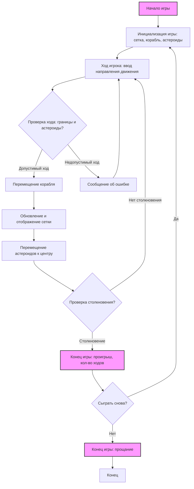

## ИНСТРУКЦИЯ:

Анализируй предоставленный код подробно и объясни его функциональность. Ответ должен включать три раздела:

1. **<алгоритм>**: Опиши рабочий процесс в виде пошаговой блок-схемы, включая примеры для каждого логического блока, и проиллюстрируй поток данных между функциями, классами или методами.
2. **<mermaid>**: Напиши код для диаграммы в формате `mermaid`, проанализируй и объясни все зависимости,
    которые импортируются при создании диаграммы.
    **ВАЖНО!** Убедитесь, что все имена переменных, используемые в диаграмме `mermaid`,
    имеют осмысленные и описательные имена. Имена переменных вроде `A`, `B`, `C`, и т.д., не допускаются!

    **Дополнительно**: Если в коде есть импорт `import header`, добавьте блок `mermaid` flowchart, объясняющий `header.py`:
    ```mermaid
    flowchart TD
        Start --> Header[<code>header.py</code><br> Determine Project Root]

        Header --> import[Import Global Settings: <br><code>from src import gs</code>]
    ```

3. **<объяснение>**: Предоставьте подробные объяснения:
   - **Импорты**: Их назначение и взаимосвязь с другими пакетами `src.`.
   - **Классы**: Их роль, атрибуты, методы и взаимодействие с другими компонентами проекта.
   - **Функции**: Их аргументы, возвращаемые значения, назначение и примеры.
   - **Переменные**: Их типы и использование.
   - Выделите потенциальные ошибки или области для улучшения.

Дополнительно, постройте цепочку взаимосвязей с другими частями проекта (если применимо).

Это обеспечивает всесторонний и структурированный анализ кода.
## Формат ответа: `.md` (markdown)
**КОНЕЦ ИНСТРУКЦИИ**

## Алгоритм
```mermaid
graph TD
    A[Начало игры: Вывод приветствия и правил] --> B{Создание игровой сетки 10x10};
    B --> C[Размещение корабля в центре сетки];
    C --> D[Случайное размещение астероидов на краях сетки];
    D --> E{Начало игрового цикла};
    E --> F{Ход игрока: Запрос направления движения};
    F --> G{Проверка допустимости хода: не выход за границы и не столкновение с астероидом};
     G -- Допустимый ход --> H[Перемещение корабля];
     H --> I[Отображение текущего состояния сетки];
     I --> J[Перемещение астероидов к центру];
     J --> K{Проверка столкновения корабля с астероидом};
      K -- Столкновение --> L[Конец игры: Вывод сообщения о проигрыше и количества ходов];
    K -- Нет столкновения --> E;
      G -- Недопустимый ход --> M[Сообщение об ошибке, повторить ввод];
      M --> F;
      L --> N{Предложение сыграть снова?};
        N -- Да --> B;
        N -- Нет --> O[Конец игры: Вывод сообщения "Спасибо за игру"];
    
     
   
    style A fill:#f9f,stroke:#333,stroke-width:2px
    style L fill:#f9f,stroke:#333,stroke-width:2px
    style O fill:#f9f,stroke:#333,stroke-width:2px
    
    
    
```
### Пояснения к алгоритму:

1.  **Начало игры:**
    *   Выводится приветственное сообщение и правила игры.
    *   Пример: `Добро пожаловать в SPACWR! Ваша задача — управлять космическим кораблём, избегая столкновения с астероидами...`
2.  **Создание игровой сетки:**
    *   Создается двумерный массив или список, представляющий поле 10x10.
    *   Пример: `grid = [[' ' for _ in range(10)] for _ in range(10)]`
3.  **Размещение корабля:**
    *   Корабль размещается в центре сетки (например, в позиции `[5][5]`).
    *   Пример: `ship_position = [5, 5]; grid[5][5] = 'R'`
4.  **Размещение астероидов:**
    *   Астероиды размещаются случайным образом на краях сетки.
    *   Пример: `asteroid_positions = [[0, 3], [9, 7], [2, 0], [5,9]]`  - астероиды у края сетки
5.  **Игровой цикл:**
    *   Цикл повторяется до тех пор, пока игрок не проиграет.
6.  **Ход игрока:**
    *   Игроку предлагается ввести направление движения корабля (вверх, вниз, влево, вправо).
    *   Пример:  `input("Введите направление движения (вверх, вниз, влево, вправо): ")`
7.  **Проверка допустимости хода:**
    *   Проверяется, не выходит ли корабль за пределы сетки и не попадает ли в клетку с астероидом.
    *   Пример: если игрок хочет сдвинуть корабль влево, проверяется `ship_position[1] - 1 >= 0 and grid[ship_position[0]][ship_position[1] -1] != 'A' `
8.  **Перемещение корабля:**
    *   Если ход допустим, позиция корабля обновляется.
    *   Пример: `ship_position[0] -= 1` если игрок пошел вверх
9.  **Отображение сетки:**
    *   На экран выводится текущее состояние сетки.
10. **Перемещение астероидов:**
    *   Астероиды перемещаются на один шаг в сторону центра сетки.
     *   Пример: Если астероид в позиции [0, 3], то позиция обновляется до [1,3]
11. **Проверка столкновения:**
    *   Проверяется, не совпадает ли позиция корабля с позицией астероида.
12. **Конец игры:**
    *   Если произошло столкновение, выводится сообщение о проигрыше.
    *   Также выводится количество сделанных ходов.
    *   Пример: `Столкновение! Ваш корабль уничтожен. Игра окончена! Вы продержались 15 ходов.`
13.  **Предложение сыграть снова:**
    *   Игроку предлагается сыграть снова или выйти.
    *   Пример: `input("Хотите сыграть снова? (да/нет)")`
14.  **Конец программы:**
    *   Выводится прощальное сообщение, если игрок не хочет играть снова.
    *   Пример: `Спасибо за игру!`

## Mermaid



### Объяснение `mermaid`:

*   `Start`: Начало игры. Это узел, который обозначает точку входа в игровую логику.
*   `InitializeGame`: Этап инициализации игры, который включает создание сетки, размещение корабля в центре, и размещение астероидов по краям сетки.
*   `PlayerTurn`: Ожидание хода игрока. Происходит ввод направления движения корабля.
*   `ValidateMove`: Проверка ввода игрока: валидация хода, проверка на выход за границу и столкновения с астероидом.
*   `MoveShip`: Перемещение корабля в случае валидного хода.
*   `UpdateGrid`: Обновление и отображение сетки на экране после хода игрока.
*   `MoveAsteroids`: Перемещение астероидов на один шаг в сторону центра сетки.
*   `CheckCollision`: Проверка столкновения корабля с астероидом.
*   `GameOver`: Завершение игры в случае столкновения. Сообщение о проигрыше и количестве ходов.
*   `InvalidMoveMessage`: Вывод сообщения об ошибке в случае некорректного ввода.
*    `PlayAgain`: Предложение сыграть снова, выбор между перезапуском игры или выходом.
*    `EndGame`: Завершение игры с прощальным сообщением в случае отказа от повторной игры.
*    `Stop`: Конец выполнения программы.

## Объяснение

### Общее описание:

Представленный текст описывает логику и шаги реализации простой текстовой игры SPACWR, в которой игрок управляет космическим кораблем, избегая столкновений с астероидами. В игре используется сетка 10x10, корабль расположен в центре, а астероиды появляются на краях и движутся к центру.

###  Структура игры:

1.  **Инициализация:**
    *   Вывод приветственного сообщения и правил игры.
    *   Создание игровой сетки.
    *   Размещение корабля в центре сетки.
    *   Случайное размещение астероидов на краях сетки.
2.  **Игровой процесс:**
    *   **Ход игрока:** Запрос направления движения корабля, проверка допустимости хода, перемещение корабля, отображение сетки.
    *   **Движение астероидов:** Перемещение астероидов к центру сетки.
    *   **Проверка столкновения:** Проверка на столкновение корабля с астероидом, завершение игры при столкновении.
3.  **Завершение игры:**
    *   Вывод сообщения о проигрыше, количества ходов, предложения сыграть снова.

### Функциональность:

*   **Игровая сетка**: Представлена как двумерный массив или список, где каждое поле может содержать информацию о корабле, астероидах или быть пустым.
*   **Корабль**: Первоначально находится в центре сетки. Игрок управляет его движением.
*   **Астероиды**: Случайно появляются на краях сетки и движутся к центру.
*   **Ход игрока**: Ввод направления движения корабля (вверх, вниз, влево, вправо).
*   **Проверка хода**: Проверка на выход за границы сетки и на столкновение с астероидом.
*   **Движение астероидов**: Перемещение астероидов к центру сетки после каждого хода игрока.
*   **Столкновение**: Завершение игры, если корабль сталкивается с астероидом.
*   **Завершение игры**: Вывод результатов и предложения начать новую игру.

###  Потенциальные ошибки или области для улучшения:

1.  **Обработка некорректного ввода:**
    *   Необходимо обрабатывать некорректный ввод направления движения (не "вверх", "вниз", "влево", "вправо").
    *   Вместо предложения повторить ввод можно сделать подсказку с возможными вариантами.
2.  **Сложность игры:**
    *   Начальный уровень игры может быть слишком простым.
    *   Можно добавить уровни сложности, увеличивая количество астероидов или их скорость.
3.  **Визуализация**:
    *   Отсутствует графический интерфейс, что усложняет восприятие игрового процесса.
    *   Реализация графического интерфейса повысит привлекательность игры.
4.  **Размер сетки:**
    *   Размер сетки фиксирован, можно добавить возможность выбора размера сетки.
5.  **Астероиды:**
    *   Можно добавлять новые астероиды по мере продвижения игры, делая ее более динамичной.
6.  **Тестирование:**
    *   Отсутствует подробное тестирование различных сценариев игры (граничные условия, некорректный ввод).

###  Возможная реализация на Python:

*   **Сетка:** Используется `list of lists` для представления сетки.
*   **Корабль и астероиды:** Представлены координатами в виде пар чисел.
*   **Функции:**
    *   `init_game()`: Инициализирует игру (сетку, корабль, астероиды).
    *   `move_ship(direction)`: Перемещает корабль в указанном направлении, проверяя валидность хода.
    *   `move_asteroids()`: Перемещает астероиды.
    *   `check_collision()`: Проверяет столкновение корабля с астероидом.
    *   `display_grid()`: Выводит текущее состояние сетки на экран.
    *   `game_loop()`: Основной игровой цикл.

### Цепочка взаимосвязей:

1.  **Ввод пользователя:** Игрок вводит направление движения, которое является входными данными для функции `move_ship()`.
2.  **Обновление состояния игры:**
    *   `move_ship()` обновляет положение корабля в сетке.
    *   `move_asteroids()` обновляет положения астероидов.
    *   `display_grid()` отображает обновленную сетку на экране.
3.  **Проверка столкновения:** `check_collision()` проверяет, не столкнулся ли корабль с астероидом, что определяет завершение игрового цикла.

### Резюме

Предоставленное описание игры SPACWR хорошо структурировано и включает все необходимые компоненты для понимания основной механики. Разработка игры на основе данного описания должна быть относительно простой и понятной.