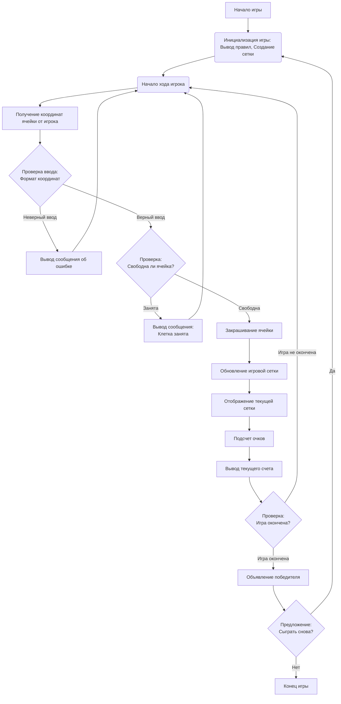

## ИНСТРУКЦИЯ:

Анализ кода игры **SPLAT** представлен ниже.

1. **<алгоритм>**:
   Игра **SPLAT** представляет собой пошаговую игру, где два игрока поочередно закрашивают ячейки на сетке. Цель игры - закрасить как можно больше ячеек своим цветом.

   **Блок-схема:**

   ```mermaid
   graph LR
      A[Начало игры] --> B(Вывод приветствия и правил игры);
      B --> C{Создание игровой сетки 10x10};
      C --> D(Начало игрового цикла);
      D --> E{Ход игрока};
      E --> F(Выбор ячейки);
      F --> G{Проверка ячейки на свободу};
      G -- Ячейка свободна --> H(Закрашивание ячейки цветом игрока);
      G -- Ячейка занята --> I(Вывод сообщения об ошибке);
      I --> E;
      H --> J(Отображение текущего состояния сетки);
      J --> K(Подсчет закрашенных ячеек каждым игроком);
      K --> L(Вывод текущего счета);
      L --> M{Проверка на завершение игры (сетка закрашена)};
      M -- Сетка не закрашена --> D;
      M -- Сетка закрашена --> N(Объявление победителя);
      N --> O(Предложение сыграть снова);
      O --> P{Выбор игрока (да/нет)};
      P -- да --> C;
      P -- нет --> Q(Завершение игры);
      Q --> R[Конец игры];
   ```

   **Примеры для логических блоков:**

   *   **B (Вывод приветствия и правил игры):**
      ```
      Добро пожаловать в SPLAT!
      Ваша задача — закрасить как можно больше клеток на сетке своим цветом.
      Игра продолжается до тех пор, пока сетка не будет полностью закрашена.
      Побеждает игрок, закрасивший больше клеток.
      Удачи!
      ```
   *   **F (Выбор ячейки):**
      Пример ввода игроком: `A1`
   *   **G (Проверка ячейки на свободу):**
      - Если выбрана ячейка `A1` и она еще не закрашена, то ячейка свободна.
      - Если выбрана ячейка `A1` и она уже закрашена, то ячейка занята.
   *   **H (Закрашивание ячейки цветом игрока):**
       Если выбрана ячейка `A1` и она свободна, она закрашивается цветом текущего игрока.
   *   **I (Вывод сообщения об ошибке):**
      ```
      Клетка уже закрашена. Попробуйте снова.
      ```
   *  **J (Отображение текущего состояния сетки):**
       ```
       Текущее состояние сетки:
       A B C D E F G H I J
      1 [X][ ][ ][ ][ ][ ][ ][ ][ ][ ]
      2 [ ][ ][ ][ ][ ][ ][ ][ ][ ][ ]
      3 [ ][ ][ ][ ][ ][ ][ ][ ][ ][ ]
      4 [ ][ ][ ][ ][ ][ ][ ][ ][ ][ ]
      5 [ ][ ][ ][ ][ ][ ][ ][ ][ ][ ]
      6 [ ][ ][ ][ ][ ][ ][ ][ ][ ][ ]
      7 [ ][ ][ ][ ][ ][ ][ ][ ][ ][ ]
      8 [ ][ ][ ][ ][ ][ ][ ][ ][ ][ ]
      9 [ ][ ][ ][ ][ ][ ][ ][ ][ ][ ]
      10 [ ][ ][ ][ ][ ][ ][ ][ ][ ][ ]
      ```
  * **K (Подсчет закрашенных ячеек каждым игроком):**
     * После первого хода игрока 1: "Игрок 1: 1 клетка, Игрок 2: 0 клеток"
     * После первого хода игрока 1 и игрока 2: "Игрок 1: 1 клетка, Игрок 2: 1 клетка"
   *  **L (Вывод текущего счета):**
      ```
      Игрок 1: 5 клеток
      Игрок 2: 3 клетки
      ```
    *  **N (Объявление победителя):**
      ```
      Игра окончена! Победил Игрок 1 с 60 закрашенными клетками.
      ```
    *  **O (Предложение сыграть снова):**
        ```
        Хотите сыграть снова? (да/нет)
        ```

2. **<mermaid>**:


    **Объяснение зависимостей:**
*  `Start`: Начало игры.
*   `Init`: Инициализация игры, включает вывод правил и создание игровой сетки.
*   `PlayerTurn`: Начало хода игрока.
*   `GetInput`: Получение координат ячейки от пользователя.
*   `ValidateInput`: Проверка корректности ввода координат.
*   `ErrorMessage`: Вывод сообщения об ошибке ввода.
*   `CheckCell`: Проверка, свободна ли выбранная ячейка.
*   `OccupiedError`: Сообщение о том, что выбранная ячейка уже занята.
*   `PaintCell`: Закрашивание выбранной ячейки цветом текущего игрока.
*   `UpdateGrid`: Обновление состояния игровой сетки.
*   `DisplayGrid`: Отображение текущего состояния сетки.
*   `ScoreCalc`: Подсчет закрашенных ячеек каждым игроком.
*   `DisplayScore`: Отображение текущего счета игроков.
*   `CheckEnd`: Проверка, окончена ли игра (все ли ячейки закрашены).
*   `DeclareWinner`: Объявление победителя.
*  `PlayAgain`: Предложение сыграть снова.
*  `End`: Конец игры.

3. **<объяснение>**:

*   **Общее описание:**
    Игра **SPLAT** — это пошаговая игра, в которой два игрока по очереди закрашивают ячейки на сетке. Цель игры — закрасить как можно больше ячеек своим цветом. Игра заканчивается, когда сетка полностью закрашена, и побеждает игрок, закрасивший больше клеток.

*   **Основные этапы:**
    1.  **Инициализация:**
        *   Вывод приветствия и правил игры.
        *   Создание игровой сетки размером 10x10.
    2.  **Игровой процесс:**
        *   Игроки по очереди выбирают ячейки, указывая их координаты (например, A1).
        *   Проверка, свободна ли выбранная ячейка. Если занята, предлагается повторить ход.
        *   Закрашивание выбранной ячейки цветом текущего игрока.
        *   Обновление и отображение текущего состояния сетки.
        *   Подсчет закрашенных ячеек каждым игроком и вывод текущего счета.
    3.  **Завершение игры:**
        *   Игра заканчивается, когда сетка полностью закрашена.
        *   Объявление победителя.
        *   Предложение сыграть снова.

*   **Реализация (на Python):**
    *   **Сетка:** Можно использовать двумерный массив (список списков) для представления игровой сетки.
    *   **Игроки:** Можно использовать переменные для отслеживания текущего игрока и его закрашенных клеток.
    *   **Функции:**
        *   Функция для создания сетки (например, `create_grid()`).
        *   Функция для проверки ввода (например, `validate_input(input_str)`).
        *   Функция для закрашивания ячейки (например, `paint_cell(grid, row, col, player)`).
        *   Функция для отображения сетки (например, `display_grid(grid)`).
        *   Функция для подсчета очков (например, `calculate_score(grid)`).
        *   Функция для проверки завершения игры (например, `is_game_over(grid)`).
        *   Основной игровой цикл, который будет обрабатывать ходы игроков.
    *   **Ввод данных:**  Используется `input()` для получения ввода от игрока.
    *   **Циклы:** Используются `while` циклы для игрового процесса, а также `for` для обработки строк и столбцов сетки.
    *   **Условия:** Используются `if` и `else` для проверки условий, таких как свободна ли ячейка, завершена ли игра и т.д.

*   **Переменные:**
    *   `grid` (список списков): Представляет игровое поле.
    *   `current_player` (целое число): Указывает текущего игрока (например, 1 или 2).
    *   `player1_score` (целое число): Количество ячеек, закрашенных первым игроком.
    *   `player2_score` (целое число): Количество ячеек, закрашенных вторым игроком.
    *   `input_str` (строка): Ввод координат от игрока.

*   **Ошибки и улучшения:**
    *   **Обработка неверного ввода:** Необходимо добавить проверки для правильного формата ввода координат (например, A1, B2) и обработки некорректного ввода.
    *   **Размер сетки:** Добавить возможность выбора размера сетки.
    *   **Графический интерфейс:** Реализовать графический интерфейс для визуализации сетки и закрашенных клеток.
    *   **Игра с компьютером:** Добавить возможность играть с компьютером.

*   **Взаимосвязь с другими частями проекта:**
    Поскольку это игра, она может быть интегрирована в проект с другими играми, в меню выбора игр, а также возможно использовать общие функции для обработки ввода и вывода сообщений.

Таким образом, представленная игра **SPLAT** является пошаговой стратегической игрой, в которой два игрока поочередно закрашивают ячейки на сетке, стараясь закрасить больше ячеек, чем оппонент. Игра предполагает использование основных принципов программирования, таких как работа со списками, циклами, условиями, функциями и ввод-вывод.